# Session - 2026-04-18

## Summary
- Dain's new session opens along the coastline near the Iron Shore Tribes. [Party]
- Dain meets the party as everyone converges near the watchtower of the Iron Shore Tribes. [Party]
- The party travels east and reaches Lerdar, a smaller dwarven city. [Party]
- The party intends to see Commander Agland there to deliver news, though Dain does not yet know what news they mean. [Party] [Character-only]
- Commander Agland charges the party to go into the mountains and carry a new sealed letter onward to the actual general, who is in a settlement there. [Party]
- Agland directs the party toward the city near Samyrn Torst in the mountains. [Party]
- The party leaves Lerdar, travels east, and then follows the river north as it leads them up into the mountains. [Party]
- A later route sketch clarifies that the traveled path so far bends inland from the Lerdar / Llurdar area and then curves up into the mountains along the river course. [Party] [To verify]
- The second day of travel passes without notable incident as the party continues along the mountain route. [Party]
- By the end of the second day, rain begins to fall over the road and river. [Party]
- By the end of the second day, the party reaches a Y-shaped meeting of two creeks where the path splits. [Party]
- During camp on the mountain route, Dain uses Minor Conjuration to make a shelter and Prestidigitation to produce a fire within it. [Character-only]
- Dain then spends time with parchment developing a shelter spell that perversely worsens the elements instead of protecting against them, gaining two hours of progress on the idea. [Character-only]
- Dain continues the same spell research for another two hours, bringing the anti-shelter project to four total hours of progress. [Character-only]
- Yuckie the Goblin tells Dain that the Astral Elf tried to fire him from a ballista while the party was in camp. [Character-only]
- Dain's regard for the Astral Elf improves, with `+4` respect recorded from the moment. [Character-only]
- During Dain's watch, he hears loud footsteps as two ogres cross the creek toward the camp. [Party]
- The Astral Elf's owl notices the ogres approaching and alerts the party in time to wake them. [Party]
- Initiative is rolled as the camp snaps into combat readiness. [Party]
- Dain casts `Sleep` on the ogres expecting the 2024 ruleset, but the DM rules that the spell must use the 2014 version instead. [Character-only]
- Dain rolls `32` on the `d8`s for `Sleep`, which is not enough to affect either ogre. [Character-only]
- Dain ends up prone in the river during the opening exchange. [Character-only]
- After getting close enough, Dain casts `Suggestion` on one ogre and tells it to lie down in the creek with its arms behind its head. [Character-only]
- The charmed ogre immediately drops its club, lies face down in the creek with its hands behind its head, and slowly floats away downstream. [Party]
- The party kills the ogres and survives the creekside ambush. [Party]
- In the immediate aftermath, Dain Truthammer stands elegantly on the Y itself and addresses the party with murky, theatrical tales of his past like a post-battle cry. [Character-only]
- As the corpses fall, the rest of the party immediately begins pillaging the ogres and gathering useful resources from them. [Party]
- After the fight, the party settles in and completes a long rest at the creek-fork camp. [Party]
- The next day, the party continues on its way into the mountains without any major events after the ogres. [Party]
- Two hours into that day's travel, the party sees five harpies in the distance circling around their nest. [Party]
- Dain hides in the cracks of the mountain wall, remaining unnoticed by the harpies. [Character-only]
- Dain uses `Minor Illusion` to draw one harpy in and `Prestidigitation` to draw another, luring them past his hidden position. [Character-only]
- As the harpies move past him, the rest of the party engages them directly while Dain remains concealed in the mountain stone. [Party] [Character-only]
- Dain targets an alpha harpy with fire and control magic, immolating it with `Chromatic Orb` and grease before locking it in place with `Suggestion`. [Character-only]
- The alpha harpy sits down obediently and allows itself to burn to death while Dain walks over and watches it burn directly. [Party] [Character-only]
- The party defeats the harpies. [Party]
- Unfortunately, the Astral Elf kills Dain's suggested enemy before the party can make any further use of it. [Party] [Character-only]
- Among the spoils is a `Ghostly Form Tattoo`, a magical tattoo that grants incorporeal movement and spectral resilience when a charge is spent. [Party] [Character-only]
- Dain has promised to help the party continue this business despite not yet understanding the matter fully. [Character-only]
- Dain begins the session at 20/20 HP with no new resource expenditure recorded yet. [Confirmed]
- An establishing coastline image and a cleaned-up regional map now anchor the session's geography in campaign memory. [Confirmed]

## Links
- Previous session: None recorded.
- Next session: TBD
- Open Threads: ../Codex/Lore/Open Threads.md

## Starting State
- Location: Coastline near the watchtower of the Iron Shore Tribes
- Immediate goal: Rejoin the party at the coastal watchtower rendezvous. [Party]
- Important active conditions/resources: HP 20/20, Temp HP [To verify], 1st-level slots 4/4, 2nd-level slots 2/2, Arcane Recovery unused, Stonecunning 2/2
- Key unresolved tension entering session: What business has brought the newly converged party together along the Iron Shore coastline [To verify]

## Live Notes (chronological)
- The session opens on a harsh stretch of coast near the Iron Shore Tribes, with surf, rock, and tribal watch-signs defining the immediate landscape. [Party]
- Dain meets the party as their paths converge near the watchtower of the Iron Shore Tribes. [Party]
- The Iron Shore watchtower serves as the group's opening rendezvous point on this coast, with inland routes and mountain-fed waterways visible beyond it. [Party]
- The party heads east from the Iron Shore coast and arrives at Lerdar, a smaller dwarven city. [Party]
- The group's present errand is to see Commander Agland in Lerdar and deliver news. [Party]
- Commander Agland is a stoic dwarf. [Party]
- After hearing the party's report, Commander Agland charges them to go into the mountains. [Party]
- Agland gives the party a new sealed letter to deliver to the actual general in a mountain settlement. [Party]
- Agland tells them to head to the city up near Samyrn Torst in the mountains. [Party]
- The party heads east out of Lerdar until the river turns them north and leads them up into the mountains. [Party]
- A later route sketch suggests the traced path runs from the Lerdar / Llurdar area, then bends inland and curves up the river into the mountains rather than as a simple straight east-then-north line. [Party] [To verify]
- The second day of travel remains uneventful as the party keeps to the route. [Party]
- By the end of that second day, rain begins to fall across the mountain road. [Party]
- By day's end, the party comes to a Y-shaped junction where two creeks meet and the path splits. [Party]
- At camp, Dain uses Minor Conjuration to fashion a shelter for the night and Prestidigitation to kindle a fire within it. [Character-only]
- With parchment in hand, Dain continues developing a contrary shelter spell that makes the elements worse rather than holding them at bay, adding two hours of research progress. [Character-only]
- He then continues working for another two hours, bringing total progress on the anti-shelter spell to four hours. [Character-only]
- Yuckie the Goblin tells Dain that the Astral Elf tried to launch him from a ballista while the party was in camp. [Character-only]
- The Astral Elf rolls a `4`, leading Dain to gain `+4` respect toward him from the exchange. [Character-only]
- During Dain's watch, heavy footsteps announce two ogres crossing the creek toward camp. [Party]
- The Astral Elf's owl spots them first and alerts the party before the ogres are fully upon them. [Party]
- Initiative is rolled. [Party]
- Dain opens the fight by casting `Sleep` at the ogres, expecting the 2024 rules version. [Character-only]
- The DM rules that `Sleep` must instead resolve under the 2014 ruleset; Dain rolls `32` on the `d8`s, and the spell drops neither ogre. [Character-only]
- In the confusion of the opening moments, Dain winds up prone in the river. [Character-only]
- After getting close enough, Dain casts `Suggestion` on one of the ogres: he tells it to lie down in the creek and put its arms behind its head. [Character-only]
- The ogre immediately drops its club, obeys, lies face down in the creek with its hands behind its head, and slowly floats downriver. [Party]
- The fight ends with both ogres dead. [Party]
- In the battle's wake, Dain climbs to the very Y of the fork and stands there elegantly, sharing murky fragments of his own past with the cadence of a victory speech. [Character-only]
- While Dain speaks, the other party members set to work at once, pillaging the ogre corpses and gathering whatever useful resources can be salvaged. [Party]
- The party then takes a long rest at the camp beside the forked creeks as the stormy night gives way toward morning. [Party]
- The next day the party resumes its mountain travel, and no major events follow the ogre ambush at first. [Party]
- Two hours into the day's march, the party spots five harpies in the distance around a nest on a high crag. [Party]
- Dain slips into cracks in the mountain wall near the nest and stays hidden from the harpies. [Character-only]
- From concealment, he uses `Minor Illusion` to lure one harpy inward and `Prestidigitation` to tempt another the same way. [Character-only]
- The harpies pass him without noticing him in the stone while the rest of the party engages them directly. [Party] [Character-only]
- Dain then turns his attention to an alpha harpy, immolating it with `Chromatic Orb` and grease before sealing the cruelty of it with `Suggestion`. [Character-only]
- Under the command, the alpha harpy sits down and allows itself to burn to death while Dain walks over and watches the fire consume it at close range. [Party] [Character-only]
- The harpy fight ends in the party's favor. [Party]
- The Astral Elf kills Dain's suggested target before the party can do anything further with the enchantment. [Party] [Character-only]
- In the aftermath, the party comes away with a `Ghostly Form Tattoo`. [Party] [Character-only]
- Dain does not yet know what news the party is referring to, but he has promised to help them with the matter so far. [Character-only]
- Dain tells the party, and the elf in particular, that he will help them up the mountains safely. [Character-only]
- **[Prompt]**

  ```text
  We kill the ogres, and long rest.
  ```
- **[Prompt]**

  ```text
  Dain Truhammer stands elegantly on the y itself where he speaks to the party, gracefully sharing his murky tales of his past, like a post battle cry, setting the scene for the pillaging and resource gthering the other members of the party immediately begin doing as the corpses fall
  ```
- **[Prompt]**

  ```text
  Also begin new campaign session , we are along the coastline near Iron Shore Tribes
  ```
- **[Prompt]**

  ```text
  the session begins. Dain meets the party.

  We are The party converges along the coast near the watchtower of the Iron Shore Tribes
  ```
- **[Prompt]**

  ```text
  Continue with 2026-04-18.md , we've arrived the city called Lerdar to the east, as smaller dwarven city, to see a commander to deliver them news. Dain is unaware of what the party is referring to at this point, but has promised to help them so far.
  ```
- **[Prompt]**

  ```text
  Dain tells one of the ogres with suggestion after getting close enough to put lie down in the lake and put his arms behind his head. THe ogre immediately drops his club, and lies down face down in the creek with his hands behind his head, and then slowly floats down the river.
  ```
- **[Prompt]**

  ```text
  We continue on our way the next day, no major events after the orgres. We contimue our travel on the next day.
  2 hours into our travel, we see 5 harpees in the distance around their nest.
  ```
- **[Prompt]**

  ```text
  Truthammer stands in the cracks of the cave wall hiding form the harpies, as his minor illusion draws one in, and presidgitation draws the other in, the harpies progress past him as the party engage the harpies directly, with him in the mountain unnoticed.
  ```
- **[Prompt]**

  ```text
  Dain commands an alpha harpy which he immolated with chromatic orb and grease, with suggestion. The harpy sits down and allows itself to burn to death, while Dain walks over to it and watches it directly burn to death.
  ```
- **[Prompt]**

  ```text
  We defeat the harpies. Unfortunately the astral elf kills my suggested enemy before we could do anything with it.
  Ghostlyu Form tatoo, while the tatoo is on your skin, you can spend one charge to become incorpoeral, for the duration you gain the following benefits, reisstyance to bludgenging, attacks, cannot be grappled or restrained, move thru creatures and solid objects as if you were constrainted, instead if you walk through solid objects you take 1d10 damage and move to available space
  ```

## Character State Changes
- Current location refined to the coastline near the watchtower of the Iron Shore Tribes.
- Dain is now confirmed to be with the party at session start.
- Current location advances east to Lerdar, a smaller dwarven city.
- Dain has committed to assisting the party with their business in Lerdar despite lacking full context about the news they intend to deliver.
- The party receives a new assignment from Commander Agland to travel into the mountains and deliver a sealed letter to the actual general in a settlement there.
- The party's destination is clarified as the city near Samyrn Torst in the mountains.
- Current travel progresses east from Lerdar and then north along the river into the mountains.
- Route sketch later clarifies the traveled line as a bend inland from the Lerdar / Llurdar area and then up into the mountains along the river. [Party] [To verify]
- The second day of travel passes without incident.
- Rain begins by the end of the second day on the mountain route.
- The party reaches a split in the path at a Y-shaped meeting of two creeks.
- Dain establishes a camp shelter with Minor Conjuration and a small fire with Prestidigitation.
- Dain gains a total of four hours of progress on an experimental anti-shelter spell that would make weather and exposure worse instead of better. [Character-only]
- Yuckie the Goblin shares a story with Dain about the Astral Elf trying to fire him from a ballista during camp. [Character-only]
- Dain gains `+4` respect toward the Astral Elf. [Character-only]
- Two ogres approach the camp through the creek during Dain's watch, and the Astral Elf's owl alerts the party before impact. [Party]
- Combat begins; Dain spends one 1st-level slot on `Sleep`, but the DM requires the 2014 ruleset, Dain rolls `32`, and no ogre falls asleep. [Character-only]
- Dain ends the opening exchange prone in the river. [Character-only]
- Dain spends one 2nd-level slot on `Suggestion` to compel one ogre to disarm, lie down in the creek, and float obediently downstream. [Character-only]
- One ogre's club is now dropped at the creekside while that ogre drifts away under the spell's instruction. [Party]
- The creekside ambush ends with both ogres dead. [Party]
- Dain turns the creek fork itself into a stage and delivers a dramatic post-battle speech laced with murky tales of his own past. [Character-only]
- The party begins scavenging the ogre corpses for resources immediately after the fight; the exact haul remains [To verify]. [Party]
- The party completes a long rest after the fight. [Party]
- The party resumes travel the next day without immediate incident after the ogre ambush. [Party]
- Five harpies are sighted in the distance around a nest two hours into the day's travel. [Party]
- Dain hides within cracks in the mountain wall during the harpy encounter. [Character-only]
- Dain uses `Minor Illusion` and `Prestidigitation` as bait to draw harpies past his concealed position while the rest of the party engages them directly. [Character-only]
- Dain uses `Chromatic Orb`, grease, and `Suggestion` against an alpha harpy, burning it to death under direct magical compulsion. [Character-only]
- One alpha harpy is dead; the exact source of the grease and whether `Chromatic Orb` used Dain's Magic Initiate cast or a spell slot remain [To verify]. [Character-only]
- The harpy encounter ends in the party's victory. [Party]
- The Astral Elf kills Dain's suggested target before the party can exploit that enchantment further. [Party] [Character-only]
- The party acquires a `Ghostly Form Tattoo`. [Party] [Character-only]
- A sealed letter from Commander Agland is now a live quest item in the party's keeping. [Party]
- Dain has personally promised to help the party, especially the elf, make the mountain journey safely. [Character-only]
- Dain's spell slots reset to 1st level `4/4`, 2nd level `2/2` after the long rest, then one 2nd-level slot is spent on the harpy `Suggestion`; `Chromatic Orb` resource use is [To verify]. [Character-only]
- Dain is no longer prone after the fight and rest. [Character-only]
- Current HP is back to full after the long rest; any interim combat damage remains [To verify]. [Character-only]
- Arcane Recovery, Stonecunning, and other long-rest resources are refreshed. [Character-only]

## New Canon / Important Discoveries
- [Party] Dain's current session opens along the coastline near the Iron Shore Tribes.
- [Party] Dain meets the party near the watchtower of the Iron Shore Tribes.
- [Party] The party has now arrived in Lerdar, a smaller dwarven city to the east.
- [Party] The group intends to see Commander Agland in Lerdar to deliver news.
- [Party] Commander Agland is a stoic dwarf.
- [Party] Commander Agland orders the party into the mountains after receiving their report.
- [Party] Agland gives the party a new sealed letter meant for the actual general in a settlement in the mountains.
- [Party] Agland directs the party to the city near Samyrn Torst in the mountains.
- [Party] The party travels east from Lerdar and then follows the river north up into the mountains.
- [Party] A later route sketch clarifies the actual traveled path as a curved inland ascent from the Lerdar / Llurdar area into the mountains along the river. [To verify]
- [Party] The second day of travel passes uneventfully.
- [Party] Rain begins by the end of the second day on the mountain road.
- [Party] By the end of the second day, the party reaches a Y-shaped confluence of two creeks where the path splits.
- [Character-only] Dain uses Minor Conjuration and Prestidigitation to improve camp conditions on the mountain route.
- [Character-only] Dain is actively researching a spell that imitates shelter magic by doing the opposite and worsening the elements; current progress stands at four hours.
- [Character-only] Yuckie the Goblin reports that the Astral Elf tried to fire him from a ballista while the party was in camp.
- [Character-only] Dain's regard for the Astral Elf improves by `+4` respect.
- [Party] Two ogres cross the creek toward camp during Dain's watch, but the Astral Elf's owl gives warning and initiative is rolled.
- [Character-only] Dain casts `Sleep`; the DM requires 2014 resolution rather than 2024, Dain rolls `32`, and the spell has no effect on the ogres.
- [Character-only] Dain is left prone in the river as the fight begins.
- [Character-only] Dain then casts `Suggestion` on one ogre, ordering it to lie down in the creek with its arms behind its head.
- [Party] The affected ogre immediately drops its club, obeys, and slowly floats downriver face down with its hands behind its head.
- [Party] The party kills both ogres at the creek-fork camp.
- [Character-only] Dain stands elegantly on the fork itself after the battle and shares murky tales of his past like a victory speech.
- [Party] As the corpses fall, the rest of the party immediately begins pillaging the ogres and gathering useful resources; the exact haul is not yet recorded. [To verify]
- [Party] The party completes a long rest after the ambush and wakes with the mountain route ahead still unresolved.
- [Party] The next day of travel begins without major incident after the ogre fight.
- [Party] Two hours into that march, the party spots five harpies in the distance around their nest on a high mountain crag.
- [Character-only] Dain hides in the cracks of the mountain wall and remains unnoticed by the harpies.
- [Character-only] Dain uses `Minor Illusion` to draw one harpy in and `Prestidigitation` to draw another, letting them pass his concealed position while the party engages openly.
- [Character-only] Dain immolates an alpha harpy with `Chromatic Orb` and grease, then uses `Suggestion` to make it sit and burn to death while he watches.
- [Party] One alpha harpy dies by fire under Dain's command during the opening exchange of the harpy fight.
- [Party] The party defeats the harpies.
- [Character-only] The Astral Elf kills Dain's suggested target before the party can do anything more with it.
- [Party] The party acquires a `Ghostly Form Tattoo` with incorporeal movement properties. [Character-only]
- [Character-only] Dain does not yet know what this news is, even though he has promised to help the party.
- [Character-only] Dain tells the elf he will help him make the mountain ascent safely.

## Open Threads
- [Open] Deliver Commander Agland's sealed letter to the actual general in the mountain settlement. [Party]
- [Open] Learn what news the party first brought to Commander Agland in Lerdar and what Dain is actually helping with. [Party] [Character-only]

## Images
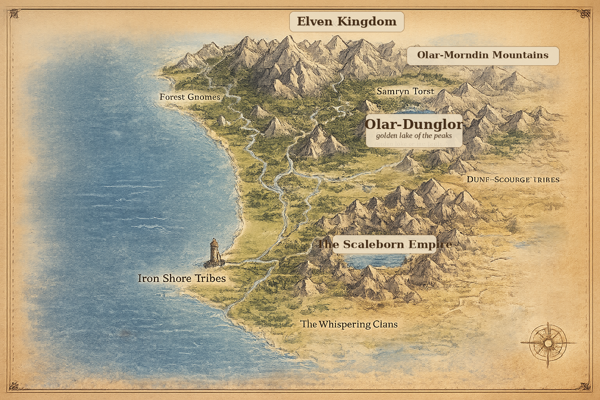

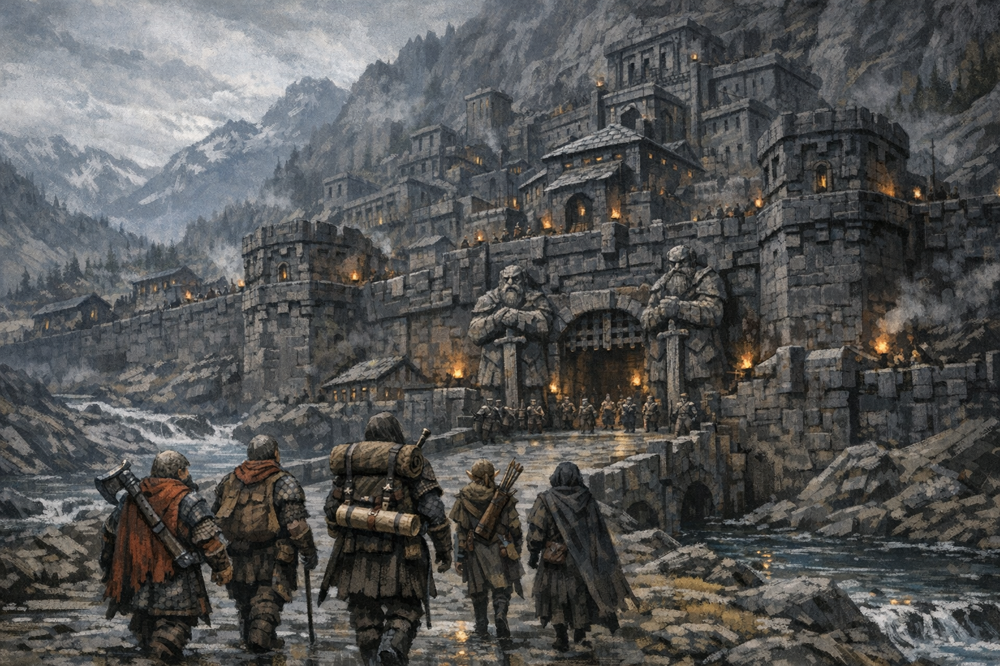
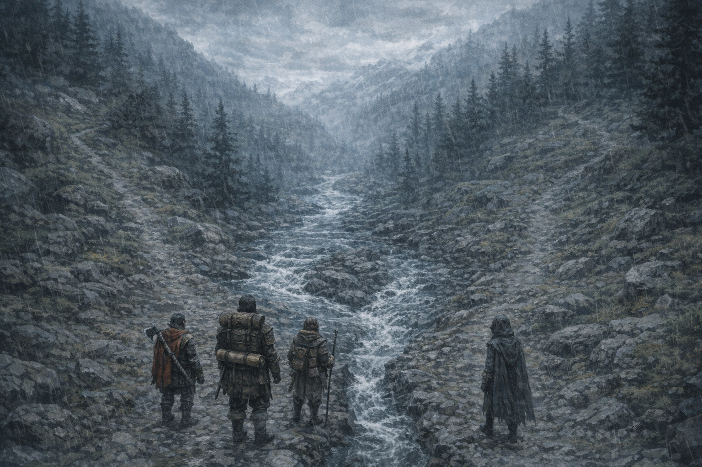
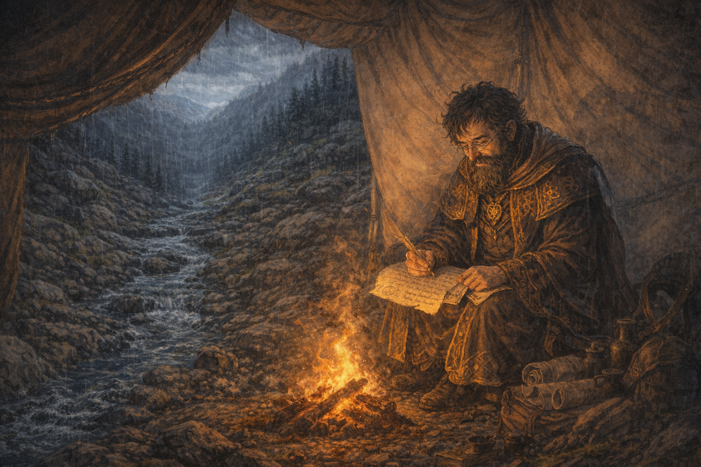
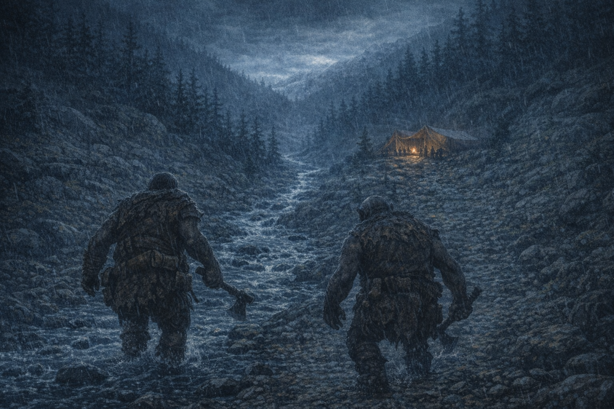
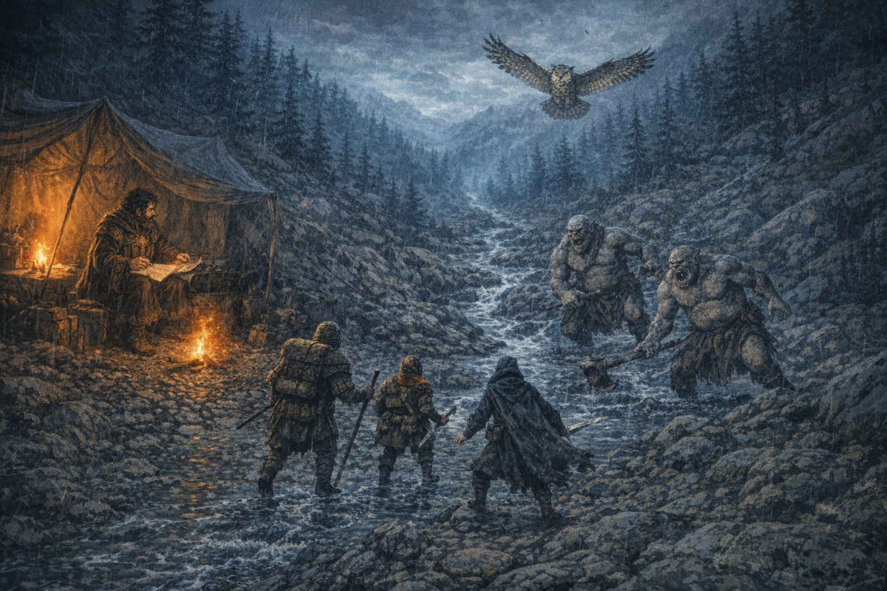
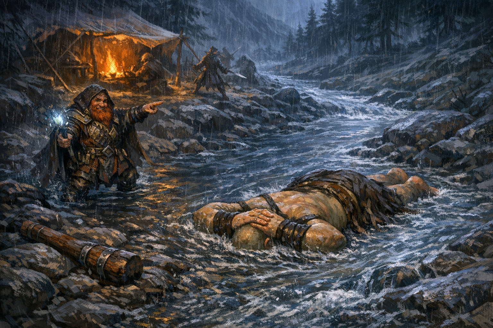
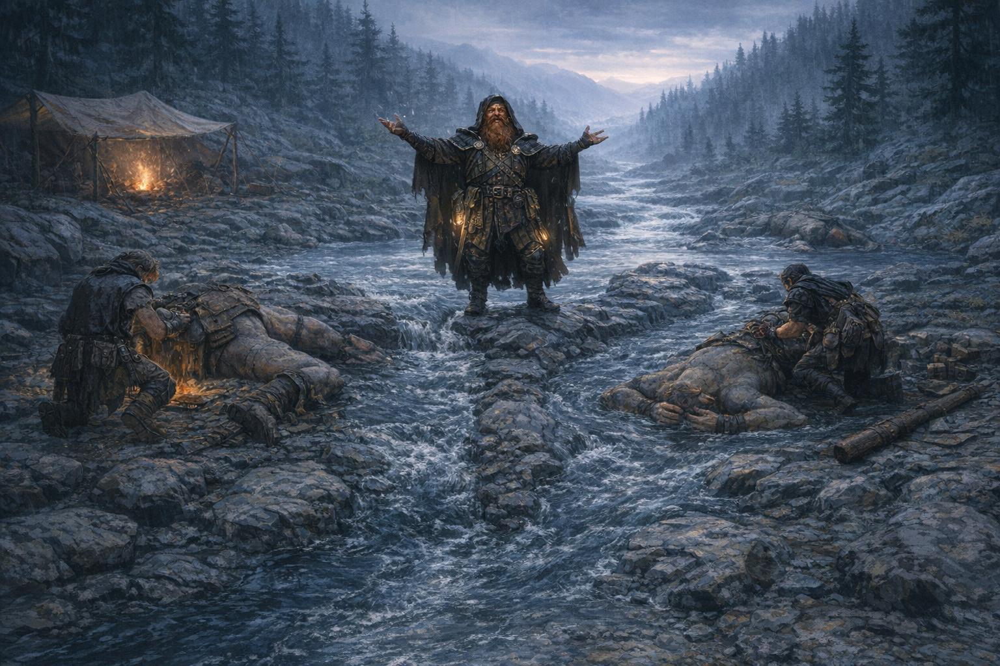
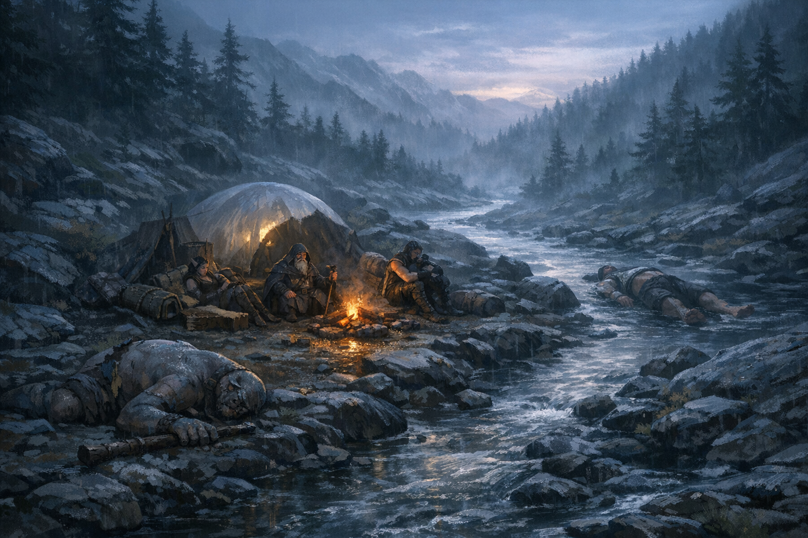
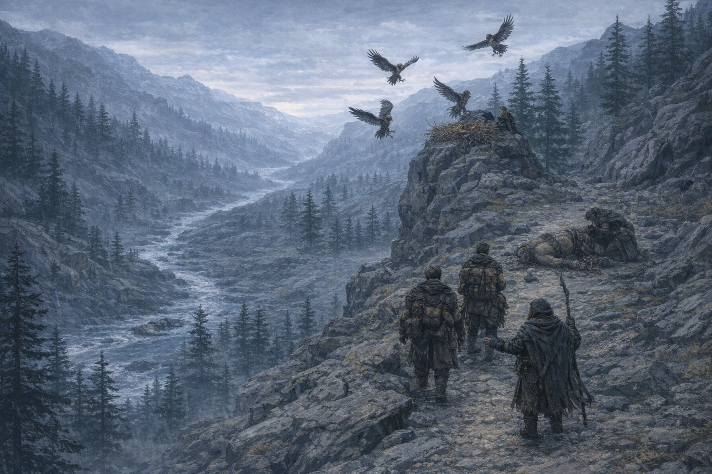
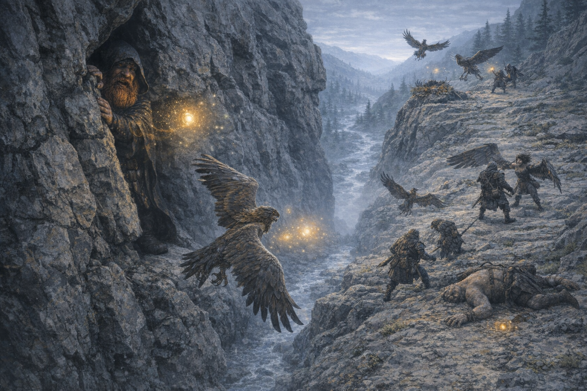
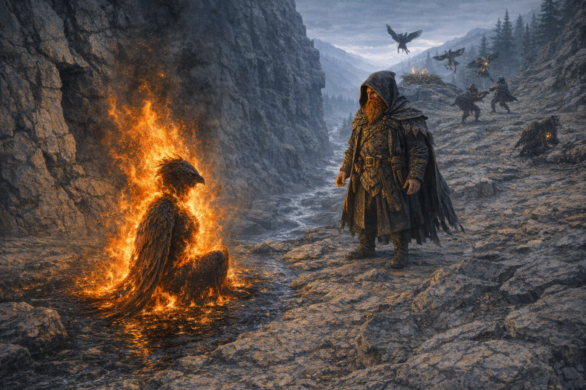

### Comic Pages
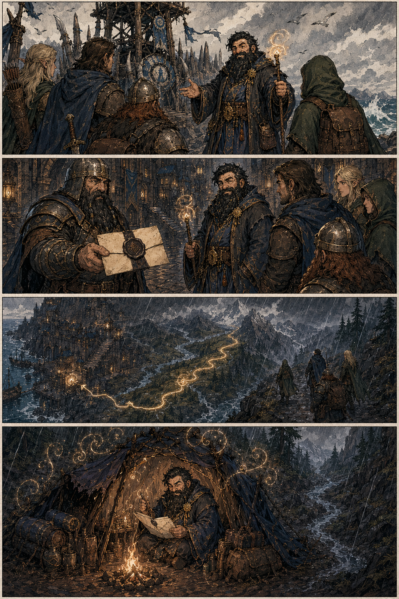
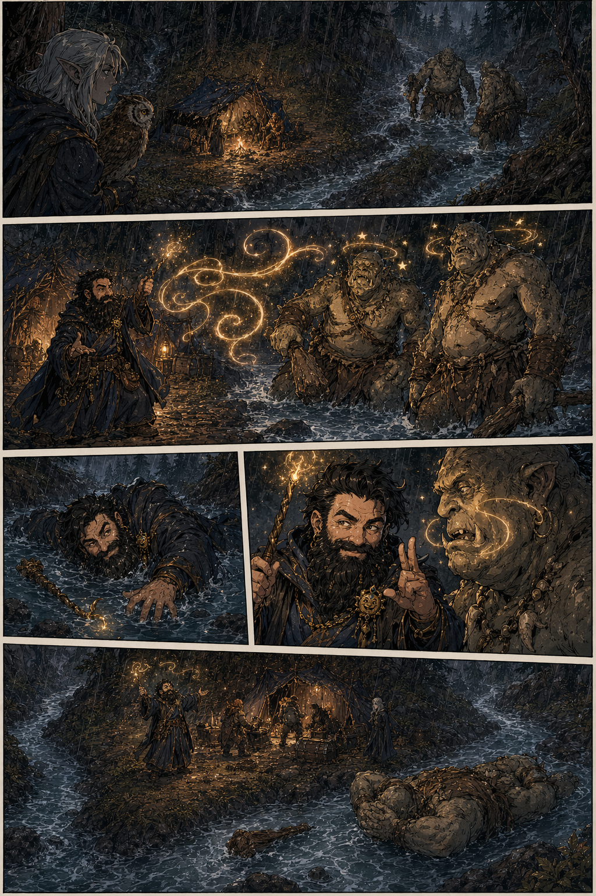

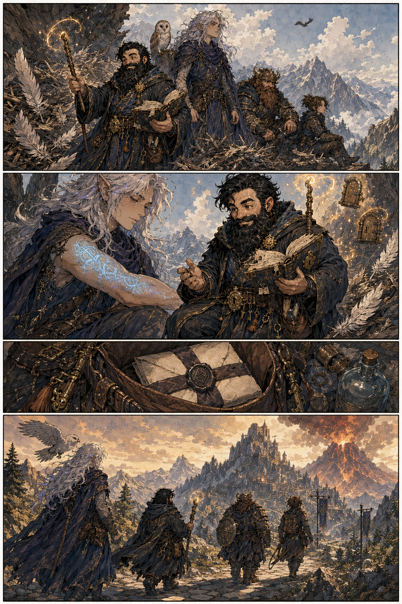
