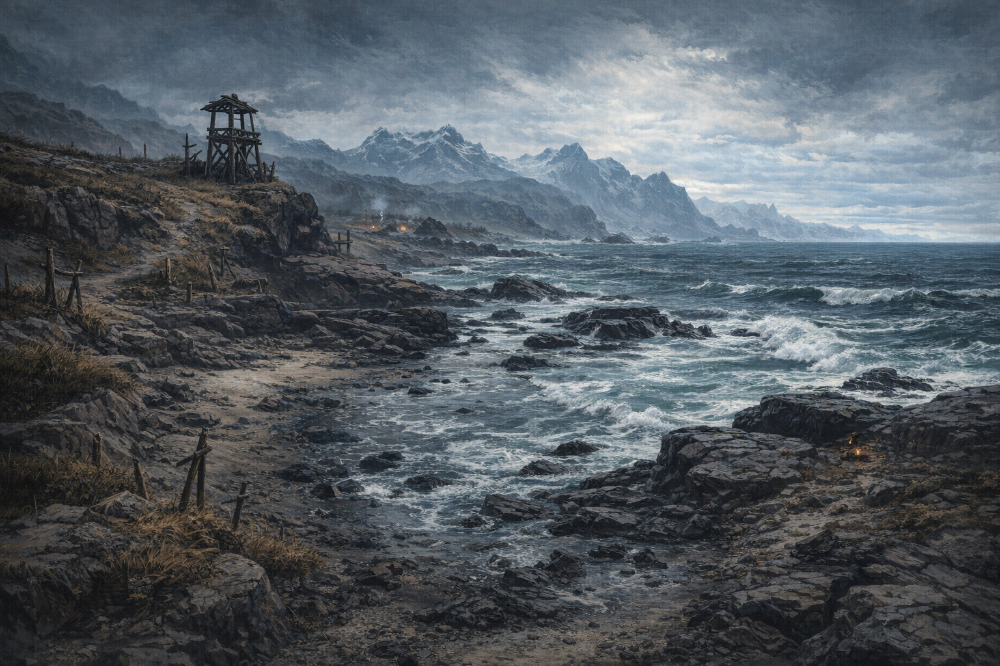

# Session - 2026-04-18

## Summary
- Dain's new session opens along the coastline near the Iron Shore Tribes. [Party]
- Dain begins the session at 20/20 HP with no new resource expenditure recorded yet. [Confirmed]
- An establishing scene image was created to anchor the coastline's mood and geography in campaign memory. [Confirmed]

## Links
- Previous session: None recorded.
- Next session: TBD
- Open Threads: ../Codex/Lore/Open Threads.md

## Starting State
- Location: Coastline near the Iron Shore Tribes
- Immediate goal: [To verify]
- Important active conditions/resources: HP 20/20, Temp HP [To verify], 1st-level slots 4/4, 2nd-level slots 2/2, Arcane Recovery unused, Stonecunning 2/2
- Key unresolved tension entering session: Why Dain is here, and what business or threat awaits along the Iron Shore coastline [To verify]

## Live Notes (chronological)
- The session opens on a harsh stretch of coast near the Iron Shore Tribes, with surf, rock, and tribal watch-signs defining the immediate landscape. [Party]
- **[Prompt]**

  ```text
  Also begin new campaign session , we are along the coastline near Iron Shore Tribes
  ```

## Character State Changes
- Current location established as the coastline near the Iron Shore Tribes.
- No HP, spell-slot, inventory, or condition changes recorded yet.

## New Canon / Important Discoveries
- [Party] Dain's current session opens along the coastline near the Iron Shore Tribes.

## Open Threads
- [Open] Dain's immediate purpose along the Iron Shore coastline remains [To verify].

## Images

