# Session - 2026-05-03

## What Happened Last Time
- The party converged near the [Iron Shore Watchtower](../Codex/Places/Iron%20Shore%20Watchtower.md) of the [Iron Shore Tribes](../Codex/Factions/Iron%20Shore%20Tribes.md), then traveled east to [Lerdar](../Codex/Places/Lerdar.md), a smaller dwarven city. [Party]
- In Lerdar, [Commander Agland](../Codex/Characters/Commander%20Agland.md) received the party's report and sent them into the mountains with [Agland's Sealed Letter](../Codex/Items/Aglands%20Sealed%20Letter.md) for the actual general in a settlement near [Samyrn Torst](../Codex/Lore/Samyrn%20Torst.md). [Party]
- [Dain Truthammer](../Codex/Characters/Dain%20Truthammer.md) still does not know what original news the party brought to Agland, though he has promised to help carry the matter forward. [Character-only]
- The party followed the river route into the mountains, camped at the [Creek-Fork Camp](../Codex/Places/Creek-Fork%20Camp.md), and survived the [Creek-Fork Ogre Ambush](../Codex/Events/Creek-Fork%20Ogre%20Ambush.md). [Party]
- Dain used `Sleep` under the 2014 spell ruling with no effect, then used `Suggestion` to make one ogre drop its club, lie face down in the creek, and float downstream with its hands behind its head. [Character-only]
- During camp, Dain worked on the anti-shelter spell idea that later became the DM-approved working draft of [Truthammer's Leaky Tent](../Codex/Powers/Truthammer%20Leaky%20Tent.md). [Character-only] [Confirmed]
- Two hours into the next day's mountain travel, the party found the [Harpy Nest Near Samyrn Torst](../Codex/Places/Harpy%20Nest%20Near%20Samyrn%20Torst.md); Dain hid in mountain cracks and used subtle magic to draw harpies past him while the party engaged openly. [Party] [Character-only]
- Dain burned an alpha harpy with `Chromatic Orb`, grease, and `Suggestion`; after the [Harpy Nest Battle](../Codex/Events/Harpy%20Nest%20Battle.md), Dain received the [Ghostly Form Tattoo](../Codex/Items/Ghostly%20Form%20Tattoo.md) reward. [Party] [Character-only] [Confirmed] [Retcon]

## Open Points
- [Open] Deliver [Agland's Sealed Letter](../Codex/Items/Aglands%20Sealed%20Letter.md) to the actual general in the mountain settlement near [Samyrn Torst](../Codex/Lore/Samyrn%20Torst.md). [Party]
- [Open] Learn the general's name and the exact mountain settlement destination. [Party] [To verify]
- [Open] Learn what news the party first brought to [Commander Agland](../Codex/Characters/Commander%20Agland.md) and whether [Dain Truthammer](../Codex/Characters/Dain%20Truthammer.md) is being trusted with the full stakes. [Party] [Character-only]
- [Open] Confirm who physically carries [Agland's Sealed Letter](../Codex/Items/Aglands%20Sealed%20Letter.md) and what protections surround it. [Party] [To verify]
- [Open] Clarify the final harpy-nest loot beyond Dain's [Ghostly Form Tattoo](../Codex/Items/Ghostly%20Form%20Tattoo.md). [Party] [To verify]
- [Open] Confirm the tattoo's exact mechanics: charges, recharge, duration, attunement, whether it is already applied, and where it appears on Dain's body. [Character-only] [To verify]
- [Open] Confirm live adventuring state: temp HP, inspiration, exact current HP, `Chromatic Orb` resource use, and any unrecorded damage or recovery after the harpy fight. [Character-only] [To verify]
- [Active] [Brother Taleesh](../Codex/Characters/Brother%20Taleesh.md), Jackson's lizardfolk monk, has arrived at the forest camp by camel; establish why he joins the current mission. [Party] [To verify]
- [Active] [Hammerton Harry Drizddon](../Codex/Characters/Hammerton%20Harry%20Drizddon.md), Norhan's Mountain Dwarf Fighter 3 / eldritch martial warrior, is present at the forest camp; establish how he joins or has joined the current mission. [Party] [To verify]
- [Open] Handle the immediate relationship tension: Taleesh distrusts dwarves and elves, while Dain is a dwarf and the party includes [Kagrenac](../Codex/Characters/The%20Astral%20Elf.md), Matt's Astral Elf. [Party] [To verify]
- [Active] Keep collecting strange magical edge cases and impractical spell ideas now that [Truthammer's Leaky Tent](../Codex/Powers/Truthammer%20Leaky%20Tent.md) has become canon. [Character-only]

## Get Into Character
- Dain has made a promise before he fully understands the problem. Start curious, helpful, and slightly suspicious.
- The sealed letter is the obvious mission; the hidden mission is learning what everyone else already knows.
- The [Ghostly Form Tattoo](../Codex/Items/Ghostly%20Form%20Tattoo.md) is useful, dangerous, and delightfully odd. Dain should want to test its limits, but only after learning the fine print.
- [Kagrenac](../Codex/Characters/The%20Astral%20Elf.md) has earned `+4` respect, partly through audacity and partly through nonsense. That is not trust yet, but it is an opening.
- [Brother Taleesh](../Codex/Characters/Brother%20Taleesh.md) is a desert survivor with reason to distrust dwarves and elves. Dain should lead with respect, not riddles, until he knows where the wound is.
- Stone, mountain roads, old settlements, strange wards, and bad shelter magic are all fair game for Dain's attention.
- Useful table line: "A sealed letter is just a secret wearing better clothes."

## Starting State
- Location: Forested area roughly 20 minutes farther along from the defeated [Harpy Nest Near Samyrn Torst](../Codex/Places/Harpy%20Nest%20Near%20Samyrn%20Torst.md); the party is beginning a long rest. [Party]
- Immediate goal: Continue toward the mountain settlement and deliver [Agland's Sealed Letter](../Codex/Items/Aglands%20Sealed%20Letter.md) to the actual general. [Party]
- Important active conditions/resources: Current HP `20` [To verify after harpy fight], Temp HP [To verify], 1st-level slots `4/4`, 2nd-level slots `1/2`, Arcane Recovery [To verify], Stonecunning [To verify], no active conditions recorded. [Character-only]
- Key items: [Ghostly Form Tattoo](../Codex/Items/Ghostly%20Form%20Tattoo.md) x1 with exact mechanics [To verify]; [Agland's Sealed Letter](../Codex/Items/Aglands%20Sealed%20Letter.md) in party possession, physical carrier [To verify]. [Party] [Character-only]
- Key relationship tensions: [Dain Truthammer](../Codex/Characters/Dain%20Truthammer.md) respects [Kagrenac](../Codex/Characters/The%20Astral%20Elf.md) more than before but does not fully know his motives; Dain has promised to help the party despite missing mission context; [Brother Taleesh](../Codex/Characters/Brother%20Taleesh.md)'s distrust of dwarves and elves may complicate both Dain and Kagrenac. [Character-only] [Party] [To verify]

## Links
- Previous session: [Session - 2026-04-18](./2026-04-18.md)
- Next session: TBD
- Open Threads: [Open Threads](../Codex/Lore/Open%20Threads.md)
- Character State: [Current State](../Character/Current%20State.md), [Inventory](../Character/Inventory.md), [Relationships](../Character/Relationships.md), [Spellbook](../Character/Spellbook.md)
- Table Roster: [Table Roster](../Codex/Lore/Table%20Roster.md)
- Key Characters: [Dain Truthammer](../Codex/Characters/Dain%20Truthammer.md), [Kagrenac](../Codex/Characters/The%20Astral%20Elf.md), [Brother Taleesh](../Codex/Characters/Brother%20Taleesh.md), [Hammerton Harry Drizddon](../Codex/Characters/Hammerton%20Harry%20Drizddon.md), [Commander Agland](../Codex/Characters/Commander%20Agland.md)
- Key Items And Powers: [Agland's Sealed Letter](../Codex/Items/Aglands%20Sealed%20Letter.md), [Ghostly Form Tattoo](../Codex/Items/Ghostly%20Form%20Tattoo.md), [Truthammer's Leaky Tent](../Codex/Powers/Truthammer%20Leaky%20Tent.md)

## Summary
- Filled after play.

## Live Notes (chronological)
- Session opens here.
- The party continues walking for about 20 minutes and arrives at a forested area. [Party]
- The party begins taking a long rest in the forested area. [Party]
- Kagrenac is confirmed as the name of Matt's Astral Elf party member. [Party] [Confirmed]
- During the long rest, [Dain Truthammer](../Codex/Characters/Dain%20Truthammer.md) holds his normal tent in a flowing river and performs random somatic components over it as the water runs through the fabric. [Character-only]
- A flash of inspiration shows Dain what the spell was missing, and he formally creates [Truthammer's Leaky Tent](../Codex/Powers/Truthammer%20Leaky%20Tent.md). [Character-only] [Confirmed]
- The creation manifests with an explosion audible to the party, immediately collapsing into a dampened explosive sound that implodes. [Party]
- A beautiful tent appears, dry on the outside. Dain spends the final hour of the long rest meditating inside the leaky tent, marveling in his new spell. [Character-only]
- **[Prompt]**

  ```text
  Dain Truthammer holds his normal tent, pushing it inside the flowing river, and using random somatic components on the tent as the water flows through it. Through a flash of inspiration, Dain realises what he was missing with the spell; and he formally creates his spell; Truthammer's Leaky Tent. With an explosion, that could be heard by the party, that immediately turns into a "dampened exposive" sound, and the explosion sound implodes.
  A beautiful tent appears, dry on the outside.
  He spends the last hour meditating inside his leaky tent, marvelling in his creation, basking in his new spell.
  ```
- DM note: [Dain Truthammer](../Codex/Characters/Dain%20Truthammer.md) is considered an outcast from [Truthammer mountain](../Codex/Places/Truthhammer%20Mountains.md) because of his faith in [Garl Glittergold](../Codex/Lore/Garl%20Glittergold.md). [DM-private] [Character-only] [Confirmed]
- Player interpretation: Dain's outcast status may explain why he is often vague about his life, stories, and backstory. [Inferred]
- [Brother Taleesh](../Codex/Characters/Brother%20Taleesh.md) arrives at the forest camp while [Hammerton Harry Drizddon](../Codex/Characters/Hammerton%20Harry%20Drizddon.md) is holding up and inspecting a severed lizard head. [Party]
- [Kagrenac](../Codex/Characters/The%20Astral%20Elf.md) casts `Thaumaturgy` on himself and addresses Taleesh in Draconic. [Party]
- Taleesh jumps down from his camel, leads it to a sheltered secured area, and crouches. [Party]
- **[Prompt]**

  ```text
  The Brother Taleesh arrives, as Norhan is holding a severed lizard head up inspecting it.
  Matthew casts thermataughy on himself, and addresses Taleesh arriving in Dragonic.
  Taleesh jumps off the camel and leads it to a sheltered secured area and crouches down.
  ```
- [Kagrenac](../Codex/Characters/The%20Astral%20Elf.md) informs the party in Common that "a lizard has arrived," referring to [Brother Taleesh](../Codex/Characters/Brother%20Taleesh.md). [Party]
- [Dain Truthammer](../Codex/Characters/Dain%20Truthammer.md) exits [Truthammer's Leaky Tent](../Codex/Powers/Truthammer%20Leaky%20Tent.md), dressed and damp, and asks what is going on. [Party] [Character-only]
- Dain sees [Hammerton Harry Drizddon](../Codex/Characters/Hammerton%20Harry%20Drizddon.md) holding the severed lizard head and initially thinks that is what Kagrenac meant by "a lizard." [Character-only]
- **[Prompt]**

  ```text
  Matthew informs the party in common a lizard has arrived (referring to Jackson). Truthammer exits his tent, dressed and damp, and questions what is going on. He sees Norhan holding a severed lizard head. Truthammer thinks that is what Matt is referring to.
  ```
- Dain realizes [Kagrenac](../Codex/Characters/The%20Astral%20Elf.md) was not referring to the severed lizard head [Hammerton Harry Drizddon](../Codex/Characters/Hammerton%20Harry%20Drizddon.md) is holding. [Character-only]
- Dain uses `Prestidigitation` to boom his voice outward and calls, "Who goes there?" toward the actual arrival. [Party] [Character-only]
- **[Prompt]**

  ```text
  Truthammer yells out after realising they are not referring to the severed head Norhan is holding, using Prestidigitation booms his voice out, "who goes there?"
  ```
- [Brother Taleesh](../Codex/Characters/Brother%20Taleesh.md) approaches the party with his scimitar at low ready and answers in Common, "Just a fellow traveller." [Party]
- Dain replies, "Ah, we're all travellers. Come join us." [Party] [Character-only]
- **[Prompt]**

  ```text
  Jackson approaches the party with his scimitar at low ready and announces in common, "Just a fellow traveller".
  Truthammer replies, "ah, we're all travellers. Come join us."
  ```
- Dain approaches [Brother Taleesh](../Codex/Characters/Brother%20Taleesh.md), reads him as standoffish and afraid, then stops and puts down his staff. [Character-only] [Inferred]
- Dain reassures Taleesh: "No need to be afraid - if you have heard of the Truthammer's, you should know we are safe, respectable travellers." [Party] [Character-only]
- **[Prompt]**

  ```text
  Truthammer approaches the lizard, notices hes standoffish and afraid, and stops, puts down his staff, "no need to be afraid - if you have heard of the Truthammer's, you should know we are safe, respectable travellers."
  ```
- [Brother Taleesh](../Codex/Characters/Brother%20Taleesh.md) reaches into his stash, produces herbal items, and asks whether the party needs "some comfry," pig-weed, or hedgehog mushroom. [Party]
- **[Prompt]**

  ```text
  The newcomer reaches into his stash, and produces a set of herbal items, and asks "do you need some comfry? do you want some pig-weed, hedgehog mushroom, does it interest you?"
  ```
- Taleesh mentions he also has [goji leaves](../Codex/Items/Taleeshs%20Herbal%20Stash.md), says "the first one is free," and claims, "When you take this, you will feel like a god." [Party] [To verify effects]
- Dain rejects the offer, saying the Truthhammers do not alter themselves in such ways, then suggests, "The young elf may be interested," referring to [Kagrenac](../Codex/Characters/The%20Astral%20Elf.md). [Party] [Character-only]
- **[Prompt]**

  ```text
  The newcomer mentions he has some "goji leaves, the first one is free. When you take this, you will feel like a god." Truthammer rejects the offer, saying the Truthammer's do not alter themselves in such ways. But mentions, "the young elf may be interested." referring to the astral elf.
  ```
- As Dain approaches, Taleesh spends 1 ki point and projects ghostly astral arms from his shoulders; this is not used as an aggressive tactic. [Party]
- Dain tells [The Festival Of Completely Unnecessary Lanterns](../Codex/Lore/Truthammer%20Tales/The%20Festival%20Of%20Completely%20Unnecessary%20Lanterns.md) and offers to create a lantern with Taleesh. [Party] [Character-only]
- Dain conjures a warm cloak and proposes a deal: if Taleesh approaches and joins the party, they will keep him warm. Dain confirms this with the party. [Party] [Character-only]
- Taleesh approaches and introduces himself to the party. [Party]
- **[Prompt]**

  ```text
  As I approach Jackson, he burns a ki point, and ghostly astral arms are projected from his shoulders. It isn't an aggressive tactic.  Truthammer tells a story of [The Festival Of Completely Unnecessary Lanterns.md](Codex/Lore/Truthammer Tales/The Festival Of Completely Unnecessary Lanterns.md)

  offering to create a lantern with him. Truthammer conjures a warm cloak, and notes if he approaches and joins us, we make a deal that we will keep him warm. I confirm this with the party. He approaches, and introduces himself to the party.
  ```
- [Brother Taleesh](../Codex/Characters/Brother%20Taleesh.md) gives Dain one pound of hedgehog mushroom from [Taleesh's Herbal Stash](../Codex/Items/Taleeshs%20Herbal%20Stash.md). [Party]
- Dain hollows out the hedgehog mushroom and begins creating a [Hedgehog Mushroom Lantern](../Codex/Items/Hedgehog%20Mushroom%20Lantern.md) inspired by [The Festival Of Completely Unnecessary Lanterns](../Codex/Lore/Truthammer%20Tales/The%20Festival%20Of%20Completely%20Unnecessary%20Lanterns.md). [Party] [Character-only]
- **[Prompt]**

  ```text
  Lizard gives me Hedgehog mushroom, a pound. I hollow it out and begin to create a lantern from the story.
  ```
- Dain records `+17` respect toward [Brother Taleesh](../Codex/Characters/Brother%20Taleesh.md), "the Lizard," after the hedgehog mushroom gift and lantern-making follow-through. [Character-only]
- **[Prompt]**

  ```text
  +17 respect to the Lizard
  ```

## Character State Changes
- Current location advances to a forested area roughly 20 minutes beyond the defeated harpy nest. [Party]
- The party has begun a long rest; rest benefits and resource recovery are not yet confirmed until the rest completes. [Party] [To verify]
- Dain formally creates [Truthammer's Leaky Tent](../Codex/Powers/Truthammer%20Leaky%20Tent.md) during the long rest and spends the last hour meditating inside it. [Character-only] [Confirmed]
- Dain's background is clarified: he is considered an outcast from Truthammer mountain due to his faith in [Garl Glittergold](../Codex/Lore/Garl%20Glittergold.md). [DM-private] [Character-only] [Confirmed]
- First in-world contact with [Brother Taleesh](../Codex/Characters/Brother%20Taleesh.md) begins at the forest camp; Dain has entered the scene but has not yet clearly recognized Taleesh as the living newcomer. [Party] [Character-only] [To verify]
- Dain exits the leaky tent dressed but damp and joins the camp confusion around Taleesh's arrival. [Character-only]
- Dain initially misunderstands Kagrenac's Common warning about "a lizard" as referring to the severed lizard head Hammerton is inspecting. [Character-only]
- Dain realizes the "lizard" is not the severed head and uses `Prestidigitation` to boom his voice outward with a challenge. [Party] [Character-only]
- Taleesh answers Dain's challenge calmly as "just a fellow traveller," and Dain invites him to join the party at the camp. [Party] [Character-only]
- Dain reads Taleesh as standoffish and afraid, stops his approach, puts down his staff, and reassures him by invoking the Truthammer name as safe and respectable. [Party] [Character-only] [Inferred]
- Taleesh shifts the first-contact exchange toward practical aid by offering herbs from [Taleesh's Herbal Stash](../Codex/Items/Taleeshs%20Herbal%20Stash.md). Effects, quantities, and whether anyone accepts are still [To verify]. [Party]
- Dain refuses the offered goji leaves and frames the refusal as a Truthammer boundary against altering himself in that way; he then redirects the offer toward Kagrenac as a possibility. [Party] [Character-only]
- Taleesh spends 1 ki point to project astral arms from his shoulders; remaining ki and exact active duration are [To verify]. [Party]
- Dain conjures a warm cloak and creates a party-backed warmth bargain for Taleesh; exact conjuration mechanics and duration are [To verify]. [Party] [Character-only]
- Taleesh approaches and introduces himself to the party, moving first contact from guarded standoff to tentative introduction. [Party]
- Dain receives one pound of hedgehog mushroom from Taleesh and begins turning it into a [Hedgehog Mushroom Lantern](../Codex/Items/Hedgehog%20Mushroom%20Lantern.md); whether the lantern is completed, functional, magical, or merely decorative is [To verify]. [Party] [Character-only]
- Dain records `+17` respect toward Brother Taleesh. [Character-only] [Confirmed]

## New Canon / Important Discoveries
- [Party] [Kagrenac](../Codex/Characters/The%20Astral%20Elf.md) is the name of Matt's Astral Elf party member.
- [Party] The party reaches a forested area after about 20 minutes of travel from the prior mountain-road position.
- [Party] The party begins a long rest in that forested area.
- [Character-only] Dain formally creates [Truthammer's Leaky Tent](../Codex/Powers/Truthammer%20Leaky%20Tent.md) during the long rest after experimenting with his normal tent in a flowing river.
- [Party] The party hears the spell's creation as an explosion that immediately dampens and implodes.
- [DM-private] [Character-only] Dain is considered an outcast from Truthammer mountain because of his faith in [Garl Glittergold](../Codex/Lore/Garl%20Glittergold.md).
- [Inferred] This outcast status may explain Dain's habit of speaking vaguely about his life, stories, and backstory.
- [Party] [Brother Taleesh](../Codex/Characters/Brother%20Taleesh.md) arrives at the forest camp by camel and secures the animal before crouching.
- [Party] [Hammerton Harry Drizddon](../Codex/Characters/Hammerton%20Harry%20Drizddon.md) is present and inspecting a severed lizard head. [To verify source and significance]
- [Party] [Kagrenac](../Codex/Characters/The%20Astral%20Elf.md) casts `Thaumaturgy` on himself and addresses Taleesh in Draconic.
- [Party] Kagrenac then tells the party in Common that "a lizard has arrived," referring to Taleesh.
- [Character-only] Dain exits his tent dressed and damp, sees Hammerton holding the severed lizard head, and initially thinks that is the "lizard" Kagrenac meant.
- [Party] Dain realizes the misunderstanding and uses `Prestidigitation` to boom his voice outward, calling, "Who goes there?"
- [Party] Taleesh approaches with his scimitar at low ready and says in Common, "Just a fellow traveller."
- [Party] Dain answers, "Ah, we're all travellers. Come join us."
- [Character-only] Dain reads Taleesh as standoffish and afraid. [Inferred]
- [Party] Dain stops, puts down his staff, and reassures Taleesh that there is no need to be afraid, claiming the Truthhammers are safe, respectable travellers.
- [Party] Taleesh carries a stash of foraged or traded herbal items and offers comfrey, pigweed, and hedgehog mushroom to the party. [To verify quantities and effects]
- [Party] Taleesh has goji leaves and claims the first one is free and makes the taker "feel like a god." [To verify actual effect, risk, and addictive property]
- [Party] Dain refuses the goji leaves, says the Truthhammers do not alter themselves in such ways, and suggests Kagrenac may be interested.
- [Party] Taleesh can project ghostly astral arms from his shoulders by spending ki; his first use at the camp was explicitly non-aggressive. [To verify exact duration and remaining ki]
- [Party] Dain uses the lantern story [The Festival Of Completely Unnecessary Lanterns](../Codex/Lore/Truthammer%20Tales/The%20Festival%20Of%20Completely%20Unnecessary%20Lanterns.md) as a diplomatic bridge, offers to make a lantern with Taleesh, and conjures a warm cloak.
- [Party] Dain and the party agree that, if Taleesh approaches and joins them, they will keep him warm.
- [Party] Taleesh approaches and introduces himself to the party.
- [Party] Taleesh gives Dain one pound of hedgehog mushroom, and Dain begins hollowing it into a lantern from the story.
- [Character-only] Dain records `+17` respect toward Taleesh, whom the player shorthand calls "the Lizard."

## Open Threads
- Carry forward: deliver [Agland's Sealed Letter](../Codex/Items/Aglands%20Sealed%20Letter.md).
- Carry forward: clarify the original news and mission stakes from [Commander Agland](../Codex/Characters/Commander%20Agland.md).
- Carry forward: confirm [Ghostly Form Tattoo](../Codex/Items/Ghostly%20Form%20Tattoo.md) mechanics and application.
- Carry forward: confirm live adventuring state at session start in [Current State](../Character/Current%20State.md).
- Active: [Brother Taleesh](../Codex/Characters/Brother%20Taleesh.md) has arrived and introduced himself; establish why he joins, what he reveals, whether the warmth bargain holds, how he reacts to the dwarves and [Kagrenac](../Codex/Characters/The%20Astral%20Elf.md), and whether anyone accepts his offered herbs or goji leaves.
- Open: clarify the exact rules, quantities, risks, and accepted uses for [Taleesh's Herbal Stash](../Codex/Items/Taleeshs%20Herbal%20Stash.md), including the one pound of hedgehog mushroom now being turned into a [Hedgehog Mushroom Lantern](../Codex/Items/Hedgehog%20Mushroom%20Lantern.md).
- Active: honor Dain's party-backed warmth bargain with [Brother Taleesh](../Codex/Characters/Brother%20Taleesh.md), including the conjured cloak and the in-progress [Hedgehog Mushroom Lantern](../Codex/Items/Hedgehog%20Mushroom%20Lantern.md) inspired by [The Festival Of Completely Unnecessary Lanterns](../Codex/Lore/Truthammer%20Tales/The%20Festival%20Of%20Completely%20Unnecessary%20Lanterns.md).
- Active: complete or clarify the [Hedgehog Mushroom Lantern](../Codex/Items/Hedgehog%20Mushroom%20Lantern.md): whether it is decorative, functional, magical, food-safe, fuel-burning, or a charmingly damp mistake.
- Open: confirm [Brother Taleesh](../Codex/Characters/Brother%20Taleesh.md)'s current ki after spending 1 point on astral arms, plus exact duration and whether the forest long rest will reset it.
- Carry forward: introduce [Hammerton Harry Drizddon](../Codex/Characters/Hammerton%20Harry%20Drizddon.md), confirm final subclass wording, and clarify the sheet-listed `Slave collar`.
- Open: clarify the source and significance of the severed lizard head [Hammerton Harry Drizddon](../Codex/Characters/Hammerton%20Harry%20Drizddon.md) is inspecting when [Brother Taleesh](../Codex/Characters/Brother%20Taleesh.md) arrives; Dain has realized it is not what Kagrenac meant.
- Carry forward: confirm final mechanics wording for [Truthammer's Leaky Tent](../Codex/Powers/Truthammer%20Leaky%20Tent.md), especially casting format, components, school, and upcast scaling.
- Carry forward: clarify what Dain's outcast status means in practical terms: family standing, clan access, public shame, legal exile, and what Dain admits to the party.
- Carry forward: confirm whether the forest long rest completes and what resources reset afterward.
- Related open-thread index: [Open Threads](../Codex/Lore/Open%20Threads.md)

## Images
- Reference anchors: [Harpy Nest Near Samyrn Torst](../Codex/Places/Harpy%20Nest%20Near%20Samyrn%20Torst.md), [Current State](../Character/Current%20State.md), [Truthammer's Leaky Tent](../Codex/Powers/Truthammer%20Leaky%20Tent.md), [Brother Taleesh](../Codex/Characters/Brother%20Taleesh.md), [Taleesh's Herbal Stash](../Codex/Items/Taleeshs%20Herbal%20Stash.md), [Kagrenac](../Codex/Characters/The%20Astral%20Elf.md), [Hammerton Harry Drizddon](../Codex/Characters/Hammerton%20Harry%20Drizddon.md)

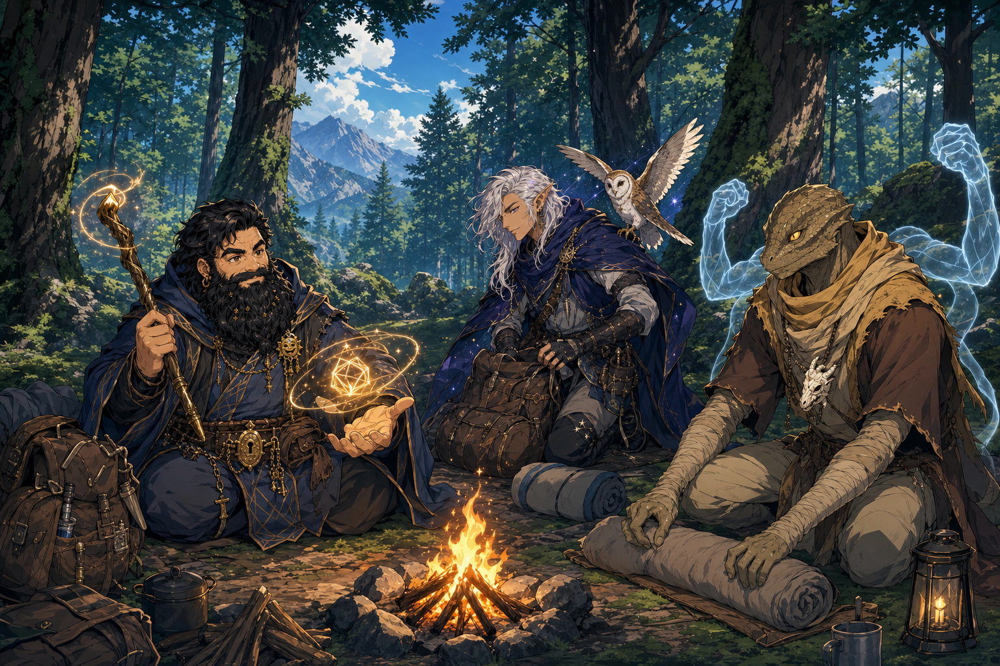
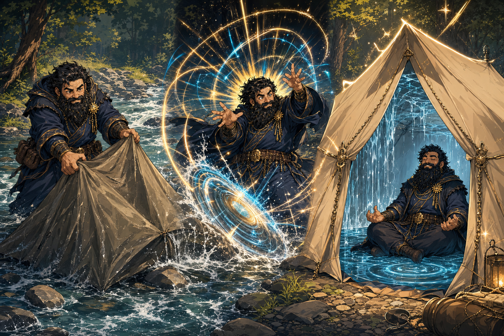
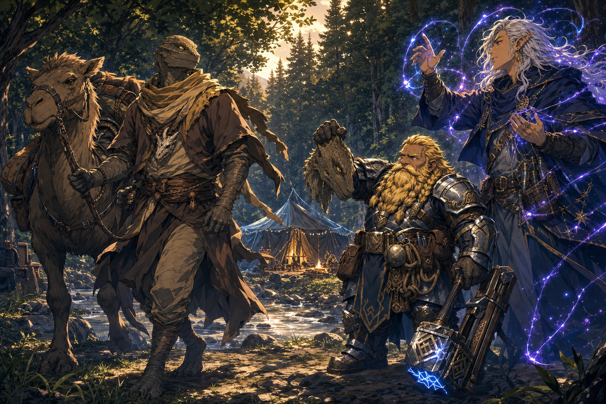
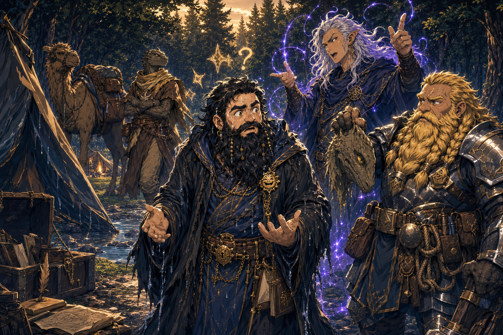
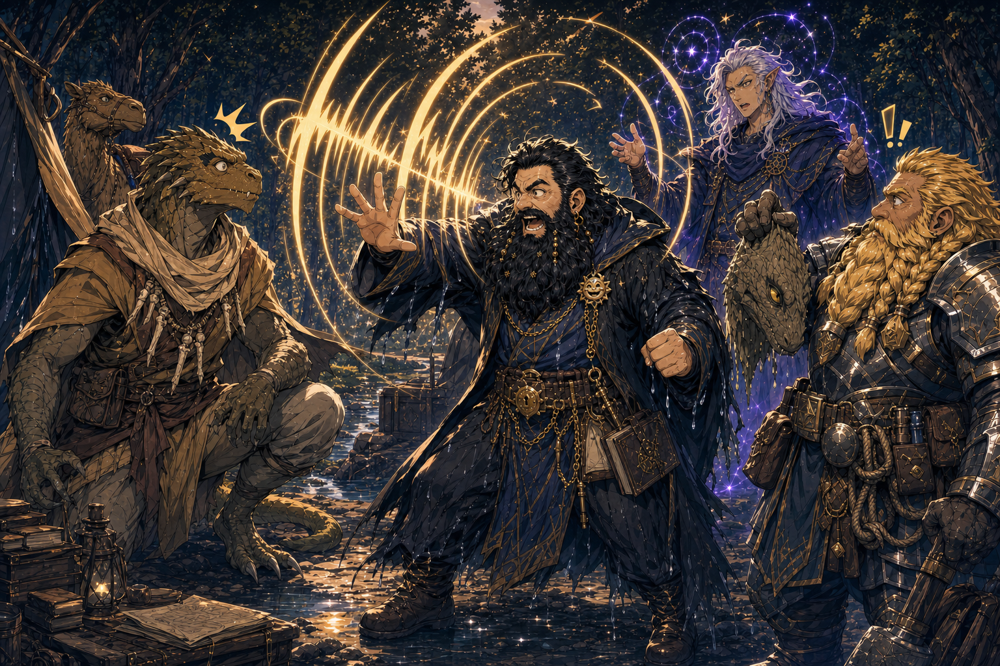
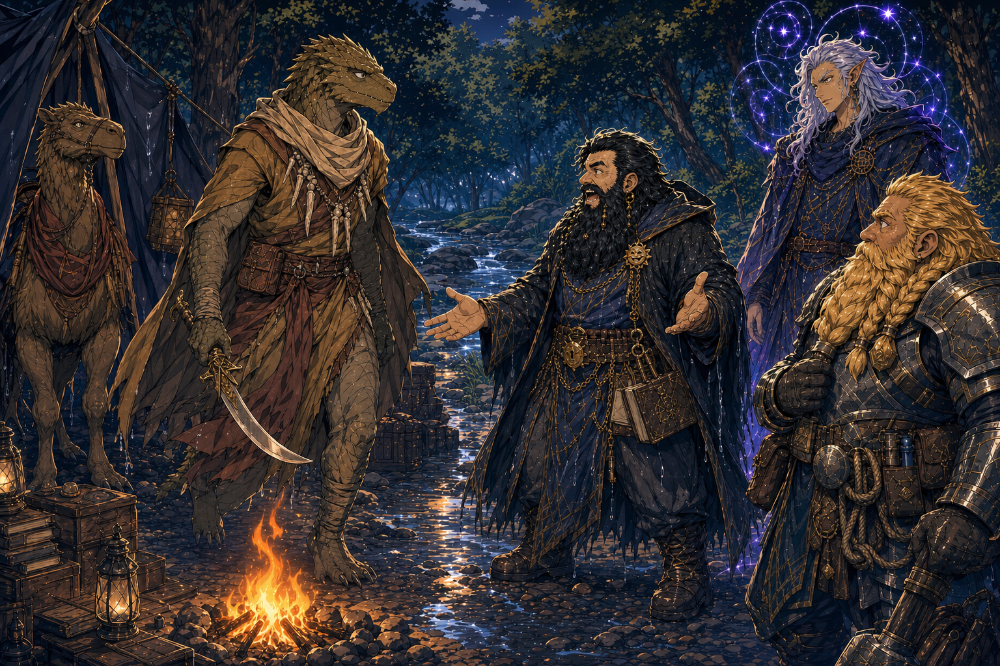
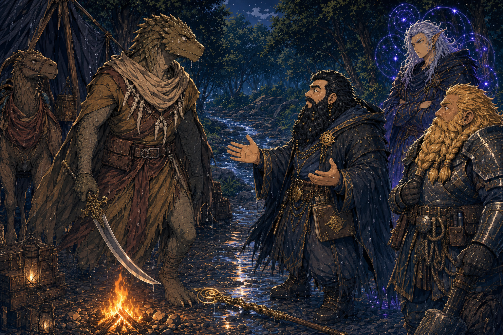
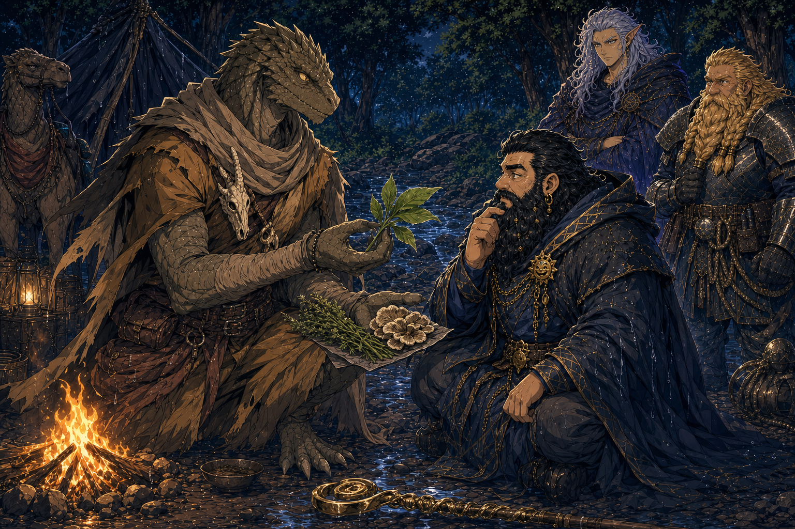
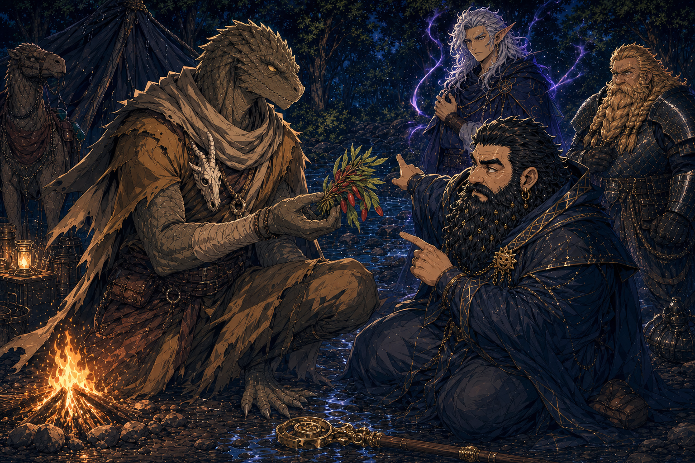
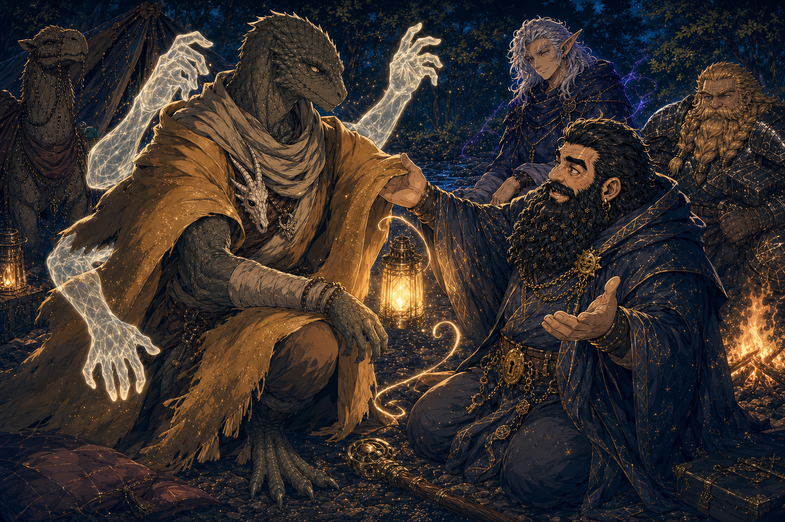
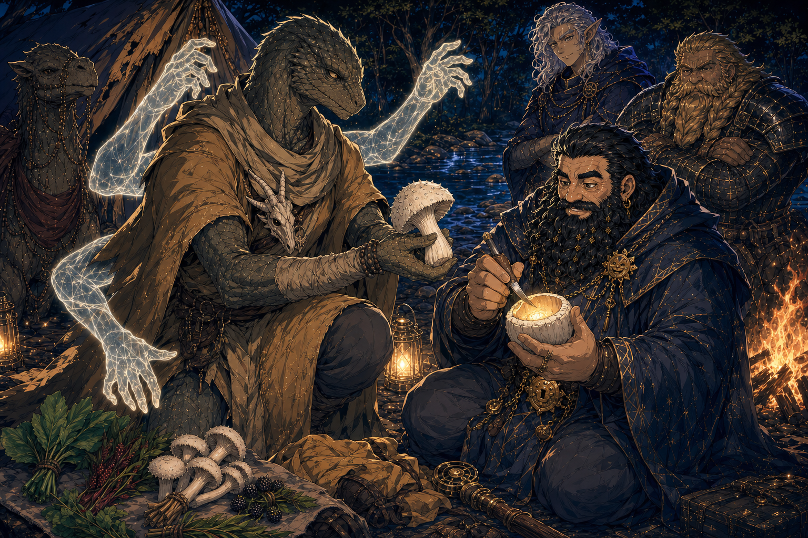
