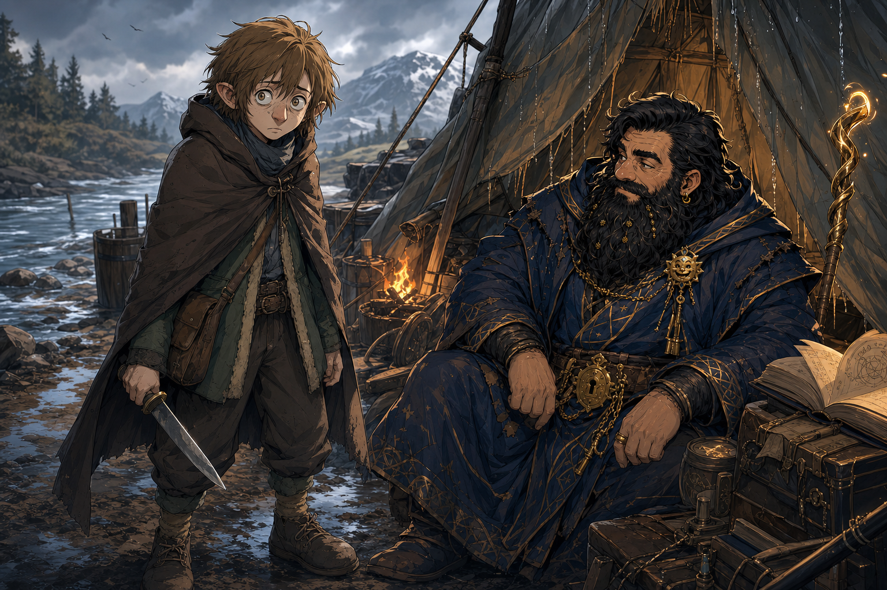
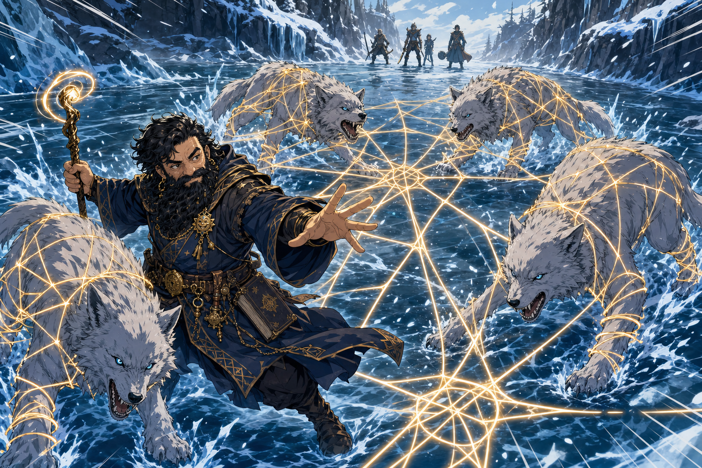
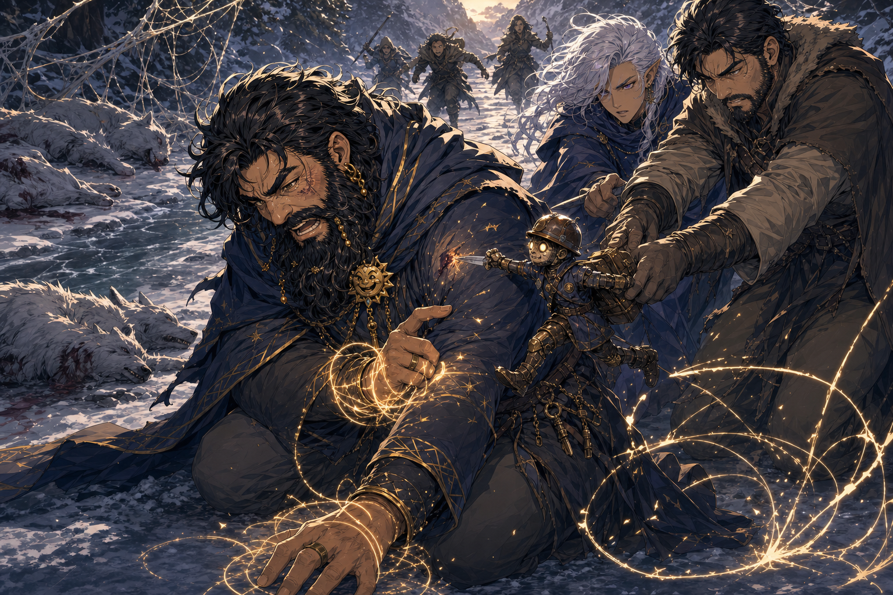

# Session - 2026-05-30

## Summary
- Dain's level 4 choices were settled in the shared ChatGPT session: Wizard 4, Resilient: Constitution, Shape Water, Web, and Rope Trick. HP handling is still [To verify], with `29` treated as the likely max under normal retroactive CON handling.
- Lachlan's new character, [Ollyander](../Codex/Characters/Ollyander.md), arrived at camp: a small hobbit-like humanoid, pale, fawn-haired, shell-shocked, rarely blinking, carrying a large knife, and not visibly hostile.
- The party moved north-east along the river with Ollyander holding onto Dain's Truthammer garment while three travelling humans followed behind.
- The group crossed into a cold area, entered combat with four winter wolves, and destroyed them.
- During the wolf fight, Web and Restrained rules were clarified for table use; the exact 2014/2024 text Tom prefers remains [To verify].
- After the wolves died, Dain prayed to [Garl Glittergold](../Codex/Lore/Garl%20Glittergold.md) near the [Coal Mine Puppet](../Codex/Items/Coal%20Mine%20Puppet.md), denied [Kurtlemack](../Codex/Lore/Kurtlemack.md) tribute from the deaths, and was stabbed by the puppet, nearly dropping to `1 HP`.
- [Brother Taleesh](../Codex/Characters/Brother%20Taleesh.md) gave Dain a good-quality large pelt and asked for always-warm leather; Dain developed it into the dangerous [Sauna Pelt](../Codex/Items/Sauna%20Pelt.md), now `84%` complete [To verify DM acceptance].
- Dain added `250 ft` of silk rope for `35 gp`; payment source, carrier, and carried weight are [To verify].

## Links
- Previous session: [Session 2026-05-03](./2026-05-03.md)
- Next session: [To verify]
- Open Threads: [Open Threads](../Codex/Lore/Open%20Threads.md)

## Date Note
- [To verify] Exact table date. On 2026-06-20, the user corrected that this shared-chat session was not from 2026-06-20, but from roughly three weeks earlier. The archive uses 2026-05-30 as the approximate session date until the exact date is confirmed.

## Starting State
- Location: Camp or immediate travel route after the 2026-05-03 events. Exact transition from the previous manticore/vulture danger is [To verify].
- Immediate goal: Continue protecting the travelling humans and preserve the five truthful answers owed upon delivery.
- Important active conditions/resources: Entering the session, Dain has just leveled to Wizard 4 with Resilient: Constitution. Post-stabbing current HP is [To verify], likely near `1 HP`.
- Key unresolved tension entering session: The Coal Mine Puppet, Kurtlemack, the travelling humans' magical glow, and the owed five truthful answers.

## Live Notes (Chronological)

- **[Prompt]**

  ```text
  Ok then what else for level up? Took Resilient
  ```

  - Dain's level 4 package was reviewed as Wizard 4 with Resilient: Constitution.
  - CON increases from `13` to `14`; CON save becomes `+4`.
  - Max HP is likely `29` under normal retroactive CON handling, but Tom's HP ruling is [To verify].
  - Maximum spell slots become `1st: 4`, `2nd: 3`.

- **[Prompt]**

  ```text
  Yep picked all those. Then to start with, Dain sits after the last session in his leaky tent, meditating, thinking about his father and how he accidentally turned their famous lava forge into a useless forge temporarily. Confirmed with the DM that the truthammers or potentially just Dain are half Azer
  ```

  - Dain's chosen level-up picks were recorded as Shape Water, Web, and Rope Trick.
  - The half-Azer / Truthammer bloodline detail is [To verify] for scope: it may apply to Dain specifically or to the Truthammers more broadly.
  - Forge accident and father material remain idea-stage / unconfirmed unless Tom confirms them in canon.

- **[Prompt]**

  ```text
  I'm going to keep notes here for a new session today: Lachlans new character arrives at the camp, a hobbit, his old character is captured by a gargantuan vulture type creature:
  The skin, she has pale skin, straight, fawn-brown hair, and a pointy nose. And she's kind of like, she almost looks shell-shocked. I don't blink much. Yeah, it's kind of like wandering over. You don't see any hostility. I'm holding a large knife. Yeah, but you're...
  ```

  - Lachlan's new character arrived at camp: [Ollyander](../Codex/Characters/Ollyander.md).
  - Ollyander appears as a small hobbit-like humanoid with pale skin, straight fawn-brown hair, a pointy nose, and a shell-shocked expression.
  - Ollyander rarely blinks, carries a large knife, and is not visibly hostile.
  - Lachlan's previous character was reported captured by a gargantuan vulture-type creature. [To verify whether this means [Yuckie the Goblin](../Codex/Characters/Yuckie%20the%20Goblin.md), the exact creature, and current status]
  - Best immediate read for Dain was Insight: danger, terror, control, injury, or bait.

- **[Prompt]**

  ```text
  +4 respect to Lachlan (Ollyander)
  ```

  - Dain records `+4` respect toward Ollyander / Lachlan's new character.
  - Reason [Inferred]: Ollyander seemed frightened and vulnerable rather than wicked or immediately threatening.

- **[Prompt]**

  ```text
  Brainstorm the questions 5 we get once we deliver them. Specifically to learn more about the puppet. We get 5 truthful answers
  ```

  - The five truthful answers owed by the travelling humans should be saved for the Coal Mine Puppet if possible.
  - Draft questions:
    1. "Tell us exactly how the Coal Mine Puppet came into your possession, from the first moment any of you encountered it to now."
    2. "What do you know, suspect, or have been told the puppet actually is?"
    3. "Which coal mines does it want to return to, where are they, and what is waiting there?"
    4. "What happens if the puppet is returned, destroyed, abandoned, stolen, or kept away from the mines?"
    5. "Why did the puppet react to Dain praying to Garl Glittergold, why did it say Kurtlemack hates you, and who is the 'you'?"
  - Dain framing: "We are owed five truths, and I would prefer the useful kind."

- **[Prompt]**

  ```text
  We move north east along the river, with Ollyander grabbing truthammers garmet as they walk.
  The 3 npcs follow and we lead the group.
  We crossing into a cold area
  ```

  - The party moves north-east along the river.
  - Ollyander walks close to Dain, grabbing or holding onto Dain's Truthammer garment.
  - The three travelling humans follow behind while Dain and the party lead.
  - The group enters a cold area.

- **[Prompt]**

  ```text
  We're entering combat, 4 winter wolves.
  Remind me of my abilities and weapons
  ```

  - Combat begins against four winter wolves.
  - Dain's best discussed options include Web, Mirror Image, Thunderwave, Magic Missile, Suggestion, Ghostly Form Tattoo, oil/fire tricks, and mundane weapons.
  - Ray of Frost may be poor into winter wolves if they resist or ignore cold. [To verify actual creature resistance]

- **[Prompt]**

  ```text
  How come web doesn't work immediately
  ```

  - Web does not normally restrain a creature immediately just because it appears around that creature.
  - Under the discussed ruling, creatures save when they start their turn in the webs or enter the webs.
  - For 2024-style wording, forced or voluntary entry into Web on any turn may trigger the save; exact table wording remains [To verify].
  - Restrained means speed `0`, attack rolls against the creature have advantage, the creature's own attack rolls have disadvantage, and it has disadvantage on Dexterity saves.
  - If the specific 5-foot Web section restraining a creature burns away, the creature is no longer restrained by that Web.

- **[Prompt]**

  ```text
  What does Glittergold think of death? And tribute?
  ```

  - Garl Glittergold's exact rites around death and tribute are still [To verify].
  - Working Dain interpretation: death should be met with respect, memory, cleverness, courage, and protective misdirection rather than blood tribute or grim worship.
  - Useful Dain line: "Glittergold does not ask us to laugh at death. Only to make certain death does not get the final joke uncontested."

- **[Prompt]**

  ```text
  What about the kobold puppets god
  ```

  - In-repo canon still marks Kurtlemack's nature as [To verify].
  - Out-of-character inference from D&D lore links Kurtlemack to Kurtulmak, a kobold deity associated with traps, mining, war, and hatred of Garl Glittergold.
  - Keep this as [Inferred] until Tom confirms the campaign version.

- **[Prompt]**

  ```text
  After destroying the wolves, Dain went over to the puppet and started praying to Glittergold, and denying kurtlemack of tribute
  ```

  - After the winter wolves were destroyed, Dain approached the Coal Mine Puppet.
  - Dain prayed to Garl Glittergold and deliberately denied Kurtlemack / Kurtulmak any tribute from the wolves' deaths.
  - Dain treats the wolves' deaths as protection, not blood-debt or mine-god offering.

- **[Prompt]**

  ```text
  The puppet stabbed Dain and almost got him to 1 hp, the other humans travelling restrain him
  ```

  - The puppet reacted violently and stabbed Dain.
  - Dain was nearly reduced to `1 HP`. Exact current HP and damage are [To verify].
  - The travelling humans restrained "him"; whether "him" means the puppet, Dain, or both is [To verify].
  - Immediate read: the puppet is dangerous, physically hostile, and likely triggered by Dain's Glittergold/Kurtlemack denial.

- **[Prompt]**

  ```text
  Give me a Dainism to say to the puppet
  ```

  - Chosen Dainism:

    > "You mistake blood for tribute. That is common among small gods and badly made knives."

- **[Prompt]**

  ```text
  Taleesh provides me with a good quality large pelt
  And asks me to make it an always warm leather
  I admit it is not my expertise, but given some creative freedom, and some constraint, I will have a go. With my own spin.
  ```

  - Taleesh gives Dain a good-quality large pelt.
  - Taleesh asks Dain to make it into always-warm leather.
  - Dain accepts with creative freedom, constraints, and his own spin.

- **[Prompt]**

  ```text
  Tell me about the custom coat spell. Dain is attempting to make a sauna pelt, it's wet initially but turns into steam and eventually kills the wearer
  ```

  - Dain's project becomes a dangerous failed-success prototype: the Sauna Pelt.
  - Concept: damp pelt, warmth from moisture, then steam, then possible scalding/lethal heat if uncontrolled.
  - This draws on Truthammer's Leaky Tent, the Always-Cold Robes, and the abandoned always-warm garment branch.

- **[Prompt]**

  ```text
  Now I am 84% through to making a sauna pelt using my knowledge of the jacket and my 6% from the warm jacket spell
  ```

  - Dain is now `84%` through the Sauna Pelt / "The Warmth That Forgot Manners."
  - Progress source: knowledge from the Always-Cold jacket/robe experiment plus the earlier `6%` from the abandoned always-warm jacket/robe attempt.
  - DM acceptance of the exact `84%` progress is [To verify].

- **[Prompt]**

  ```text
  Add 250ft of silk rope for 35g
  ```

  - Dain acquired `250 ft` silk rope for `35 gp`.
  - Payment source is [To verify] because Dain's personal inventory only records `13 gp`.
  - Carrier and final carried weight are [To verify].

## Character State Changes
- Dain is now Wizard 4, with Resilient: Constitution selected. [Confirmed from shared chat]
- CON is now `14`, and CON save is now `+4`. [Confirmed from shared chat]
- Max HP is likely `29`, but exact Tom ruling is [To verify].
- Current HP after the Coal Mine Puppet stabbing is [To verify], likely near `1 HP`.
- Spell slots maximum is now `1st: 4`, `2nd: 3`; current remaining after the winter wolf fight is [To verify].
- Dain has added Shape Water, Web, and Rope Trick to his current spell package. [Confirmed from shared chat]
- Dain acquired `250 ft` silk rope for `35 gp`; payment source, carrier, and carried weight are [To verify].
- Dain started the Sauna Pelt for Taleesh and reached `84%` progress [To verify DM acceptance].

## New Canon / Important Discoveries
- Ollyander is Lachlan's new player character. [To verify spelling, pronouns, ancestry, class, and whether prior character means Yuckie]
- The Coal Mine Puppet can escalate from biting to a near-lethal stabbing.
- Dain's denial of Kurtlemack tribute is a major faith beat and may reveal a direct hostile connection between Kurtlemack and Glittergold's faithful. [Inferred]
- The five truthful answers should be preserved for puppet origin, identity, destination, risk, and Dain/Garl/Kurtlemack relevance.
- The Sauna Pelt has become the active follow-through on Taleesh's warmth request, rather than a normal jacket.

## Open Threads
- Confirm Dain's exact current HP after the stabbing.
- Confirm whether the travelling humans restrained the puppet, Dain, or both.
- Confirm whether the puppet is bound, disarmed, boxed, gagged, or still dangerous.
- Ask the five truthful puppet questions when the humans' debt comes due.
- Confirm whether winter wolves yielded pelts, claws, teeth, or cold-magic components.
- Confirm whether Ollyander knows anything about the gargantuan vulture-type creature that captured Lachlan's previous character.
- Confirm whether Sauna Pelt `84%` progress is accepted by Tom and what safety constraint remains.
- Confirm who paid for and carries the `250 ft` silk rope.
- Confirm whether the party is still moving north-east along the river toward the same destination.
- Confirm half-Azer scope: Dain only or the Truthammers more broadly.

## Images





