# Session - 2026-06-20 - Glittergold Road

## Summary
- Session title: `Glittergold Road`. This is the user's session title, not a confirmed in-world road or place.
- The session opens in the centre of an [unnamed town](../Codex/Places/Unnamed%20Town%20-%202026-06-20.md). Exact town name and route context are [To verify].
- Six dragon corpses or dragon remains are present, and the town artisans have struck a deal with Truthammer / Dain to make equipment in exchange for the material itself. Exact materials and deliverables are [To verify].
- Dain tries to embody "interesting, but essentially useless" by donating gold to local gnomes who worship [Garl Glittergold](../Codex/Lore/Garl%20Glittergold.md), receiving the [Half-Pound Sack From Glittergold Gnomes](../Codex/Items/Half-Pound%20Sack%20From%20Glittergold%20Gnomes.md) in return, and planning to give that sack to the local church.
- In a tavern, Dain buys drinks for a sad deep gnome, a human, and two dwarves; the human reacts badly, reinforcing Dain's note that human constitution is not as good as dwarven constitution.
- [Brother Taleesh](../Codex/Characters/Brother%20Taleesh.md) invites Dain to play dice, cheats or appears to cheat, and Dain's respect for him drops sharply.
- Dain decides to anti-cheat Taleesh and force him to complete the game, casting `Suggestion` with the command: "Complete the game." Taleesh fails the save, so the game completes; exact slot expenditure and wider table reaction are [To verify].
- Harry / [Hammerton Harry Drizddon](../Codex/Characters/Hammerton%20Harry%20Drizddon.md) asks for Dain's seal, Dain provides it in exchange for `100 gp` worth of silver, then bets that silver; Dain loses the betting round, [Ollyander](../Codex/Characters/Ollyander.md) wins, and a [human/townsperson](../Codex/Characters/Rat-House%20Human%20-%202026-06-20.md) silver exchange creates a new rat-and-poverty action thread. [To verify exact seal, silver ownership, and human identity]
- Dain gives his last `5 gp` to the [human/townsperson](../Codex/Characters/Rat-House%20Human%20-%202026-06-20.md) tied to the rat problem, leaving his gold-piece balance likely at `0`; exact silver and other coin holdings remain [To verify].
- The next morning, Dain reflects on his failed moral lesson, prays to [Garl Glittergold](../Codex/Lore/Garl%20Glittergold.md) about his disappointment, sees a rat fall from the ceiling, and begins writing the idea for a new failed-moral-lesson rat spell in his wizard book. The current lead pitch is `Truthammer's Cuddly Rat`, a comfort spell whose full-hour cuddle leaves the target feeling as if they failed an important moral lesson; mechanics remain idea-stage in [Failed Moral Lesson Rat Spell Ideas](../Codex/Brainstorm/Powers/Failed%20Moral%20Lesson%20Rat%20Spell%20Ideas.md).

## Links
- Previous session: [Session 2026-05-30](./2026-05-30.md)
- Next session: [To verify]
- Open Threads: [Open Threads](../Codex/Lore/Open%20Threads.md)
- Live play aid: [2026-06-20 Live Play Aid](./2026-06-20-play-aid.md)

## Starting State
- Location: Centre of an [unnamed town](../Codex/Places/Unnamed%20Town%20-%202026-06-20.md), after the cold-area travel, winter wolves, and Coal Mine Puppet stabbing from the approximate 2026-05-30 session. [To verify exact town and transition]
- Immediate goals from notebook:
  - Complete the Sauna Jacket / [Sauna Pelt](../Codex/Items/Sauna%20Pelt.md). [To verify whether "jacket" is a rename, shorthand, or separate version]
  - Get the [Coal Mine Puppet](../Codex/Items/Coal%20Mine%20Puppet.md) and go answer the five questions / use the five truthful answers.
  - Embody the idea of "interesting, but essentially useless."
- Important active conditions/resources: Dain's current HP after the puppet stabbing, current spell slots after the winter wolf fight, and current coin balance are all [To verify].
- Key unresolved tension entering session: The puppet mystery, the Sauna Pelt, the dragon remains, and Dain's relationship with Taleesh.

## Source Note Photos
These are the original notebook photos supplied by the user for live-session capture.

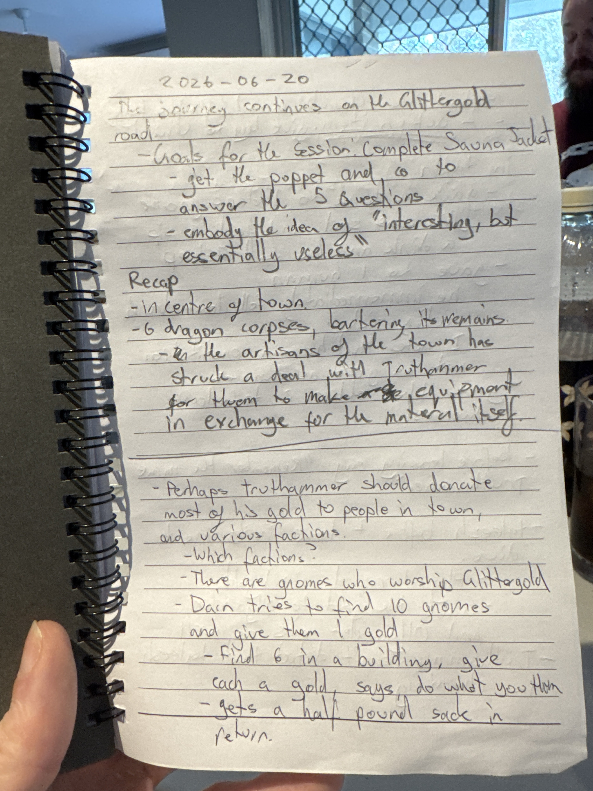

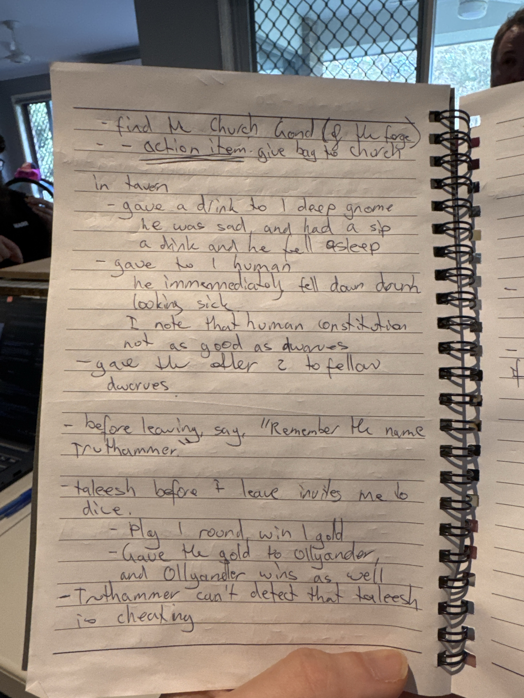

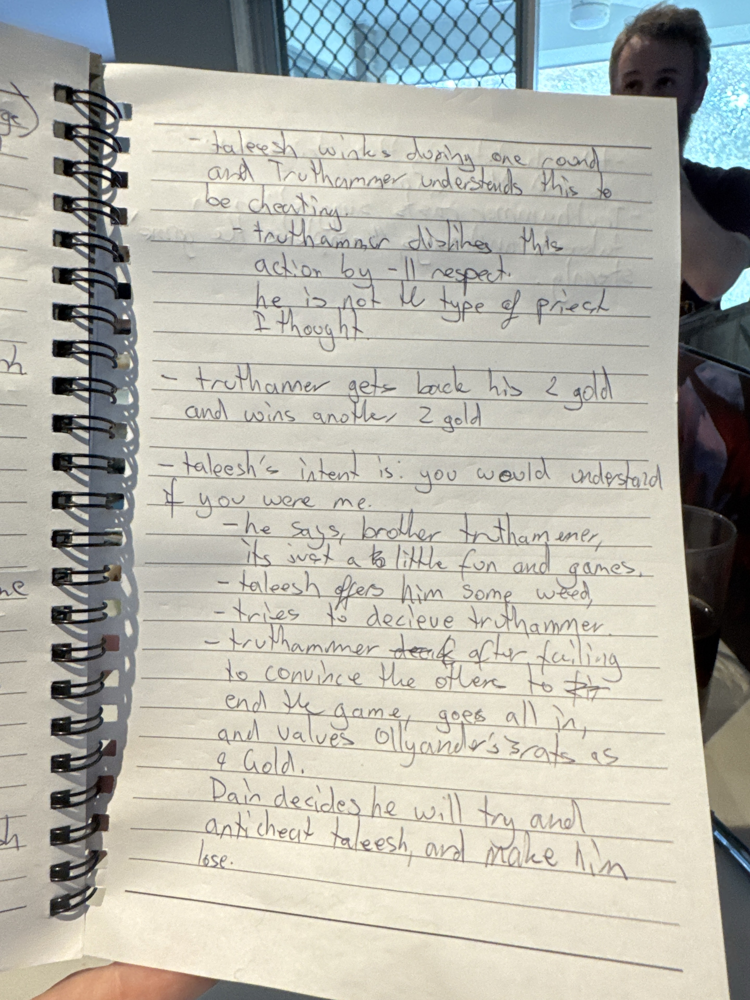

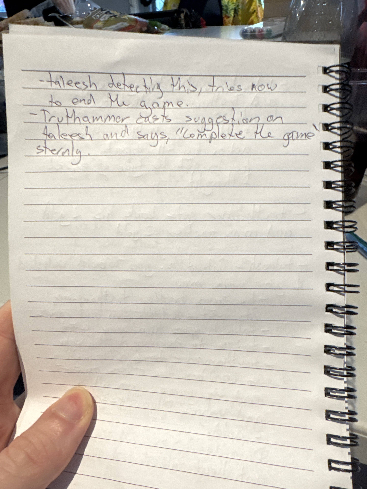

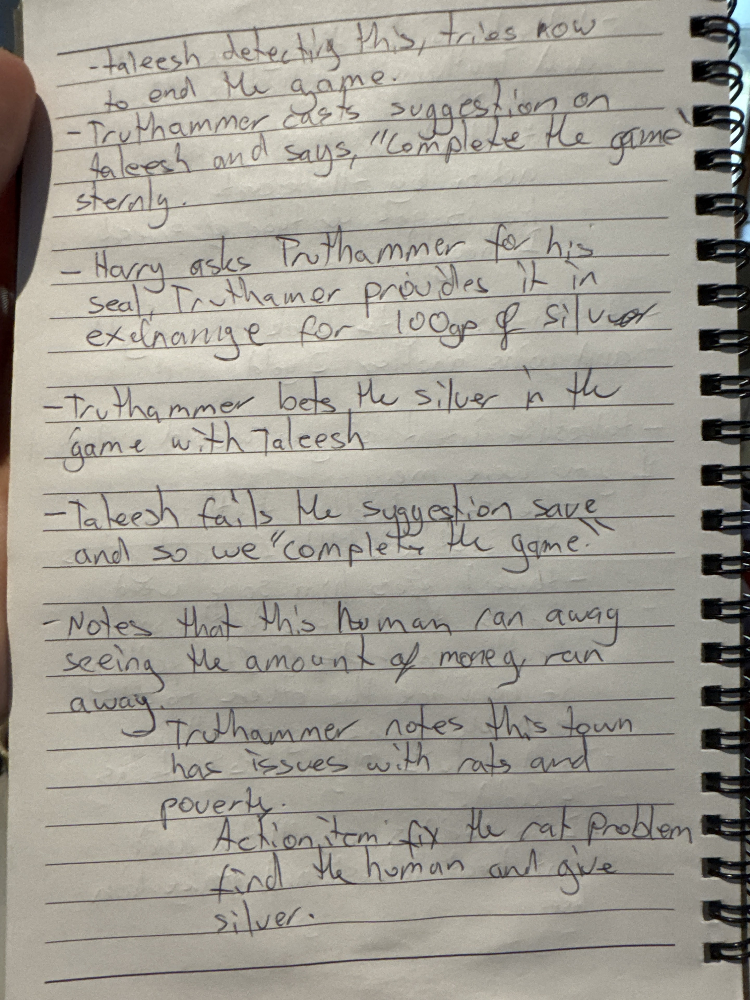

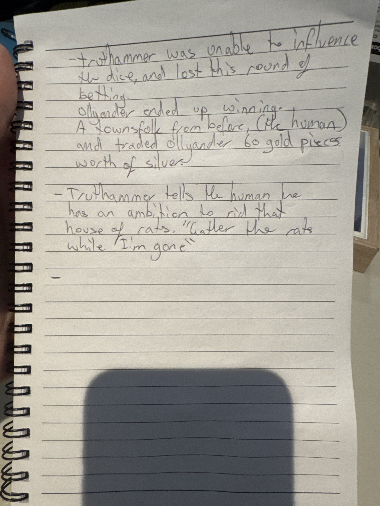

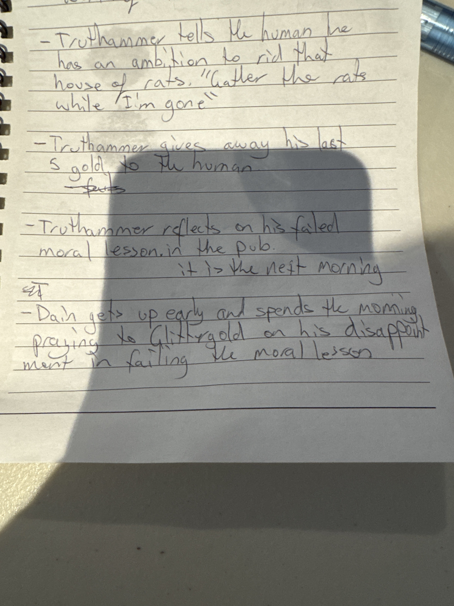

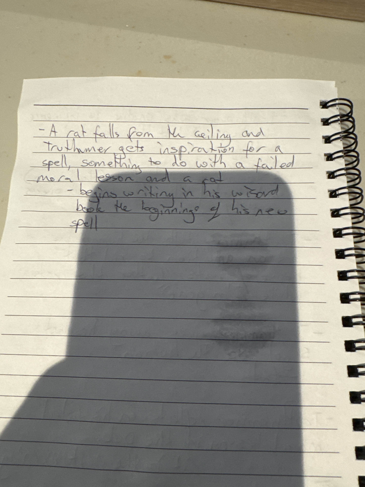

## Live Notes (Chronological)

- **[User correction]**

  ```text
  Glittergold road is just my title for the session
  ```

  - `Glittergold Road` is the session title only.
  - Do not create or treat Glittergold Road as an in-world road/place unless later confirmed in play.

- **[Notebook page 1 transcription]**

  ```text
  2026-06-20
  The journey continues on the Glittergold road
  - Goals for the session. Complete Sauna Jacket
  - get the puppet and go to answer the 5 questions
  - embody the idea of "interesting, but essentially useless"

  Recap
  - In centre of town
  - 6 dragon corpses, barkening its remains [unclear]
  - the artisans of the town has struck a deal with Truthhammer for them to make equipment in exchange for the material itself

  - Perhaps Truthhammer should donate most of his gold to people in town, and various factions.
  - Which factions?
  - There are gnomes who worship Glittergold
  - Dain tries to find 10 gnomes and give them 1 gold
  - find 6 in a building, give each a gold, says do what you th... [unclear]
  - gets a half pound sack in return.
  ```

  - Dain is in the centre of an [unnamed town](../Codex/Places/Unnamed%20Town%20-%202026-06-20.md).
  - Six dragon corpses/remains are present. Exact type of dragon, ownership, and usable materials are [To verify].
  - Town artisans have made a deal with Truthhammer / Dain: they will make equipment in exchange for keeping or using the dragon material itself. [To verify exact terms]
  - Dain considers donating most of his gold to people or factions in town.
  - Dain identifies local gnomes who worship Glittergold as donation targets.
  - Dain tries to find 10 gnomes and give each `1 gp`.
  - Dain finds six gnomes in a building, gives each `1 gp`, says an unclear instruction, and receives the [Half-Pound Sack From Glittergold Gnomes](../Codex/Items/Half-Pound%20Sack%20From%20Glittergold%20Gnomes.md) in return. [To verify contents and exact phrase]

- **[Notebook page 2 transcription]**

  ```text
  - find the church (Gond? of the forge)
  - action item: give bag to church

  In tavern
  - gave a drink to 1 deep gnome
    he was sad and had a sip
    a drink and he fell asleep
  - gave to 1 human
    he immediately fell down drunk
    looking sick
    I note that human constitution not as good as dwarves
  - gave the other 2 to fellow dwarves

  - before leaving say, "Remember the name Truthhammer."

  - Taleesh before I leave invites me to dice.
  - play 1 round win 1 gold
  - gave the gold to Ollyander,
    and Ollyander wins as well
  - Truthhammer can't detect that Taleesh is cheating
  ```

  - Dain wants to find the church, possibly a church of Gond / forge faith, and give the [Half-Pound Sack From Glittergold Gnomes](../Codex/Items/Half-Pound%20Sack%20From%20Glittergold%20Gnomes.md) to it. Exact deity and church identity are [To verify].
  - In the tavern, Dain buys or gives drinks:
    - one sad deep gnome drinks or sips and falls asleep
    - one human drinks and immediately falls down drunk, looking sick
    - two fellow dwarves receive the other drinks
  - Dain notes that human constitution is not as good as dwarven constitution.
  - Before leaving, Dain says: "Remember the name Truthhammer."
  - Taleesh invites Dain to play dice.
  - Dain plays one round and wins `1 gp`.
  - Dain gives the gold to [Ollyander](../Codex/Characters/Ollyander.md), and Ollyander also wins.
  - Dain cannot initially detect that Taleesh is cheating.

- **[Notebook page 3 transcription]**

  ```text
  - Taleesh wins during one round and Truthhammer understands this to be cheating
  - Truthhammer dislikes this action by -11 respect.
    He is not the type of priest I thought.

  - Truthhammer gets back his 2 gold and wins another 2 gold

  - Taleesh's intent is: you would understand if you were me.
  - he says, brother Truthammer, it's just a little fun and games.
  - Taleesh offers him some weed,
  - tries to deceive Truthhammer
  - Truthhammer after failing to convince the other to end the game, goes all in,
    and values Ollyander's 3 rats as 9 gold.
    Dain decides he will try and anti-cheat Taleesh, and make him lose.
  ```

  - Taleesh wins a round, and Dain understands or concludes that Taleesh is cheating.
  - Dain reduces respect for Taleesh by `-11`, noting that Taleesh is not the type of priest Dain thought he was.
  - Dain gets back his `2 gp` and wins another `2 gp`. Exact net coin state is [To verify].
  - Taleesh's intent is recorded as: "you would understand if you were me."
  - Taleesh says, "Brother Truthammer, it's just a little fun and games."
  - Taleesh offers Dain some weed and tries to deceive him.
  - After failing to convince others to end the game, Dain goes all in and values Ollyander's `3 rats` as `9 gp`. [To verify whether "rats" is the correct reading]
  - Dain decides he will try to anti-cheat Taleesh and make him lose.

- **[Notebook page 4 transcription]**

  ```text
  - Taleesh detecting this, tries now to end the game.
  - Truthhammer gets Suggestion on Taleesh and says, "Complete the game" sternly.
  ```

  - Taleesh detects Dain's counterplay and tries to end the game.
  - Dain casts `Suggestion` on Taleesh and says, sternly, "Complete the game."
  - The exact saving throw outcome is confirmed by the next notebook page: Taleesh fails the save. Spell slot expenditure and wider table reaction remain [To verify].

- **[Notebook page 5 transcription]**

  ```text
  - Taleesh detecting this, tries now
    to end the game.

  - Truthammer casts suggestion on
    Taleesh and says, "complete the game
    [sternly?]."

  - Harry asks Truthammer for his
    seal, Truthammer provides it in
    exchange for 100gp of silver

  - Truthammer bets the silver in the
    game with Taleesh

  - Taleesh fails the suggestion save
    and so we "complete the game"

  - Notes that this human ran away
    seeing the amount of money, ran
    away.
    Truthammer notes this town
    has issues with rats and
    poverty.
    Action item for the rat problem
    find the human and give
    silver.
  ```

  - Taleesh fails the `Suggestion` saving throw, so Dain's command to "complete the game" takes hold enough for the game to continue/completed state to matter. [To verify exact spell slot expenditure and any saving throw number]
  - Harry / [Hammerton Harry Drizddon](../Codex/Characters/Hammerton%20Harry%20Drizddon.md) asks Dain for his seal; Dain provides it in exchange for `100 gp` worth of silver. [To verify exact object, whether this is Dain's personal seal/signet/stamp, and whether it is lent, pawned, or permanently transferred]
  - Dain bets the silver in the game with Taleesh. [To verify exact stake, carrier, and whether this is silver pieces or silver worth `100 gp`]
  - A [human/townsperson](../Codex/Characters/Rat-House%20Human%20-%202026-06-20.md) runs away after seeing the amount of money. [To verify whether this is the same human from the tavern drink or another townsperson]
  - Dain notes that the town has issues with rats and poverty.
  - Action item: fix the rat problem, find the [human/townsperson](../Codex/Characters/Rat-House%20Human%20-%202026-06-20.md), and give silver.

- **[Notebook page 6 transcription]**

  ```text
  - Truthammer was unable to influence
    the dice, and lost this round of
    betting.
    Ollyander ended up winning.
    A townsfolk from before, (the human)
    [and/had?] traded Ollyander 60 gold pieces
    worth of silver.

  - Truthammer tells the human he
    has an ambition to rid that
    house of rats. "Gather the rats
    while I'm gone"

  -
  ```

  - Dain is unable to influence the dice and loses this round of betting.
  - [Ollyander](../Codex/Characters/Ollyander.md) ends up winning.
  - A townsperson from before, apparently the [human](../Codex/Characters/Rat-House%20Human%20-%202026-06-20.md), is involved in a trade with Ollyander worth `60 gp` in silver. [To verify direction of trade, whether the value is `60 gp`, and whether this is the same human who ran away]
  - Dain tells the [human](../Codex/Characters/Rat-House%20Human%20-%202026-06-20.md) he has an ambition to rid that house of rats: "Gather the rats while I'm gone." [To verify the house, whether the human accepts, and whether the rats are ordinary, magical, diseased, or connected to the earlier `3 rats` note]

- **[Notebook page 7 transcription]**

  ```text
  - Truthammer tells the human he
    has an ambition to rid that
    house of rats. "Gather the rats
    while I'm gone"

  - Truthammer gives away his last
    5 gold to the human
    - rats [crossed out?]

  - Truthammer reflects on his failed
    moral lesson in the pub.
    it is the next morning

  - Dain gets up early and spends the morning
    praying to Glittergold on his disappointment
    in failing the moral lesson
  ```

  - This page reinforces the same rat-house thread: Dain tells the [human/townsperson](../Codex/Characters/Rat-House%20Human%20-%202026-06-20.md), "Gather the rats while I'm gone." [To verify exact human, house, and rat situation]
  - Dain gives his last `5 gp` to the [human/townsperson](../Codex/Characters/Rat-House%20Human%20-%202026-06-20.md). This likely leaves Dain with `0 gp`, while silver and other coin holdings remain [To verify] because of the unresolved seal-for-silver and betting flow.
  - The scene advances to the next morning after the pub/dice scene.
  - Dain reflects on his failed moral lesson from the pub and spends the morning praying to [Garl Glittergold](../Codex/Lore/Garl%20Glittergold.md) about his disappointment in failing that lesson. [To verify exact lesson and whether Dain frames it as failing Taleesh, the human, himself, or all three]

- **[Notebook page 8 transcription]**

  ```text
  - A rat falls from the ceiling and
    Truthhammer gets inspiration for a
    spell, something to do with a failed
    moral lesson and a rat
    - begins writing in his wizard
      book the beginnings of his new
      spell
  ```

  - A rat falls from the ceiling during or after Dain's next-morning reflection.
  - Dain gets inspiration for a spell involving a failed moral lesson and a rat. This is spell inspiration only; it is not recorded as mechanical Heroic Inspiration unless confirmed later.
  - Dain begins writing the beginnings of the new spell in his wizard book / spellbook.
  - The fact of Dain beginning the research is canon to the live notes; spell names, level, school, components, and mechanics remain [To verify] and are staged in [Failed Moral Lesson Rat Spell Ideas](../Codex/Brainstorm/Powers/Failed%20Moral%20Lesson%20Rat%20Spell%20Ideas.md).

- **[User spell idea]**

  ```text
  Truthammers Cuddly Rat, when sad, the user is able to summon a fat fluffy rat, that cuddles the user for an hour.
  ```

  - Working spell name normalized as `Truthammer's Cuddly Rat`.
  - Proposed effect: when sad, the user can summon a fat, fluffy rat that cuddles the user for one hour.
  - This is the current lead spell design in [Failed Moral Lesson Rat Spell Ideas](../Codex/Brainstorm/Powers/Failed%20Moral%20Lesson%20Rat%20Spell%20Ideas.md), pending user/DM approval for mechanics, level, school, duration wording, and whether it has any mechanical benefit beyond comfort.

- **[User spell refinement]**

  ```text
  Truthammers Cuddly Rat, when sad, the user is able to summon a fat fluffy rat, that cuddles the user for an hour, and after cuddling for an entire hour, the target feels as if they've failed an important moral lesson
  ```

  - Refined proposed effect: after the full hour of cuddling, the target feels as if they have failed an important moral lesson.
  - This moral aftereffect is staged as idea-stage spell design; it does not yet force confession, reveal the lesson, or create a mechanical compulsion unless Tom approves that version.

## Character State Changes
- Dain's exact current HP remains [To verify].
- Dain's exact current coin balance is now [To verify]; the notebook records at least `6 gp` donated to gnomes, an intended attempt to donate to 10 gnomes, tavern drinks, dice wagers/winnings, a `1 gp` transfer to Ollyander, `100 gp` worth of silver received for Dain's seal and then bet, a [human/townsperson](../Codex/Characters/Rat-House%20Human%20-%202026-06-20.md) trade involving `60 gp` worth of silver, and Dain later giving his last `5 gp` to that person. His gold-piece balance is therefore likely `0`, while silver and other coin holdings remain [To verify].
- Dain likely spent one 2nd-level spell slot on `Suggestion` against Taleesh, and Taleesh failed the save. [To verify slot expenditure, exact DC/roll, and whether any table-specific casting issue applies]
- Dain receives the [Half-Pound Sack From Glittergold Gnomes](../Codex/Items/Half-Pound%20Sack%20From%20Glittergold%20Gnomes.md) from local gnomes after donating gold. Contents and carrier are [To verify].
- Dain intends to give the [Half-Pound Sack From Glittergold Gnomes](../Codex/Items/Half-Pound%20Sack%20From%20Glittergold%20Gnomes.md) to the local church. [To verify whether completed]
- Dain provides his "seal" to Harry / Hammerton Harry Drizddon in exchange for `100 gp` worth of silver. Exact object, ownership status, and whether Dain can reclaim it are [To verify].
- Dain's respect for Taleesh changes by `-11` after the cheating. [Character-only]
- Dain opens a new town action item: address rats and poverty by finding the [human/townsperson](../Codex/Characters/Rat-House%20Human%20-%202026-06-20.md) and giving silver. [Character-only] [To verify exact person and silver amount]
- Dain begins idea-stage research on a failed-moral-lesson rat spell after next-morning prayer and a rat falling from the ceiling. The spell mechanics are not canon yet; see [Failed Moral Lesson Rat Spell Ideas](../Codex/Brainstorm/Powers/Failed%20Moral%20Lesson%20Rat%20Spell%20Ideas.md). [Character-only] [To verify]

## New Canon / Important Discoveries
- The town contains gnomes who worship Glittergold. [To verify whether this means Garl Glittergold specifically]
- A local church may be tied to Gond, a forge deity, Garl, or another forge/gnome faith. [To verify]
- The town artisans have access to six dragon corpses/remains and have made an equipment-for-material deal with Dain / Truthhammer. [To verify exact terms]
- Taleesh is willing to cheat or appear to cheat at dice, offer weed, frame the behavior as fun and games, then try to end the game when Dain counterplays. [To verify his exact motive]
- Dain reacts strongly against Taleesh's cheating and uses `Suggestion` to force completion; Taleesh fails the save.
- Ollyander wins the later betting round after Dain loses.
- The town has visible issues with rats and poverty, and at least one [human/townsperson](../Codex/Characters/Rat-House%20Human%20-%202026-06-20.md) is central enough that Dain records an action item to find them and give silver. [To verify identity, house, and social context]
- Dain gives his last `5 gp` to the [human/townsperson](../Codex/Characters/Rat-House%20Human%20-%202026-06-20.md) tied to the rat-house thread. [To verify exact person and whether any silver is also given later]
- The next morning, Dain prays to [Garl Glittergold](../Codex/Lore/Garl%20Glittergold.md) about his disappointment in the failed moral lesson.
- A rat falls from the ceiling, inspiring Dain to begin writing a new original spell concept tied to a failed moral lesson and a rat. [To verify final spell design and DM approval]

## Open Threads
- Confirm exact town name, church identity, and whether "Gond of the forge" is the right reading.
- Confirm dragon type, number, owner, condition, usable materials, and what equipment the artisans agreed to make.
- Confirm whether Dain found 10 gnomes or only six, total gold donated, and current coin balance.
- Identify the [Half-Pound Sack From Glittergold Gnomes](../Codex/Items/Half-Pound%20Sack%20From%20Glittergold%20Gnomes.md)'s contents and whether Dain delivered it to the church.
- Confirm the dice-game aftermath: final pot, exact silver flow, whether Taleesh objectively cheated, what Taleesh does after failing the `Suggestion` save, whether Dain's seal can be reclaimed, and whether this creates lasting party tension.
- Confirm whether "Ollyander's 3 rats" is the correct reading and what those rats are.
- Follow up on the town rat-and-poverty action item: identify the [human/townsperson](../Codex/Characters/Rat-House%20Human%20-%202026-06-20.md), locate the house, gather or inspect the rats, and decide how much silver Dain can safely give.
- Develop and seek approval for the failed-moral-lesson rat spell seeded by Dain's next-morning prayer and the falling rat.
- Continue the Sauna Jacket / Sauna Pelt project.
- Continue the puppet / five truthful answers goal.

## Images
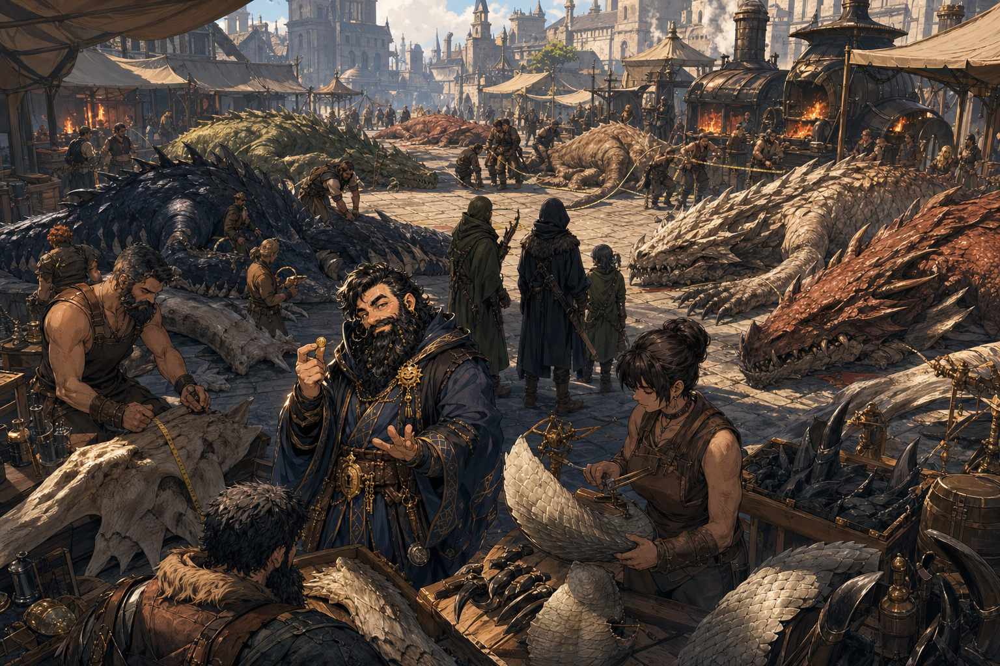

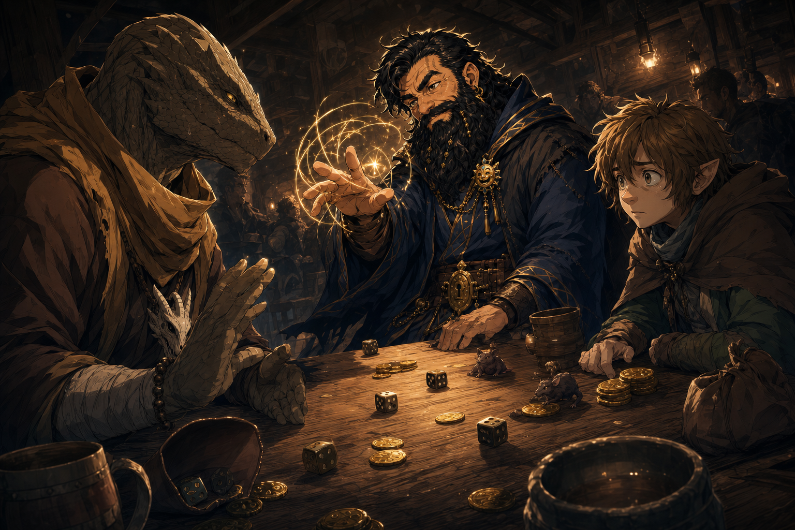

- Visual continuity note: the small rat-like figures/tokens in the tavern dice image are provisional visual shorthand for the unclear notebook phrase `Ollyander's 3 rats`; they are not confirmed canon until the table verifies what the note meant.


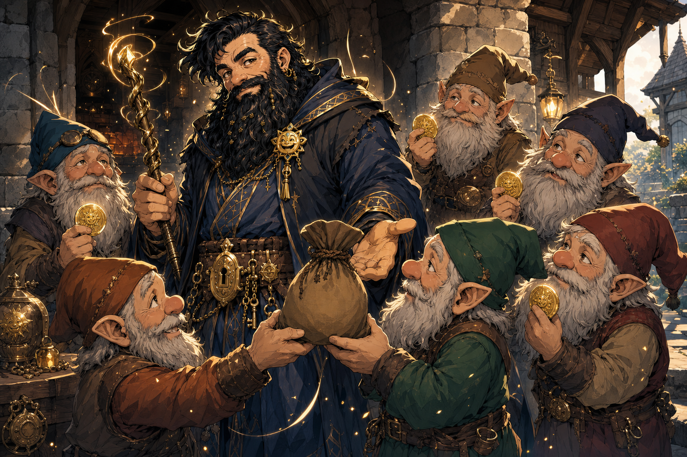

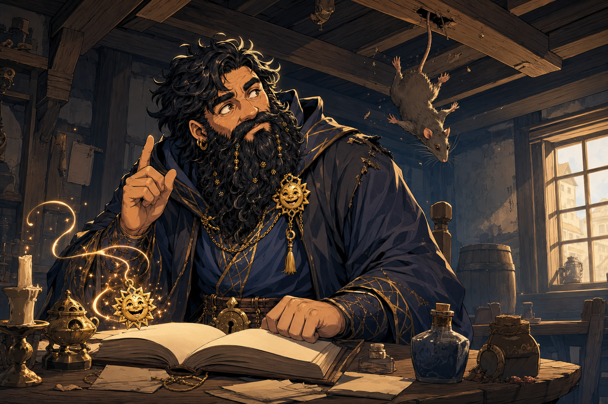

- Canon beat image: next-morning prayer to [Garl Glittergold](../Codex/Lore/Garl%20Glittergold.md), the falling rat, and the first spark of the new spell idea.

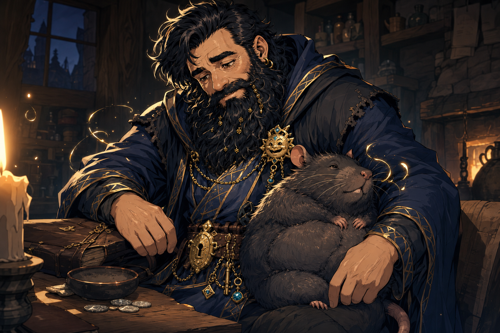

- Concept image note: this illustrates the idea-stage `Truthammer's Cuddly Rat` spell beat. It is not final approved spell art or mechanics until Tom approves the spell.
