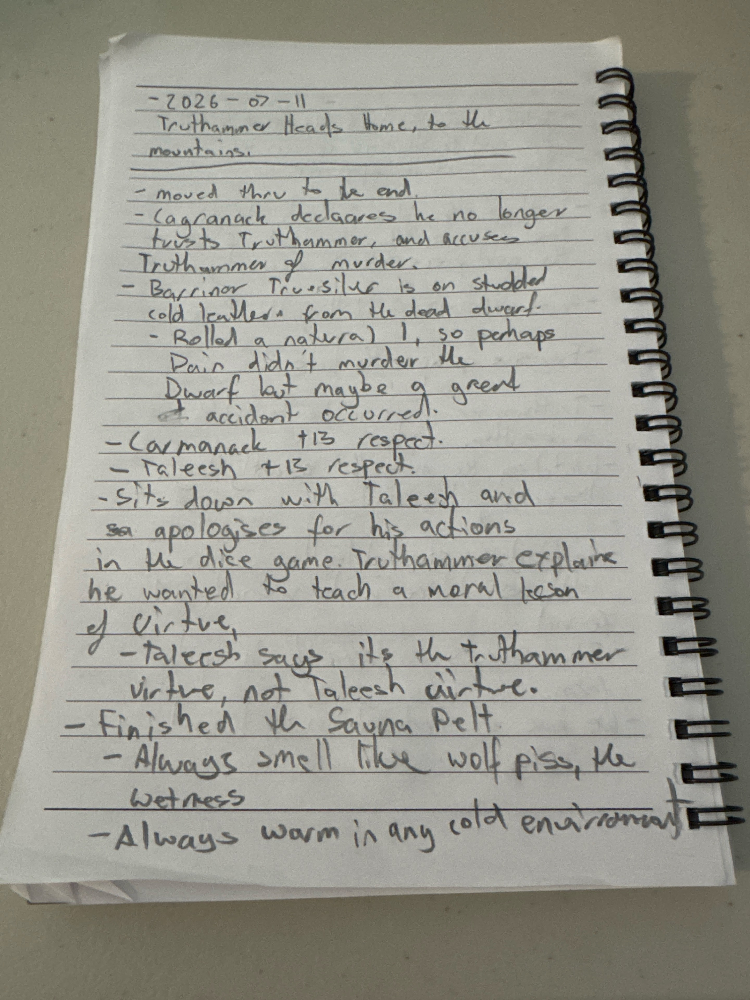
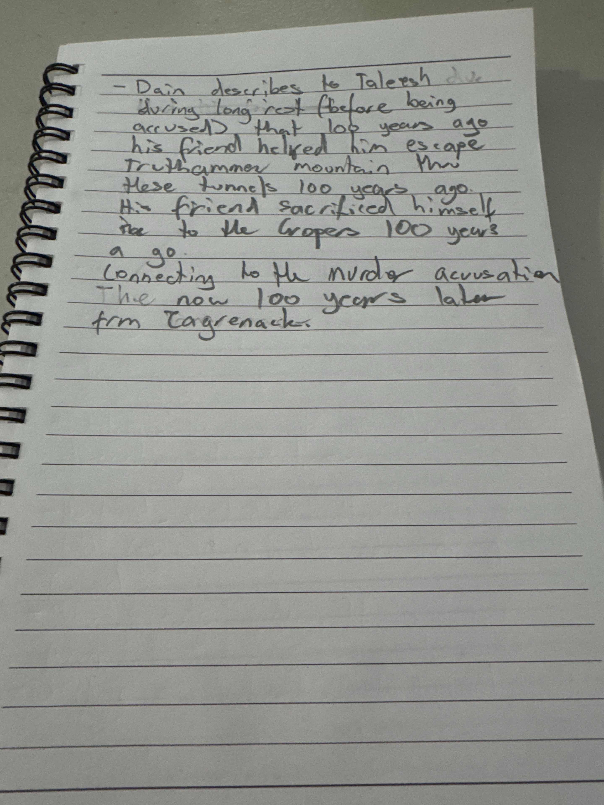
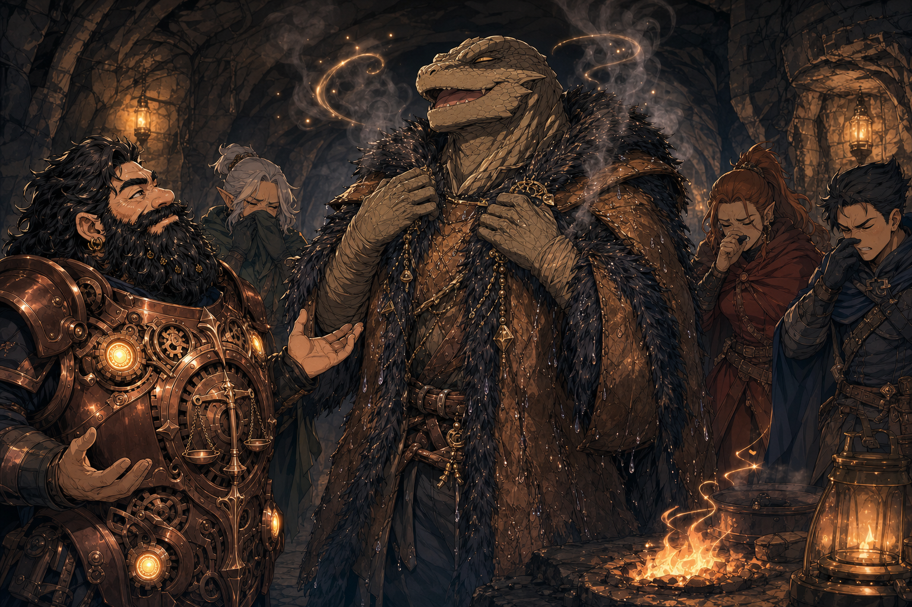
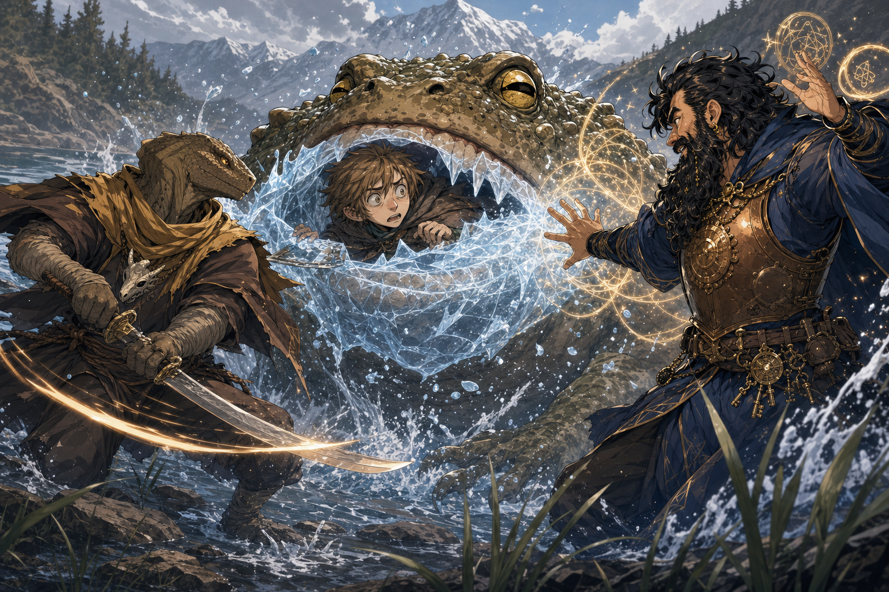
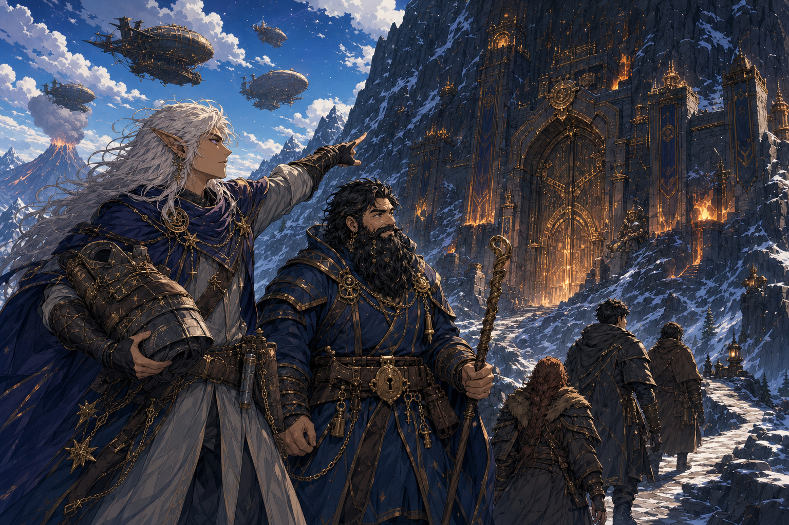
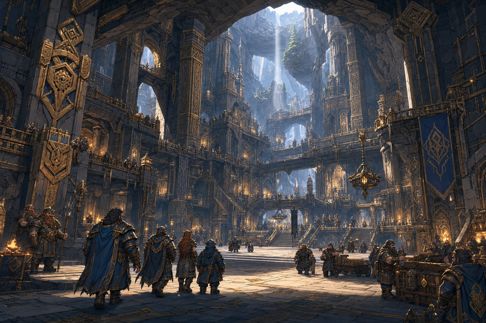
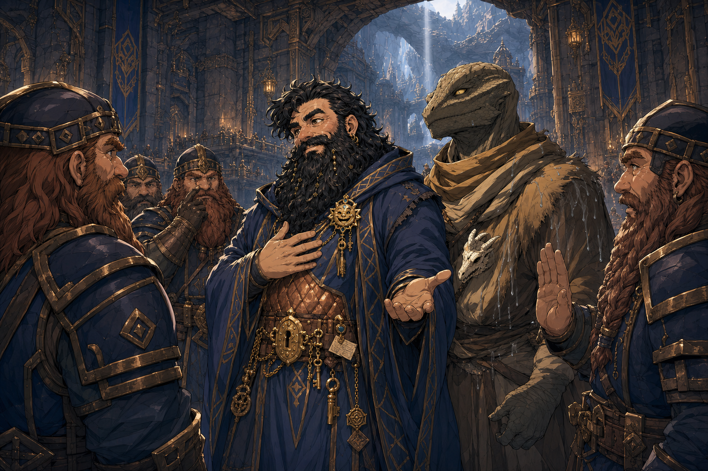
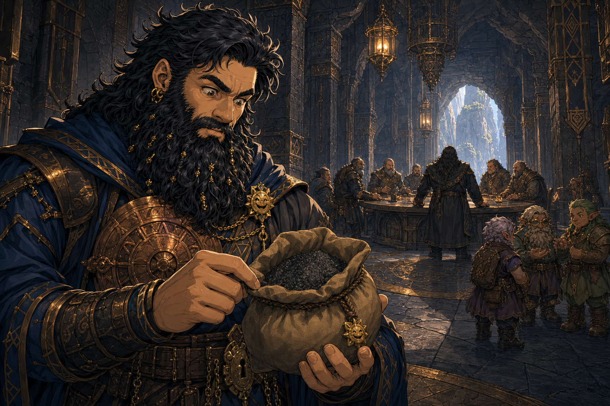
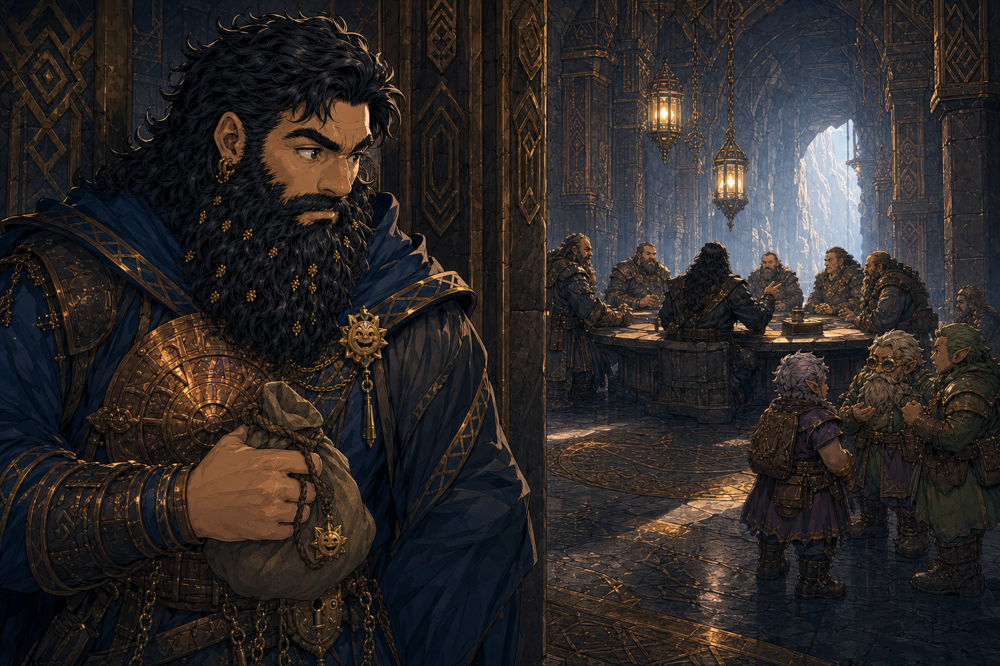

# Session - 2026-07-11

## What Happened Last Time
- [Party] The party left the unnamed town and travelled east toward the Truthhammer mountain route while still carrying [Commander Agland's sealed letter](../Codex/Items/Aglands%20Sealed%20Letter.md). [To verify who carries it]
- [Party] The party entered a tunnel through a grand door, lit an entrance hearth, and uncovered a hidden passage with a descending spiral stair.
- [Party] [To verify] [Hammerton Harry Drizddon](../Codex/Characters/Hammerton%20Harry%20Drizddon.md) broke through rubble using a hammer that audibly protested.
- [Character-only] Dain believes the hidden passage should be reported to his father and approached again with proper arms.
- [Party] After roughly another hour underground, the floor collapsed above the Underdark. A roper may be below, and Dain began stepping back after sensing danger.
- [Character-only] Dain's [Sauna Pelt](../Codex/Items/Sauna%20Pelt.md) for [Brother Taleesh](../Codex/Characters/Brother%20Taleesh.md) remains an unfinished, potentially lethal wet-heat prototype at a recorded `84%` completion. [To verify DM acceptance]

## Open Points
- [Open] Survive the floor collapse and establish who fell, where everyone is standing, and whether the creature below is actually a roper.
- [Open] Decide whether to retreat, secure the passage, warn Dain's father / the Truthhammers, or continue toward the Underdark.
- [Open] Keep [Agland's sealed letter](../Codex/Items/Aglands%20Sealed%20Letter.md) intact and resume the delivery mission.
- [Open] Finish or stabilize the [Sauna Pelt](../Codex/Items/Sauna%20Pelt.md), especially the missing safeguard that prevents warmth escalating into lethal steam.
- [To verify] Dain's current HP, remaining spell slots, coin balance, [Dain's Seal](../Codex/Items/Dains%20Seal.md) status, and who currently carries the Sauna Pelt.

## Get Into Character
- Dain has sensed danger; step back first, then work out whether the collapse can be turned into an advantage.
- Ask what the stonework reveals about the passage, its age, and whether the Truthhammers truly never knew it existed.
- Decide how much to tell the party about Dain's father, the mountain spirits, and his outcast status if retreat makes home relevant.
- For the Sauna Pelt, think like a Truthammer: the last `16%` is not more heat, but manners - a vent, command word, temperature ceiling, or release flap.
- Taleesh asked for warmth, but the dice-game betrayal still stings. Decide whether finishing the gift is duty, reconciliation, or a very educational warning.

## Starting State
- Location: At a collapsed section of the [hidden tunnel near Truthhammer Mountain](../Codex/Places/Hidden%20Tunnel%20Near%20Truthammer%20Mountain.md), above the Underdark, with a possible roper below.
- Immediate goal: Avoid the collapse threat, identify the creature below, and choose whether to retreat or continue.
- Important active conditions/resources: Current HP, spell slots, floor-collapse consequences, and initiative are [To verify]. No lingering condition is confirmed.
- Key items: [Breastplate of Balance](../Codex/Items/Breastplate%20of%20Balance.md), now confirmed equipped and attuned; [Agland's sealed letter](../Codex/Items/Aglands%20Sealed%20Letter.md), [Sauna Pelt](../Codex/Items/Sauna%20Pelt.md), [Half-Pound Sack From Glittergold Gnomes](../Codex/Items/Half-Pound%20Sack%20From%20Glittergold%20Gnomes.md), and [Dain's Seal](../Codex/Items/Dains%20Seal.md), with other carrier or ownership details unresolved where noted.
- Key relationship tensions: Dain recorded `-11` respect toward [Brother Taleesh](../Codex/Characters/Brother%20Taleesh.md) after the dice-game cheating and then used `Suggestion` to force the game to completion.

## Links
- Previous session: [Session 2026-06-20 - Glittergold Road](./2026-06-20.md)
- Next session: TBD
- Open Threads: [Open Threads](../Codex/Lore/Open%20Threads.md)

## Summary
- The party moves through the hidden tunnel to its far end while Dain continues toward home in the [Truthhammer Mountains](../Codex/Places/Truthhammer%20Mountains.md).
- During a long rest before the accusation, Dain tells [Brother Taleesh](../Codex/Characters/Brother%20Taleesh.md) that a friend helped him escape Truthhammer Mountain through these tunnels about one hundred years ago and sacrificed himself to pursuing troopers.
- Dain apologizes to Taleesh for his conduct in the dice game, explaining that he meant to teach a moral lesson about virtue; Taleesh answers that it is "the Truthammer virtue, not Taleesh virtue."
- Dain finishes the [Sauna Pelt / Sauna Jacket](../Codex/Items/Sauna%20Pelt.md) and gives it to Taleesh, who graciously accepts it and loves it. It remains warm in cold environments, and the surrounding area now smells like female white-wolf piss; whether the earlier lethal-steam risk remains is [To verify].
- [Kagrenac](../Codex/Characters/The%20Astral%20Elf.md) declares that he no longer trusts Dain and accuses him of murder. A natural `1` produces the possibility that Dain did not murder the dead dwarf, but that a great accident occurred. [To verify exact check, speaker, and ruling]
- Play is about to resume at the accusation scene. The dead dwarf's name and the notebook line about studded cold leather remain [To verify].
- [DM clarification] The armor Kagrenac is using as evidence would not realistically belong to Dain's missing friend. It more likely belonged to a different dwarf who later went looking for that friend. The searcher's identity and fate remain [To verify].
- At an [unnamed mountain lake](../Codex/Places/Unnamed%20Frog%20Lake%20-%202026-07-11.md), a huge mottled brown-and-green [giant frog](../Codex/Characters/Giant%20Lake%20Frog%20-%202026-07-11.md) covered in bumps emerges from the water and clamps its jaws around [Ollyander](../Codex/Characters/Ollyander.md).
- [Brother Taleesh](../Codex/Characters/Brother%20Taleesh.md) immediately slashes the frog, while Dain casts `Shape Water` to freeze water around its jaws and prevent it from clamping down further on Ollyander. Exact damage, conditions, initiative, and the frog's fate are [To verify].
- After another one or two hours of walking, the party sees the monumental gates of the [Truthhammer Mountains](../Codex/Places/Truthhammer%20Mountains.md). Airships are visible near or above the mountain. [To verify exact number, design, allegiance, and activity]
- The character described as the moon elf notices the airships and decides to head to the mountains first, changing his immediate priority from delivering [Agland's sealed letter](../Codex/Items/Aglands%20Sealed%20Letter.md) to delivering armor to Dain's father. [To verify whether the moon elf is Kagrenac, which armor is being delivered, its carrier, and whether the rest of the party agrees]
- Two monumental statues of axe-bearing dwarves flank the entrance. The party passes between them and through the gates into the [Truthammer Gate Cavern](../Codex/Places/Truthammer%20Gate%20Cavern.md), an enormous inhabited space lit naturally from openings high above.
- The cavern's masterful carvings and overall architectural character look similar to a dwarven tower the party visited earlier. Many dwarves are present inside. [To verify which tower is being compared and the cavern's exact civic function]
- Inside, [Truthammer gate guards](../Codex/Factions/Truthammer%20Gate%20Guards.md) stop Taleesh over the female-white-wolf-piss smell of his damp Sauna Jacket and tell him he must wash. Dain steps in, accepts responsibility, invokes the dwarven god [Tharrd Harr](../Codex/Lore/Tharrd%20Harr.md) as having smelled this way after victory, and successfully persuades the guards to excuse the party and let them pass.
- Dain declares to the party that he is going to meet [his father](../Codex/Characters/Dains%20Father.md), then heads toward him through a busy part of the cavern populated mostly by dwarves and gnomes, with some deep gnomes and halflings and perhaps only one or two humans.
- Dain reaches a formal [Truthammer clan-head chamber](../Codex/Places/Truthammer%20Clan-Head%20Chamber.md), almost like a throne room but not royal. His father is confirmed as head of the Truthammer clan; the exact office and title remain [To verify], with `magistrate` rejected and `vizier` mentioned but incomplete/uncertain.
- Dain sees his father speaking with advisers and a group of gnomes. He retrieves and opens the [half-pound sack gifted by Glittergold gnomes](../Codex/Items/Half-Pound%20Sack%20From%20Glittergold%20Gnomes.md), discovering that it contains gunpowder resembling coarse dark-grey powder.
- Dain overhears his father express disappointment to the gnomes that a [Truthammer-linked sigil](../Codex/Items/Dains%20Seal.md) has been used by someone for gold, identified table-side as Norhan. His father says that if it happens again, they will need to investigate. [To verify whether this refers to Hammerton/Harry's earlier seal transaction and whose exact sigil is meant]

## Source Note Photos




## Live Notes (chronological)
- Session opens at the floor collapse above the Underdark. Exact positions, fall results, and possible-roper initiative are [To verify].
- **[Prompt]**

  ```text
  Ok I’ve attuned and equipped to the breastplate of balance
  ```

- [Character-only] Dain equips and attunes to the [Breastplate of Balance](../Codex/Items/Breastplate%20of%20Balance.md), raising his AC to `14` and occupying one attunement slot. Current charges are [To verify].
- [Party] The group moves through the hidden tunnel to its far end while Dain heads home toward the [Truthhammer Mountains](../Codex/Places/Truthhammer%20Mountains.md).
- [Party] The party completes a long rest before the accusation scene. Dain's HP returns to maximum, spell slots return to `1st 4/4` and `2nd 3/3`, and long-rest resources refresh; exact maximum HP remains [To verify].
- [Character-only] During the long rest, Dain tells [Brother Taleesh](../Codex/Characters/Brother%20Taleesh.md) that roughly one hundred years ago a friend helped him escape Truthhammer Mountain through these same tunnels.
- [Character-only] Dain says that friend sacrificed himself to pursuing troopers during the escape. The friend's identity, the troopers' allegiance, and whether the friend died are [To verify].
- [Party] [To verify who overheard] Dain sits with Taleesh and apologizes for his actions during the dice game, explaining that he wanted to teach a moral lesson about virtue.
- [Party] Taleesh replies, "It's the Truthammer virtue, not Taleesh virtue."
- [Character-only] Dain records `+13` respect connected to Taleesh. [To verify direction, new total, and whether this replaces or adds to earlier markers]
- [Character-only] The notebook also records `+13` respect connected to Kagrenac. [To verify direction, new total, and triggering beat]
- [Character-only] Dain finishes the [Sauna Pelt](../Codex/Items/Sauna%20Pelt.md) during the long rest.
- [Party] Confirmed finished traits: the jacket is always warm in any cold environment, and its wetness makes the surrounding area smell like female white-wolf piss. Taleesh now carries/wears it. [To verify exact mechanical wording, odor radius, attunement, and whether the earlier steam/scalding risk remains]
- [Party] [Kagrenac](../Codex/Characters/The%20Astral%20Elf.md) declares that he no longer trusts Dain and accuses him of murder.
- [Party] A notebook line appears to identify the dead dwarf and connect studded cold leather to the corpse, but the exact name and wording are illegible. [To verify from the table]
- [Party] A natural `1` leads to the possibility that Dain did not murder the dwarf, but that a great accident occurred. [To verify who rolled, what check was made, and whether this is a ruling, belief, or inference]
- **[Prompt]**

  ```text
  DM noted that armour the elf is using as evidence wouldn’t realistically belong to the friend who saved Truthammer, instead more likely to a dwarf who went looking for the friend who went missing
  ```

- [DM clarification] The armor used as evidence would not realistically belong to the friend who helped Dain escape and then went missing.
- [DM-private] [Inferred] The armor more likely belonged to a second dwarf who went searching for the missing friend. Confirm whether the armored corpse is this searcher and whether the searcher died by accident.
- **[Prompt]**

  ```text
  Taleesh graciously accepts the jacket and now the area smells like female white wolf piss.
  Taleesh loves it
  ```

- [Party] [Clarification to the long-rest crafting beat] Dain gives the completed [Sauna Pelt / Sauna Jacket](../Codex/Items/Sauna%20Pelt.md) to Taleesh.
- [Party] Taleesh graciously accepts the jacket and loves it.
- [Party] The jacket's persistent wetness makes the surrounding area smell like female white-wolf piss. [To verify odor radius and mechanical consequences]
- **[Prompt]**

  ```text
  Ollyander is attacked by a giant frog who came out of a lake which is brown and green and bumps all over it, Taleesh responds by slashing it and Dain uses shapenwater to freeze water preventing the frog from clamping down on Ollyander further
  ```

- [Party] At an [unnamed mountain lake](../Codex/Places/Unnamed%20Frog%20Lake%20-%202026-07-11.md), a [giant frog](../Codex/Characters/Giant%20Lake%20Frog%20-%202026-07-11.md) emerges from the water and attacks Ollyander.
- [Party] The frog is mottled brown and green with bumps across its body, and it clamps its jaws around Ollyander. [To verify whether Ollyander is grappled, restrained, swallowed, or affected by a table-specific condition]
- [Party] Taleesh responds by slashing the frog. [To verify weapon, attack roll, damage, and whether the strike releases Ollyander]
- [Character-only] Dain casts `Shape Water`, freezing water around the frog's mouth so it cannot clamp down further on Ollyander. [To verify exact frozen volume, duration, action economy, whether concentration is involved under the table ruling, and any mechanical condition imposed]
- Live encounter: the frog's remaining actions, Ollyander's condition, and initiative order are [To verify].
- **[Prompt]**

  ```text
  Another hour or two of walking , and we see the gates to the Truthammer . The moon elf noticed the airships and decided to head to the mountains first, changing his priority of the letter to delivering armor to my father
  ```

- [Party] After another one or two hours of walking, the party sees the gates leading into the Truthammer mountain stronghold. Exact elapsed time and the frog-encounter resolution are [To verify].
- [Party] Airships are visible near or above the Truthhammer Mountains. [To verify number, owners, construction, purpose, whether they are arriving or departing, and why their presence changes the moon elf's decision]
- [Party] The moon elf notices the airships and chooses to head to the mountains first. Existing records treat `moon elf` as probable shorthand for [Kagrenac / the Astral Elf](../Codex/Characters/The%20Astral%20Elf.md), but the identity remains [To verify].
- [Party] The moon elf changes his immediate priority from delivering [Agland's sealed letter](../Codex/Items/Aglands%20Sealed%20Letter.md) to delivering armor to Dain's father. The letter remains carried and undelivered unless the table confirms otherwise. [To verify exact armor, current carrier, Dain's father's name/location, party agreement, and whether this is a delay or formal mission change]
- Live location: on the approach to the Truthammer gates, with airships visible overhead.
- **[Prompt]**

  ```text
  We go through the gates, entering into a cavernous space, natural light entering from above, to everybody it looks similar to the dwarven tower we were at, high quality carvings, and loads of dwarves inside
  ```

- [Party] The party passes between two statues of dwarves holding axes and goes through the Truthammer gates.
- [Party] Beyond the gates is the vast [Truthammer Gate Cavern](../Codex/Places/Truthammer%20Gate%20Cavern.md), with natural light entering from openings high above.
- [Party] The cavern contains extensive, exceptionally high-quality dwarven carvings and is heavily populated with dwarves.
- [Party] Everyone recognizes a similarity between this interior and a dwarven tower the party visited previously. [To verify whether this means the Iron Shore Watchtower, a structure in Lerdar, or another tower, and whether the resemblance indicates shared builders, culture, era, or merely style]
- Live location: inside the Truthammer Gate Cavern.
- **[Prompt]**

  ```text
  The guards inside say to Taleesh that he must wash for there is piss smell, Dain steps in and says Tad Har the god smelled in such ways after victory, and that the smell is my fault, so please excuse us. A successful persuasion roll lets us through.
  ```

- **[User correction]**

  ```text
  Tharrd Harr a dwarf god.
  ```

- [Party] Truthammer gate guards stop Taleesh because the Sauna Jacket makes the area smell like female white-wolf piss and tell him that he must wash.
- [Character-only] Dain steps between Taleesh and the guards, says that [Tharrd Harr](../Codex/Lore/Tharrd%20Harr.md), a dwarven god, smelled in such ways after victory, and admits that Taleesh's smell is Dain's fault.
- [Party] Dain asks the guards to excuse the party. A successful Persuasion roll convinces them to let the group through. [To verify exact roll, modifier, DC, whether the Tharrd Harr story is accepted as literal history, and whether Taleesh remains under any expectation to wash later]
- Live status: the party has passed the guard checkpoint and may continue deeper into the Truthammer Gate Cavern.
- **[Prompt]**

  ```text
  Dain declares to the party he is going to meet with his father, and heads that way. type area, there's heaps of dwarves and gnomes, some deep gnomes, and some halflings, maybe like one or two humans. You walk through that, that area and into kind of the chamber where your father is, almost like a throne room, but not, what do you call it, the magistrate. He's not that, he's the head of the clan. A vizier. He's the.
  ```

- [Character-only] Dain tells the party that he is going to meet with his father and begins heading that way. [To verify who accompanies him and the party's reaction]
- [Party] The route passes through a busy interior district with many dwarves and gnomes, some deep gnomes and halflings, and perhaps only one or two humans.
- [Party] Dain enters or reaches the threshold of a formal chamber where his father is located. The chamber feels almost like a throne room but is not described as royal.
- [Party] Dain's father is the head of the Truthammer clan. The speaker considers `magistrate`, rejects it, then mentions `vizier` before the description trails off; no formal title is yet confirmed.
- Live location: at or entering the [Truthammer clan-head chamber](../Codex/Places/Truthammer%20Clan-Head%20Chamber.md), immediately before Dain's meeting with his father.
- **[Prompt]**

  ```text
  I see my father with advisors talking with a group of gnomes. Walking over, I grab the gift from the gnomes from the last time and take a look inside the bag. It’s gunpowder. Looks like a coarse dark grey powder.
  ```

- [Character-only] Dain sees his father meeting with advisers and a group of gnomes in the clan-head chamber. [To verify adviser identities, gnome identities, meeting subject, and whether they notice Dain immediately]
- [Character-only] Dain retrieves the [half-pound sack from the Glittergold gnomes](../Codex/Items/Half-Pound%20Sack%20From%20Glittergold%20Gnomes.md) and opens it.
- [Party] The sack contains gunpowder with the appearance of a coarse dark-grey powder.
- [To verify] Exact quantity, quality, rules, value, intended purpose, safe handling requirements, whether any powder spills, and whether Dain's father or the gnomes react.
- Live location: in the clan-head chamber, holding the opened gunpowder sack while Dain's father confers with advisers and gnomes.
- **[Prompt]**

  ```text
  Dain overhears his father speaking with the gnomes, expressing disappointment that his sigil has been used by someone for gold (Norhan) and that if this happens again we will need to investigate.
  ```

- [Character-only] Dain overhears his father speaking with the gnome delegation about a sigil having been used by someone to obtain gold.
- [Character-only] Dain's father expresses disappointment about the use and says that if it happens again, `we` will need to investigate.
- [Party/table identity] The person is identified as Norhan. Norhan is the player of [Hammerton Harry Drizddon](../Codex/Characters/Hammerton%20Harry%20Drizddon.md), making Hammerton/Harry the likely in-world actor. [To verify]
- [Inferred] This may be the earlier event in which Dain gave [his seal](../Codex/Items/Dains%20Seal.md) to Harry / Hammerton in exchange for `100 gp` worth of silver, but the new phrasing says the sigil was used `for gold`; confirm whether it is the same transaction or a separate use.
- [To verify] Whether `his sigil` means Dain's personal sigil, his father's sigil, a Truthammer clan sigil, or another credential; how the use was detected; and what would count as a repeat.
- Live status: Dain has overheard a warning, but no formal investigation is active unless the table confirms otherwise.

## Character State Changes
- [Character-only] [Confirmed] [Breastplate of Balance](../Codex/Items/Breastplate%20of%20Balance.md) is now equipped and attuned.
- AC changes from the recorded unarmored `10` to `14`.
- Attunement usage becomes `1 / 3` confirmed slots; the [Ghostly Form Tattoo](../Codex/Items/Ghostly%20Form%20Tattoo.md)'s attunement requirement remains [To verify].
- Current Breastplate of Balance charges are [To verify].
- Long rest completed: HP restored to maximum [exact maximum To verify], spell slots restored to `1st 4/4` and `2nd 3/3`, Arcane Recovery restored to `1 / Long Rest`, and Stonecunning restored to `2 / Long Rest`.
- [Sauna Pelt](../Codex/Items/Sauna%20Pelt.md) changes from `84%` in-progress to complete.
- The completed Sauna Jacket transfers from Dain to Taleesh; it is no longer carried by Dain.
- Dain records `+13` respect connected to Taleesh and `+13` respect connected to Kagrenac. [To verify direction and resulting totals]
- Dain uses the `Shape Water` cantrip during the giant-frog attack; no spell slot is spent. The table allows the frozen water to prevent the frog from clamping down further on Ollyander. [To verify duration and mechanical ruling]

## New Canon / Important Discoveries
- [Character-only] Dain is proficient in medium armor and can cast normally while wearing the Breastplate of Balance.
- [Character-only] Dain escaped Truthhammer Mountain through these tunnels about one hundred years ago with a friend's help.
- [Character-only] That friend sacrificed himself to pursuing troopers during the escape. Exact outcome and identities remain [To verify].
- [Party] [To verify who heard] Dain has begun revealing this history to Taleesh.
- [Party] Kagrenac no longer trusts Dain and accuses him of murdering a dwarf connected to the tunnel history.
- [DM-private] The armor does not realistically identify the corpse as Dain's missing friend; it more likely points to a separate dwarf who later searched for the friend. [Inferred identity; To verify]
- [Party] The completed Sauna Jacket is always warm in cold environments and makes the surrounding area smell like female white-wolf piss.
- [Party] Taleesh accepts and loves the completed Sauna Jacket; its odor makes the surrounding area smell specifically like female white-wolf piss.
- [Party] A huge mottled brown-and-green, bumpy giant frog inhabits or hunts from the unnamed lake.
- [Party] Dain can use `Shape Water` protectively in this scene by freezing available water around a biting creature's jaws; record this as the encounter's ruling, not a universal expansion of the spell until Tom confirms it.
- [Party] The Truthhammer mountain stronghold has monumental gates visible from the approach route.
- [Party] Airships are currently visible near or over the Truthhammer Mountains; their ownership and meaning are unknown.
- [Party] The moon elf has made delivering armor to Dain's father the immediate priority ahead of the still-undelivered sealed letter.
- [Party] Two axe-bearing dwarf statues flank the Truthammer entrance.
- [Party] The interior beyond the gates is a naturally lit, heavily populated cavern of masterful dwarven carving, visually familiar to the whole party from an earlier dwarven tower.
- [Party] Tharrd Harr is a dwarven god. Dain claims that Tharrd Harr smelled like this after victory; the broader story and its religious authority are [To verify].
- [Party] The gate guards object to the Sauna Jacket's female-white-wolf-piss smell, but Dain's successful Persuasion and acceptance of responsibility secure passage without Taleesh washing first.
- [Party] The inhabited area beyond the checkpoint is culturally mixed but overwhelmingly non-human: many dwarves and gnomes, some deep gnomes and halflings, and perhaps one or two humans.
- [Party] Dain's father is head of the Truthammer clan and receives or conducts business in a formal non-royal chamber resembling a throne room in dignity or layout.
- [Party] Dain's father is currently conferring with advisers and a group of gnomes.
- [Party] The previously mysterious half-pound gnome gift contains coarse dark-grey gunpowder.
- [Character-only] Dain's father and the gnomes are aware that a Truthammer-linked sigil has been used for gold and regard the incident with disappointment.
- [Character-only] A second occurrence would trigger or require investigation.

## Open Threads
- Immediate: answer Kagrenac's murder accusation and establish the armored dwarf's identity, cause of death, and connection to Dain's century-old escape.
- Identify Dain's friend, confirm how the friend went missing after sacrificing himself to the pursuing troopers, and identify the later dwarf who apparently searched for him.
- Clarify the illegible notebook line naming the armored dwarf and mentioning studded cold leather; the armor is not a realistic match for Dain's missing friend.
- Confirm whether the natural `1` established an accident, merely suggested one, or reflected a character's mistaken conclusion.
- Taleesh is confirmed as the completed Sauna Jacket's carrier/wearer. Confirm its odor radius, exact mechanics, and whether the earlier lethal-steam risk remains.
- Carry forward: deliver Agland's letter, decide what returning home means for Dain's outcast status, and resolve the wider tunnel threat.
- Resolve the giant-frog encounter: confirm Ollyander's condition and damage, Taleesh's attack details, the exact `Shape Water` ruling, initiative, whether more frogs are present, and the creature's fate.
- At the Truthammer gates, identify the airships and establish why they caused the moon elf to reprioritize the route.
- Confirm the moon elf's identity, which armor is intended for Dain's father, who carries it, and whether the party accepts delaying the sealed-letter mission.
- Identify the earlier dwarven tower whose architecture resembles the Gate Cavern and establish whether the similarity reveals shared builders, a clan connection, or a broader dwarven style.
- Establish the Gate Cavern's formal name and function, who governs or guards it, how the airships connect to it, and how the resident dwarves react to Dain's return.
- Clarify Tharrd Harr's portfolio, symbols, worship, victory story, and whether Dain quoted orthodox lore, obscure lore, a family tale, or a persuasive embellishment.
- Confirm whether the guards' permission fully resolves the smell objection or merely postpones Taleesh's required wash.
- Confirm Dain's father's name, formal title, appearance, disposition, powers, relationship with Dain, and reaction to his return.
- Confirm whether the whole party accompanies Dain into the clan-head chamber, waits outside, or separates.
- Establish the official names and functions of the busy mixed-population district and the clan-head chamber.
- Ask why the Glittergold gnomes gave Dain gunpowder, whether the gnome delegation knows, and whether the powder connects to the mountain, airships, forges, church, armor, or current clan business.
- Confirm the gunpowder's quantity, mechanics, value, safe storage, and whether opening it in the chamber creates any immediate concern.
- Clarify whose sigil was used, whether Hammerton/Harry used it, whether this is the prior `100 gp`-worth-of-silver exchange or another transaction, who currently holds the seal, and what a clan investigation would involve.
- Decide whether Dain discloses that he voluntarily handed over the seal, confronts Hammerton privately, retrieves it immediately, or first asks his father what the clan already knows.

## Images


- Scene continuity: the accusation occurs after Dain's long-rest confession to Taleesh and after Dain equips the Breastplate of Balance. The dead dwarf and exact evidence are not shown because those details remain [To verify].



- Scene continuity: the completed jacket is visibly damp, magically warm, and beloved by Taleesh despite making the surrounding area smell like female white-wolf piss.



- Scene continuity: Taleesh slashes the bumpy brown-and-green frog while Dain freezes lake water around its jaws to stop it clamping down further on Ollyander.



- Scene continuity: after another one or two hours of walking, the moon elf spots airships above the Truthhammer gates and turns the party's immediate attention toward delivering armor to Dain's father.



- Scene continuity: natural light falls from high openings across masterfully carved, multi-level dwarven architecture crowded with residents just inside the gates.



- Scene continuity: Dain accepts responsibility for Taleesh's damp Sauna Jacket, invokes Tharrd Harr's post-victory smell, and successfully persuades the dwarven guards to let the party pass.


- Scene continuity: Dain crosses a busy district of dwarves, gnomes, deep gnomes, halflings, and very few humans toward the formal chamber of his father, the head of the Truthammer clan.



- Scene continuity: Dain opens the half-pound gnome gift and finds coarse dark-grey gunpowder while his father confers with advisers and gnomes in the background; the father's appearance remains deliberately obscured.



- Scene continuity: Dain quietly realizes the significance of his father's warning to the gnomes about a sigil being used for gold; Hammerton/Norhan is not present in the depicted discussion and the sigil's design remains unseen.
