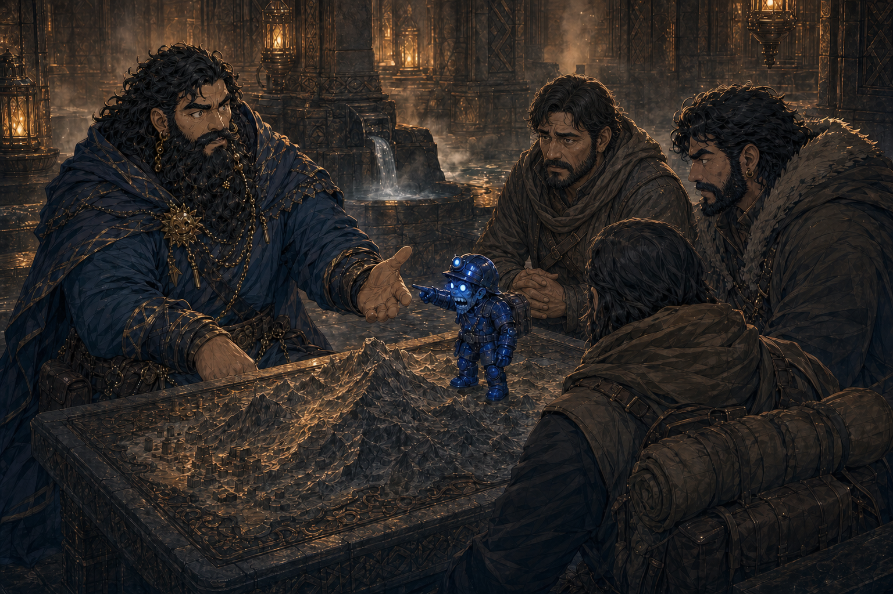

# Session - 2026-08-29

## What Happened Last Time
- [Party] The party entered the [Truthhammer mountain stronghold](../Codex/Places/Truthhammer%20Mountains.md), where airships remain visible and the interior is a vast, naturally lit cavern of masterful dwarven carving.
- [Character-only] Dain met [his father](../Codex/Characters/Dains%20Father.md), admitted possible responsibility for lending out [his seal](../Codex/Items/Dains%20Seal.md), reported the journey, and warned him about Kagrenac's murder accusation.
- [Character-only] Dain's father offered him a bath, dinner, a place to stay, and guest-right. He remains disappointed by Dain's break with Moradin but assured Dain that he is always welcome at his table; formal clan standing remains unresolved.
- [Party] Dain and the party headed toward the [bathhouses](../Codex/Places/Berronar%20Truesilver%20Bathhouses.md), associated table-side with the uncertain phrase `Barren Archer of Silver hand` and possibly with Berronar Truesilver.
- [Party] In a truth-for-truth exchange, the [southern human traders](../Codex/Factions/Southern%20Human%20Traders.md) revealed that their true goal is to establish new trade.
- [Party] The [Coal Mine Puppet](../Codex/Items/Coal%20Mine%20Puppet.md) asked whether the mountain has a mine. Dain truthfully revealed that it is home to one of the richest mines in the land.
- [Party] [To verify] The proposed trade, the puppet's interest in the mine, Dain's authority to reveal the mine's wealth, and whether this exchange consumed one of the five truthful answers owed all remain unresolved.

## Open Points
- [Open] Ask what trade the humans propose: goods, partners, route, authority, terms, and intended access to the Truthhammer settlement.
- [Open] Ask why the Coal Mine Puppet wanted to know about the mine, whether this is the coal mine it seeks, and what it intends to do with Dain's answer.
- [Open] Determine whether the mine's extraordinary wealth was secret, whether Dain was authorized to reveal it, and whether clan leadership now needs warning.
- [Open] Settle the five-truth accounting: separate reciprocal exchange, early use of an owed answer, or one of the five formally consumed.
- [To verify] Confirm the bathhouses' proper name, possible Berronar Truesilver dedication, customs, facilities, and who has entered.
- [To verify] Dain's exact maximum/current HP, coin balance, Breastplate of Balance charges, Ghostly Form Tattoo state, and current holder of his seal remain unresolved.

## Get Into Character
- Let the traders finish their proposal before offering another valuable truth; precise questions are cheaper than generous disclosures.
- Ask the puppet directly whether the Truthhammer mine is the mine it wants, then watch whether the humans answer for it.
- Decide whether honesty now requires Dain to warn his father about the disclosure before dinner.
- Keep the bargain's bookkeeping explicit: "Was that one of the five, or a new truth bought with mine?"
- Remember that Dain is home as a welcomed son but not yet a restored clansman; hospitality and authority are different doors.

## Starting State
- Location: At or near the [Berronar Truesilver-associated bathhouses](../Codex/Places/Berronar%20Truesilver%20Bathhouses.md) inside the Truthhammer settlement, in conversation with the southern human traders and Coal Mine Puppet. Whether the party has entered or begun bathing is [To verify].
- Immediate goal: Hear the proposed trade and establish why the puppet is interested in the Truthhammer mine without disclosing further sensitive details by accident.
- Important active conditions/resources: No active condition is confirmed. Dain completed a long rest on 2026-07-11; current HP is restored to maximum [exact maximum likely `29`, To verify], spell slots are `1st 4/4` and `2nd 3/3`, Arcane Recovery is `1 / Long Rest`, and Stonecunning is `2 / Long Rest`.
- Key items: [Breastplate of Balance](../Codex/Items/Breastplate%20of%20Balance.md) equipped and attuned; [Agland's sealed letter](../Codex/Items/Aglands%20Sealed%20Letter.md) still undelivered [carrier To verify]; [Dain's Seal](../Codex/Items/Dains%20Seal.md) [holder To verify]; coarse dark-grey gunpowder in the [half-pound gnome gift sack](../Codex/Items/Half-Pound%20Sack%20From%20Glittergold%20Gnomes.md); [Sauna Jacket](../Codex/Items/Sauna%20Pelt.md) carried or worn by Brother Taleesh.
- Key unresolved tension: The traders and puppet now know of the mountain's extraordinary mine, but their intentions, Dain's authority, and the bargain accounting are all uncertain.
- Key relationship tensions: Dain's father offers personal welcome without confirmed clan restoration; Kagrenac's murder accusation and broken trust remain unresolved; Taleesh's completed Sauna Jacket may still create bathhouse trouble through its female-white-wolf-piss smell.

## Links
- Previous session: [Session 2026-07-11](./2026-07-11.md)
- Next session: TBD
- Current State: [Dain's Current State](../Character/Current%20State.md)
- Open Threads: [Open Threads](../Codex/Lore/Open%20Threads.md)

## Summary
- Filled after play.

## Live Notes (chronological)
- Session opens at the carried-forward truth-for-truth exchange near the bathhouses. No new 2026-08-29 in-world action has been recorded yet.

## Character State Changes
- None recorded yet.

## New Canon / Important Discoveries
- None recorded yet.

## Open Threads
- Carry forward: [Respond to the Southern Human Traders](../Codex/Lore/Open%20Threads.md#respond-to-southern-human-traders).
- Carry forward: [Investigate the Coal Mine Puppet](../Codex/Lore/Open%20Threads.md#investigate-the-coal-mine-puppet).
- Carry forward: [Ask the Five Puppet Truths](../Codex/Lore/Open%20Threads.md#ask-the-five-puppet-truths).
- Carry forward: clarify the bathhouses, Dain's clan standing, the sigil debt, dinner invitation, airships, armor delivery, Agland's sealed letter, Kagrenac's accusation, and the hidden tunnel.

## Images
- Opening continuity reference from the final scene of the previous session:

  
- No new 2026-08-29 visual beat has occurred yet. Generate a session image when play establishes the next meaningful scene, reveal, confrontation, ritual, or location change.
