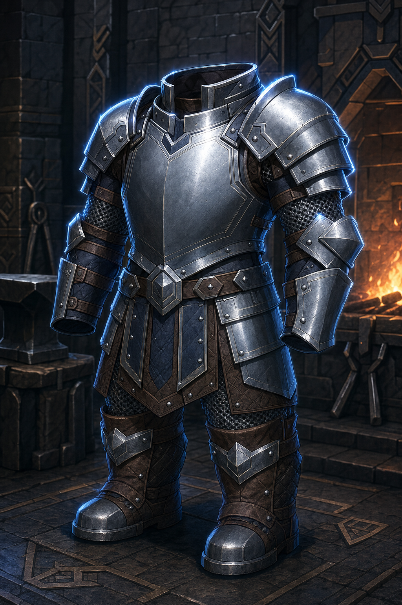
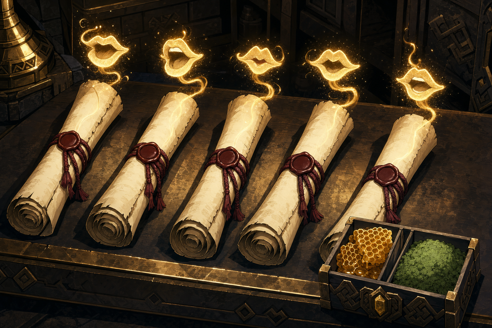
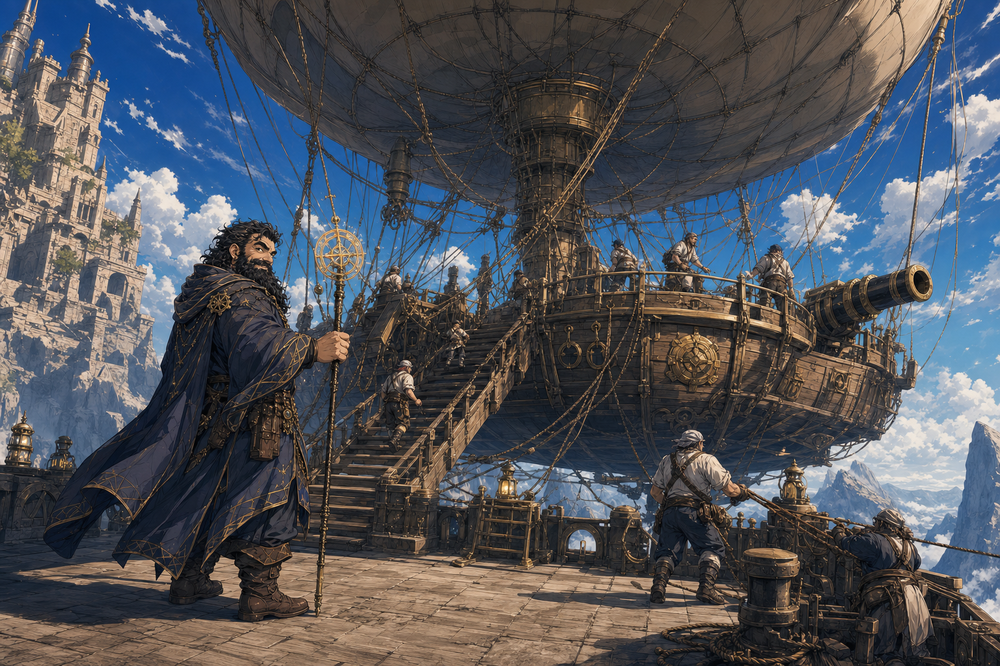
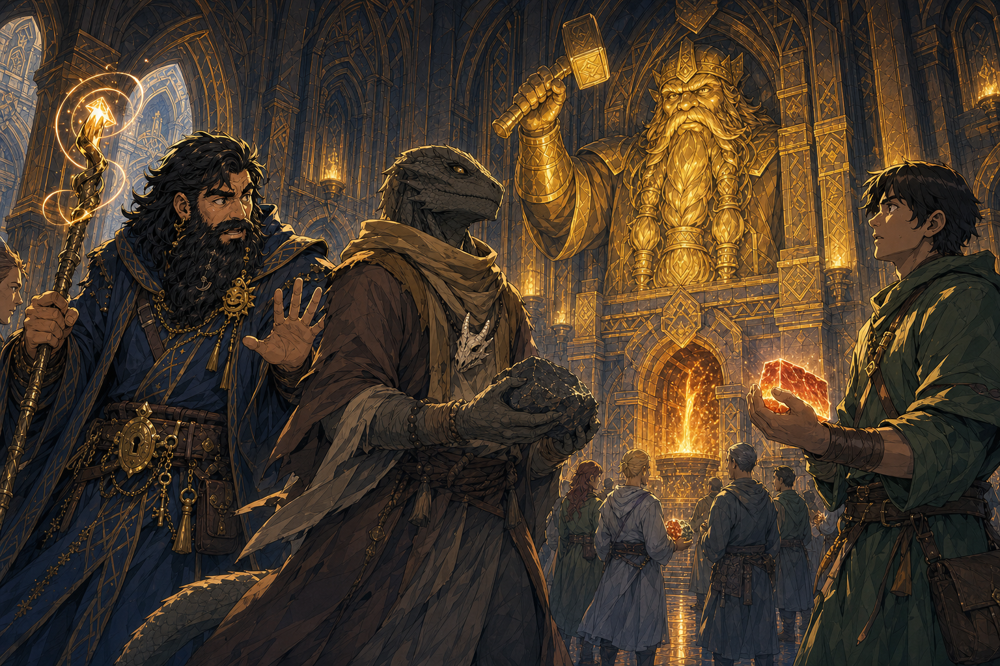
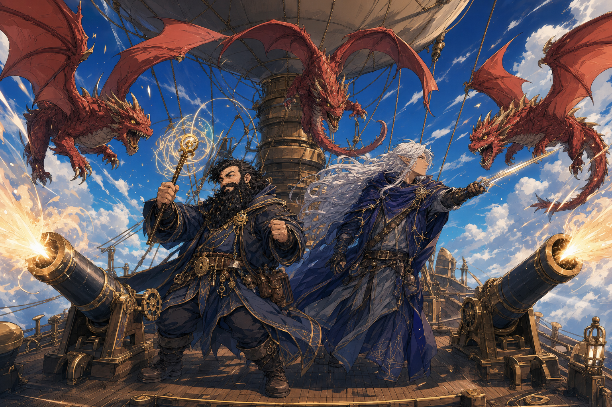
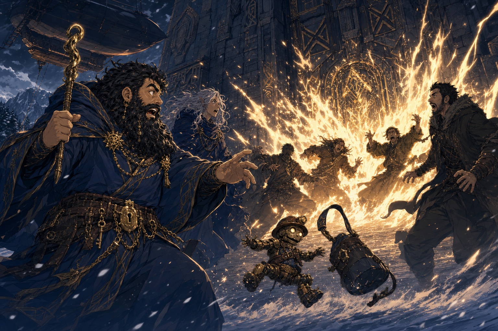

# Session - 2026-08-29

## What Happened Last Time
- [Party] The party reconciled the roper-tunnel armor: it bore Berronar Truesilver heraldry, Biggus returned it to a temple, and [Kagrenac](../Codex/Characters/The%20Astral%20Elf.md) later apologized to Dain after hearing its origin. Biggus's identity and the armor's full history remain [To verify].
- [Character-only] At Truthammer Mountain, Dain's father discussed Dain's exile, warned him not to reveal forge secrets, welcomed the party to dinner, forbade Dain from claiming southern land in his name, rejected the human traders' proposed trade, and told Dain to take the traders and their puppet onward.
- [Party] Kagrenac secured morning passage to [Ola Dung Lot](../Codex/Places/Ola%20Dung%20Lot.md) in the [Samryn Torsten](../Codex/Lore/Samryn%20Torsten.md) area aboard a Gondian airship. During the preceding long rest, he taught Dain `Find Familiar`.
- [Party] After roughly six hours in flight, three red dragon wyrmlings attacked. The party defeated them using the airship's cannons.
- [Party] At Ola Dung Lot's gates, the [southern human traders](../Codex/Factions/Southern%20Human%20Traders.md) were consumed by holy fire. Their [Bag of Holding](../Character/Inventory.md) and [Coal Mine Puppet](../Codex/Items/Coal%20Mine%20Puppet.md) survived and were acquired by the party.
- [Party] Harry seized the puppet, extracted unspecified information, and tied it to his belt while it was in rat form. Kagrenac's `Identify` revealed nothing; he tried additional unspecified magic.
- [Party] Ben led the party to deliver [Commander Agland's sealed letter](../Codex/Items/Aglands%20Sealed%20Letter.md). The delivery mission is complete.
- [Party] A dwarven commander gave the party two new objectives: recover people abducted from settlements raided by a cult linked to Yuan-ti, and confer with humans in the southwest to warn and rally them.

## Open Points
- [Open] Dain and Taleesh must eventually return to the town to retrieve Taleesh's [Sauna Pelt / Sauna Jacket](../Codex/Items/Sauna%20Pelt.md), which was left behind despite being Dain's gift to Taleesh. [To verify exact town and storage location]
- [Open] Get a letter of introduction from the dwarven commander for the southwestern humans.
- [Resolved] The party has chosen the [balloon-like skyship](../Codex/Places/Party%20Skyship%20-%202026-08-29.md) and is about to board it.
- [Open] Build a shopping and requisition list for the airship; speak with Ben about magical outfitting and the quartermasters about mundane supplies.
- [Open] Identify the raided settlements, cult, Yuan-ti involvement, captives, likely destination, rescue window, and the commander responsible for the mission.
- [Open] Learn exactly what Harry extracted from the Coal Mine Puppet, what its rat form means, and why `Identify` still reveals nothing.
- [To verify] Determine why holy fire killed the traders, whether their five-truth and later-payment debts died with them, and who now owns or carries their Bag of Holding.
- [To verify] Confirm the identities of Biggus, Havana, Yennefer, Ben, and the feral halfling; current evidence must not silently merge them with existing characters.

## Get Into Character
- Dain's first practical move is paperwork with teeth: secure the introduction letter before asking suspicious southwestern humans to trust a dwarf carrying warnings of cults and Yuan-ti.
- Treat the airship as a magnificent moving spell component. Ask Ben what makes it fly, what magic can be fitted, and what breaks first when dragons arrive.
- The rescue mission fits Dain's deepest ethic: make the life his friend saved produce good by bringing stolen people home.
- Keep an eye on Harry's belt. A cobalt puppet that becomes a rat, resists `Identify`, hates Glittergold, and survived holy fire has not become less interesting merely because it is tied up.
- Use the repaired trust with Kagrenac carefully; his apology closes the accusation, but the missing friend, dead searcher, and hidden tunnel remain sharp-edged truths.

## Starting State
- Location: [Ola Dung Lot](../Codex/Places/Ola%20Dung%20Lot.md), a city in the [Samryn Torsten](../Codex/Lore/Samryn%20Torsten.md) area, after delivery of Agland's sealed letter and receipt of the dwarven commander's new objectives. The feral halfling is exploring a sparse temple of Dumathoin; Dain's exact room or district is [To verify].
- Immediate goal: Obtain the introduction letter and choose, provision, and magically fit transport for the captive-recovery and southwestern-diplomacy mission.
- Important active conditions/resources: No active condition is confirmed. Dain completed a long rest before the airship journey, but spell slots, HP, cannon-combat expenditure, and other resources after the red-wyrmling attack are [To verify].
- Key items: [Breastplate of Balance](../Codex/Items/Breastplate%20of%20Balance.md) remains the last confirmed equipped and attuned armour; Dain has newly acquired [Dwarven Half Plate](../Codex/Items/Dwarven%20Half%20Plate.md) described as `+2 AC`, with equipped state and exact total [To verify]; Dain's smoke-powder or gunpowder pouch [exact identity and amount To verify]; Agland's sealed letter delivered; the surviving Bag of Holding [carrier To verify]; Coal Mine Puppet in rat form tied to Harry's belt.
- Key unresolved tension: The party has two linked missions but no final route or loadout, while the captive trail, cult structure, Yuan-ti role, and southwestern political contacts are all unclear.
- Key relationship tensions: Kagrenac has apologized; Dain's father remains personally welcoming but has forbidden land claims in his name and warned Dain about forge secrets; Harry currently controls the puppet and may know more than the record does.

## Links
- Previous session: [Session 2026-07-11](./2026-07-11.md)
- Next session: TBD
- Current State: [Dain's Current State](../Character/Current%20State.md)
- Open Threads: [Open Threads](../Codex/Lore/Open%20Threads.md)

## Summary
- Filled after play.

## Live Notes (chronological)
- Session opens in Ola Dung Lot, within the Samryn Torsten area, with the commander's two objectives and transport offer on the table. No new 2026-08-29 in-world action has been recorded yet.
- **[Prompt]**

  ```text
  So Taleesh and I will need to return to the town eventually to grab the piss jacket, as it was a gift to Taleesh
  ```

- [Party] [Confirmed] The completed Sauna Jacket remains Taleesh's gift and property, but it was left behind in a town. Dain and Taleesh intend to return eventually and retrieve it. The exact town and storage location are [To verify].
- **[Prompt]**

  ```text
  Truthammer got a dwarven half plate, which is a +2 ac
  ```

- [Character-only] [Confirmed] Dain Truthammer acquires [Dwarven Half Plate](../Codex/Items/Dwarven%20Half%20Plate.md), described by the user as `+2 AC`. If this means standard magical half plate with a `+2` armour bonus, Dain's `DEX +0` would make his AC `17` while wearing it. Exact table wording, source, equipped state, and attunement are [To verify].
- **[Prompt]**

  ```text
  Then I need to think of a list of scrolls or items that I want from quartermasters and the Ben guy.
  I’m thinking scrolls which would help with the spell making odd and useless spells
  ```

- [Character-only] [Confirmed intent] Dain wants to build a [requisition wishlist](../Codex/Brainstorm/Lore/Dain%20Requisition%20Wishlist.md) for Ben and the quartermasters, prioritizing scrolls, magical curios and scribing supplies whose principles can support his long-term ambition to invent odd and apparently useless spells. No candidate item has yet been requested, approved or acquired.
- **[Prompt]**

  ```text
  Ok we get 5 magic mouth scrolls
  ```

- [Party] [Confirmed] The party acquires exactly five [`Magic Mouth` scrolls](../Codex/Items/Magic%20Mouth%20Scrolls.md). Their source, ownership and carrier remain [To verify]. Possession does not yet establish that Dain has copied the spell into his spellbook.
- **[Prompt]**

  ```text
  Skywrite and Pyrotechnics will be goals to acquire them later
  ```

- [Character-only] [Confirmed goal] Dain intends to acquire the `Skywrite` and `Pyrotechnics` spells later. Neither spell nor any associated scroll is currently owned or known by Dain.
- **[Prompt]**

  ```text
  Ok we’re about to board our sky ship which is more like a really big hot air balloon with some sort of canon in it.
  ```

- [Party] [Confirmed] The party is about to board its assigned [skyship](../Codex/Places/Party%20Skyship%20-%202026-08-29.md). It resembles a very large hot-air balloon with a ship-like structure beneath it and has at least one cannon aboard. The prompt's `canon` is recorded as `cannon` in the normalized campaign record; weapon type and count remain [To verify].
- **[Prompt]**

  ```text
  Samryn Torsten is the area, ola dung lot is the name of the city
  ```

- [Party] [Confirmed] Samryn Torsten is the wider area, while Ola Dung Lot is the city where the party is preparing to board the skyship. [Retcon] This supersedes the archive's earlier treatment of Samryn Torsten as the city and Ola Dung Lot as a high-mountain lake.
- **[Prompt]**

  ```text
  We walk into Morrodins chamber, there are 14 temples across this city

  The gods of the Morndinsamman were:[1][12][13]

  Moradin, greater god and chief among the Morndinsamman; he was the god of creation and crafts, and the dwarven race as a whole.
  Berronar Truesilver, intermediate goddess of hearth and home; consort of Moradin and matriarch of the dwarven pantheon.
  Dumathoin, intermediate god of mining, gems, and underground exploration.
  Sharindlar, intermediate goddess of fertility, romantic love, and healing.
  Clangeddin Silverbeard, god of battle, valor, and honor in combat.
  Vergadain, god of trade, wealth, negotiation, luck, trickery, and chance.
  Dugmaren Brightmantle, god of scholarship, discovery, and invention.
  Gorm Gulthyn, god of vigilance, defense, and protection.
  Haela Brightaxe, goddess of luck and battle.
  Marthammor Duin, god of wanderers.
  Thard Harr, god of survival, hunting, and nature.
  Abbathor, god of greed.
  Hanseath, god of war, carousing, alcohol.
  Tharmekhûl, demipower of the forge and molten rock, as well as war to a minor degree.
  ```

- [Party] [Confirmed] The party walks into [Moradin's chamber](../Codex/Places/Moradins%20Chamber%20-%20Ola%20Dung%20Lot.md) in Ola Dung Lot. The city contains fourteen temples, and the fourteen named gods of the [Morndinsamman](../Codex/Lore/Morndinsamman.md) are Moradin, Berronar Truesilver, Dumathoin, Sharindlar, Clangeddin Silverbeard, Vergadain, Dugmaren Brightmantle, Gorm Gulthyn, Haela Brightaxe, Marthammor Duin, Thard Harr, Abbathor, Hanseath and Tharmekhûl. The prompt's `Morrodins` is normalized as `Moradin's`; whether each deity has exactly one corresponding temple is [Inferred] and [To verify].
- **[Prompt]**

  ```text
  In the middle is a 20 foot statue a dwarf made of pure gold. We see a variety of humanoids that aren’t dwarves, gnomes all worshipping .
  ```

- [Party] [Confirmed] At the centre of Moradin's chamber stands a `20-foot` statue of a dwarf made from pure gold. A varied congregation of non-dwarven humanoids, including gnomes, is worshipping in the chamber. The identity of the depicted dwarf, the identities and faiths of the worshippers, and whether every humanoid present is participating are [To verify].
- **[Prompt]**

  ```text
  The two temples are connected, they share a wall, which the forge is built into it. The forge is symbolic. To represent Morrison. The people that come in to worship and offering chunks of metal and going to the forge, and picking up something that is white red hot but their hands don’t seem to be getting burnt.
  ```

- [Party] [Confirmed] Moradin's temple or chamber is connected to a second, currently unnamed temple. They share a wall, and a symbolic forge representing Moradin is built into that wall. Worshippers offer chunks of metal, approach the forge, and retrieve unidentified objects that appear white-to-red hot, yet their bare hands show no apparent burns. The prompt's `Morrison` is normalized as `Moradin`; the second temple, the transformed or exchanged objects, the forge's functional magic, and the worshippers' protection from heat are [To verify].
- **[Prompt]**

  ```text
  Truthammer warns Taleesh that morrodin protects his believers and not necessarily him as he tries to replicate the ritual. Truthammer gains respect for him as he says he wants this experience for the sake of it
  ```

- [Party] [Confirmed] [Dain](../Codex/Characters/Dain%20Truthammer.md) warns [Taleesh](../Codex/Characters/Brother%20Taleesh.md) that Moradin protects his believers and may not protect Taleesh as Taleesh attempts to replicate the forge ritual. Taleesh says he wants the experience for its own sake, and Dain gains respect for him. The prompt's `morrodin` is normalized as `Moradin`. Whether Taleesh completes the ritual, what he offers or retrieves, and whether he is burned are [To verify].

## Character State Changes
- Item-location clarification: Taleesh still owns the Sauna Jacket, but it was left behind in a town and is not currently with the party. [To verify exact town and storage location]
- Dain acquires dwarven half plate described as `+2 AC`. The Breastplate of Balance remains his last confirmed equipped armour until the new armour is explicitly equipped; conditional half-plate AC is `17` under the standard magical `+2` interpretation. [To verify table wording and attunement]
- New stated objective: prepare a scroll, curio and spell-research supply requisition for Ben and the quartermasters. No inventory change yet.
- Party loot increases by five `Magic Mouth` spell scrolls. No scroll has yet been assigned, copied, cast or consumed. [To verify carrier and ownership]
- Spell-seeking goals added: acquire `Skywrite` and `Pyrotechnics` later. No current inventory or spellbook change.
- Location/transport update: the party has selected its skyship and is at the point of boarding. Departure has not yet been confirmed.
- Location-name correction: the party is in the city of Ola Dung Lot, within the wider Samryn Torsten area. Earlier city/area and lake interpretations are superseded.
- Location update: before boarding the skyship, the party enters Moradin's chamber in Ola Dung Lot. The party has observed the statue and worshippers but has not yet interacted with them.
- Scene discovery: the chamber centres on a `20-foot` pure-gold dwarf statue and contains non-dwarven humanoid worshippers, including gnomes.
- Ritual discovery: Moradin's temple shares a forge-wall with a second temple. Worshippers offer metal and retrieve white-to-red-hot objects without apparent burns.
- Relationship change: Dain gains respect for Taleesh after Taleesh knowingly accepts the ritual's risk simply for the experience. Exact numerical respect change is [To verify].

## New Canon / Important Discoveries
- [Party] [Confirmed] Taleesh owns the completed Sauna Jacket, but it is not currently with him: it was left behind in a town and must eventually be retrieved by Dain and Taleesh. [To verify exact town and storage location]
- [Character-only] [Confirmed] Dain now owns dwarven half plate described as `+2 AC`.
- [Character-only] [Confirmed intent] Dain will seek scrolls and items that help him study the principles needed to create uniquely odd and apparently useless spells.
- [Party] [Confirmed] The party acquires five `Magic Mouth` spell scrolls.
- [Character-only] [Confirmed goal] Dain wants to acquire `Skywrite` and `Pyrotechnics` in the future.
- [Party] [Confirmed] The selected skyship resembles an enormous hot-air balloon and carries at least one cannon.
- [Party] [Confirmed] Samryn Torsten is the area and Ola Dung Lot is the city.
- [Party] [Confirmed] Ola Dung Lot contains fourteen temples and the party has entered Moradin's chamber. The fourteen gods named for the Morndinsamman are recorded in the linked lore entry.
- [Party] [Confirmed] Moradin's chamber contains a `20-foot` pure-gold statue of a dwarf and welcomes or presently contains worshippers who are not dwarves, including gnomes.
- [Party] [Confirmed] The chamber's symbolic forge is built into a wall shared by two connected temples and represents Moradin. Its metal-offering rite apparently permits worshippers to handle white-to-red-hot objects without injury.
- [Character-only] [Confirmed] Dain respects Taleesh more after warning him that Moradin may not protect a nonbeliever and hearing Taleesh say that the experience itself is worth attempting the ritual.

## Open Threads
- Primary personal errand: return with Taleesh to retrieve his Sauna Jacket from the town where it was left.
- Equipment decision: confirm the dwarven half plate's exact `+2 AC` wording, attunement and Stealth rules, then decide whether to replace the Breastplate of Balance.
- Requisition planning: choose the final priority scrolls and curios from [Dain's Requisition Wishlist](../Codex/Brainstorm/Lore/Dain%20Requisition%20Wishlist.md), confirm Ben's authority and the quartermasters' budget, then make the request in play.
- Requisition progress: five `Magic Mouth` scrolls acquired; decide carrier, ownership, whether Dain attempts transcription, and how many scrolls to preserve for use or research.
- Future spell hunt: locate and acquire `Skywrite` and `Pyrotechnics`; confirm Tom permits their source material before treating either as available.
- Primary: obtain the southwestern introduction letter.
- Transport selected: board the balloon-like skyship; confirm its name, crew, route, lift system, cannon count/type, ammunition, provisions and remaining magical fittings.
- Temple district: establish why the party entered Moradin's chamber, who is present, what happens there, and whether the fourteen city temples correspond one-to-one with the fourteen listed Morndinsamman gods.
- Golden statue and congregation: identify the dwarf depicted, determine whether the statue is literally solid gold or gold-clad, learn what rite is underway, and identify the non-dwarven worshippers.
- Shared forge-wall ritual: identify the adjoining temple, learn what enters and leaves the symbolic forge, determine why the retrieved objects are white-to-red hot, and discover why worshippers' bare hands do not burn.
- Taleesh's attempt: confirm whether he completes the ritual, what metal he offers, what he retrieves, whether Moradin protects him, and whether he is burned or otherwise changed.
- Primary: locate and recover captives from cult-raided settlements.
- Primary: warn and rally the humans in the southwest against the cult and Yuan-ti threat.
- Carry forward: investigate the Coal Mine Puppet, holy fire, hidden tunnel, missing friend/searcher, Truthammer sigil debt, forge secrets, and Dain's formal clan standing.

## Images
- New item reference:

  

  

- Current scene:

  

  

- Major scene continuity from the imported 2026-07-11 summary:

  

  
- Generate new 2026-08-29 art when play establishes the next meaningful scene, reveal, confrontation, ritual, or location change.
