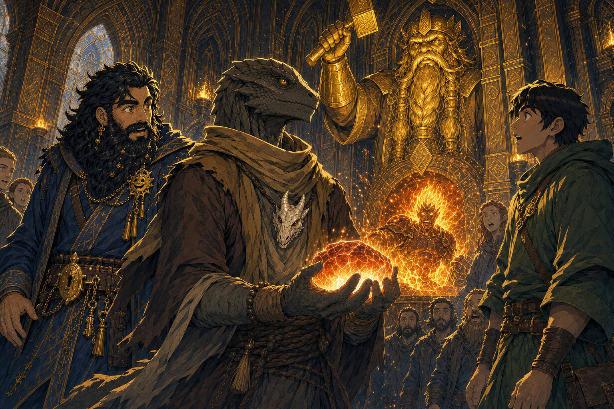

# Azer in Moradin's Forge

## One-Line Summary
An unidentified azer glimpsed for a brief moment inside Moradin's symbolic forge before disappearing back into the fire.

## Status
- [Party] [Confirmed on 2026-08-29] An azer appears briefly within the forge and then disappears into the flames.
- [To verify] Identity, name, gender, allegiance, purpose, whether it was physically present, and whether it noticed or communicated with the party.

## What Dain Knows
- [Party] The sighting occurs immediately after Taleesh successfully completes the forge ritual without showing pain.
- [Character-only] Dain has an established but incompletely defined half-Azer connection, potentially shared by the Truthhammer line.
- [Inferred] The sighting may matter to Dain's ancestry or forge heritage, but no connection has been confirmed.

## What The Party Knows
- [Party] The figure is an azer.
- [Party] It is visible only briefly inside the forge before vanishing back into the fire.
- [To verify] Who sees it, how it is identified as an azer, whether it entered or merely became visible, and whether its disappearance was voluntary.

## Description
- An azer seen momentarily amid the forge flames. No further physical details have been established in play.

## Notable Events
- 2026-08-29: The azer briefly appears within Moradin's shared-wall forge and disappears again into the fire after Taleesh's ritual. [Session 2026-08-29](../../Adventures/2026-08-29.md)

## Related Entries
- [Moradin's Chamber - Ola Dung Lot](../Places/Moradins%20Chamber%20-%20Ola%20Dung%20Lot.md)
- [Dain Truthammer](./Dain%20Truthammer.md)
- [Brother Taleesh](./Brother%20Taleesh.md)
- [Truthhammer Mountains](../Places/Truthhammer%20Mountains.md)
- [Open Threads](../Lore/Open%20Threads.md)
- [Session 2026-08-29](../../Adventures/2026-08-29.md)
