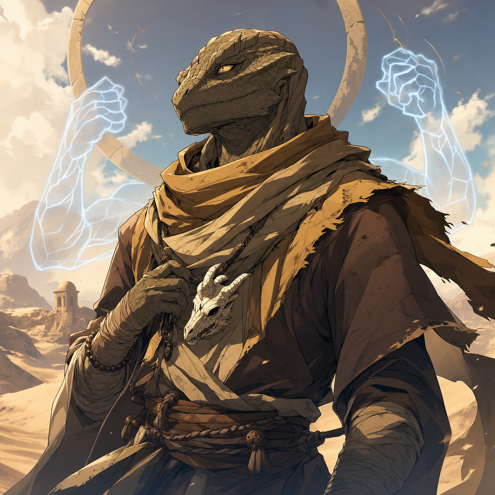

# Brother Taleesh

## One-Line Summary
Jackson's lizardfolk monk, a desert survivor called the Keeper of the Dunes, carrying a scorched goat-bone charm and deep distrust for elves and dwarves.

## Table Role
- Role: Player Character.
- Player: Jackson / Jackbo.
- DM: Tom.

## Status
- [Confirmed] Onboarded from user-provided backstory and sheet images on 2026-05-03.
- Source images: [charsheet1](../../Assets/Brother%20Taleesh/charsheet1.png), [charsheet2](../../Assets/Brother%20Taleesh/charsheet2.png).
- [Confirmed] Player: Jackson.
- [Confirmed] Player aliases from user roster: Jackson / Jackbo.
- [To verify] The sheet image appears to list player name `Jakabo`; user specified Jackson / Jackbo, so this Codex uses the user-provided roster.
- [Confirmed] Character name used by user and repo: Brother Taleesh.
- [To verify] The sheet image appears to spell the name `Brother Taal'esh`; keep `Brother Taleesh` until corrected.
- [Confirmed] Species/Race: Lizardfolk.
- [Confirmed] Class/Level: Monk 3.
- [Confirmed] Background: Ruined.
- [Confirmed] Alignment/faith notation on sheet: `TN (Fharlanghn)`.
- [Party] [Confirmed] In-world arrival at the forest camp was logged on 2026-05-03.
- [To verify] Why Brother Taleesh joins the current mountain-road mission and what he knows about it.

## What Dain Knows
- [Party] Brother Taleesh has arrived at the party's forest camp by camel, approached with his scimitar at low ready, and answered Dain's challenge in Common as "just a fellow traveller."
- [Character-only] Dain invited him to join the camp.
- [Character-only] Dain reads Taleesh as standoffish and afraid, then stops and puts down his staff to reassure him. [Inferred]
- [Party] Dain sees Taleesh produce herbal items from [Taleesh's Herbal Stash](../Items/Taleeshs%20Herbal%20Stash.md) and offer comfrey, pigweed, and hedgehog mushroom. [To verify effects]
- [Party] Dain hears Taleesh offer goji leaves, saying the first one is free and that taking one will make the taker "feel like a god." [To verify actual effects]
- [Character-only] Dain refuses the goji leaves and says the Truthhammers do not alter themselves in such ways.
- [Party] Dain sees Taleesh spend 1 ki point and project ghostly astral arms from his shoulders without using them aggressively.
- [Character-only] Dain responds by telling [The Festival Of Completely Unnecessary Lanterns](../Lore/Truthammer%20Tales/The%20Festival%20Of%20Completely%20Unnecessary%20Lanterns.md), offering to make a lantern with Taleesh, and conjuring a warm cloak.
- [Party] Dain uses `Prestidigitation` and `Minor Conjuration` together to give Taleesh a warm cloak for the remainder of the night.
- [Party] Taleesh approaches and introduces himself to the party after Dain and the party agree to keep him warm if he joins them.
- [Party] Taleesh gives Dain one pound of hedgehog mushroom, and Dain begins hollowing it into a [Hedgehog Mushroom Lantern](../Items/Hedgehog%20Mushroom%20Lantern.md).
- [Character-only] Dain records `+17` respect toward Taleesh after the hedgehog mushroom gift and lantern-making start.
- [Character-only] Dain tracks `50%` trust with Taleesh as of 2026-05-03.
- [Character-only] Taleesh / Jackson gains `+3` respect as of 2026-05-03. [To verify respect direction]
- [Party] During the smoky cave encounter, Taleesh bites and strikes the [Werebear at Smoky Cave](./Werebear%20at%20Smoky%20Cave.md), then says "ouch." [To verify damage and whether the bite has any special consequence]
- [Party] During the same fight, the werebear swings a greataxe at Taleesh / Jackson, rolls a natural `1`, and loses the weapon onto the cave roof out of reach.
- [Party] On 2026-05-30, Taleesh gives Dain a good-quality large pelt and asks him to make it into always-warm leather.
- [Character-only] Dain accepts with creative freedom, constraints, and "his own spin," beginning the [Sauna Pelt](../Items/Sauna%20Pelt.md).
- [Party] On 2026-06-20, Taleesh invites Dain to play dice in a tavern before leaving.
- [Character-only] Dain concludes Taleesh cheated at dice and reduces respect by `-11`.
- [Party] Taleesh offers Dain weed, says "Brother Truthammer, it's just a little fun and games," tries to end the game after detecting Dain's counterplay, then fails Dain's `Suggestion` save to "Complete the game." [To verify exact motive, wording, final stakes, and party reaction]
- [Party] [To verify who overheard] During the 2026-07-11 long rest, Dain apologizes for his dice-game actions and says he meant to teach a moral lesson about virtue. Taleesh replies, "It's the Truthammer virtue, not Taleesh virtue."
- [Character-only] During the same long rest, Dain tells Taleesh that a friend helped him escape Truthhammer Mountain through these tunnels one hundred years ago and sacrificed himself to pursuing troopers.
- [Party] Dain completes the [Sauna Pelt / Sauna Jacket](../Items/Sauna%20Pelt.md) for Taleesh: always warm in cold environments, with wetness that makes the surrounding area smell like female white-wolf piss.
- [Party] Taleesh graciously accepts the completed Sauna Jacket, now carries/wears it, and loves it. The jacket makes the surrounding area smell like female white-wolf piss.
- [Character-only] The notebook records `+13` respect connected to Taleesh. [To verify direction and resulting total]
- [To verify] Whether Dain knows any of Taleesh's backstory, faith, tribal loss, monastery history, or distrust of dwarves and elves.

## What The Party Knows
- [Party] Brother Taleesh arrives by camel, secures the animal in a sheltered area, and crouches at the camp.
- [Party] Kagrenac addresses Taleesh in Draconic after casting `Thaumaturgy` on himself.
- [Party] Kagrenac then tells the party in Common that "a lizard has arrived," referring to Taleesh.
- [Character-only] Dain initially misunderstands that announcement as referring to Hammerton's severed lizard head rather than Taleesh, then realizes the mistake and booms "Who goes there?" with `Prestidigitation`.
- [Party] Taleesh approaches with scimitar at low ready and says, "Just a fellow traveller."
- [Party] Dain replies, "Ah, we're all travellers. Come join us."
- [Party] Dain stops approaching, puts down his staff, and says there is no need to be afraid.
- [Party] Dain claims that, if Taleesh has heard of the Truthhammers, he should know they are safe, respectable travellers.
- [Party] Taleesh reaches into his stash, produces herbal items, and asks whether the party needs comfrey, pigweed, or hedgehog mushroom.
- [Party] Taleesh offers goji leaves, says the first one is free, and claims they make the taker feel like a god.
- [Party] Dain refuses the goji leaves and suggests Kagrenac may be interested.
- [Party] Taleesh spends 1 ki point to project ghostly astral arms from his shoulders; the use is not aggressive.
- [Party] Dain tells a lantern story, conjures a warm cloak, offers to make a lantern with Taleesh, and confirms with the party that they will keep Taleesh warm if he joins them.
- [Party] Dain uses `Prestidigitation` and `Minor Conjuration` together to give Taleesh a warm cloak for the remainder of the night.
- [Party] Taleesh approaches and introduces himself to the party.
- [Party] Taleesh gives Dain one pound of hedgehog mushroom for lantern-making.
- [Party] Dain hollows the mushroom and begins creating the [Hedgehog Mushroom Lantern](../Items/Hedgehog%20Mushroom%20Lantern.md).
- [To verify] Whether the party knows Brother Taleesh's desert history or why he distrusts elves and dwarves.
- [To verify] Why Brother Taleesh joins the current mountain-road mission.

## Brother Taleesh's Own History
Knowledge boundary: player-provided backstory for Brother Taleesh; not established as known to Dain unless revealed in play.

- Hatched beneath the drifting shade of desert oases among nomadic lizardfolk who moved from water to water with goats and quiet stories.
- Elven fire destroyed his people, burning tents to ash and sand to glass.
- His mother pushed him behind a dune, but the blast buried him half-dead; when he escaped, his tribe and oasis were gone.
- The only remnant he found was a charred, cracked bone charm carved like a goat's head.
- He wandered the desert until he collapsed by a stone outcrop and woke in a monastery carved into the rock.
- The monks were harsh but honest, teaching him the desert's lessons: movement like wind, strikes like a serpent, and inner quiet.
- Dwarves later attacked the monastery, seeking gold rumored beneath it; Brother Taleesh fought until he fell.
- When he woke, the halls were silent, the dwarves had taken what they wanted, and any surviving monks were gone.
- He now walks the desert tribeless and monastery-less, trading in towns only when needed.
- He distrusts elves and dwarves because both have taken everything from him.
- He is ruined, but not broken. He endures.

## Description
- Age: 28.
- Height: 6'3".
- Weight: 165 lb.
- Eyes: Yellow.
- Skin: Scales.
- Hair: None.
- Visual anchors: desert-wrapped lizardfolk monk, sand-worn robes, calm but guarded bearing, scorched goat-bone charm, crescent-horizon motif, spectral astral arms when ki manifests.

## Personality
- Personality traits: Keeps emotions buried beneath calm scales, but they burn hot beneath the surface; sleeps lightly, waking at the faintest shift of wind or footstep.
- Ideal: Endurance. The desert teaches that survival is not strength, but stubbornness. He will not fall again.
- Bond: The desert is his only true home; he feels uneasy beneath roofs and walls.
- Flaw: He struggles to stay in one place; stillness feels like death creeping closer.

## Mechanical Snapshot
- AC: 17.
- HP: 24/24.
- Initiative: +9.
- Speed: 40 ft.; lizardfolk walk and swim speed noted.
- Proficiency Bonus: +2.
- Ki Save DC: 13.
- Hit Dice: 3d8 [Inferred from monk level; sheet shows total `3` and HP calculation `8+4+6`].
- Ability Scores: STR 11 (+0), DEX 18 (+4), CON 14 (+2), INT 11 (+0), WIS 16 (+3), CHA 13 (+1).
- Saving Throws: STR +2, DEX +6, CON +2, INT +0, WIS +3, CHA +1.
- Strongest skills visible on sheet: Acrobatics +6, Animal Handling +5, Insight +5, Perception +5, Stealth +6, Survival +5.
- Other visible skills include Arcana +0, Deception +1, History +0, Intimidation +1, Investigation +0, Medicine +3, Nature +0, Performance +1, Persuasion +1, Religion +0, Sleight of Hand +4.
- Passive Perception: 15.
- Comeliness: 9.

## Current Session Resource Notes
- 2026-05-03: Spent 1 ki point to project ghostly astral arms from his shoulders during first contact at the forest camp. Remaining ki and exact active duration are [To verify].
- 2026-05-03: Has a warm cloak from Dain for the remainder of the night, created through `Prestidigitation` and `Minor Conjuration`. Whether it persists afterward is [To verify].

## Features And Tactics
- Ruined background feature: `Still Standing`, granting the Alert feat.
- Alert notes from sheet: initiative +5, cannot be surprised while conscious, and other creatures cannot gain advantage from being unseen.
- Lizardfolk features: Bite, Hungry Jaws, Hold Breath 15 minutes, Natural Armor, Nature's Intuition.
- Monk features: Unarmored Defense, Martial Arts, Ki, Flurry of Blows, Patient Defense, Step of the Wind, Dedicated Weapon, Unarmored Movement, Deflect Missiles, Ki-Fueled Attack.
- Subclass: Way of the Astral Self.
- Astral Arms: bonus action to summon spectral arms for 10 minutes using 1 ki; visible chosen creatures within 10 ft. make a Dexterity save or take damage; while active, he can use spectral arms for unarmed strikes with extra reach and may use Wisdom for certain Strength checks/saves and spectral-arm attacks. [To verify exact table wording]

## Attacks
- Scimitar: +6, `1d6+4` slashing.
- Dagger / Jambiya: +6, `1d4+4` piercing, range 20/60.
- Bite: +6, `1d6+4` bludgeoning.
- Spectral Arms / Unarmed Strike: +6, `1d4+4` force [To verify; sheet notation is partly obscured].

## Proficiencies And Gear
- Armor: none.
- Weapons: simple weapons and scimitars.
- Tools: Cartographer's Tools, Dice Set.
- Languages: Common, Dwarf, Goblin [To verify from sheet].
- Currency: 13 GP.
- Carried gear: Traveler's Clothes, pouch, scimitar, jambiya, dice set.
- Ruined background equipment: cracked hourglass, rusty manacles, half-empty bottle, hunting trap.
- Ruined trinket: [Taleesh's Bone Charm](../Items/Taleeshs%20Bone%20Charm.md).
- Foraged/trade goods on sheet: [Taleesh's Herbal Stash](../Items/Taleeshs%20Herbal%20Stash.md), including hedgehog mushroom, wild blackberry, pigweed, comfrey, sheep sorrel, and goji leaves with potent but addictive effects. [To verify quantities and rules]

## Allies And Organizations
- Fellow Travellers / Followers of Fharlanghn.
- Symbol: Crescent Horizon.
- [To verify] Whether this is a faith, order, loose fellowship, or current travel network.

## Relationship Hooks
- Dain is a dwarf, and Taleesh's backstory gives him reason to distrust dwarves. This should be handled as an active relationship tension, not ignored.
- [Hammerton Harry Drizddon](./Hammerton%20Harry%20Drizddon.md) is also a dwarf player character, so the tension is not only about Dain.
- Kagrenac is an Astral Elf, and Taleesh's tribe was destroyed by elven fire. This may create immediate friction if revealed.
- Taleesh's desert survival, monastery discipline, and astral arms give him a very different style of endurance from Dain's clever magical meddling.
- Dain may be drawn to the cracked bone charm, the crescent-horizon symbol, and the precise strangeness of astral arms.

## Notable Events
- 2026-05-03: Brother Taleesh onboarded into the Codex from Jackson's sheet images and backstory.
- 2026-05-03: Brother Taleesh arrives at the forest camp by camel, secures the camel in a sheltered area, and crouches while Kagrenac addresses him in Draconic; Hammerton Harry Drizddon is inspecting a severed lizard head at the time. [Session 2026-05-03](../../Adventures/2026-05-03.md)
- 2026-05-03: Kagrenac announces in Common that "a lizard has arrived," referring to Taleesh; Dain initially mistakes the announcement as referring to Hammerton's severed lizard head. [Session 2026-05-03](../../Adventures/2026-05-03.md)
- 2026-05-03: Dain realizes Taleesh is the arrival and uses `Prestidigitation` to boom, "Who goes there?" [Session 2026-05-03](../../Adventures/2026-05-03.md)
- 2026-05-03: Taleesh approaches with his scimitar at low ready and answers in Common, "Just a fellow traveller"; Dain replies, "Ah, we're all travellers. Come join us." [Session 2026-05-03](../../Adventures/2026-05-03.md)
- 2026-05-03: Dain reads Taleesh as standoffish and afraid, stops, puts down his staff, and reassures him through the Truthammer name. [Session 2026-05-03](../../Adventures/2026-05-03.md)
- 2026-05-03: Taleesh produces herbal items from his stash and asks whether the party needs comfrey, pigweed, or hedgehog mushroom. [Session 2026-05-03](../../Adventures/2026-05-03.md)
- 2026-05-03: Taleesh offers goji leaves with the promise of godlike feeling; Dain refuses and redirects the offer toward Kagrenac. [Session 2026-05-03](../../Adventures/2026-05-03.md)
- 2026-05-03: Taleesh spends 1 ki point to project ghostly astral arms without aggression; Dain answers with the lantern-festival story, conjures a warm cloak, secures a party promise to keep Taleesh warm, and Taleesh approaches to introduce himself. [Session 2026-05-03](../../Adventures/2026-05-03.md)
- 2026-05-03: Dain uses `Prestidigitation` and `Minor Conjuration` together to give Taleesh a warm cloak for the remainder of the night. [Session 2026-05-03](../../Adventures/2026-05-03.md)
- 2026-05-03: Taleesh gives Dain one pound of hedgehog mushroom, which Dain hollows out and begins turning into a [Hedgehog Mushroom Lantern](../Items/Hedgehog%20Mushroom%20Lantern.md). [Session 2026-05-03](../../Adventures/2026-05-03.md)
- 2026-05-03: Dain records `+17` respect toward Taleesh. [Session 2026-05-03](../../Adventures/2026-05-03.md)
- 2026-05-03: Dain's trust with Taleesh reaches `50%`, and Taleesh / Jackson gains `+3` respect. [Session 2026-05-03](../../Adventures/2026-05-03.md) [To verify respect direction]
- 2026-05-03: At the [Smoky Scratch-Marked Cave](../Places/Smoky%20Scratch-Marked%20Cave.md), Taleesh bites and strikes the [Werebear at Smoky Cave](./Werebear%20at%20Smoky%20Cave.md), then says "ouch." [Session 2026-05-03](../../Adventures/2026-05-03.md) [To verify damage]
- 2026-05-03: The werebear rolls a natural `1` while swinging its greataxe at Taleesh / Jackson; the weapon flies onto the cave roof out of the werebear's reach. [Session 2026-05-03](../../Adventures/2026-05-03.md)
- 2026-05-30: Taleesh provides Dain with a good-quality large pelt and asks for always-warm leather; Dain begins the [Sauna Pelt](../Items/Sauna%20Pelt.md) and reaches `84%` progress. [Session 2026-05-30](../../Adventures/2026-05-30.md)
- 2026-06-20: Taleesh invites Dain to dice in a tavern, cheats or appears to cheat, offers weed, and tries to end the game when Dain decides to anti-cheat; Dain responds with `Suggestion`: "Complete the game," Taleesh fails the save, and the game completes. [Session 2026-06-20](../../Adventures/2026-06-20.md) [To verify final accounting and fallout]
- 2026-07-11: During a long rest, Dain apologizes to Taleesh over the dice game, explains the intended moral lesson, reveals his century-old tunnel escape and friend's sacrifice, and finishes the [Sauna Pelt](../Items/Sauna%20Pelt.md). [Session 2026-07-11](../../Adventures/2026-07-11.md)
- 2026-07-11: Taleesh graciously accepts and loves the completed Sauna Jacket. He now carries/wears it, and its wetness makes the surrounding area smell like female white-wolf piss. [Session 2026-07-11](../../Adventures/2026-07-11.md)
- 2026-07-11: When a huge, bumpy brown-and-green [giant lake frog](./Giant%20Lake%20Frog%20-%202026-07-11.md) clamps its jaws around Ollyander, Taleesh immediately responds by slashing it while Dain freezes water around its mouth. [Session 2026-07-11](../../Adventures/2026-07-11.md) [To verify weapon, roll, and damage]

## Related Entries
- [Relationships](../../Character/Relationships.md)
- [Open Threads](../Lore/Open%20Threads.md)
- [Taleesh's Bone Charm](../Items/Taleeshs%20Bone%20Charm.md)
- [Taleesh's Herbal Stash](../Items/Taleeshs%20Herbal%20Stash.md)
- [Hedgehog Mushroom Lantern](../Items/Hedgehog%20Mushroom%20Lantern.md)
- [Sauna Pelt](../Items/Sauna%20Pelt.md)
- [Kagrenac](./The%20Astral%20Elf.md)
- [Dain Truthammer](./Dain%20Truthammer.md)
