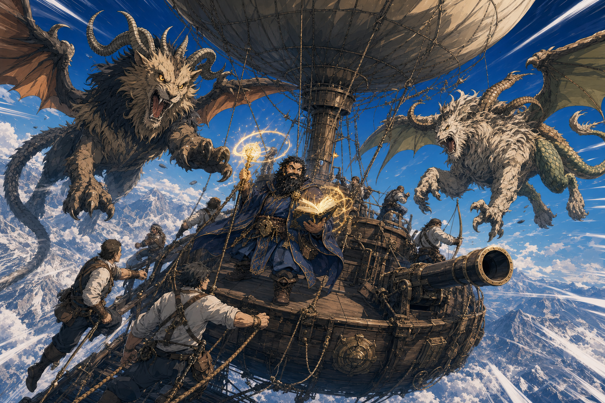

# Crymeria Attackers - 2026-08-29

## One-Line Summary
Two airborne creatures called `crymeria` that attack the party's balloon-like skyship shortly after it departs Ola Dung Lot heading south.

## Status
- Table role: DM-controlled / NPC creatures.
- [Party] [Confirmed on 2026-08-29] Exactly two attackers are present.
- [Party] [Confirmed] They attack while the skyship is airborne and travelling south.
- [To verify] Whether `crymeria` is the intended spelling of `chimera`, whether both use a standard chimera stat block, their appearance, sizes, heads, breath weapons, motives, origin, initiative, ranges, current positions, damage and eventual fate.
- [Inferred visual only] The current scene art interprets `crymeria` as chimeric winged mixed-beast creatures. This does not settle their canonical anatomy or rules.

## What Dain Knows
- Two hostile airborne creatures are attacking the party's skyship.
- Their presence immediately threatens the crew, balloon envelope, rigging, cannon and mission departure.

## Notable Events
- 2026-08-29: The pair attacks after the party takes off from Ola Dung Lot and heads south. [Session 2026-08-29](../../Adventures/2026-08-29.md)

## Related Entries
- [Party Skyship](../Places/Party%20Skyship%20-%202026-08-29.md)
- [Dain Truthammer](./Dain%20Truthammer.md)
- [Session 2026-08-29](../../Adventures/2026-08-29.md)
- [Open Threads](../Lore/Open%20Threads.md)
