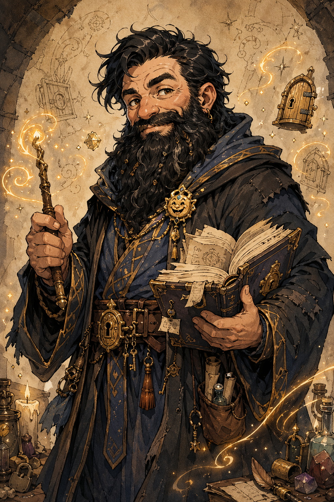

# Dain Truthammer

## One-Line Summary
A dwarf wizard with the bearing of an honest magistrate and the soul of a delighted meddler, drawn to deception, strange magic, and the hidden usefulness of apparently silly spells.

## Table Role
- Role: Player Character.
- Player: Maitland / user.
- DM: Tom.

## Status
- [Confirmed] Baseline imported from [Dicfuc_164465751.pdf](../../Dicfuc_164465751.pdf) on 2026-04-18.
- [Confirmed] Mechanically a level 4 dwarf wizard with Sage background and School of Conjuration subclass.
- [Confirmed] Alignment confirmed by user as `Chaotic Good` on 2026-04-18.
- [Confirmed] [Garl Glittergold](../Lore/Garl%20Glittergold.md) was chosen as Dain's deity on 2026-04-18.
- [Confirmed] Current location established on 2026-04-18 as the coastline near the Iron Shore Tribes.
- [Confirmed] Dain received the `Ghostly Form Tattoo` reward after the harpy fight; this was corrected on 2026-05-03 to clarify that Kagrenac did not receive it.
- [DM-private] [Character-only] [Confirmed] Dain is considered an outcast from [Truthammer mountain](../Places/Truthhammer%20Mountains.md) because of his faith in [Garl Glittergold](../Lore/Garl%20Glittergold.md).
- [To verify] Weight, Temp HP, and prepared-spell markings remain unsettled.
- [Confirmed from 2026-05-30 shared session] Dain took Resilient: Constitution at Wizard 4, raising CON from `13` to `14` and CON save to `+4`.
- [Confirmed from 2026-05-30 shared session] Level-up picks include Shape Water, Web, and Rope Trick.
- [To verify] Exact max HP after level 4 and Resilient: Constitution; `29` is the likely value under normal retroactive CON handling.
- [Confirmed by user from DM] Dain and/or the Truthhammers have a half-Azer connection; exact scope and implications are [To verify].

## What The Character Knows
- [Character-only] He delights in deception, illusion, and strange little magical tricks.
- [Character-only] He would rather solve problems with baffling or obscure magic than by brute force.
- [Character-only] He actively seeks out ridiculous or impractical spells because even useless-looking magic may hide wonder or utility.
- [Character-only] He wants, over time, to develop the most unique and useless spells known to the realm.
- [Character-only] He formally created [Truthammer's Leaky Tent](../Powers/Truthammer%20Leaky%20Tent.md) during the forest long rest on 2026-05-03.
- [Character-only] He knows he is considered an outcast from Truthammer mountain because of his faith in [Garl Glittergold](../Lore/Garl%20Glittergold.md). [DM-private] [Confirmed]
- [Character-only] At the forest camp, he hears Kagrenac say "a lizard has arrived," sees Hammerton holding a severed lizard head, initially assumes the head is what Kagrenac means, then realizes the mistake and booms "Who goes there?" with `Prestidigitation`.
- [Character-only] When Taleesh answers as "just a fellow traveller," Dain welcomes him with, "Ah, we're all travellers. Come join us."
- [Character-only] Dain reads Taleesh as standoffish and afraid, stops, puts down his staff, and reassures him by invoking the Truthammer name as safe and respectable. [Inferred]
- [Character-only] Dain sees Taleesh produce herbal items from [Taleesh's Herbal Stash](../Items/Taleeshs%20Herbal%20Stash.md) and offer comfrey, pigweed, and hedgehog mushroom. [To verify effects]
- [Character-only] Dain hears Taleesh offer goji leaves with the claim that taking one makes the taker "feel like a god," refuses, and says the Truthhammers do not alter themselves in such ways.
- [Character-only] Dain suggests Kagrenac, "the young elf," may be interested in the goji leaves. [To verify whether Kagrenac is actually interested]
- [Character-only] Dain sees Taleesh project ghostly astral arms from his shoulders without using them aggressively.
- [Character-only] Dain tells [The Festival Of Completely Unnecessary Lanterns](../Lore/Truthammer%20Tales/The%20Festival%20Of%20Completely%20Unnecessary%20Lanterns.md), offers to create a lantern with Taleesh, conjures a warm cloak, and confirms with the party that they will keep Taleesh warm if he joins them.
- [Character-only] Dain uses `Prestidigitation` and `Minor Conjuration` together to give Taleesh a warm cloak for the remainder of the night.
- [Party] Taleesh approaches and introduces himself after the warmth bargain.
- [Character-only] Dain receives one pound of hedgehog mushroom from Taleesh and begins hollowing it into a [Hedgehog Mushroom Lantern](../Items/Hedgehog%20Mushroom%20Lantern.md) inspired by the lantern story.
- [Character-only] Dain records `+17` respect toward Taleesh after the hedgehog mushroom gift and lantern-making start.
- [Character-only] Dain reaches `6%` progress on always-warm robes for Taleesh, realizes the concept is not truly him, and pivots into the [Always-Cold Robes](../Items/Always-Cold%20Robes.md) prototype after a flash of inspiration.
- [Party] At the start of the new in-world day after the forest long rest, Dain wakes to cold winds, hears [Kagrenac](./The%20Astral%20Elf.md) warn that the winds will worsen, and sees [Southern Human Traders](../Factions/Southern%20Human%20Traders.md) approach seeking [Olar Dunglor](../Places/Olar%20Dunglor.md).
- [Party] Dain rolls a natural `20` on Persuasion to convince the traders to trust the party and come with them, then delegates cost-setting to [Hammerton Harry Drizddon](./Hammerton%20Harry%20Drizddon.md) while requesting half paid upfront.
- [Party] The traders' arrangement becomes half now, half later; the upfront half is paid into [Party Loot](../../Character/Party%20Loot.md) as [Burdock](../Items/Burdock.md) x10 oz and [Ginseng](../Items/Ginseng.md) x2 oz, worth `5 gp` equivalent.
- [Character-only] Kagrenac tells Dain in Draconic that the newcomers are all glowing in magic. [To verify detection source]
- [Character-only] Dain shakes the [Coal Mine Puppet](../Items/Coal%20Mine%20Puppet.md)'s hand while attempting `Identify`, but the puppet appears to prevent or block the casting. [Inferred] [To verify resource cost]
- [Party] The puppet speaks in a high voice about being taken back to the coal mines.
- [Character-only] Dain begins praying to [Garl Glittergold](../Lore/Garl%20Glittergold.md), and the puppet bites him. Dain does not know why. [To verify damage, trigger, and consequence]
- [Character-only] Dain realizes the puppet is a cobalt puppet.
- [Party] The puppet says, "[Kurtlemack](../Lore/Kurtlemack.md) hates you." [To verify who "you" refers to]
- [Party] Dain defuses Hammerton / Dresden's push for more payment from the [Southern Human Traders](../Factions/Southern%20Human%20Traders.md) by keeping the original deal and adding five truthful answers owed upon delivery.
- [Party] On 2026-05-30, Dain meets [Ollyander](./Ollyander.md), Lachlan's new player character, and records `+4` respect after Ollyander arrives shell-shocked, knife in hand, but not visibly hostile.
- [Party] During travel north-east along the river, Ollyander holds onto Dain's Truthammer garment while the three travelling humans follow behind.
- [Party] After the winter wolves are destroyed, Dain prays to [Garl Glittergold](../Lore/Garl%20Glittergold.md), denies [Kurtlemack](../Lore/Kurtlemack.md) tribute from the deaths, and is stabbed by the [Coal Mine Puppet](../Items/Coal%20Mine%20Puppet.md), nearly dropping to `1 HP`.
- [Character-only] Dain begins the [Sauna Pelt](../Items/Sauna%20Pelt.md) for [Brother Taleesh](./Brother%20Taleesh.md), reaching `84%` progress [To verify DM acceptance].
- [Character-only] While meditating in [Truthammer's Leaky Tent](../Powers/Truthammer%20Leaky%20Tent.md), Dain thinks about his father and the famous lava forge accident; the father/forge accident framing remains idea-stage unless Tom confirms it in play.
- [Party] On 2026-06-20, Dain is in the centre of an unnamed town where six dragon corpses/remains are present and town artisans have made an equipment-for-material deal with him / Truthhammer. [To verify exact terms]
- [Party] Dain gives gold to local gnomes who worship Glittergold, receives the [Half-Pound Sack From Glittergold Gnomes](../Items/Half-Pound%20Sack%20From%20Glittergold%20Gnomes.md), and intends to give it to the local church. [To verify exact church, sack contents, and coin balance]
- [Party] In a tavern, Dain says, "Remember the name Truthhammer."
- [Character-only] During a dice game, Dain concludes [Brother Taleesh](./Brother%20Taleesh.md) is cheating, loses `-11` respect for him, decides to anti-cheat, and casts `Suggestion`: "Complete the game." Taleesh fails the save, the game completes, Dain later loses the betting round, and [Ollyander](./Ollyander.md) ends up winning. [To verify final stakes and party fallout]
- [Party] Harry / [Hammerton Harry Drizddon](./Hammerton%20Harry%20Drizddon.md) asks Dain for his seal; Dain provides it in exchange for `100 gp` worth of silver and then bets the silver. [To verify exact seal object, whether "Harry" is Hammerton, and whether the seal can be reclaimed]
- [Character-only] Dain notices that the unnamed town has issues with rats and poverty, records an action item to find the human/townsperson and give silver, and tells the human, "Gather the rats while I'm gone." [To verify identity and house]
- [Character-only] Dain gives his last `5 gp` to the human/townsperson tied to the rat-house thread. His gold-piece balance is likely `0`, but exact silver and other coin holdings remain [To verify].
- [Character-only] The next morning, Dain reflects on his failed pub moral lesson, prays to [Garl Glittergold](../Lore/Garl%20Glittergold.md) about his disappointment, sees a rat fall from the ceiling, and begins writing a new failed-moral-lesson rat spell in his wizard book / spellbook. Current lead pitch: `Truthammer's Cuddly Rat`; mechanics remain idea-stage in [Failed Moral Lesson Rat Spell Ideas](../Brainstorm/Powers/Failed%20Moral%20Lesson%20Rat%20Spell%20Ideas.md).
- [Party] Around the goblin campfire, Dain puts his arm around the hobgoblin leader and speaks of his mother, apprenticeship, and early training. [To verify whether "hobgoblin leader" corrects earlier goblin-leader shorthand]
- [Party] Dain says, "I trained under people who prized precision and under others who prized results. I kept both lessons and annoyed both camps."
- [Party] Dain says, "My mother could correct a room without raising her voice. A rare talent." [To verify her name]

## What The Party Knows
- [Party] Session 2026-04-18 opens along the coastline near the Iron Shore Tribes.
- [Party] Olar Dunglor is a lake high in the mountains, named by southern human traders seeking directions on 2026-05-03.
- [To verify] Whether the party knows Dain is an outcast from his mountain homeland.
- [To verify] Dain's public-facing motives and immediate purpose on that coast are not yet recorded.

## What Is Uncertain
- [To verify] What his Temp HP and current active effects are.
- [To verify] Current HP after the Coal Mine Puppet stabbing, likely near `1 HP`.
- [To verify] Which wizard spells are prepared right now versus simply present on the export.
- [To verify] What "outcast" means mechanically/socially: family rejection, religious censure, legal exile, clan politics, or another status.
- [To verify] Whether the half-Azer connection applies only to Dain, to the Truthammer bloodline more broadly, or to another family/cultural layer, and whether it has any mechanical effect.

## Description
- [Confirmed] Male dwarf, age 107, medium, 4'9", white skin, brown eyes, black hair.
- [Confirmed] Strong Intelligence, strong lore skills, darkvision 120 ft., poison resistance, and advantage against the Poisoned condition.
- [Confirmed] Wizard subclass on sheet: School of Conjuration.
- [Confirmed] Deity: [Garl Glittergold](../Lore/Garl%20Glittergold.md).
- [Confirmed] Canonical portrait shows him slightly naturally disheveled, in fancy scholar's robes marked with the sigil of [Garl Glittergold](../Lore/Garl%20Glittergold.md).
- [Confirmed] Current portrait now follows the campaign's kinetic shonen fantasy anime image style: clean modern battle-anime line art, smooth cel shading, expressive character acting, warm golden magic, and sharp hidden-door motifs. [Retcon] Style update recorded 2026-05-03.
- [Inferred] His current spell choices support misdirection, concealment, and magical stagecraft even though his formal specialty is conjuration.

## Personality And Play Texture
- [Confirmed] Dain works best as a benevolent meddler: mischievous, protective, curious, and willing to bend expectations for a kinder result.
- [Confirmed] He favors deception, illusion, obscure tricks, and elegant nonsense over brute force.
- [Inferred] He is likely to embarrass bullies, test authority with sly needling, and mislead dangerous people for good reasons rather than for vanity.
- [Confirmed] He is strongly drawn to bizarre, impractical, or "useless" magic and treats that curiosity as a real calling rather than a joke.
- [Confirmed] He can be played as someone who speaks politely to illusions, touches stone while thinking, and delights in hidden mechanisms and coded messages.
- [Inferred] His evasive stories and habit of giving layered answers may be partly protective, shaped by being an outcast from home for his faith rather than mere whimsy.
- [Confirmed] He publicly refuses Taleesh's goji leaves by invoking a Truthammer principle against altering himself in that way, despite his complicated outcast relationship with the Truthammer homeland.
- [Confirmed] He can use absurd Truthammer stories and small conjured comforts as sincere diplomacy, not only as jokes.

## Dainisms
- "A straight road is for people with nothing to hide and nothing to find."
- "Kindness with a crooked hat is still kindness."
- "If the lock exists, it means someone hoped to be clever."
- "A lie told to a tyrant is just a shortcut."
- "Stone remembers. Best speak politely near a mountain."
- "There's no such thing as a useless spell, only a dull wizard."
- "I trained under people who prized precision and under others who prized results. I kept both lessons and annoyed both camps."
- "My mother could correct a room without raising her voice. A rare talent."
- "A puppet may insult Glittergold, but only because someone else lent it courage and forgot to lend it manners."
- "Careful, little cobalt thing. Garl loves a joke, and worse for you, he remembers the punchline."
- "You mistake blood for tribute. That is common among small gods and badly made knives."
- "Remember the name Truthhammer."
- "Gather the rats while I'm gone."

## Evasive Dainisms
- "Ah, well. Mountains keep their own bookkeeping."
- "That depends whether you want the short truth, the long truth, or the useful truth."
- "A thing can be known, and still not improve by being said aloud."
- "Some roads are better described after you've left them behind."
- "If I'd learned nothing from it, I'd tell it plainly."
- "There are questions with answers, and questions with consequences."
- "Back home we called that the sort of detail that invites more detail."
- "A tidy account is usually missing the important crooked bits."
- "I've done wiser things, but not always more instructive ones."
- "You may have the outline now, and the corners later."
- "That story still has sharp edges. Best handled gradually."
- "In the Truthammer Mountains, we let some facts arrive wearing a coat."
- "If I answer that directly, you'll only ask the question behind it."
- "Some matters improve in the retelling. Others survive by not being retold."
- "I was there, certainly. Beyond that, memory becomes decorative."
- "The mountain remembers it more clearly than I do, and it is not speaking."
- "Let us say I came by that lesson honestly and leave the bruises out of it."
- "It was lawful enough for the innocent and unlawful enough for the guilty."
- "I prefer to introduce my mistakes by reputation first."
- "That is a long story, and some of the witnesses are still cross."

## Near-Term Motivations
- [Character-only] Help Kagrenac reach the mountain road near Samyrn Torst safely.
- [Character-only] Deliver Commander Agland's sealed letter to the actual general.
- [Character-only] Quietly discover the fuller truth behind the party's mission.
- [Character-only] Hunt for strange mountain magic, old wards, and improbable little spells.
- [Character-only] Decide how much, if anything, to reveal about being an outcast from Truthammer mountain.
- [Character-only] Understand why the [Coal Mine Puppet](../Items/Coal%20Mine%20Puppet.md) can apparently block `Identify`, why it bites during prayer to [Garl Glittergold](../Lore/Garl%20Glittergold.md), what a cobalt puppet is, why [Kurtlemack](../Lore/Kurtlemack.md) hates him or someone near him, and whether "the coal mines" are a destination, prison, origin, or trap.
- [Character-only] Preserve the future five truthful answers from the [Southern Human Traders](../Factions/Southern%20Human%20Traders.md) for questions that actually matter.
- [Character-only] Use the five truthful answers for the Coal Mine Puppet's origin, identity, coal-mine destination, return/destruction risks, and the Garl/Kurtlemack reaction.
- [Character-only] Finish or stabilize the [Sauna Pelt](../Items/Sauna%20Pelt.md) for Brother Taleesh.
- [Character-only] Resolve the 2026-06-20 dice aftermath: final silver accounting, Dain's seal, Taleesh's cheating, Ollyander's winnings, and any party trust damage.
- [Character-only] Find the human/townsperson tied to the rat-and-poverty problem, inspect the house, gather or contain the rats, and give silver responsibly.
- [Character-only] Develop the failed-moral-lesson rat spell seed without treating the mechanics as canon before user/DM approval.

## Long-Term Ambitions
- [Character-only] Develop a personal body of magic so peculiar and apparently useless that it becomes unmatched in the realm.
- [Character-only] Prove that strange edge-case spells can hold wonder, elegance, and real value even when no one else sees the point.

## Mechanical Snapshot
- Current HP nearly 1 after the Coal Mine Puppet stabbing [To verify exact value]; max HP likely 29 [To verify Tom's HP ruling]; AC 10; Speed 30 ft.; spell save DC 15; spell attack bonus +7; CON save +4.
- Notable features: Arcane Recovery, Minor Conjuration, Stonecunning (Tremorsense), Magic Initiate (Wizard), Resilient: Constitution.
- Spell themes on sheet/current package: Ray of Frost, Shape Water, Mage Hand, Minor Illusion, Disguise Self, Silent Image, Suggestion, Invisibility, Mirror Image, Web, Rope Trick.

## Notable Records
- 2026-04-18: Initial character baseline created from the imported sheet and user blurb.
- 2026-04-18: Dain's obsession with odd and impractical magic was recorded as a persistent character driver.
- 2026-04-18: Alignment confirmed as Chaotic Good, current HP confirmed as 20, and [Garl Glittergold](../Lore/Garl%20Glittergold.md) chosen as Dain's deity.
- 2026-04-18: Canonical portrait updated to show [Garl Glittergold](../Lore/Garl%20Glittergold.md)'s sigil worked into Dain's fancy but slightly disheveled scholar's robes.
- 2026-04-18: A new session began with Dain along the coastline near the Iron Shore Tribes.
- 2026-04-24: Canonical portrait regenerated as `Dain_Truthammer_portrait_v3.png` under the earlier whimsical inked fantasy style.
- 2026-04-24: The DM gave/approved the mechanics for `Truthammer's Leaky Shelter`, the working-title version of Dain's anti-shelter spell. His clan mountain was also placed near a volcano, with proposed volcanic-flow forge lore.
- 2026-05-03: Codex reference images, including `Dain_Truthammer_portrait_v3.png`, were regenerated in the campaign's kinetic shonen fantasy anime style.
- 2026-05-03: User correction clarified that Dain, not Kagrenac, received the `Ghostly Form Tattoo` reward from the harpy fight.
- 2026-05-03: During a forest long rest beside a flowing river, Dain formally created [Truthammer's Leaky Tent](../Powers/Truthammer%20Leaky%20Tent.md) and spent the final hour meditating inside it.
- 2026-05-03: DM note recorded that Dain is considered an outcast from Truthammer mountain because of his faith in [Garl Glittergold](../Lore/Garl%20Glittergold.md).
- 2026-05-03: Dain exited [Truthammer's Leaky Tent](../Powers/Truthammer%20Leaky%20Tent.md) dressed but damp, heard Kagrenac's Common announcement that "a lizard has arrived," saw Hammerton holding a severed lizard head, and initially misunderstood the announcement. [Session 2026-05-03](../../Adventures/2026-05-03.md)
- 2026-05-03: Dain realized the announcement referred to a living arrival rather than the severed head, then used `Prestidigitation` to boom his voice outward and call, "Who goes there?" [Session 2026-05-03](../../Adventures/2026-05-03.md)
- 2026-05-03: Dain welcomes Brother Taleesh after Taleesh identifies himself as "just a fellow traveller." [Session 2026-05-03](../../Adventures/2026-05-03.md)
- 2026-05-03: Dain lowers his staff to reassure Taleesh and publicly invokes the Truthammer name as safe and respectable, despite his private outcast status. [Session 2026-05-03](../../Adventures/2026-05-03.md)
- 2026-05-03: Dain sees Taleesh offer herbal remedies from his stash during the first-contact exchange. [Session 2026-05-03](../../Adventures/2026-05-03.md)
- 2026-05-03: Dain refuses Taleesh's goji leaves, says the Truthhammers do not alter themselves in such ways, and suggests Kagrenac may be interested. [Session 2026-05-03](../../Adventures/2026-05-03.md)
- 2026-05-03: Dain answers Taleesh's non-aggressive astral arms with [The Festival Of Completely Unnecessary Lanterns](../Lore/Truthammer%20Tales/The%20Festival%20Of%20Completely%20Unnecessary%20Lanterns.md), a conjured cloak, a lantern-making offer, and a party-backed promise to keep Taleesh warm. [Session 2026-05-03](../../Adventures/2026-05-03.md)
- 2026-05-03: Dain uses `Prestidigitation` and `Minor Conjuration` together to give Brother Taleesh a warm cloak for the remainder of the night. [Session 2026-05-03](../../Adventures/2026-05-03.md)
- 2026-05-03: Dain receives one pound of hedgehog mushroom from Taleesh, hollows it out, and begins creating the [Hedgehog Mushroom Lantern](../Items/Hedgehog%20Mushroom%20Lantern.md). [Session 2026-05-03](../../Adventures/2026-05-03.md)
- 2026-05-03: Dain records `+17` respect toward Brother Taleesh, using the player shorthand "the Lizard." [Session 2026-05-03](../../Adventures/2026-05-03.md)
- 2026-05-03: Dain reaches `6%` progress on always-warm robes for Brother Taleesh, realizes the idea is not truly him, and pivots into the [Always-Cold Robes](../Items/Always-Cold%20Robes.md) prototype after a flash of inspiration. [Session 2026-05-03](../../Adventures/2026-05-03.md)
- 2026-05-03: The party wakes to cold winds after the forest long rest; Kagrenac warns the winds will worsen, and [Southern Human Traders](../Factions/Southern%20Human%20Traders.md) approach asking for the way to [Olar Dunglor](../Places/Olar%20Dunglor.md). [Session 2026-05-03](../../Adventures/2026-05-03.md)
- 2026-05-03: Dain rolls a natural `20` on Persuasion to convince the southern human traders to trust the party and come with them, delegates cost-setting to [Hammerton Harry Drizddon](./Hammerton%20Harry%20Drizddon.md), and requests half paid upfront. [Session 2026-05-03](../../Adventures/2026-05-03.md)
- 2026-05-03: The trader arrangement is set as half now, half later; the upfront half goes into [Party Loot](../../Character/Party%20Loot.md) as [Burdock](../Items/Burdock.md) x10 oz and [Ginseng](../Items/Ginseng.md) x2 oz. [Session 2026-05-03](../../Adventures/2026-05-03.md)
- 2026-05-03: Kagrenac warns Dain in Draconic that the newcomers are glowing with magic; Dain shakes the [Coal Mine Puppet](../Items/Coal%20Mine%20Puppet.md)'s hand while attempting `Identify`, but the puppet appears to prevent the spell and speaks of being taken back to the coal mines. [Session 2026-05-03](../../Adventures/2026-05-03.md)
- 2026-05-03: Dain begins praying to [Garl Glittergold](../Lore/Garl%20Glittergold.md), and the [Coal Mine Puppet](../Items/Coal%20Mine%20Puppet.md) bites him for reasons Dain does not understand. [Session 2026-05-03](../../Adventures/2026-05-03.md)
- 2026-05-03: Dain realizes the puppet is a cobalt puppet, and it says, "[Kurtlemack](../Lore/Kurtlemack.md) hates you." [Session 2026-05-03](../../Adventures/2026-05-03.md)
- 2026-05-03: Dain defuses Hammerton / Dresden's request for more payment by keeping the original trader deal and adding five truthful answers owed upon delivery. [Session 2026-05-03](../../Adventures/2026-05-03.md)
- 2026-05-03: Around the goblin campfire, Dain puts his arm around the hobgoblin leader and tells stories of his mother, apprenticeship, and early training. [Session 2026-05-03](../../Adventures/2026-05-03.md)
- 2026-05-03: During the fight at the [Smoky Scratch-Marked Cave](../Places/Smoky%20Scratch-Marked%20Cave.md), Dain casts `Chromatic Orb` at the [Werebear at Smoky Cave](./Werebear%20at%20Smoky%20Cave.md), choosing acid and dealing `11` acid damage. [Session 2026-05-03](../../Adventures/2026-05-03.md) [To verify resource source]
- 2026-05-30: Dain's level 4 package is recorded: Resilient: Constitution, Shape Water, Web, and Rope Trick. [Session 2026-05-30](../../Adventures/2026-05-30.md)
- 2026-05-30: User reports Tom confirmed Dain and/or the Truthhammers have a half-Azer connection; scope remains [To verify], and the father/forge accident material stays idea-stage. [Session 2026-05-30](../../Adventures/2026-05-30.md)
- 2026-05-30: [Ollyander](./Ollyander.md) arrives at camp; Dain records `+4` respect, and Ollyander later holds onto Dain's Truthammer garment while travelling north-east along the river. [Session 2026-05-30](../../Adventures/2026-05-30.md)
- 2026-05-30: After the party destroys four winter wolves, Dain denies [Kurtlemack](../Lore/Kurtlemack.md) tribute while praying to [Garl Glittergold](../Lore/Garl%20Glittergold.md); the [Coal Mine Puppet](../Items/Coal%20Mine%20Puppet.md) stabs him, nearly dropping him to `1 HP`. [Session 2026-05-30](../../Adventures/2026-05-30.md)
- 2026-05-30: Dain begins the [Sauna Pelt](../Items/Sauna%20Pelt.md) for [Brother Taleesh](./Brother%20Taleesh.md), reaching `84%` progress [To verify DM acceptance]. [Session 2026-05-30](../../Adventures/2026-05-30.md)
- 2026-06-20: In the session titled `Glittergold Road`, Dain deals with local gnomes, a church, town artisans, six dragon corpses/remains, and a tavern dice game with Taleesh. [Session 2026-06-20](../../Adventures/2026-06-20.md)
- 2026-06-20: Dain concludes Taleesh cheated at dice, records `-11` respect, and casts `Suggestion`: "Complete the game." Taleesh fails the save, the game completes, Dain loses the later betting round, and Ollyander ends up winning. [Session 2026-06-20](../../Adventures/2026-06-20.md)
- 2026-06-20: Dain provides his seal to Harry / Hammerton in exchange for `100 gp` worth of silver, bets the silver, and then turns the silver aftermath toward a rat-and-poverty action item: find the human/townsperson, inspect or gather the rats, and give silver responsibly. [Session 2026-06-20](../../Adventures/2026-06-20.md) [To verify exact seal and human]
- 2026-06-20: Dain gives his last `5 gp` to the rat-house human/townsperson, then spends the next morning praying to [Garl Glittergold](../Lore/Garl%20Glittergold.md) about his failed moral lesson. A rat falls from the ceiling and inspires the beginnings of a new spell, now led by the `Truthammer's Cuddly Rat` pitch in [Failed Moral Lesson Rat Spell Ideas](../Brainstorm/Powers/Failed%20Moral%20Lesson%20Rat%20Spell%20Ideas.md). [Session 2026-06-20](../../Adventures/2026-06-20.md) [To verify spell approval and exact coin accounting]

## Related Entries
- [Current State](../../Character/Current%20State.md)
- [Inventory](../../Character/Inventory.md)
- [Party Loot](../../Character/Party%20Loot.md)
- [Spellbook](../../Character/Spellbook.md)
- [Relationships](../../Character/Relationships.md)
- [Timeline](../../Character/Timeline.md)
- [Open Threads](../Lore/Open%20Threads.md)
- [Dainisms](../Lore/Dainisms.md)
- [Truthammer Tales](../Lore/Truthammer%20Tales.md)
- [The Festival Of Completely Unnecessary Lanterns](../Lore/Truthammer%20Tales/The%20Festival%20Of%20Completely%20Unnecessary%20Lanterns.md)
- [Dain Background Evasions](../Lore/Dain%20Background%20Evasions.md)
- [Garl Glittergold](../Lore/Garl%20Glittergold.md)
- [Home In The Truthammer Mountains](../Lore/Dain%20Background%20Evasions/Home%20In%20The%20Truthammer%20Mountains.md)
- [Why He Left Home](../Lore/Dain%20Background%20Evasions/Why%20He%20Left%20Home.md)
- [Campaign Visual Style Guide](../Images/Campaign%20Visual%20Style%20Guide.md)
- [Truthammer's Leaky Tent](../Powers/Truthammer%20Leaky%20Tent.md)
- [Truthhammer Mountains](../Places/Truthhammer%20Mountains.md)
- [Hedgehog Mushroom Lantern](../Items/Hedgehog%20Mushroom%20Lantern.md)
- [Always-Cold Robes](../Items/Always-Cold%20Robes.md)
- [Sauna Pelt](../Items/Sauna%20Pelt.md)
- [Coal Mine Puppet](../Items/Coal%20Mine%20Puppet.md)
- [Kurtlemack](../Lore/Kurtlemack.md)
- [Olar Dunglor](../Places/Olar%20Dunglor.md)
- [Southern Human Traders](../Factions/Southern%20Human%20Traders.md)
- [Hammerton Harry Drizddon](./Hammerton%20Harry%20Drizddon.md)
