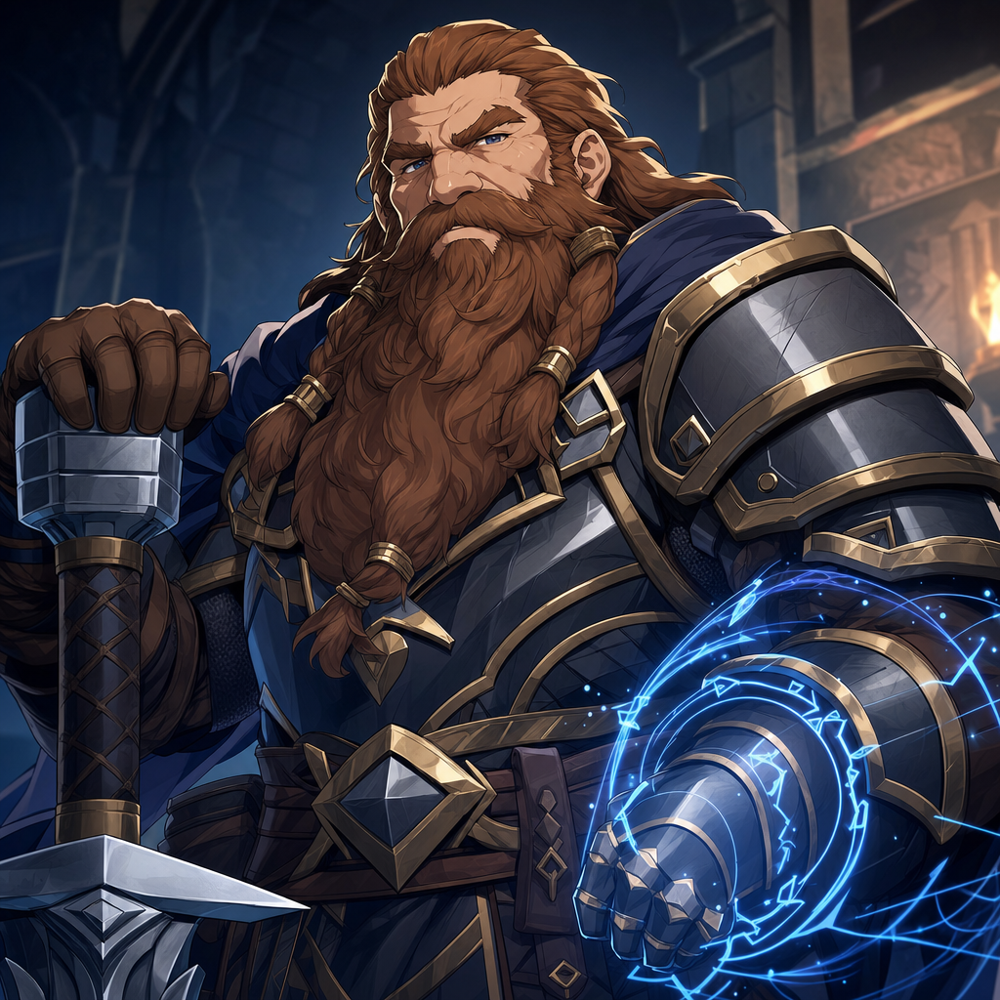

# Hammerton Harry Dresdon

## One-Line Summary
Norhan's dwarf Eldrich Knight, newly added to the player roster.

## Table Role
- Role: Player Character.
- Player: Norhan.
- DM: Tom.

## Status
- [Confirmed] User identified Norhan as the player and Hammerton Harry Dresdon as the character on 2026-05-03.
- [Confirmed] Ancestry/species: Dwarf.
- [Confirmed] Class note from user: Eldrich Knight.
- [To verify] Whether the table spelling is `Eldrich Knight` or the standard `Eldritch Knight`.
- [To verify] In-world introduction to Dain and the party has not yet been logged.

## What Dain Knows
- [To verify] Whether Dain has met Hammerton Harry Dresdon in play.
- [To verify] Whether Dain knows Hammerton's class, motives, faction ties, or relationship to the current mission.

## What The Party Knows
- [To verify] How Hammerton joins, or has joined, the party.

## Description
- Dwarf.
- Eldrich Knight / eldritch martial archetype [To verify exact wording].
- [Inferred] Likely a martial dwarf with arcane techniques, based on the class note.

## Relationship Hooks
- Another dwarf in the player roster may complicate Brother Taleesh's distrust of dwarves.
- Dain may be curious about Hammerton's arcane martial practice, especially if it uses unusual spellcraft or runes.

## Notable Events
- 2026-05-03: Added to the Codex from the user-provided player roster.

## Related Entries
- [Table Roster](../Lore/Table%20Roster.md)
- [Relationships](../../Character/Relationships.md)
- [Dain Truthammer](./Dain%20Truthammer.md)
- [Brother Taleesh](./Brother%20Taleesh.md)
