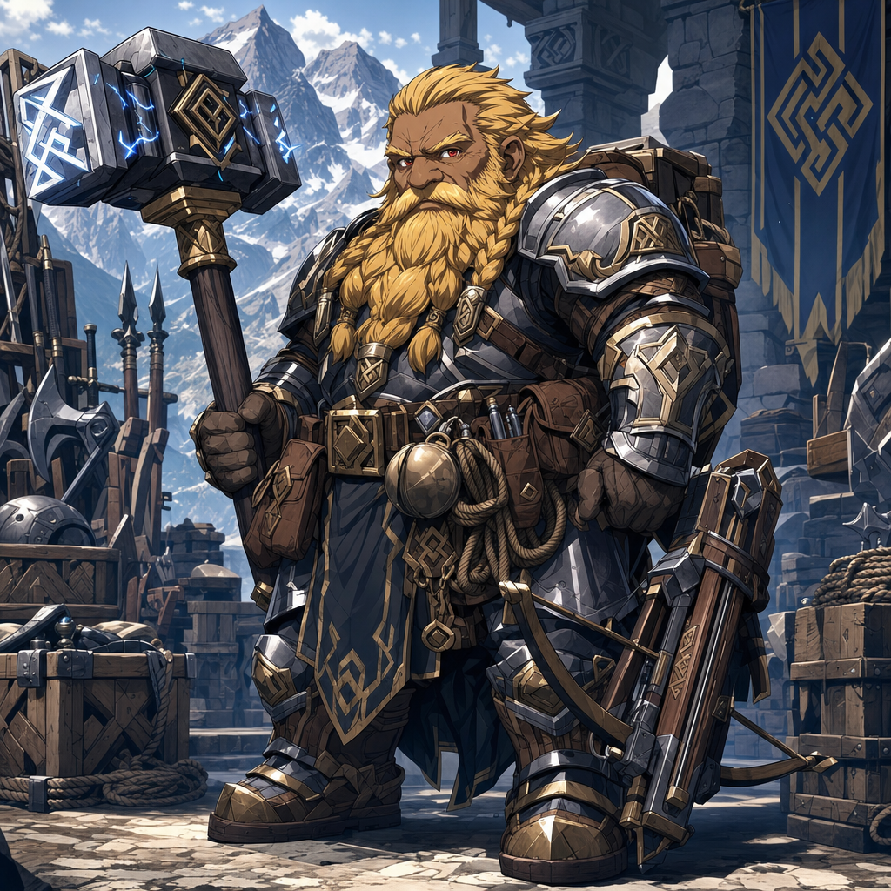

# Hammerton Harry Drizddon

## One-Line Summary
Norhan's Mountain Dwarf Fighter 3, a soldier-quartermaster and hammer-forward eldritch warrior who treats magic as one more disciplined toolset.

## Table Role
- Role: Player Character.
- Player: Norhan.
- DM: Tom.

## Source
- [Confirmed] Onboarded from [Hammerton Harry Drizddon.pdf](../../Assets/Hammerton%20Harry%20Drizddon.pdf) on 2026-05-03.
- [Retcon] The sheet confirms the character spelling as `Hammerton Harry Drizddon`; earlier repo notes used `Dresdon`.

## Status
- [Confirmed] Player: Norhan.
- [Confirmed] Character name: Hammerton Harry Drizddon.
- [Confirmed] Ancestry/species: Mountain Dwarf.
- [Confirmed] Class/level: Fighter 3.
- [Confirmed] Sheet spellcasting class: `Eldritch Fighter`.
- [To verify] The class field says `3 - Fighter (Eldrich)` while the spellcasting field says `Eldritch Fighter`; use Fighter 3 / eldritch martial archetype until the table confirms exact subclass wording.
- [Confirmed] Background: Soldier - Quartermaster. Sheet spelling says `Solider - QuartMaster`.
- [Confirmed] Alignment: TN.
- [Confirmed] XP: 1775.
- [Party] [Confirmed] Present at the forest camp when [Brother Taleesh](./Brother%20Taleesh.md) arrives on 2026-05-03.
- [To verify] In-world introduction to [Dain Truthammer](./Dain%20Truthammer.md) and the party is only partly logged; his presence is established, but how he joined the mission is not.

## What Dain Knows
- [Party] Dain has interacted with Hammerton Harry Drizddon enough to delegate the trader cost-setting to him; the formal in-world introduction is still [To verify].
- [Party] Dain delegates the cost-setting for the southern traders' possible guidance or accompaniment to Hammerton / Norhan after persuading the traders to trust the party. [Confirmed on 2026-05-03]
- [Party] Called Dresden at the table during the trader negotiation after the [Coal Mine Puppet](../Items/Coal%20Mine%20Puppet.md) reveal. [To verify table shorthand vs character-name variant]
- [Party] Hammerton / Dresden asks for more from the [Southern Human Traders](../Factions/Southern%20Human%20Traders.md) because the original deal was negotiated before the party knew about the puppet. Dain defuses the escalation by keeping the original deal and adding five truthful answers due upon delivery. [Confirmed on 2026-05-03]
- [To verify] Whether Dain knows Hammerton's quartermaster history, spellcasting, military rank, or relationship to the current mission.

## What The Party Knows
- [To verify] How Hammerton joins, or has joined, the current mountain-road mission.
- [Party] Hammerton is holding up and inspecting a severed lizard head when Brother Taleesh arrives at the forest camp. [To verify source and significance]
- [Character-only] Dain sees Hammerton holding the severed lizard head, initially thinks it is the "lizard" Kagrenac announced, then realizes the mistake and challenges the actual arrival.
- [Party] After Dain's natural `20` Persuasion check with the [Southern Human Traders](../Factions/Southern%20Human%20Traders.md), Dain delegates to Hammerton / Norhan to determine the cost, with Dain requesting half paid upfront. [To verify final terms]
- [Party] Once the [Coal Mine Puppet](../Items/Coal%20Mine%20Puppet.md) proves more dangerous and mysterious than the party first knew, Hammerton / Dresden asks for more; Dain's compromise adds five truthful answers upon delivery instead of reopening the original material payment.
- [To verify] Whether the party knows about the sheet-listed `Slave collar`, what it means, and whether it is still present.

## Appearance
- Age: 132.
- Height: 4'9".
- Weight: 140 lb.
- Eyes: Red.
- Skin: Tan.
- Hair: Golden.
- Visual anchors: compact mountain dwarf soldier, heavy armor, hammer-first posture, quartermaster pouches, supply discipline, practical scrutiny, and restrained arcane force worked into the weapon rather than flashy wizardry.

## Personality And Roleplay Cues
- Personality trait: "I solve problems with hammer and sometimes even paper work."
- Ideal: "No one left is behind, unless it is a risk."
- Bond: "If you like my hammer you are a friend."
- Flaw: "I'm busy with my hammer or calculating supply and will miss whats going on."
- Table read: exacting, blunt, supply-minded, brave under pressure, and more comfortable with gear, stone, weapons, and logistics than emotional nuance. [Inferred]

## Backstory
Knowledge boundary: sheet-provided backstory for Hammerton; not established as known to Dain unless revealed in play.

- Raised in a mountain hold guarding a vital trade pass.
- Began as a quartermaster who counted weapons, maintained gear, and rejected flawed forge-work.
- Earned the nickname by testing steel by sound, striking each piece until he trusted it.
- During a convoy ambush, with officers dead and supplies at risk, Hammerton took control.
- He reorganized weapons, rationed bolts, used terrain as a choke point, and kept the unit alive until reinforcements arrived.
- That action earned him rank, respect, and authority.
- He turned to magic afterward as a matter of control, treating arcane study as another toolset for reinforcing steel and structure.
- Now he operates as a soldier-quartermaster and eldritch warrior, preparing others for the kind of chaos he survived.
- Sheet note: `4 campaigns` [To verify meaning].

## Mechanical Snapshot
- AC: 18.
- HP: 31/31.
- Initiative: +1.
- Speed: 35 ft.
- Proficiency Bonus: +2.
- Hit Dice: 3 total; sheet HP notation `10+9+6`.
- Ability Scores: STR 18 (+4), DEX 12 (+1), CON 14 (+2), INT 15 (+2), WIS 7 (-2), CHA 11 (+0).
- Saving Throws: STR +6, DEX +1, CON +4, INT +2, WIS -2, CHA +0.
- Passive Perception: 8.
- Strongest skill: Athletics +6.
- Other visible skills: Acrobatics +3, Animal Handling -2, Arcana +2, Deception +0, History +2, Insight -2, Intimidation +2, Investigation +2, Medicine -2, Nature +2, Perception -2, Performance +0, Persuasion +0, Religion +2, Sleight of Hand +1, Stealth +1, Survival +0.

## Combat And Features
- War hammer, two-handed notation: +6 to hit, `d8/10+4`.
- `[E]Dwarven Hammer`: +8 to hit, `2d6+8`. [To verify exact item name, enchantment, and ownership details]
- Heavy Crossbow: +3 to hit, `1d10+1`.
- Action Surge: extra action, short rest.
- Second Wind: bonus action, short rest, `1d10 + level`.
- Mobile feat: +10 speed; sheet shorthand notes movement/running benefit. [To verify exact table wording]
- Darkvision.
- Dwarven Resistance: advantage against poison and resistance to poison damage.
- Stonecunning: enhanced History checks related to stonework.
- Military Rank: can command respect, access supplies, and call in favors from allied military units.

## Spellcasting
- Spellcasting Ability: INT +2.
- Spell Save DC: 12.
- Spell Attack Bonus: +4.
- 1st-level slots: 2.
- Cantrips: `Booming Blade` (`1d8`, 5 ft.), `Sword Burst` (`1d6`, 5 ft.).
- 1st-level spells: `Magic Missile`, `Slivery Barbs`, `Thunderwave`.
- [To verify] Sheet says `Slivery Barbs`; likely `Silvery Barbs`, but preserve the sheet spelling until confirmed.
- Thunderwave sheet notation: `15ft cube-2d8 con sav+10ft push, Fail noP`.

## Proficiencies And Gear
- Armor: all armor.
- Weapons: all martial weapons; sheet also lists Battle Axe, Hand Axe, Light Hammer, War Hammer, and Heavy Crossbows.
- Tools: Dice Set, Smith's Tools, vehicles (land).
- Languages: Common, Dwarven. Sheet spelling says `Drawrven`.
- Armor/clothing carried or listed: Plate Armour, Chain mail, Scale mail.
- Weapons listed: Dwarven Hammer (+2), War Hammer, Great Weapon, Daggers.
- Potions: Healing Potion `2d4+4`, Speed Potion, Fire Breath Potion - 30 ft. cone.
- Other sheet-listed gear: Slave collar, Explorer's Pack, Flask of Honey [To verify; sheet says `Flack of Honey`], Wax Ear Plug.
- Explorer's Pack contents: backpack, bedroll, mess kit, tinderbox, 10 torches, 10 days rations, waterskin, and 50 ft. rope.

## Treasure And Oddities
- Bomb, 60 ft.; `1d12`, Dexterity save for half damage; sheet value 150 gp.
- Snake head - Youati enemy head. [To verify spelling and context]
- Bunny ears shaped weathered rock, jade, about 50 gp or more to the right person.
- Bunny ears shaped weathered rock, yellow quartz, 80 gp.
- Nuggets of silver, 350 gp.
- Small ammonite, 5 gp.
- Ogre teeth set, no listed value; intended necklace as a victory token.
- Ogre loin cloth for lizard warmth.
- Ogre meat for lizard food.

## Allies And Organizations
- Agnland Olorran - Commander, Dwarven Mountains. [To verify spelling; may connect to [Commander Agland](./Commander%20Agland.md)]

## Relationship Hooks
- Another dwarf in the player roster may complicate [Brother Taleesh](./Brother%20Taleesh.md)'s distrust of dwarves.
- Dain may be curious about Hammerton's arcane martial practice, especially if it is expressed through runes, thunder, and practical weapon reinforcement.
- Hammerton's quartermaster instincts may pair well with Dain's strange-magic curiosity when supplies, repairs, or improvised plans matter.
- The sheet-listed `Slave collar` needs care before becoming in-world canon for the party; confirm whether it is a present item, history marker, joke note, or unresolved condition.

## Notable Events
- 2026-05-03: Added to the Codex from the user-provided player roster.
- 2026-05-03: Corrected spelling and expanded from the uploaded character sheet PDF.
- 2026-05-03: Present at the forest camp holding up and inspecting a severed lizard head when Brother Taleesh arrives by camel. [Session 2026-05-03](../../Adventures/2026-05-03.md)
- 2026-05-03: Dain exits the leaky tent, sees Hammerton holding the severed lizard head, initially mistakes it for the lizard Kagrenac announced, then realizes the mistake and booms "Who goes there?" with `Prestidigitation`. [Session 2026-05-03](../../Adventures/2026-05-03.md)
- 2026-05-03: Dain delegates cost-setting to Hammerton / Norhan after persuading the southern human traders to trust the party and come with them; Dain requests half paid upfront. [Session 2026-05-03](../../Adventures/2026-05-03.md)
- 2026-05-03: After the puppet reveal, Hammerton / Dresden asks for more because the original negotiation did not account for the puppet; Dain defuses the escalation by keeping the original deal and adding five truthful answers due upon delivery. [Session 2026-05-03](../../Adventures/2026-05-03.md)

## Related Entries
- [Table Roster](../Lore/Table%20Roster.md)
- [Open Threads](../Lore/Open%20Threads.md)
- [Relationships](../../Character/Relationships.md)
- [Dain Truthammer](./Dain%20Truthammer.md)
- [Brother Taleesh](./Brother%20Taleesh.md)
- [Commander Agland](./Commander%20Agland.md)
- [Southern Human Traders](../Factions/Southern%20Human%20Traders.md)
- [Coal Mine Puppet](../Items/Coal%20Mine%20Puppet.md)
