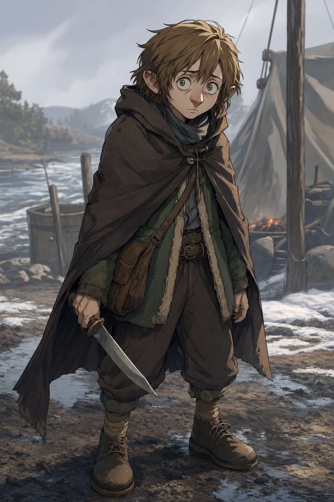

# Ollyander

## One-Line Summary
Lachlan Pratt's new small hobbit-like player character, shell-shocked and knife-carrying but not visibly hostile when first approaching Dain's camp.

## Table Role
- Role: Player Character.
- Player: Lachlan Pratt.
- DM: Tom.

## Status
- [Party] [Confirmed] Arrived at camp during the 2026-05-30 session.
- [Party] [Confirmed] Lachlan's new character after his previous character was reported captured by a gargantuan vulture-type creature.
- [To verify] Exact ancestry/species, class, pronouns, name spelling, and relationship to Lachlan's previous character.
- [To verify] Whether Lachlan's previous character is [Yuckie the Goblin](./Yuckie%20the%20Goblin.md), and whether the captor is a vulture, manticore, roc-like creature, or another flying monster.

## What Dain Knows
- [Party] Ollyander first appears as a small hobbit-like humanoid.
- [Party] Ollyander has pale skin, straight fawn-brown hair, a pointy nose, and a shell-shocked look.
- [Party] Ollyander rarely blinks and carries a large knife.
- [Party] Ollyander is not visibly hostile on approach.
- [Character-only] Dain records `+4` respect toward Ollyander.
- [Party] During travel, Ollyander walks close to Dain and grabs or holds onto Dain's Truthammer garment.
- [Party] During the 2026-06-20 tavern dice game, Dain gives Ollyander `1 gp`, and Ollyander wins as well.
- [Party] Dain later goes all in and values Ollyander's `3 rats` as `9 gp`. [To verify whether "rats" is correct and whether they are literal animals, game pieces, or something else]
- [Party] In the later dice-game accounting, Dain loses a betting round while Ollyander ends up winning; a human/townsperson from before is involved in a `60 gp` worth-of-silver trade with Ollyander. [To verify direction, holder, and whether this is connected to the town rat problem]

## What The Party Knows
- [Party] Ollyander approached camp after Lachlan's previous character was captured.
- [Party] Ollyander carries a large knife but did not present obvious hostility.
- [To verify] Whether the party knows why Ollyander is shell-shocked or what Ollyander saw before arrival.

## What Is Uncertain
- [To verify] Exact character name spelling.
- [To verify] Whether Ollyander is literally a hobbit/halfling or only hobbit-like.
- [To verify] Whether Ollyander's lack of blinking is fear, trauma, magic, species trait, injury, or habit.
- [To verify] Whether Ollyander knows anything about the gargantuan vulture-type creature.

## Description
- Small humanoid, hobbit-like.
- Pale skin.
- Straight fawn-brown hair.
- Pointy nose.
- Shell-shocked expression.
- Rarely blinks.
- Carries a large knife.

## Notable Events
- 2026-05-30: Ollyander arrives at camp, apparently frightened or stunned but not hostile; Dain's best immediate read is to check Insight before treating the knife as threat. [Session 2026-05-30](../../Adventures/2026-05-30.md)
- 2026-05-30: Dain records `+4` respect toward Ollyander. [Session 2026-05-30](../../Adventures/2026-05-30.md)
- 2026-05-30: As the party travels north-east along the river into colder country, Ollyander walks close to Dain and holds onto his Truthammer garment. [Session 2026-05-30](../../Adventures/2026-05-30.md)
- 2026-06-20: During the tavern dice game, Dain gives Ollyander `1 gp`; Ollyander wins as well, and Dain later values Ollyander's `3 rats` as `9 gp` while going all in. After Dain loses a later betting round, Ollyander ends up winning, and a human/townsperson trade involving Ollyander is valued at `60 gp` worth of silver. [Session 2026-06-20](../../Adventures/2026-06-20.md) [To verify "rats" and silver trade]

## Related Entries
- [Dain Truthammer](./Dain%20Truthammer.md)
- [Yuckie the Goblin](./Yuckie%20the%20Goblin.md)
- [Table Roster](../Lore/Table%20Roster.md)
- [Relationships](../../Character/Relationships.md)
- [Open Threads](../Lore/Open%20Threads.md)
- [Session 2026-05-30](../../Adventures/2026-05-30.md)
