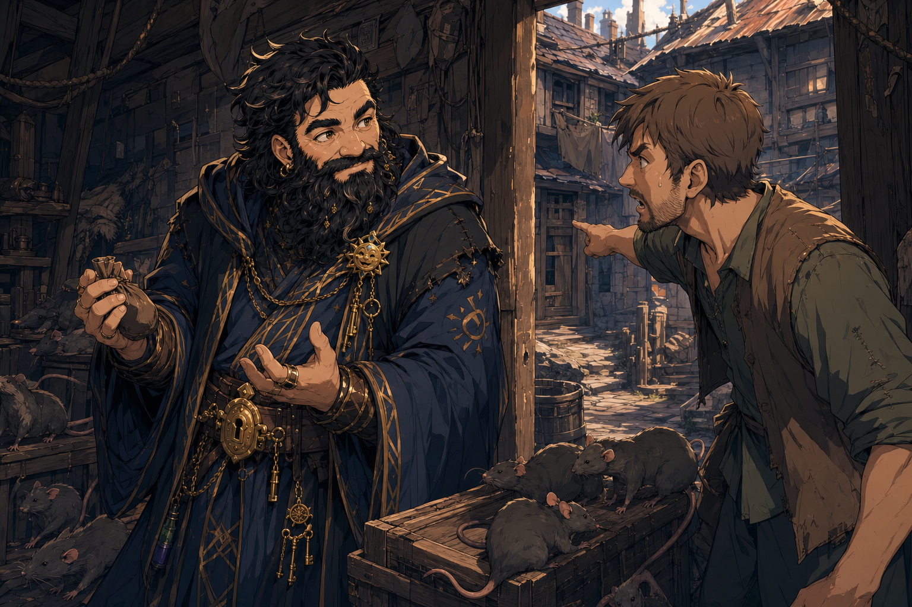

# Rat-House Human - 2026-06-20

## One-Line Summary
An unnamed human or townsperson tied to the 2026-06-20 dice/silver aftermath, the unnamed town's rat-and-poverty problem, and Dain's last `5 gp` gift.

## Table Role
- Role: DM-controlled / NPC. [To verify]
- DM: Tom.
- Player-facing note: This is a temporary tracking title, not an in-world name.

## Status
- [Party] [To verify] A human/townsperson runs away or withdraws after seeing the amount of money involved in the dice/silver scene.
- [Party] [To verify] A townsperson from before, apparently the human, is involved in a `60 gp` worth-of-silver trade with [Ollyander](./Ollyander.md).
- [Character-only] [To verify] Dain connects this person to a house with rats and the town's poverty problem, tells them, "Gather the rats while I'm gone," and later gives them his last `5 gp`.
- [To verify] Whether this is the same person as the tavern human who drank badly, the same person who ran away, the same person involved in the Ollyander silver exchange, and the same person with the rat-infested house.

## What Dain Knows
- [Character-only] The town has issues with rats and poverty.
- [Character-only] Dain has a practical action item: find this human/townsperson, inspect or address the rat problem, and decide how to help without turning poverty into a spectacle.
- [Character-only] Dain told the human/townsperson, "Gather the rats while I'm gone."
- [Character-only] Dain later gave his last `5 gp` to the human/townsperson, leaving his gold-piece balance likely at `0`; exact silver and other coin holdings remain [To verify].
- [Character-only] Dain's next-morning failed-moral-lesson reflection, prayer to [Garl Glittergold](../Lore/Garl%20Glittergold.md), and falling-rat spell seed all sit near this rat-house thread.

## What Is Uncertain
- [To verify] Name, pronouns, household, occupation, and exact relationship to the tavern, dice game, and Ollyander's silver exchange.
- [To verify] Which house has rats, whether it belongs to this person, and whether anyone in the household is sick, hungry, indebted, or endangered.
- [To verify] Whether the rats are ordinary vermin, diseased, magical, organized, connected to Ollyander's `3 rats`, connected to the falling rat, or simply a sign of poverty.
- [To verify] Whether Dain gave only `5 gp`, intended to give silver later, or already arranged another transfer.
- [To verify] Whether the `60 gp` worth-of-silver trade with Ollyander is a sale, debt, wager, exchange, restitution, or misread notebook wording.

## Dain-Facing Approach
- Ask their name first; a kindness without a name is only half a kindness.
- Confirm whether the rat-infested house is theirs, where it is, and who else lives there.
- Inspect the rats before spending more coin: ordinary hunger-sign, disease risk, magical swarm, trained animals, or civic symptom.
- Help through controlled goods, repairs, food, cleaning, temple aid, or witnessed silver rather than flashing wealth in front of desperate townsfolk.
- Keep `Truthammer's Cuddly Rat` separate from pest control unless Tom explicitly makes the connection; the spell seed is comfort and conscience, not extermination.

## Image Status
- This page uses the existing 2026-06-20 rat-and-poverty scene as a reference image.
- No canonical portrait has been generated because the person's identity and physical description are not confirmed.

## Notable Events
- 2026-06-20: A human/townsperson runs away or withdraws after seeing the amount of money involved in the tavern dice/silver scene. [Session 2026-06-20](../../Adventures/2026-06-20.md) [To verify identity and motive]
- 2026-06-20: A townsperson from before, apparently the human, is involved in a `60 gp` worth-of-silver trade with [Ollyander](./Ollyander.md). [Session 2026-06-20](../../Adventures/2026-06-20.md) [To verify trade direction and holder]
- 2026-06-20: Dain tells the human/townsperson he has an ambition to rid that house of rats and says, "Gather the rats while I'm gone." [Session 2026-06-20](../../Adventures/2026-06-20.md) [To verify exact house and rat situation]
- 2026-06-20: Dain gives his last `5 gp` to the human/townsperson before the next-morning failed moral lesson and falling-rat spell inspiration. [Session 2026-06-20](../../Adventures/2026-06-20.md)

## Related Entries
- [Session 2026-06-20](../../Adventures/2026-06-20.md)
- [2026-06-20 Live Play Aid](../../Adventures/2026-06-20-play-aid.md)
- [Unnamed Town - 2026-06-20](../Places/Unnamed%20Town%20-%202026-06-20.md)
- [Ollyander](./Ollyander.md)
- [Brother Taleesh](./Brother%20Taleesh.md)
- [Garl Glittergold](../Lore/Garl%20Glittergold.md)
- [Failed Moral Lesson Rat Spell Ideas](../Brainstorm/Powers/Failed%20Moral%20Lesson%20Rat%20Spell%20Ideas.md)
- [Open Threads](../Lore/Open%20Threads.md)
