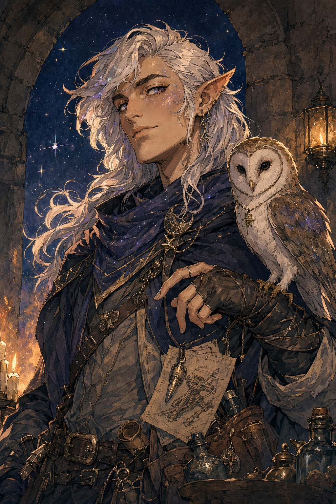

# Kagrenac

## One-Line Summary
Matt's Astral Elf party member whose boldness, owl, and questionable ballista judgment have earned Dain's increased respect.

## Table Role
- Role: Player Character.
- Player: Matt / Matthew.
- Character aliases: Kagrenac; The Astral Elf.
- DM: Tom.

## Status
- [Party] [Confirmed] Name: Kagrenac. User confirmation recorded 2026-05-03.
- [Party] [Confirmed] Player: Matt. User confirmation recorded 2026-05-03.
- [Party] [Confirmed] Kagrenac is an Astral Elf traveling with the party.
- [Party] [Confirmed] Kagrenac has an owl that spotted the ogres before they fully reached camp.
- [Character-only] [Confirmed] Dain recorded `+4` respect for Kagrenac after hearing that he tried to fire Yuckie from a ballista.
- [Party] [Confirmed] Kagrenac did not receive or wear the `Ghostly Form Tattoo`; Dain received that reward instead. [Retcon] User correction recorded 2026-05-03.
- [To verify] Class, pronouns, motives, and relationship to Yuckie.

## What Dain Knows
- [Character-only] Kagrenac is audacious enough to try launching Yuckie from a ballista.
- [Character-only] Dain respects this more than he probably should.
- [Character-only] Dain has promised to help Kagrenac make the mountain ascent safely.

## What The Party Knows
- [Party] Kagrenac's owl warned the party about the approaching ogres at the creek-fork camp.
- [Party] Kagrenac killed Dain's suggested enemy before the party could exploit the enchantment further after the harpy fight.
- [Party] Kagrenac cast `Thaumaturgy` on himself and addressed Brother Taleesh in Draconic when Taleesh arrived at the forest camp.
- [Party] Kagrenac then told the party in Common that "a lizard has arrived," referring to Brother Taleesh.

## What Is Uncertain
- [To verify] Whether Kagrenac understood Dain's plan for the suggested enemy.
- [To verify] Whether the owl is familiar, companion, trained scout, or another magical feature.
- [To verify] Whether Draconic is one of Kagrenac's known languages or was enabled by another feature.

## Description
- Astral Elf.
- [Inferred] Reads as bold, impulsive, and tactically useful.

## Notable Events
- 2026-04-18: Yuckie tells Dain that Kagrenac tried to launch him from a ballista; Dain gains `+4` respect. [Session 2026-04-18](../../Adventures/2026-04-18.md)
- 2026-04-18: Kagrenac's owl spots two ogres crossing the creek toward camp and alerts the party. [Session 2026-04-18](../../Adventures/2026-04-18.md)
- 2026-04-18: After the harpy battle, Kagrenac kills Dain's suggested target before the party can do anything more with it. [Session 2026-04-18](../../Adventures/2026-04-18.md)
- 2026-05-03: User correction clarified that the `Ghostly Form Tattoo` reward belongs to Dain, not Kagrenac.
- 2026-05-03: User confirmed the Astral Elf's name as Kagrenac and player as Matt.
- 2026-05-03: Kagrenac cast `Thaumaturgy` on himself and addressed Brother Taleesh in Draconic during Taleesh's arrival at the forest camp. [Session 2026-05-03](../../Adventures/2026-05-03.md)
- 2026-05-03: Kagrenac told the party in Common that "a lizard has arrived," prompting Dain to initially mistake Hammerton's severed lizard head for the announced arrival. [Session 2026-05-03](../../Adventures/2026-05-03.md)

## Related Entries
- [Dain Truthammer](./Dain%20Truthammer.md)
- [Yuckie the Goblin](./Yuckie%20the%20Goblin.md)
- [Brother Taleesh](./Brother%20Taleesh.md)
- [Relationships](../../Character/Relationships.md)
- [Creek-Fork Ogre Ambush](../Events/Creek-Fork%20Ogre%20Ambush.md)
- [Harpy Nest Battle](../Events/Harpy%20Nest%20Battle.md)
