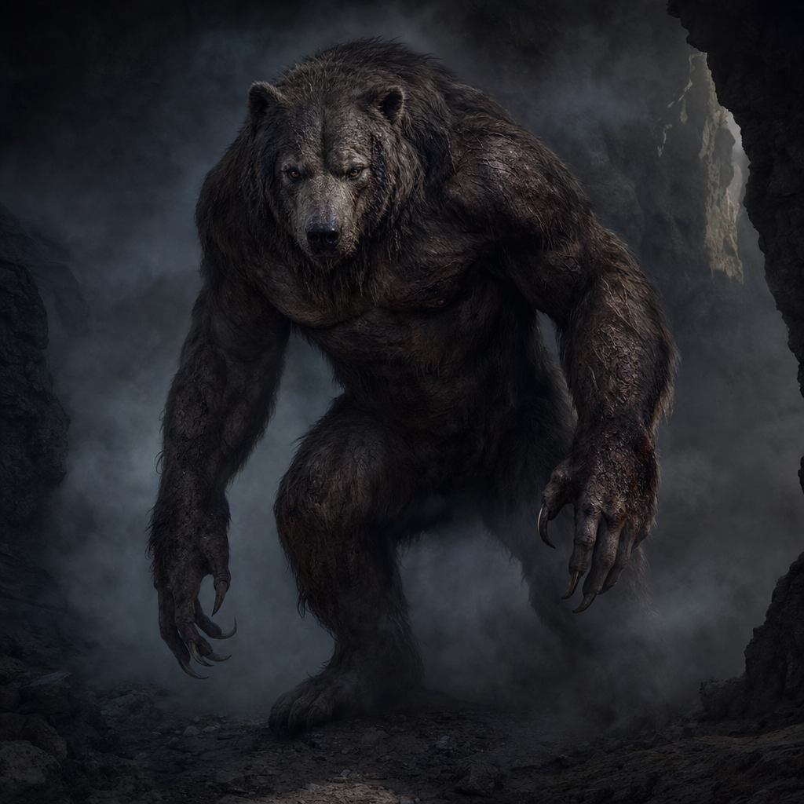

# Werebear at Smoky Cave

## One-line summary
A speaking werebear revealed at the smoky scratch-marked cave after warning the party to leave, then killed by Matt's `Inflict Wounds` and reverted into a dead human man.

## Table Role
- Role: DM-controlled / NPC or creature.
- Controller: Tom.

## Status
- [Party] [Confirmed] First revealed on 2026-05-03 at the [Smoky Scratch-Marked Cave](../Places/Smoky%20Scratch-Marked%20Cave.md).
- [Party] [Confirmed] The party hears grunting and growling as they approach the cave.
- [Party] [Confirmed] A voice from the cave yells, "you should leave."
- [Party] [Confirmed] Dain yells back, "we're coming."
- [Party] [Confirmed] As the party gets close, a werebear reveals itself.
- [Party] [Confirmed] Brother Taleesh bites and strikes the werebear, saying "ouch."
- [Party] [Confirmed] Hammerton Harry Drizddon attacks the werebear with a hammer, missing once and hitting once.
- [Party] [Confirmed] Dain attempts to blind the werebear, but it succeeds on its Constitution save and is not blinded.
- [Party] [Confirmed] The werebear tries to hit and swing at a weasel summoned from a Bag of Tricks by the moon elf, but completely misses.
- [Party] [Confirmed] Dain hits the werebear with `Chromatic Orb` for `11` acid damage.
- [Party] [Confirmed] The werebear rolls a natural `1` while swinging its greataxe at Brother Taleesh / Jackson, loses the greataxe, and sends it flying onto the cave roof out of its reach.
- [Party] [Confirmed] Matt casts `Inflict Wounds` on the werebear, delivering the killing blow.
- [Party] [Confirmed] The werebear is dead at the smoky cave.
- [Party] [Confirmed] As it falls, the werebear reverts into human form.
- [Party] [Confirmed] The corpse is now a dead naked human man on the cave floor.
- [To verify] Name, motive, hostility, whether it lived in the cave, whether the smoke belonged to it, and whether the goblin-pus smell mattered.
- [To verify] The dead man's identity, whether Taleesh's bite has any special mechanical consequence, the exact spell or resource Dain used for the blinding attempt, the Chromatic Orb resource source, whether "moon elf" refers to Kagrenac, whether the greataxe can be retrieved, and the exact `Inflict Wounds` spell source/resource/damage.

## What The Party Knows
- [Party] The werebear can speak or at least shout a warning.
- [Party] It warned the party away before revealing itself.
- [Party] It is associated with the smoky cave, fur on rocks, and very large scratch marks.
- [Party] It has now been bitten and struck by Taleesh, then hit once by Hammerton's hammer after one missed swing.
- [Party] It resisted Dain's attempted blinding effect with a successful Constitution save.
- [Party] It completely missed a summoned weasel from a Bag of Tricks.
- [Party] It has taken `11` acid damage from Dain's `Chromatic Orb`.
- [Party] It lost its greataxe on a natural `1`; the weapon is on the cave roof out of the werebear's reach.
- [Party] Matt's `Inflict Wounds` killed it.
- [Party] Death caused or revealed a return to human form.
- [Party] The body is a dead naked human man.

## What Is Uncertain
- [To verify] Whether the werebear is guarding something, hiding, wounded, territorial, cursed, or trying to prevent the party from entering for their own safety.
- [To verify] Whether the cave marks and smoke were made by the werebear or something else.
- [To verify] Whether the party's potent goblin-pus smell affects its reaction.
- [To verify] How much damage Taleesh and Hammerton dealt, whether the werebear retaliates, and whether the bite interaction matters because the target is a werebear.
- [To verify] Whether Dain used `Blindness/Deafness` or another blinding effect, and whether a spell slot or other limited resource was consumed.
- [To verify] Whether Dain's `Chromatic Orb` spent a 1st-level spell slot or a separate feature/resource.
- [To verify] Bag of Tricks owner/type, summoned weasel duration and stats, exact werebear attack count, and whether the werebear wastes further attacks on conjured creatures.
- [To verify] Whether the werebear has backup weapons, can climb or reach the cave roof, or can be kept separated from its greataxe.
- [To verify] Who the dead man was, what the party does with the corpse, whether there are lycanthropy or curse implications, whether the greataxe is lootable, and what remains inside the cave.

## Notable Events
- 2026-05-03: As the party approaches the smoky scratch-marked cave, they hear grunting and growling; a voice yells, "you should leave." Dain yells back, "we're coming," and a werebear reveals itself. [Session 2026-05-03](../../Adventures/2026-05-03.md)
- 2026-05-03: Brother Taleesh bites and strikes the werebear, saying "ouch"; Hammerton Harry Drizddon attacks with a hammer, missing once and hitting once. [Session 2026-05-03](../../Adventures/2026-05-03.md)
- 2026-05-03: Dain attempts to blind the werebear, but the werebear succeeds on its Constitution save and is not blinded. [Session 2026-05-03](../../Adventures/2026-05-03.md) [To verify exact spell or effect]
- 2026-05-03: The werebear tries to hit and swing at a weasel summoned from a [Bag of Tricks](../Items/Bag%20of%20Tricks.md) by the moon elf, but completely misses. [Session 2026-05-03](../../Adventures/2026-05-03.md) [To verify whether "moon elf" refers to Kagrenac]
- 2026-05-03: Dain casts `Chromatic Orb` at the werebear and deals `11` acid damage. [Session 2026-05-03](../../Adventures/2026-05-03.md) [To verify resource source]
- 2026-05-03: The werebear rolls a natural `1` swinging its greataxe at Brother Taleesh / Jackson, loses the weapon, and sends it flying onto the cave roof out of reach. [Session 2026-05-03](../../Adventures/2026-05-03.md)
- 2026-05-03: Matt casts `Inflict Wounds` on the werebear, delivering the killing blow. [Session 2026-05-03](../../Adventures/2026-05-03.md) [To verify whether Matt is acting as Kagrenac and exact resource/damage]
- 2026-05-03: As the werebear falls, it reverts into a dead naked human man on the cave floor. [Session 2026-05-03](../../Adventures/2026-05-03.md) [To verify identity]

## Related entries
- [Smoky Scratch-Marked Cave](../Places/Smoky%20Scratch-Marked%20Cave.md)
- [Dain Truthammer](./Dain%20Truthammer.md)
- [Kagrenac](./The%20Astral%20Elf.md)
- [Bag of Tricks](../Items/Bag%20of%20Tricks.md)
- [Session 2026-05-03](../../Adventures/2026-05-03.md)
