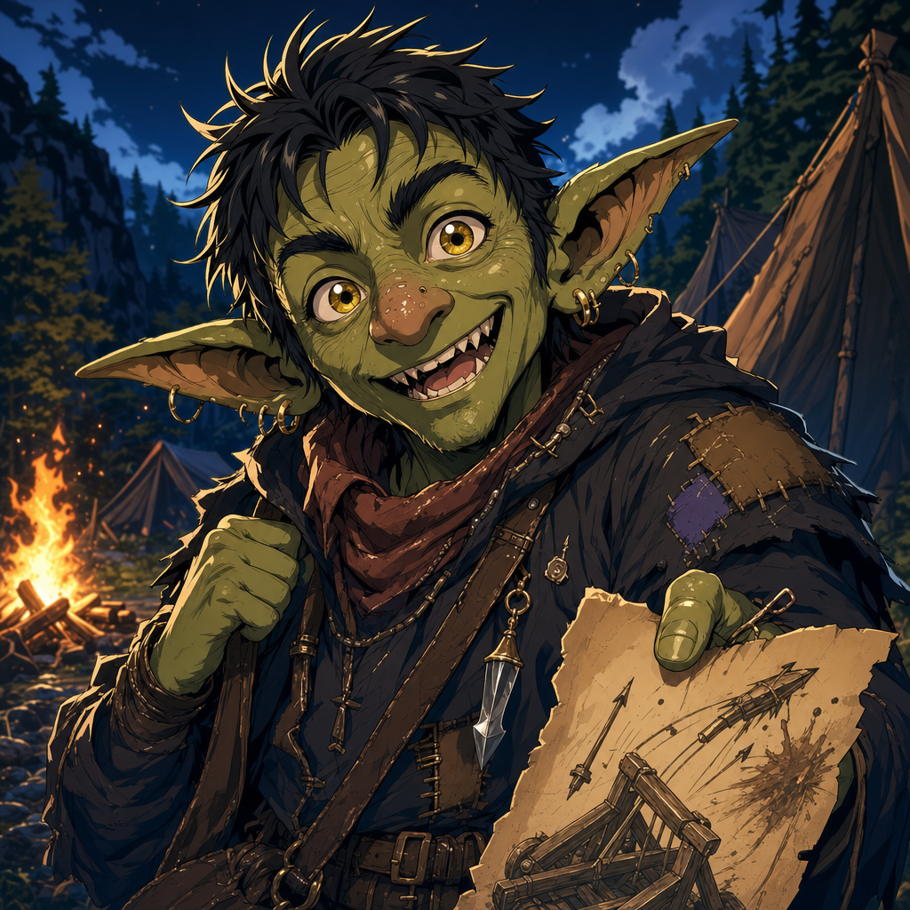

# Yuckie the Goblin

## One-Line Summary
Lachlan Pratt's goblin character, a camp informant or party-adjacent companion who tells Dain absurd but useful stories.

## Table Role
- Role: Player Character.
- Player: Lachlan Pratt.
- DM: Tom.

## Status
- [Character-only] [Confirmed] Yuckie told Dain that Kagrenac tried to fire him from a ballista during camp.
- [Confirmed] User roster identifies Yuckie as Lachlan Pratt's player character on 2026-05-03.
- [Inferred] [To verify] The 2026-05-30 shared session says Lachlan's old character was captured by a gargantuan vulture-type creature; because the roster previously listed Lachlan as Yuckie's player, this may refer to Yuckie.
- [To verify] Yuckie's in-world party role, current location, long-term loyalty, and how long Dain has known him.

## What Dain Knows
- [Character-only] Yuckie is willing to bring Dain odd, actionable social information.
- [Character-only] Dain treats Yuckie's nonsense as potentially meaningful rather than disposable.

## What The Party Knows
- [To verify] Whether the whole party knows Yuckie gave Dain the ballista story.

## What Is Uncertain
- [To verify] Whether Yuckie is in-world treated as a full party member, follower, local contact, prisoner, scout, or recurring camp presence.
- [To verify] Whether the ballista incident was dangerous, comedic, consensual, or some mixture best not inspected too closely.
- [To verify] Whether Yuckie was the character captured by the gargantuan vulture-type creature before Ollyander arrived.

## Description
- Goblin.
- [Inferred] Likely expressive, resilient, and accustomed to camp chaos.

## Notable Events
- 2026-04-18: Yuckie tells Dain that Kagrenac tried to fire him from a ballista while the party was in camp. [Session 2026-04-18](../../Adventures/2026-04-18.md)
- 2026-05-30: Lachlan's previous character was reported captured by a gargantuan vulture-type creature when [Ollyander](./Ollyander.md) arrived. This may refer to Yuckie, but the identity is [To verify]. [Session 2026-05-30](../../Adventures/2026-05-30.md)

## Related Entries
- [Dain Truthammer](./Dain%20Truthammer.md)
- [Kagrenac](./The%20Astral%20Elf.md)
- [Ollyander](./Ollyander.md)
- [Relationships](../../Character/Relationships.md)
- [Session 2026-04-18](../../Adventures/2026-04-18.md)
