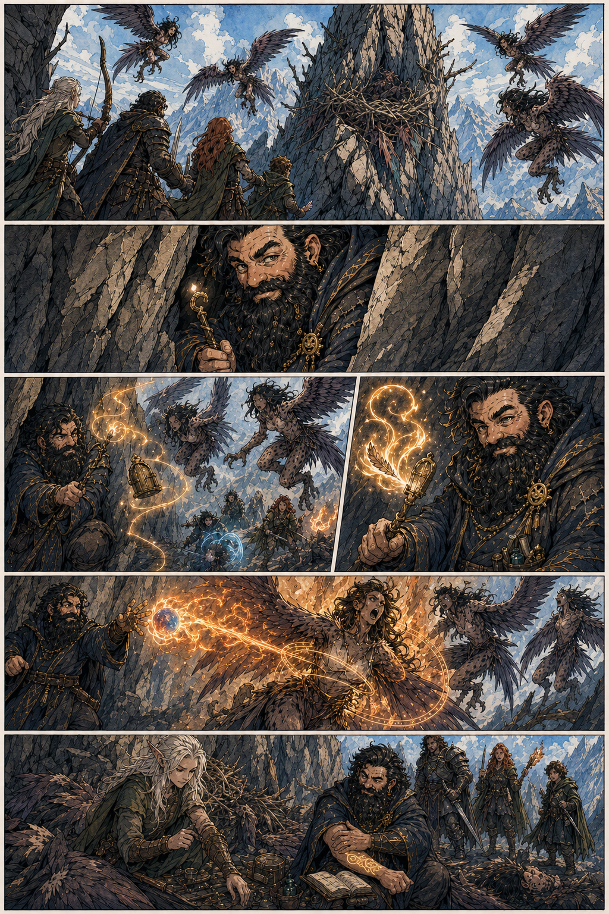

# Harpy Nest Battle

## One-Line Summary
The party defeats five harpies at a mountain nest after Dain hides in the stone, lures enemies with minor magic, and burns an alpha harpy under `Suggestion`.

## Status
- [Party] [Confirmed] Occurred on 2026-04-18.
- [Party] [Confirmed] The party defeats the harpies.
- [Party] [Confirmed] The party recovers a `Ghostly Form Tattoo`.

## Key Beats
- The party spots five harpies around a high mountain nest.
- Dain hides in cracks in the mountain wall.
- Dain uses `Minor Illusion` and `Prestidigitation` to draw harpies past his concealed position.
- Dain immolates an alpha harpy with `Chromatic Orb` and grease, then uses `Suggestion` to make it sit and burn.
- The Astral Elf kills Dain's suggested target before the party can exploit the enchantment further.
- The party recovers the `Ghostly Form Tattoo`.

## Uncertain Details
- [To verify] Exact source of the grease.
- [To verify] Whether `Chromatic Orb` used Dain's Magic Initiate cast or a spell slot.
- [To verify] Full loot from the nest beyond the tattoo.

## Related Entries
- [Harpy Nest Near Samyrn Torst](../Places/Harpy%20Nest%20Near%20Samyrn%20Torst.md)
- [Ghostly Form Tattoo](../Items/Ghostly%20Form%20Tattoo.md)
- [The Astral Elf](../Characters/The%20Astral%20Elf.md)
- [Dain Truthammer](../Characters/Dain%20Truthammer.md)
- [Session 2026-04-18](../../Adventures/2026-04-18.md)
