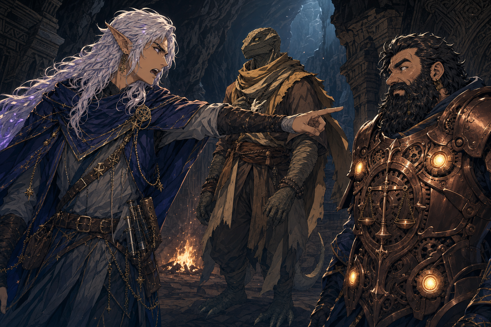

# Kagrenac's Murder Accusation

## One-Line Summary
After a long rest in the hidden tunnel, Kagrenac declares that he no longer trusts Dain Truthammer and accuses him of murdering a dwarf tied to Dain's century-old escape.

## Status
- [Party] [Confirmed] Occurs on 2026-07-11 at or near the far end of the hidden tunnel beneath the Truthhammer mountain route.
- [Party] [Confirmed] Kagrenac says he no longer trusts Dain and accuses him of murder.
- [To verify] The dead dwarf's name, exact evidence, and the illegible notebook reference to studded cold leather.
- [To verify] Whether the death was murder, a great accident, or something else.
- [DM-private] [Confirmed DM clarification] The armor Kagrenac is using as evidence would not realistically have belonged to Dain's missing friend.
- [DM-private] [Inferred] The armor more likely belonged to a different dwarf who later went searching for the missing friend.
- [Character-only] [Confirmed on 2026-07-11] Dain warns his father, the leader of the Truthammer clan, about the moon elf's accusations while reporting the events that brought the party to the mountain.

## Immediate Context
- The party has moved through the hidden tunnel and completed a long rest.
- During the rest, Dain told Brother Taleesh that a friend helped him escape Truthhammer Mountain through these tunnels about one hundred years ago.
- Dain said the friend sacrificed himself to pursuing troopers.
- Dain also apologized to Taleesh over the dice game and completed the Sauna Pelt.
- After entering the mountain, Dain reports the journey to his father and explicitly warns him about the moon elf's accusations. [To verify exact account and father's response]

## Accusation
- Kagrenac declares that he no longer trusts Dain.
- Kagrenac accuses Dain of murdering a dwarf.
- A natural `1` leads to the possibility that Dain did not commit murder but that a great accident occurred. [To verify who rolled, what check was made, and what the result established]

## Evidence Clarification
- The armor does not realistically connect the corpse directly to Dain's missing friend. [Confirmed DM clarification]
- The leading interpretation is that an unknown second dwarf went searching for the friend after he disappeared and is the more likely owner of the armor. [DM-private] [Inferred]
- This weakens any simple claim that the armored corpse is the friend Dain abandoned or killed, but it does not yet establish how the searching dwarf died.

## Open Questions
- Who is the armored dwarf who apparently went searching for Dain's missing friend?
- Who was Dain's missing friend, and what happened after he sacrificed himself to the troopers?
- What is Kagrenac's evidence?
- What happened in these tunnels one hundred years ago?
- Who were the pursuing troopers, and whom did they serve?
- What does the notebook's studded cold leather line mean?
- Does Kagrenac accuse Dain of killing the later searcher, causing the searcher's accident, abandoning the original friend, or concealing the history?

## Related Entries
- [Dain Truthammer](../Characters/Dain%20Truthammer.md)
- [Kagrenac](../Characters/The%20Astral%20Elf.md)
- [Brother Taleesh](../Characters/Brother%20Taleesh.md)
- [Hidden Tunnel Near Truthhammer Mountain](../Places/Hidden%20Tunnel%20Near%20Truthammer%20Mountain.md)
- [Why Dain Left Home](../Lore/Dain%20Background%20Evasions/Why%20He%20Left%20Home.md)
- [Past Trouble And Regrets](../Lore/Dain%20Background%20Evasions/Past%20Trouble%20And%20Regrets.md)
- [Session 2026-07-11](../../Adventures/2026-07-11.md)
