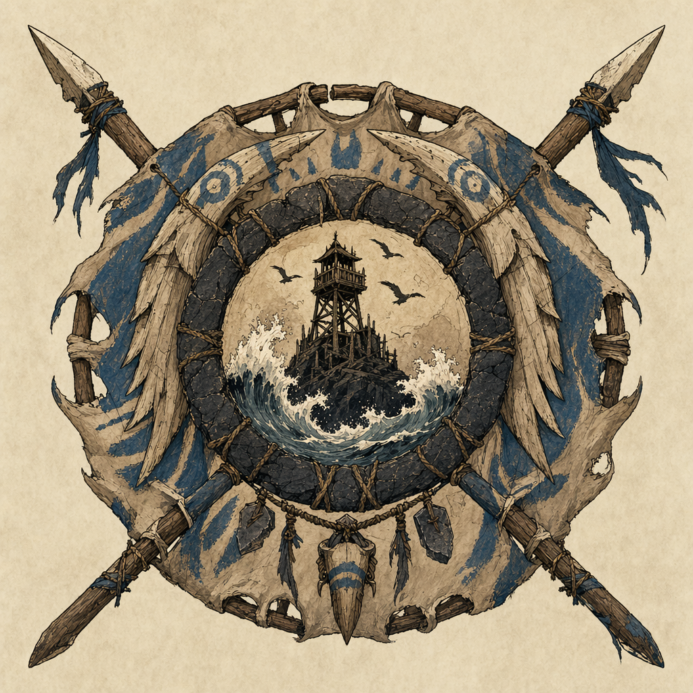

# Iron Shore Tribes

## One-Line Summary
Coastal tribes associated with the watchtower where Dain meets the party.

## Status
- [Party] [Confirmed] The session opens near the watchtower of the Iron Shore Tribes.
- [To verify] Tribal names, leaders, alliances, customs, symbols, and relationship with Lerdar.

## What Dain Knows
- [Party] The Iron Shore Tribes are tied to the coastal region where the party converges.
- [To verify] Whether Dain has prior knowledge of them.

## What Is Uncertain
- [To verify] Whether they are allies, neutral locals, military partners, a confederation, or a broader regional culture.

## Description
- A coastal tribal presence on a harsh shoreline of surf, rock, and watch-signs.

## Notable Events
- 2026-04-18: Dain meets the party near the watchtower of the Iron Shore Tribes. [Session 2026-04-18](../../Adventures/2026-04-18.md)

## Related Entries
- [Iron Shore Watchtower](../Places/Iron%20Shore%20Watchtower.md)
- [Session 2026-04-18](../../Adventures/2026-04-18.md)
