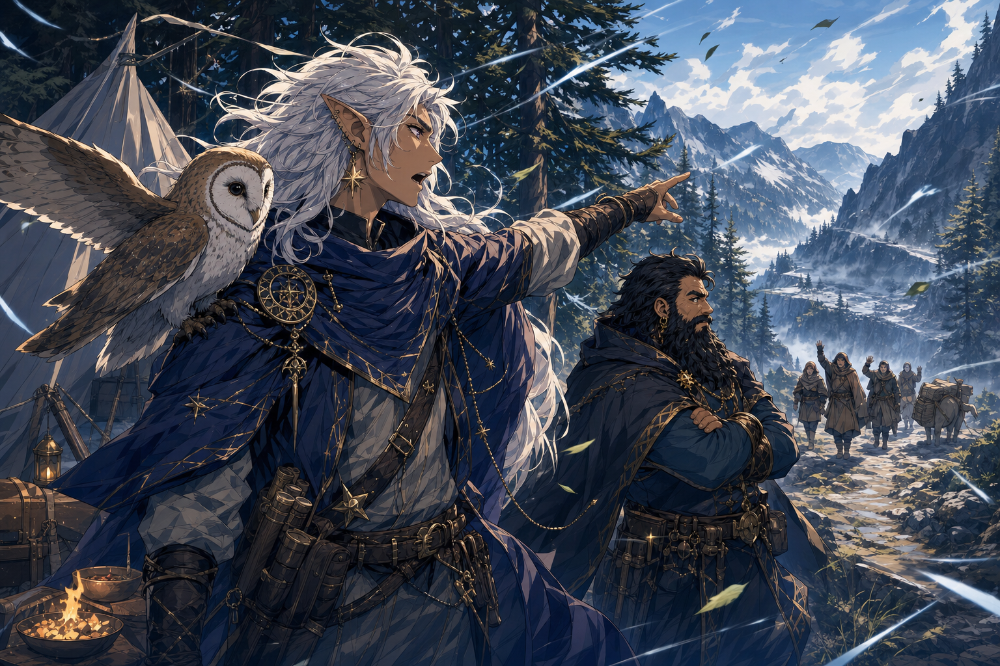
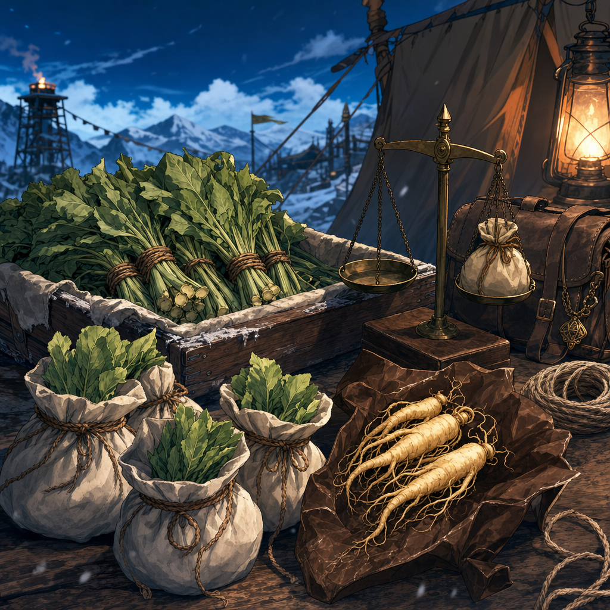

# Southern Human Traders

## One-Line Summary
An unnamed group of human traders from the south who approach the party in cold mountain winds while seeking the way to [Olar Dunglor](../Places/Olar%20Dunglor.md).

## Status
- [Party] [Confirmed] First encountered on 2026-05-03 at the forested mountain camp after the long rest.
- [Party] [Confirmed] They speak Common.
- [Party] [Confirmed] They identify themselves as traders from the south.
- [Party] [Confirmed] They are looking for the way to [Olar Dunglor](../Places/Olar%20Dunglor.md).
- [Party] [Confirmed] Dain rolls a natural `20` on Persuasion to convince them to trust the party and come with them.
- [Party] [Confirmed] Dain delegates cost-setting to [Hammerton Harry Drizddon](../Characters/Hammerton%20Harry%20Drizddon.md) and requests half payment upfront.
- [Party] [Confirmed] The arrangement is half now, half later; the upfront half is paid into [Party Loot](../../Character/Party%20Loot.md) as [Burdock](../Items/Burdock.md) x10 oz and [Ginseng](../Items/Ginseng.md) x2 oz.
- [Character-only] [Confirmed] [Kagrenac](../Characters/The%20Astral%20Elf.md) tells Dain in Draconic that the newcomers are all glowing in magic. Detection source [To verify].
- [Party] [Confirmed] One human trader sighs and pulls out the [Coal Mine Puppet](../Items/Coal%20Mine%20Puppet.md).
- [Party] [Confirmed] The [Coal Mine Puppet](../Items/Coal%20Mine%20Puppet.md) bites Dain when he begins praying to [Garl Glittergold](../Lore/Garl%20Glittergold.md).
- [Party] [Confirmed] Dain realizes the puppet is a cobalt puppet, and the puppet says, "[Kurtlemack](../Lore/Kurtlemack.md) hates you."
- [Party] [Confirmed] After Hammerton / Dresden asks for more because the puppet was not part of the original negotiation, Dain keeps the original deal and adds five truthful answers owed upon delivery.
- [Party] [Confirmed] During the goblin camp negotiation, the humans who initially refuse to enter the goblin camp and break bread are convinced to enter with the party and break bread with the goblins; the party, humans, and goblins begin cooking breakfast together around the campfire.
- [Party] [Confirmed] During the manticore encounter, the [Manticore on the Forest Road](../Characters/Manticore%20on%20the%20Forest%20Road.md) attacks the traders under the party's protection.
- [Party] [Confirmed] The human holding the [Coal Mine Puppet](../Items/Coal%20Mine%20Puppet.md) takes `11` damage from the manticore.
- [Party] [Confirmed] A second manticore descends and attacks the other human trader with bites and slashes for around `20` total damage.
- [Party] [Confirmed] On 2026-05-30, three travelling humans follow behind while the party leads north-east along the river into colder country.
- [Party] [Confirmed] After Dain denies [Kurtlemack](../Lore/Kurtlemack.md) tribute from four winter wolves' deaths, the [Coal Mine Puppet](../Items/Coal%20Mine%20Puppet.md) stabs Dain and nearly drops him to `1 HP`.
- [Party] [Confirmed on 2026-07-11] In a truth-for-truth exchange, the traders reveal that their true goal is to establish new trade and ask Dain about the nature of the Truthammer mountain.
- [Party] Dain answers their questions and the Coal Mine Puppet's mine question by revealing that the mountain contains one of the richest mines in the land.
- [Party] [To verify] The humans restrain "him" afterward; whether this means the puppet, Dain, or both is unclear.
- [To verify] Names, exact number of traders, goods and services intended for the new trade, desired partners, route, authority, honesty, threat level, whether they already knew or suspected the mine, whether they know anything about the party's mission, and the exact later half of the payment.

## What Dain Knows
- [Party] They approach from the distance at the start of the new day.
- [Party] Their opening greeting is directed at "dwarves."
- [Party] They ask for directions to [Olar Dunglor](../Places/Olar%20Dunglor.md), a lake high in the mountains.
- [Party] Dain persuades them to trust the party and come with them, rolling a natural `20`.
- [Party] Dain wants half the agreed cost paid upfront and has delegated the final cost to [Hammerton Harry Drizddon](../Characters/Hammerton%20Harry%20Drizddon.md).
- [Party] The party receives the upfront half as [Burdock](../Items/Burdock.md) x10 oz and [Ginseng](../Items/Ginseng.md) x2 oz, worth `5 gp` equivalent, stored in [Party Loot](../../Character/Party%20Loot.md).
- [Character-only] Kagrenac tells Dain in Draconic that all the newcomers glow with magic.
- [Party] One trader carries or presents the [Coal Mine Puppet](../Items/Coal%20Mine%20Puppet.md); Dain's attempted `Identify` fails or is blocked. [To verify resource cost]
- [Party] The puppet bites Dain as he begins praying to [Garl Glittergold](../Lore/Garl%20Glittergold.md); Dain does not know why. [To verify damage and trigger]
- [Character-only] Dain recognizes it as a cobalt puppet.
- [Party] The puppet invokes [Kurtlemack](../Lore/Kurtlemack.md)'s hatred.
- [Party] Dain defuses Hammerton / Dresden's attempt to ask for more by preserving the original deal and adding five truthful answers due upon delivery.
- [Party] The traders who initially resist entering the goblin camp and breaking bread are convinced to follow the party in and share breakfast around the campfire with the goblins.
- [Party] The trader holding the [Coal Mine Puppet](../Items/Coal%20Mine%20Puppet.md) is wounded for `11` damage by the [Manticore on the Forest Road](../Characters/Manticore%20on%20the%20Forest%20Road.md).
- [Party] Another human trader is bitten and slashed by a second manticore for around `20` total damage.
- [Party] On 2026-05-30, the humans follow behind as the party leads north-east along the river into a cold area.
- [Party] After Dain denies Kurtlemack tribute and is stabbed by the puppet, the humans restrain "him." [To verify whether they restrained the puppet, Dain, or both]
- [Party] The traders' underlying purpose is to establish new trade; they ask Dain about the mountain's nature and learn from him that it contains one of the richest mines in the land.
- [To verify] Whether Dain recognizes their route, dialect, trade marks, clothing, or destination.

## What The Party Knows
- [Party] They are human traders from the south.
- [Party] They are seeking [Olar Dunglor](../Places/Olar%20Dunglor.md).
- [Party] They arrive as cold winds begin and [Kagrenac](../Characters/The%20Astral%20Elf.md) warns conditions will worsen.
- [Party] After Dain's natural `20` Persuasion check, they are being invited to trust the party and travel with them.
- [Party] The escort or guidance payment is half now, half later.
- [Party] The "half now" payment is [Burdock](../Items/Burdock.md) x10 oz and [Ginseng](../Items/Ginseng.md) x2 oz, held as [Party Loot](../../Character/Party%20Loot.md).
- [Party] One of the traders produces the [Coal Mine Puppet](../Items/Coal%20Mine%20Puppet.md), and the puppet speaks in a high voice about being taken back to the coal mines.
- [Party] The puppet bites Dain during his prayer to [Garl Glittergold](../Lore/Garl%20Glittergold.md).
- [Party] The puppet says, "[Kurtlemack](../Lore/Kurtlemack.md) hates you."
- [Party] The final visible deal remains the original payment structure, plus five truthful answers owed upon delivery.
- [Party] Some or all of the traders initially do not want to enter the goblin camp and break bread, but are convinced to do so with the party; they join the campfire breakfast with the goblins. [To verify exact dissenters and who persuaded them]
- [Party] The manticore attacks the traders during the forest-road encounter, dealing `11` damage to the human holding the Coal Mine Puppet.
- [Party] A second manticore attacks the other human trader for around `20` total damage.

## What Is Uncertain
- [To verify] Whether they are lost, truthful, desperate, bait, or ordinary traders.
- [To verify] Whether Olar Dunglor intersects with the party's route toward the mountain general near [Samyrn Torst](../Lore/Samyrn%20Torst.md).
- [To verify] Exact later half of the payment, collection timing, who physically carries the upfront herbs, exact delivery trigger for the five truthful answers, and whether Olar Dunglor changes the party's route or obligations.
- [To verify] Why all the newcomers appear to be glowing with magic, what the [Coal Mine Puppet](../Items/Coal%20Mine%20Puppet.md) is, why it bit Dain during prayer, what [Kurtlemack](../Lore/Kurtlemack.md) means to the traders or puppet, and whether the traders control it, fear it, owe it, or are burdened by it.
- [To verify] The wounded puppet-holder's name, current HP, wound severity, whether the puppet is damaged or reacting, the other wounded human's name/current HP, exact damage, and whether either manticore targeted a trader for a reason.

## Payment

- Upfront half received now:
  - [Burdock](../Items/Burdock.md) x10 oz at `1 sp/oz`; total `10 sp`.
  - [Ginseng](../Items/Ginseng.md) x2 oz at `2 gp/oz`; total `4 gp`.
- Total upfront value: `5 gp` equivalent.
- Storage: [Party Loot](../../Character/Party%20Loot.md). Current carrier [To verify].
- Later half: owed by the traders; exact contents and value [To verify].
- Addendum after the puppet reveal: the original material payment stays intact, and upon delivery the traders owe the party five truthful answers. Delivery target, exact asker, and enforcement are [To verify].
- 2026-07-11 truth exchange: [To verify] whether the traders' admission about seeking trade counts as one of the five truthful answers, represents a separate reciprocal bargain, or occurs before the earlier debt formally comes due.
- Draft 2026-05-30 puppet questions: chain of custody, what the puppet is, which coal mines it wants and what waits there, what happens if it is returned/destroyed/abandoned/stolen/kept away, and why it reacted to Garl Glittergold / Kurtlemack / "you." [To verify final wording asked in play]

## Notable Events
- 2026-05-03: The traders approach the party from the distance and say in Common, "Hi dwarves. Hail, we are traders from the south, we are looking for our way to Olar Dunglor." [Session 2026-05-03](../../Adventures/2026-05-03.md)
- 2026-05-03: Dain rolls a natural `20` on Persuasion to convince the traders to trust the party and come with them; he delegates cost-setting to Hammerton Harry Drizddon and requests half paid upfront. [Session 2026-05-03](../../Adventures/2026-05-03.md)
- 2026-05-03: The arrangement is clarified as half now, half later; the upfront half is paid as [Burdock](../Items/Burdock.md) x10 oz and [Ginseng](../Items/Ginseng.md) x2 oz into [Party Loot](../../Character/Party%20Loot.md). [Session 2026-05-03](../../Adventures/2026-05-03.md)
- 2026-05-03: Kagrenac privately warns Dain in Draconic that the newcomers are glowing with magic; a human trader sighs and produces the [Coal Mine Puppet](../Items/Coal%20Mine%20Puppet.md), which blocks or prevents Dain's attempted `Identify` and speaks of being taken back to the coal mines. [Session 2026-05-03](../../Adventures/2026-05-03.md)
- 2026-05-03: The [Coal Mine Puppet](../Items/Coal%20Mine%20Puppet.md) bites Dain as he begins praying to [Garl Glittergold](../Lore/Garl%20Glittergold.md); Dain does not know why. [Session 2026-05-03](../../Adventures/2026-05-03.md)
- 2026-05-03: Dain realizes the puppet is a cobalt puppet, and it says, "[Kurtlemack](../Lore/Kurtlemack.md) hates you." [Session 2026-05-03](../../Adventures/2026-05-03.md)
- 2026-05-03: Hammerton / Dresden asks for more because the original negotiation did not account for the puppet; Dain defuses the escalation by preserving the original deal and adding five truthful answers due upon delivery. [Session 2026-05-03](../../Adventures/2026-05-03.md)
- 2026-05-03: During the goblin camp negotiation, the humans who initially refuse to enter the camp and break bread are convinced to enter with the party and break bread with the goblins; the party, humans, and goblins begin cooking breakfast together around the campfire. [Session 2026-05-03](../../Adventures/2026-05-03.md)
- 2026-05-03: During the forest-road manticore encounter, the manticore attacks the traders under the party's protection and deals `11` damage to the human holding the [Coal Mine Puppet](../Items/Coal%20Mine%20Puppet.md). [Session 2026-05-03](../../Adventures/2026-05-03.md)
- 2026-05-03: A second manticore descends from the sky and bites and slashes the other human trader for around `20` total damage. [Session 2026-05-03](../../Adventures/2026-05-03.md)
- 2026-05-30: The three travelling humans follow behind while the party leads north-east along the river into a cold area. [Session 2026-05-30](../../Adventures/2026-05-30.md)
- 2026-05-30: After Dain denies Kurtlemack tribute from the winter wolves' deaths, the [Coal Mine Puppet](../Items/Coal%20Mine%20Puppet.md) stabs him nearly to `1 HP`; the humans restrain "him" afterward. [Session 2026-05-30](../../Adventures/2026-05-30.md) [To verify restraint target]
- 2026-07-11: The traders exchange a truth with Dain, revealing that their real aim is to establish new trade. They ask about the mountain and hear Dain state that it contains one of the richest mines in the land. [Session 2026-07-11](../../Adventures/2026-07-11.md) [To verify intended trade and five-truth accounting]

## Related Entries
- [Olar Dunglor](../Places/Olar%20Dunglor.md)
- [Kagrenac](../Characters/The%20Astral%20Elf.md)
- [Dain Truthammer](../Characters/Dain%20Truthammer.md)
- [Hammerton Harry Drizddon](../Characters/Hammerton%20Harry%20Drizddon.md)
- [Party Loot](../../Character/Party%20Loot.md)
- [Burdock](../Items/Burdock.md)
- [Ginseng](../Items/Ginseng.md)
- [Coal Mine Puppet](../Items/Coal%20Mine%20Puppet.md)
- [Manticore on the Forest Road](../Characters/Manticore%20on%20the%20Forest%20Road.md)
- [Garl Glittergold](../Lore/Garl%20Glittergold.md)
- [Kurtlemack](../Lore/Kurtlemack.md)
- [Truthhammer Mountains](../Places/Truthhammer%20Mountains.md)
- [Open Threads](../Lore/Open%20Threads.md)
- [Session 2026-05-03](../../Adventures/2026-05-03.md)
- [Session 2026-05-30](../../Adventures/2026-05-30.md)
