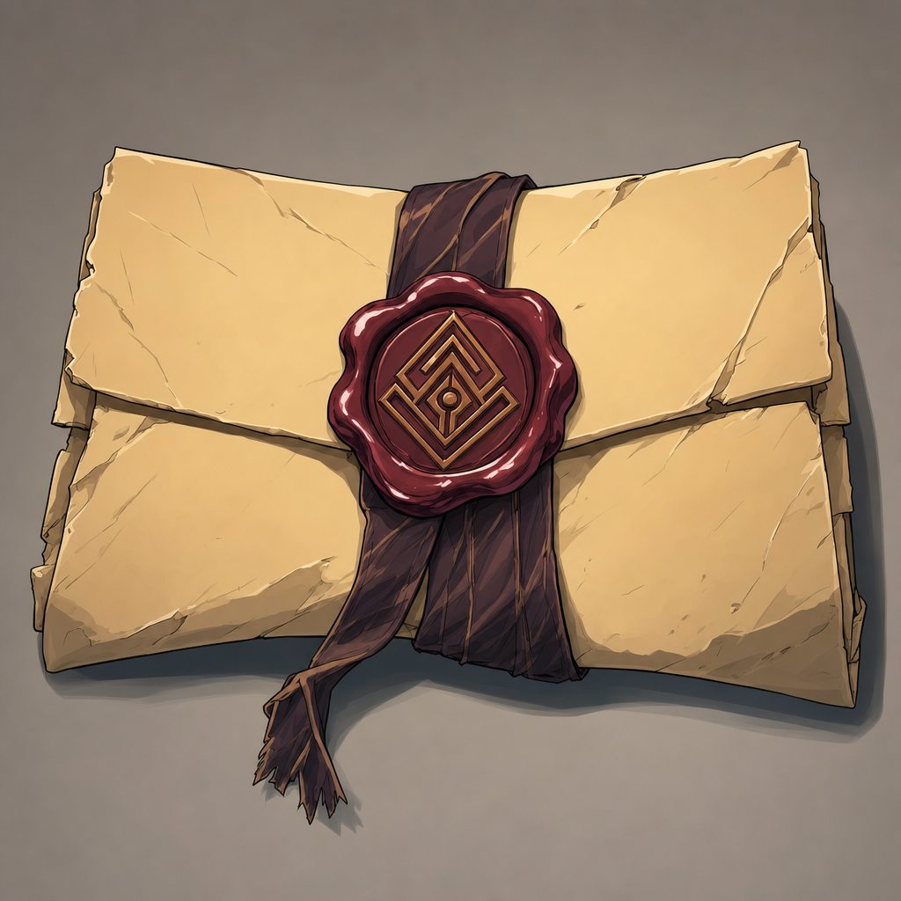

# Agland's Sealed Letter

## One-Line Summary
A sealed letter Commander Agland gives the party to deliver to the actual general in a mountain settlement.

## Status
- [Party] [Confirmed] Commander Agland gives the party a new sealed letter on 2026-04-18.
- [Party] [Confirmed] The letter is meant for the actual general in a settlement in the mountains.
- [To verify] Who carries the letter, what seal marks it, whether it is magical, and what it says.

## What Dain Knows
- [Character-only] Dain knows the party has promised or agreed to carry the letter onward.
- [Character-only] Dain does not yet know the original news the party brought to Agland.
- [Character-only] The 2026-06-20 town errands, dice conflict, rat problem, and sack delivery are all local business; the letter remains the clearest formal mission thread unless Tom confirms the party has completed or paused it.

## What The Party Knows
- [Party] The letter must be delivered to the actual general near Samyrn Torst.

## What Is Uncertain
- [To verify] The general's name.
- [To verify] The mountain settlement's name.
- [To verify] Whether the letter is urgent, secret, dangerous, magically sealed, or politically sensitive.
- [To verify] Who physically carries the letter during the 2026-06-20 town session and whether the unnamed town is on the intended route.

## Dain-Facing Live Use
- Before leaving the unnamed town, confirm the carrier, seal integrity, destination, urgency, and route.
- If local errands threaten to delay the party, Dain can frame the choice plainly: help the town without losing the letter's purpose.
- Do not open, identify, trade, pledge, or use the letter as leverage unless the party and Tom make clear that doing so is allowed.

## Notable Events
- 2026-04-18: Commander Agland gives the party the sealed letter after hearing their report. [Session 2026-04-18](../../Adventures/2026-04-18.md)

## Related Entries
- [Commander Agland](../Characters/Commander%20Agland.md)
- [Lerdar](../Places/Lerdar.md)
- [Samyrn Torst](../Lore/Samyrn%20Torst.md)
- [Open Threads](../Lore/Open%20Threads.md)
