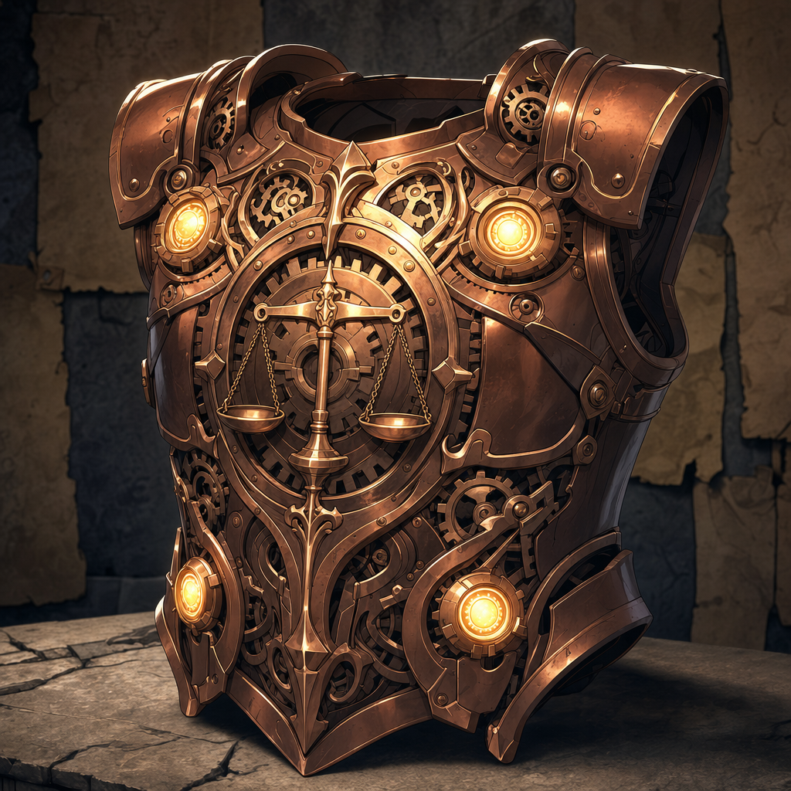
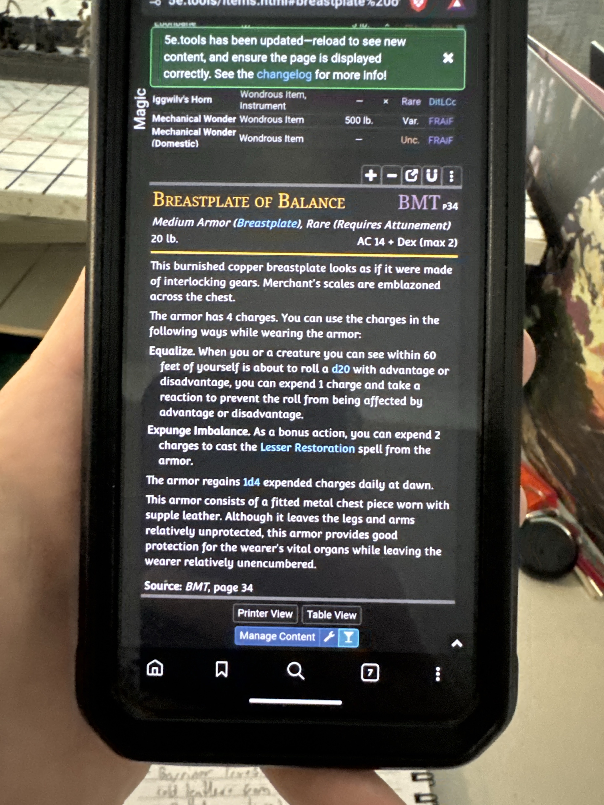

# Breastplate of Balance

## One-Line Summary
A rare copper-and-clockwork breastplate that spends magical charges to flatten advantage or disadvantage and correct bodily afflictions.

## Status
- [Character-only] [Confirmed by user on 2026-07-11] Dain owns the Breastplate of Balance.
- [Confirmed] Published magic item from *The Book of Many Things*, page 34.
- [Confirmed] Medium armor (breastplate), rare, requires attunement, `20 lb.`
- [Character-only] [Confirmed by user on 2026-07-11] Dain received it when the party killed the harpies on 2026-04-18.
- [To verify] Who currently carries it, whether Dain is wearing it, and whether he is attuned.
- [Character-only] [Confirmed by user on 2026-07-11] Dain is proficient/trained in medium armor.

## Appearance
- Burnished copper construction resembling interlocking gears.
- Merchant's balance scales emblazoned across the chest.
- A fitted metal chest piece worn with supple leather, leaving the limbs comparatively free.

## Armor Class
- Base AC: `14 + DEX modifier`, to a maximum Dexterity contribution of `+2`.
- Dain's recorded Dexterity modifier is `+0`, so his AC would be `14` while wearing it.
- The item does not itself grant a magical AC bonus beyond the normal breastplate calculation.

## Charges
- Maximum charges: `4`.
- Recharge: regains `1d4` expended charges each day at dawn.

### Equalize
- Trigger: Dain or a creature he can see within `60 ft.` is about to make a d20 roll with advantage or disadvantage.
- Cost: `1` charge and Dain's reaction.
- Effect: the roll is made normally, without advantage or disadvantage.
- Tactical use: cancel an enemy's advantage, remove an ally's disadvantage, or neutralize an unwanted advantage when a normal roll is preferable.

### Expunge Imbalance
- Cost: `2` charges and a bonus action.
- Effect: casts `Lesser Restoration` from the armor.
- Typical uses: end one disease or one condition affecting a creature: Blinded, Deafened, Paralyzed, or Poisoned, subject to the table's spell version.

## Suitability For Dain
- Dain is proficient/trained in medium armor, so he can wear the breastplate and continue casting wizard spells.
- With `DEX +0`, it raises his passive AC from the recorded unarmored `10` to `14`.
- `Mage Armor` would provide only AC `13` with `DEX +0` and cannot be combined with worn armor, so the breastplate is the stronger passive defense and saves a 1st-level spell slot when Mage Armor would otherwise be used.
- The breastplate does not impose disadvantage on Stealth checks and has no Strength requirement under the standard breastplate rules.
- Attunement remains required. Dain currently has no confirmed competing attuned item, although the [Ghostly Form Tattoo](./Ghostly%20Form%20Tattoo.md)'s attunement requirement is still [To verify].

## Tactical Assessment
- [Inferred] Strong recommendation: wear and attune unless Dain already has three more valuable attuned items or needs to conceal the conspicuous copper armor.
- `Equalize` is the main combat value: use it to remove a dangerous enemy's advantage or an ally's disadvantage before the d20 is rolled.
- Preserve at least `2` charges when disease, poison, paralysis, blindness, or deafness is a plausible threat so `Expunge Imbalance` remains available.
- The reaction cost competes with any other reaction options Dain gains, but no major competing reaction spell is currently recorded on his sheet.

## Source Evidence

- User-provided table reference photo received on 2026-07-11.
- The original baseline character-sheet PDF does not list this item, so the user's correction takes precedence for campaign continuity.
- Campaign-style reference render completed on 2026-07-11 as `Breastplate_of_Balance_ref.png`.

## Notable Events
- 2026-04-18: Dain receives the Breastplate of Balance after the party kills the harpies near the mountain route toward Samyrn Torst. [Confirmed by user on 2026-07-11] [Session 2026-04-18](../../Adventures/2026-04-18.md)

## Related Entries
- [Dain Truthammer](../Characters/Dain%20Truthammer.md)
- [Inventory](../../Character/Inventory.md)
- [Current State](../../Character/Current%20State.md)
- [Harpy Nest Battle](../Events/Harpy%20Nest%20Battle.md)
