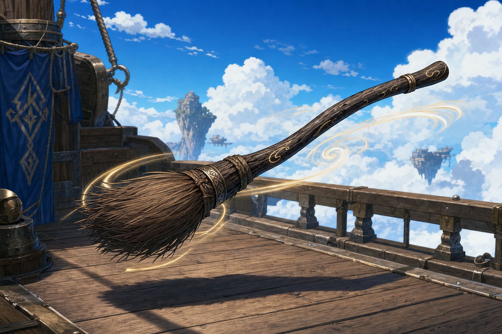

# Flying Broom

## One-Line Summary
Dain Truthammer's newly acquired magical broom, confirmed capable of flight but otherwise mechanically unidentified.

## Status
- [Character-only] [Confirmed on 2026-08-29] Dain owns the flying broom.
- [To verify] Source, giver or place found; whether it is the standard 2014 magic item `Broom of Flying`; command word; flight speed; carrying capacity; autonomous travel or recall; attunement; current stowage; and whether Dain has ridden it.
- [Inferred visual only] The reference art interprets it as a sturdy dark-wood broom with bound natural bristles and subtle wind magic. Its canonical appearance has not been verbally established.

## What Dain Knows
- The broom can fly.
- It came into Dain's possession after the party destroyed two `crymeria` attacking the southbound balloon skyship.

## Ownership And Location
- Owner: Dain Truthammer.
- Current location: With Dain or aboard the party skyship [To verify exact stowage].
- Attunement: [To verify].

## Notable Events
- 2026-08-29: Dain acquires the flying broom after the southbound skyship encounter. The source and transaction are not yet recorded. [Session 2026-08-29](../../Adventures/2026-08-29.md)

## Related Entries
- [Dain Truthammer](../Characters/Dain%20Truthammer.md)
- [Party Skyship](../Places/Party%20Skyship%20-%202026-08-29.md)
- [Crymeria Attackers](../Characters/Crymeria%20Attackers%20-%202026-08-29.md)
- [Inventory](../../Character/Inventory.md)
- [Session 2026-08-29](../../Adventures/2026-08-29.md)
