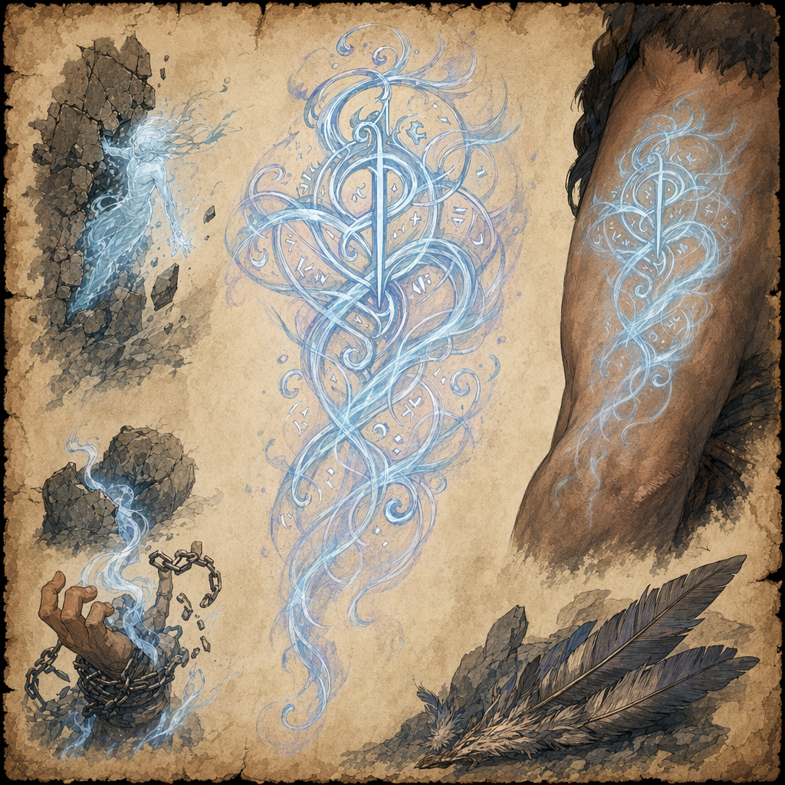

# Ghostly Form Tattoo

## One-line Summary
A magical tattoo that grants temporary incorporeal movement and spectral resilience when a charge is spent.

## Status
- [Confirmed] Dain Truthammer received the tattoo as the harpy-fight reward on 2026-04-18. [Retcon] User correction recorded 2026-05-03.
- [Confirmed] The Astral Elf did not receive or wear this tattoo.
- [To verify] Total charges, recharge timing, duration, attunement requirement, exact rules wording, and whether Dain has applied it yet.

## What Dain Knows
- [Character-only] Dain received this tattoo as his reward after the harpy fight.
- [Character-only] While the tattoo is on the skin, one charge can be spent to become incorporeal.
- [Character-only] For the duration, the bearer gains resistance to bludgeoning attacks.
- [Character-only] For the duration, the bearer cannot be grappled or restrained.
- [Character-only] For the duration, the bearer can move through creatures and solid objects as though they were difficult terrain.
- [Character-only] If the bearer moves through a solid object, the bearer takes `1d10` damage and is moved to an available space.

## What Is Uncertain
- [To verify] How many charges the tattoo has in total.
- [To verify] How and when its charges recharge.
- [To verify] How long the incorporeal state lasts.
- [To verify] Whether the resistance is to bludgeoning damage generally or only to bludgeoning from attacks.
- [To verify] Whether the item requires attunement.
- [To verify] Whether Dain has already applied the tattoo and where it appears on his body.

## Acquisition
- 2026-04-18: Dain Truthammer received the `Ghostly Form Tattoo` after the party defeated the harpies near their mountain nest. [Party] [Confirmed] [Retcon] User correction recorded 2026-05-03.

## Related Entries
- [Session 2026-04-18](../../Adventures/2026-04-18.md)
- [Harpy Nest Battle](../Events/Harpy%20Nest%20Battle.md)
- [Inventory](../../Character/Inventory.md)
