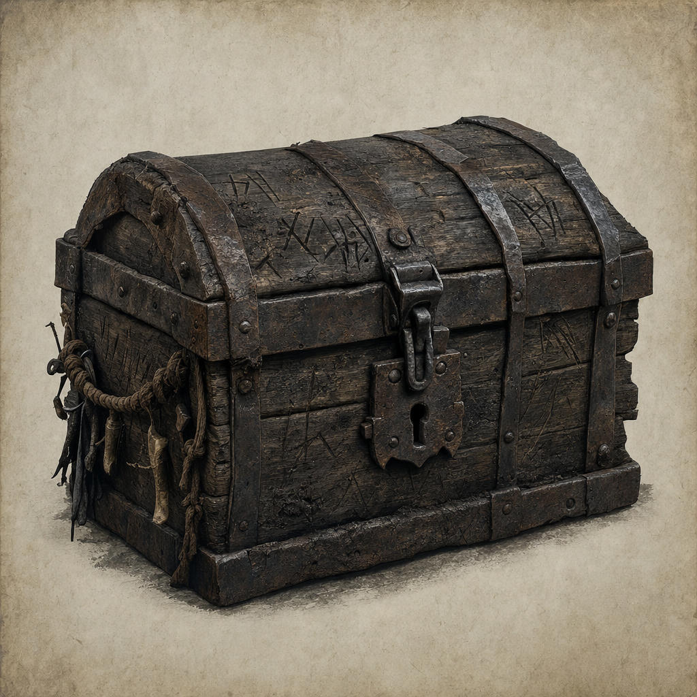

# Goblin Camp Chest

## One-line summary
A chest stolen from the goblin camp while the goblins were under the influence of the styx / sytxweed potion.

## Status
- [Party] [Confirmed] On 2026-05-03, the party leaves the goblin camp while the goblins are under the influence of the styx / sytxweed potion.
- [Party] [Confirmed] The moon elf and the fighter dwarf steal a chest from the goblins during the exit. [To verify whether "moon elf" refers to Kagrenac and "fighter dwarf" refers to Hammerton Harry Drizddon]
- [Party] [Confirmed] The moon elf and Norhan open the chest and find `500 gp` plus a [Mask of Changed Appearance](./Mask%20of%20Changed%20Appearance.md).
- [To verify] Lock/trap status, ownership markings, magical aura, weight, carrier, and whether the hobgoblin leader notices.

## What The Party Knows
- [Party] The chest came from the goblin camp.
- [Party] It was taken while the goblins were memory-impaired by the styx / sytxweed effect.
- [Party] Contents: `500 gp` and a [Mask of Changed Appearance](./Mask%20of%20Changed%20Appearance.md).

## Notable Events
- 2026-05-03: As the party walks out of the goblin camp, the moon elf and fighter dwarf steal this chest from the goblins while the goblins are under the influence of the styx / sytxweed potion. [Session 2026-05-03](../../Adventures/2026-05-03.md)
- 2026-05-03: The moon elf and Norhan open the chest and find `500 gp` plus a [Mask of Changed Appearance](./Mask%20of%20Changed%20Appearance.md). [Session 2026-05-03](../../Adventures/2026-05-03.md)

## Related entries
- [Kagrenac](../Characters/The%20Astral%20Elf.md)
- [Hammerton Harry Drizddon](../Characters/Hammerton%20Harry%20Drizddon.md)
- [Sytxweed Plant](./Sytxweed%20Plant.md)
- [Mask of Changed Appearance](./Mask%20of%20Changed%20Appearance.md)
- [Party Loot](../../Character/Party%20Loot.md)
- [Session 2026-05-03](../../Adventures/2026-05-03.md)
