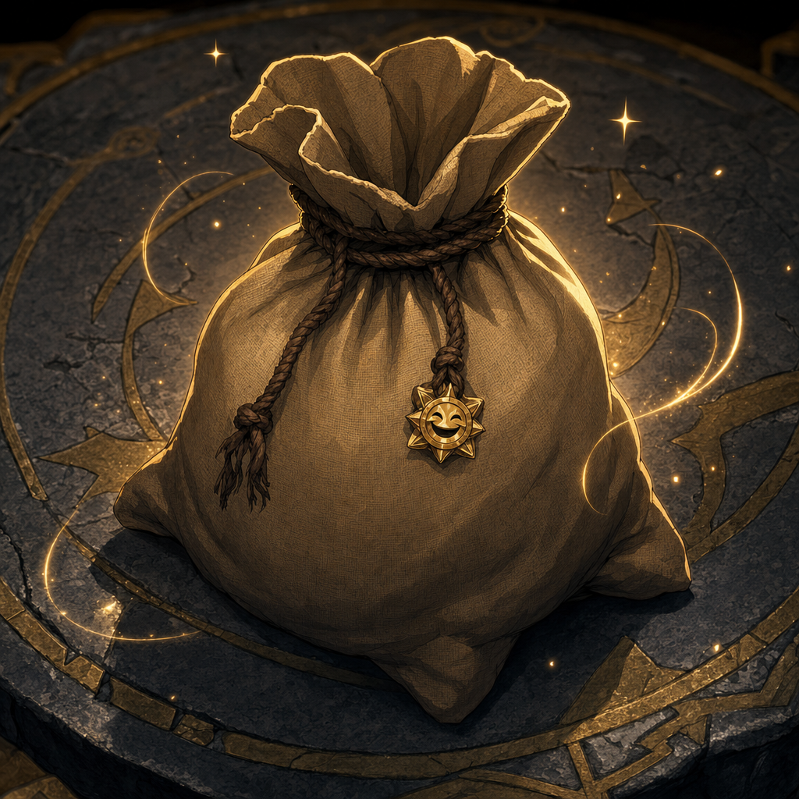

# Half-Pound Sack From Glittergold Gnomes

## One-Line Summary
A small half-pound sack received by [Dain Truthammer](../Characters/Dain%20Truthammer.md) from local Glittergold-worshipping gnomes after he gave `1 gp` each to six of them.

## Status
- [Party] [Confirmed] Received on 2026-06-20 during the session titled [Glittergold Road](../../Adventures/2026-06-20.md).
- [Party] [Confirmed] Dain received it from local gnomes who worship Glittergold after donating `1 gp` to each of six gnomes found in a building.
- [Character-only] [Confirmed] Dain intends to take or give the sack to a local church, possibly connected to Gond, a forge faith, Garl, or another local tradition. Exact church identity is [To verify].
- [To verify] Contents, material, markings, carrier, intended recipient, religious meaning, and whether the sack is magical.

## What Dain Knows
- [Character-only] Dain was trying to embody "interesting, but essentially useless" by giving gold to Glittergold-worshipping gnomes.
- [Character-only] The sack was given back to him after that donation, making it more than ordinary shopping or loose loot.
- [Character-only] His safest current play is to inspect it respectfully, ask what custom he has entered, and avoid opening or spending it before understanding its intended recipient.

## What The Party Knows
- [Party] Dain received a half-pound sack from the local Glittergold-worshipping gnomes.
- [Party] Dain recorded an action item to find the local church and give the bag to it.
- [To verify] Whether the rest of the party saw the exchange clearly, knows the intended church, or knows the sack exists.

## What Is Uncertain
- [To verify] Whether the gnomes worship [Garl Glittergold](../Lore/Garl%20Glittergold.md) specifically or a local Glittergold-associated tradition.
- [To verify] Whether the local church is dedicated to [Garl Glittergold](../Lore/Garl%20Glittergold.md), Gond, another forge or gnome faith, or a mixed shrine.
- [To verify] Whether the sack contains coin, grain, incense, forge ash, medicine, a joke object, a test, a holy offering, a contract token, or something stranger.
- [To verify] Whether the sack should be opened, delivered sealed, blessed, weighed, identified, or presented with specific words.

## Dain-Facing Live Use
- Ask Tom whether Religion, History, Arcana, smell, stitching, weight, sound, or visible symbols give Dain a read before opening it.
- If taking it to the church, phrase the handoff as a question first: "What offering has been put in my hands, and to whom is it owed?"
- Do not spend a Coal Mine Puppet truthful answer on the sack unless the sack or church reveals a direct connection to the puppet, [Kurtlemack](../Lore/Kurtlemack.md), cobalt, tribute, or the dangerous religious pattern.

## Notable Events
- 2026-06-20: Dain tries to find 10 gnomes who worship Glittergold, finds six in a building, gives each `1 gp`, receives a half-pound sack in return, and records an action item to find the church and give the bag to it. [Session 2026-06-20](../../Adventures/2026-06-20.md)

## Related Entries
- [Dain Truthammer](../Characters/Dain%20Truthammer.md)
- [Garl Glittergold](../Lore/Garl%20Glittergold.md)
- [Kurtlemack](../Lore/Kurtlemack.md)
- [Coal Mine Puppet](./Coal%20Mine%20Puppet.md)
- [Inventory](../../Character/Inventory.md)
- [Open Threads](../Lore/Open%20Threads.md)
- [Session 2026-06-20](../../Adventures/2026-06-20.md)
