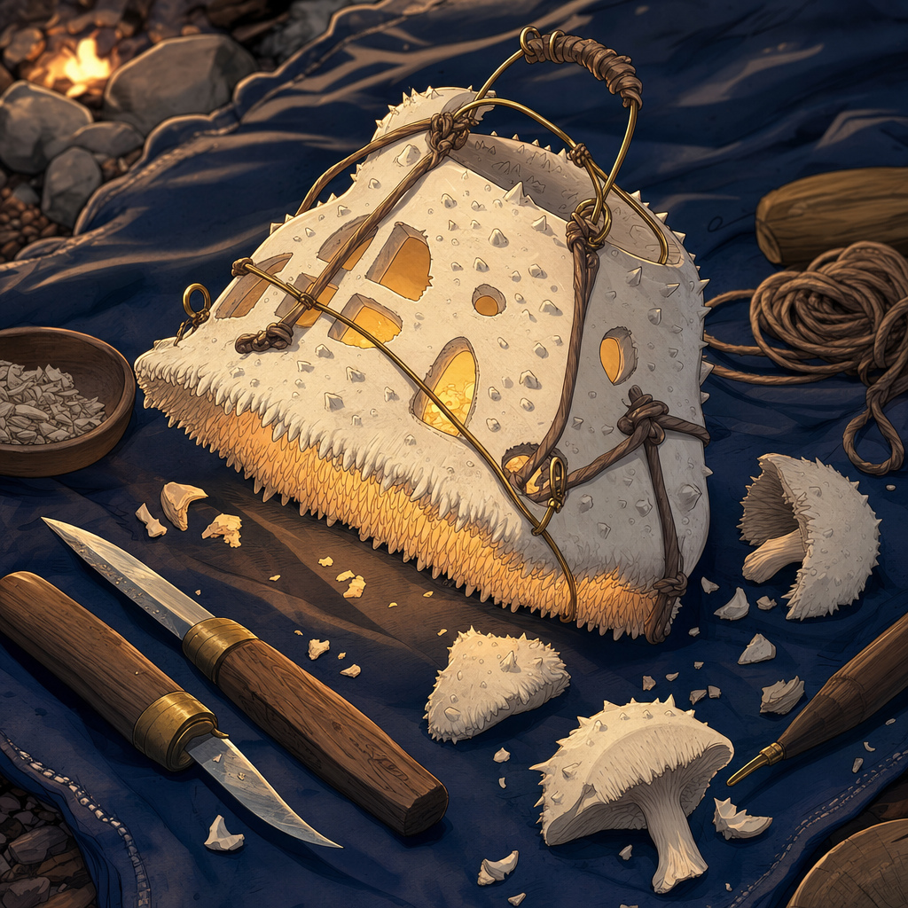

# Hedgehog Mushroom Lantern

## One-Line Summary
An in-progress lantern Dain begins crafting from one pound of hedgehog mushroom given by [Brother Taleesh](../Characters/Brother%20Taleesh.md), inspired by [The Festival Of Completely Unnecessary Lanterns](../Lore/Truthammer%20Tales/The%20Festival%20Of%20Completely%20Unnecessary%20Lanterns.md).

## Status
- [Party] [Confirmed] Begun on 2026-05-03 at the forest camp.
- [Party] Material: one pound of hedgehog mushroom from [Taleesh's Herbal Stash](./Taleeshs%20Herbal%20Stash.md).
- [Party] Dain hollows the mushroom out and begins creating a lantern from the story.
- [Party] [Confirmed] During the goblin toll encounter, Dain offers the lantern to the goblin leader as something delicious to eat.
- [Party] [Confirmed] The goblin leader begins eating the lantern and takes `4` fire damage.
- [Party] [Confirmed] Dain's `Suggestion` on the goblin leader does not fail from that damage because Dain was not directly causing it.
- [To verify] Whether the lantern is completed before being eaten, whether any remains survive, whether it was functional or magical, and whether it is safe or edible afterward.

## What Dain Knows
- [Character-only] Dain is turning Taleesh's gift into a visible follow-through on the lantern-making offer.
- [Character-only] The project ties the warmth bargain to a shared piece of absurd craft rather than only a spoken promise.
- [Character-only] Dain uses the lantern as an edible offering in the goblin toll negotiation, paired with `Suggestion`: "Allow us safe passage, a meal, and a way through."

## What The Party Knows
- [Party] Taleesh gave Dain one pound of hedgehog mushroom.
- [Party] Dain hollowed it out and began making a lantern from the festival story.
- [Party] Dain gives the lantern to the goblin leader as food during the toll encounter.
- [Party] The goblin leader takes `4` fire damage while eating it.

## Description
- Large pale hedgehog mushroom being hollowed into a lantern body.
- Inspired by impossible mountain festival lanterns.
- Intended to become a small camp object of warmth, trust, and ridiculous craftsmanship.
- [To verify] Light source, fuel, frame, handle, and whether Dain uses magic to stabilize it.
- [To verify] Which component or light source caused the `4` fire damage when eaten.

## Notable Events
- 2026-05-03: Brother Taleesh gives Dain one pound of hedgehog mushroom; Dain hollows it out and begins creating this lantern from [The Festival Of Completely Unnecessary Lanterns](../Lore/Truthammer%20Tales/The%20Festival%20Of%20Completely%20Unnecessary%20Lanterns.md). [Session 2026-05-03](../../Adventures/2026-05-03.md)
- 2026-05-03: Dain offers the lantern to the goblin leader as food while casting `Suggestion`: "Allow us safe passage, a meal, and a way through." The goblin leader begins eating it, takes `4` fire damage, and the `Suggestion` does not fail because Dain was not directly causing the damage. [Session 2026-05-03](../../Adventures/2026-05-03.md)

## Related Entries
- [Dain Truthammer](../Characters/Dain%20Truthammer.md)
- [Brother Taleesh](../Characters/Brother%20Taleesh.md)
- [Taleesh's Herbal Stash](./Taleeshs%20Herbal%20Stash.md)
- [The Festival Of Completely Unnecessary Lanterns](../Lore/Truthammer%20Tales/The%20Festival%20Of%20Completely%20Unnecessary%20Lanterns.md)
- [Inventory](../../Character/Inventory.md)
- [Open Threads](../Lore/Open%20Threads.md)
