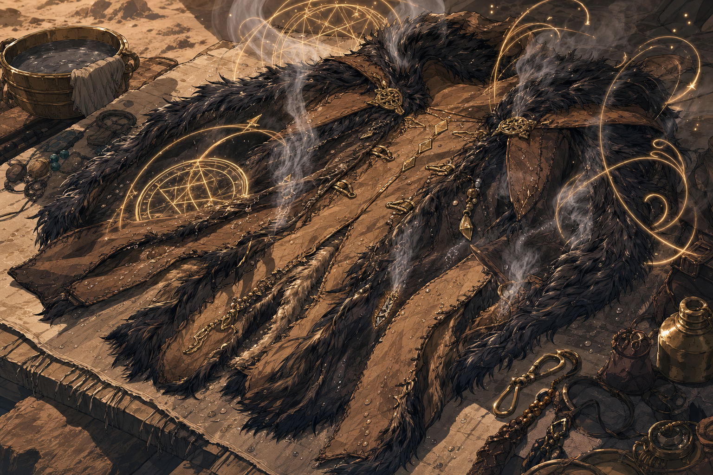

# Sauna Pelt

## One-Line Summary
A completed wet-heat jacket belonging to Brother Taleesh: warm in any cold environment, damp enough to make the area smell like female white-wolf piss, and currently awaiting retrieval from a town where it was left behind.

## Status
- [Character-only] [Confirmed] Begun during the 2026-05-30 session from a good-quality large pelt provided by [Brother Taleesh](../Characters/Brother%20Taleesh.md).
- [Character-only] [Confirmed] Taleesh asked Dain to make the pelt into always-warm leather.
- [Character-only] [Confirmed] Dain accepted with creative freedom, constraints, and his own spin.
- [Character-only] [Confirmed] Working names include `Sauna Pelt` and `The Warmth That Forgot Manners`.
- [Character-only] [Confirmed] Dain recorded `84%` progress using knowledge from the [Always-Cold Robes](./Always-Cold%20Robes.md) and the earlier `6%` always-warm garment attempt.
- [Character-only] [Confirmed] Dain completed the Sauna Pelt during the 2026-07-11 long rest.
- [Character-only] [Confirmed] The finished pelt is always warm in any cold environment.
- [Party] [Confirmed] The finished jacket's wetness makes the surrounding area smell like female white-wolf piss.
- [Party] [Confirmed on 2026-07-11] Taleesh graciously accepts the completed jacket and loves it.
- [Party] [Confirmed on 2026-07-11] Taleesh accepted and carried/wore the item; Dain no longer carries it.
- [Party] [Confirmed on 2026-08-29] The jacket remains Taleesh's gift and property, but it was left behind in a town. Dain and Taleesh intend to return eventually to retrieve it. The exact town and storage location are [To verify].
- [Party] [Retcon / specificity] The final odor is specifically female white-wolf piss, and it affects the surrounding area rather than only the pelt itself.
- [Character-only] [To verify] The 2026-06-20 notebook goal calls the project "Sauna Jacket"; this is currently treated as shorthand or an alternate name for the Sauna Pelt until confirmed otherwise.
- [To verify] What final resources were spent, whether the item requires attunement, and the odor's effective radius.
- [To verify] Whether this is a magic item, spell prototype, mundane craft with magical treatment, or unstable experimental object.

## What Dain Knows
- [Character-only] A straightforward always-warm leather was requested, but the result is becoming something more Dain-shaped.
- [Character-only] The completed pelt remains wet and keeps its wearer warm in cold environments.
- [Party] Its wetness makes the surrounding area smell like female white-wolf piss.
- [Party] Taleesh loves the result.
- [Character-only] Earlier research risked escalating damp warmth into dangerous or lethal steam. Whether that risk remains in the completed version is [To verify].
- [Character-only] The earlier `6%` warm-garment work was recovered or converted into this new project.
- [Character-only] The Always-Cold Robes taught Dain something useful about temperature magic from the wrong direction.

## What The Party Knows
- [Party] Taleesh gave Dain a good-quality large pelt and asked for always-warm leather. [To verify who else was listening]
- [To verify] Whether Taleesh knows the current design may become dangerously hot if uncontrolled.

## What Is Uncertain
- [To verify] Whether completion added a safety mechanism such as vents, limits, a release flap, command word, or temperature ceiling.
- [To verify] Exact mechanical meaning of "always warm in any cold environment" and of the persistent wetness.
- [To verify] Whether it still creates steam, inflicts heat/scalding, causes a formal Wet condition, resists fire, or interacts with cold/fire/lightning damage.
- [To verify] Whether it requires attunement, charges, concentration, a rest reset, or crafting checks.
- [Confirmed] Taleesh wants and loves the Dain-style finished jacket.

## Description
- Base material: good-quality large pelt from Brother Taleesh.
- Finished traits: damp hide, reliable warmth in cold environments, and an area-filling smell of female white-wolf piss.
- Earlier design direction: sealed warmth cycle, steam buildup, and dangerous over-warmth. [To verify what survived completion]
- Thematic link: a sibling problem to [Truthammer's Leaky Tent](../Powers/Truthammer%20Leaky%20Tent.md), which already weaponizes inconvenient wetness.

## Notable Events
- 2026-05-30: Taleesh gives Dain a good-quality large pelt and asks for always-warm leather. [Session 2026-05-30](../../Adventures/2026-05-30.md)
- 2026-05-30: Dain frames the project as a Sauna Pelt: wet first, then warm, then steam, then potentially lethal if warmth is not persuaded to stop. [Session 2026-05-30](../../Adventures/2026-05-30.md)
- 2026-05-30: Dain reaches `84%` completion by applying knowledge from the Always-Cold Robes and recovering the abandoned `6%` warm-jacket progress. [Session 2026-05-30](../../Adventures/2026-05-30.md) [To verify DM acceptance]
- 2026-06-20: Notebook goals include completing the "Sauna Jacket," currently treated as this Sauna Pelt project unless later corrected. [Session 2026-06-20](../../Adventures/2026-06-20.md)
- 2026-07-11: Dain completes the Sauna Pelt during the long rest. Its finished notes say it is always warm in any cold environment and its wetness smells like wolf piss. [Session 2026-07-11](../../Adventures/2026-07-11.md)
- 2026-07-11: Taleesh graciously accepts and loves the finished Sauna Jacket. He now carries/wears it, and the surrounding area smells like female white-wolf piss. [Session 2026-07-11](../../Adventures/2026-07-11.md)
- 2026-07-11: Truthammer gate guards tell Taleesh he must wash because of the jacket's piss smell. Dain accepts responsibility, invokes the dwarven god [Tharrd Harr](../Lore/Tharrd%20Harr.md)'s post-victory smell, succeeds on Persuasion, and gets the party through without Taleesh washing first. [Session 2026-07-11](../../Adventures/2026-07-11.md)
- 2026-08-29: User clarification establishes that the jacket was left behind in a town. It still belongs to Taleesh, and Dain and Taleesh need to return eventually to retrieve it. Exact town and storage location are [To verify]. [Session 2026-08-29](../../Adventures/2026-08-29.md)

## Related Entries
- [Dain Truthammer](../Characters/Dain%20Truthammer.md)
- [Brother Taleesh](../Characters/Brother%20Taleesh.md)
- [Always-Cold Robes](./Always-Cold%20Robes.md)
- [Truthammer's Leaky Tent](../Powers/Truthammer%20Leaky%20Tent.md)
- [Inventory](../../Character/Inventory.md)
- [Spellbook](../../Character/Spellbook.md)
- [Open Threads](../Lore/Open%20Threads.md)
- [Session 2026-05-30](../../Adventures/2026-05-30.md)
- [Session 2026-06-20](../../Adventures/2026-06-20.md)
- [Session 2026-07-11](../../Adventures/2026-07-11.md)
