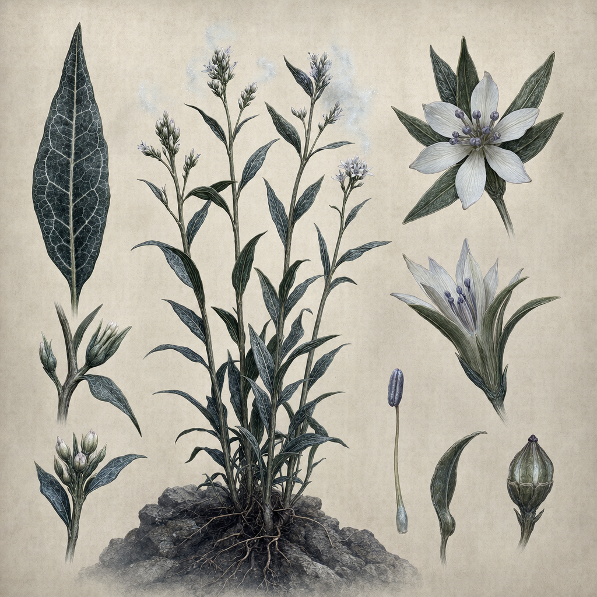

# Sytxweed Plant

## One-line summary
A plant used by Kagrenac to poison shared food so the goblins forget about the party.

## Status
- [Party] [Confirmed] On 2026-05-03, [Kagrenac](../Characters/The%20Astral%20Elf.md) / Matt poisons the shared food in the goblin camp with sytxweed.
- [Party] [Confirmed] The goblins eat the poisoned food and forget about the party.
- [Party] [Confirmed] The leader remains charmed and is happy the party is there for now.
- [To verify] Exact spelling: recorded from the live table note as `sytxweed`.
- [To verify] Exact mechanics, dose, saving throw, duration, poison type, and whether the effect is magical, alchemical, mundane, or plant toxin.

## What The Party Knows
- [Party] Sytxweed can be used in shared food to make goblins forget about the party.
- [Party] The effect did not break Dain's active charm on the leader in this instance.

## Notable Events
- 2026-05-03: Kagrenac poisons the shared goblin-camp food with sytxweed; the goblins eat and forget about the party, while the leader remains charmed and happy the party is present. [Session 2026-05-03](../../Adventures/2026-05-03.md)

## Related entries
- [Kagrenac](../Characters/The%20Astral%20Elf.md)
- [Dain Truthammer](../Characters/Dain%20Truthammer.md)
- [Taleesh's Herbal Stash](./Taleeshs%20Herbal%20Stash.md)
- [Session 2026-05-03](../../Adventures/2026-05-03.md)
