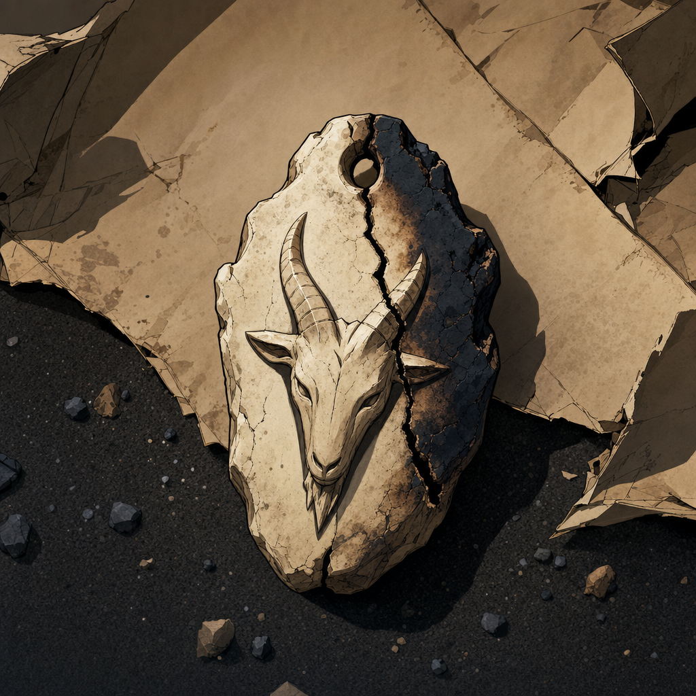

# Taleesh's Bone Charm

## One-Line Summary
A charred, cracked bone charm carved like a goat's head, the only remnant Brother Taleesh recovered after elven fire destroyed his oasis and tribe.

## Status
- [Confirmed] Player-provided backstory and sheet notes establish this as Brother Taleesh's ruined trinket.
- [Confirmed] The charm is a simple carving of a goat's head, scorched black on one side and cracked.
- [To verify] Whether the charm is purely sentimental, religious, magical, or tied to any surviving tribal practice.

## What Dain Knows
- [To verify] Whether Dain has seen the charm or knows what it means.

## What Brother Taleesh Knows
- It is the only named remnant from the oasis after elven fire destroyed his tribe.
- It anchors his memory of his people, his goats, his mother, and the moment the sky burned.

## Description
- Small bone charm.
- Goat-head carving.
- Scorched black on one side.
- Cracked through the bone.
- Carried by Brother Taleesh after the loss of his tribe and monastery.

## Notable Events
- 2026-05-03: Added to the Codex during Brother Taleesh's onboarding.

## Related Entries
- [Brother Taleesh](../Characters/Brother%20Taleesh.md)
