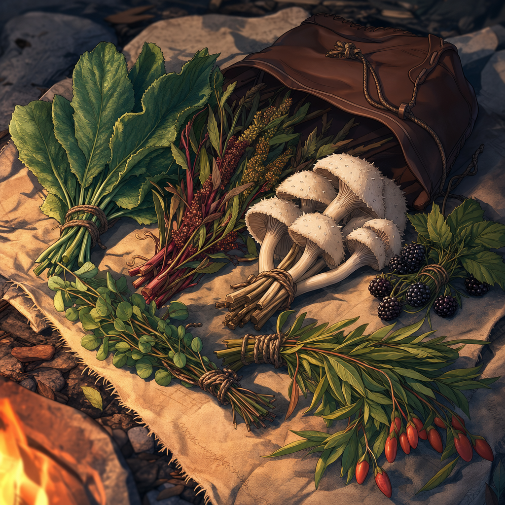

# Taleesh's Herbal Stash

## One-Line Summary
A practical collection of foraged or traded herbs and foods carried by [Brother Taleesh](../Characters/Brother%20Taleesh.md), first offered to the party during his forest-camp arrival.

## Status
- [Confirmed] Brother Taleesh's sheet lists hedgehog mushroom, wild blackberry, pigweed, comfrey, sheep sorrel, and goji leaves among his foraged or trade goods.
- [Party] On 2026-05-03, Taleesh produced herbal items from his stash and offered comfrey, pigweed, and hedgehog mushroom to the party.
- [Party] Taleesh then mentioned goji leaves, said "the first one is free," and claimed taking one would make the taker "feel like a god."
- [Party] Dain refused the goji leaves and said the Truthhammers do not alter themselves in such ways.
- [Party] Taleesh gave Dain one pound of hedgehog mushroom, which Dain immediately began hollowing into a [Hedgehog Mushroom Lantern](./Hedgehog%20Mushroom%20Lantern.md).
- [Party] During the goblin toll encounter on 2026-05-03, Taleesh covertly passed one goji leaf and one gold piece to a goblin through a firm, angled handshake on neutral ground.
- [To verify] Exact quantities, mechanical effects, preparation methods, spoilage, and whether the party accepts any of the items.
- [To verify] The sheet note says goji leaves have potent but addictive effects; exact rules, risk, and addiction mechanics are not yet confirmed.

## What Dain Knows
- [Party] Dain sees Taleesh reach into his stash and offer herbal items shortly after Dain lowers his staff and reassures him.
- [Character-only] Dain has heard Taleesh ask whether the party needs "some comfry," pig-weed, or hedgehog mushroom.
- [Character-only] Dain hears Taleesh claim goji leaves can make the taker "feel like a god."
- [Character-only] Dain refuses the goji leaves and frames that refusal as a Truthammer principle against altering himself in that way.
- [Character-only] Dain receives one pound of hedgehog mushroom and begins turning it into a lantern inspired by [The Festival Of Completely Unnecessary Lanterns](../Lore/Truthammer%20Tales/The%20Festival%20Of%20Completely%20Unnecessary%20Lanterns.md).
- [To verify] Whether Dain recognizes the herbs, knows their uses, suspects any risk, or notices Taleesh's hidden goji-leaf handoff to the goblin.

## What The Party Knows
- [Party] Taleesh carries practical herbal supplies and is willing to offer them during first contact.
- [Party] The offered items include comfrey, pigweed, and hedgehog mushroom.
- [Party] Taleesh also offers goji leaves with a free-sample pitch and a promise of godlike feeling.
- [Party] Dain refuses the goji leaves and suggests [Kagrenac](../Characters/The%20Astral%20Elf.md), "the young elf," may be interested.
- [Party] Taleesh gives Dain one pound of hedgehog mushroom, and Dain begins making a lantern from it.
- [Party] During the goblin toll encounter, Taleesh meets a goblin on neutral ground and passes one goji leaf with a gold piece through a covert handshake. [To verify whether all party members notice]
- [To verify] Whether the offer is hospitality, trade, field medicine, food, temptation, a test of trust, or some mixture of these.

## Contents
- Comfrey, spoken at the table as "comfry."
- Pigweed, spoken at the table as "pig-weed."
- Hedgehog mushroom. [Party] One pound given to Dain on 2026-05-03 for the [Hedgehog Mushroom Lantern](./Hedgehog%20Mushroom%20Lantern.md); remaining quantity [To verify].
- Wild blackberry. [To verify whether currently offered]
- Sheep sorrel. [To verify whether currently offered]
- Goji leaves. [Party] Offered with the claim "the first one is free" and that taking one makes the taker "feel like a god." One goji leaf is passed to a goblin during the 2026-05-03 toll encounter. Remaining quantity, effects, duration, risk, and addiction mechanics are [To verify].

## Notable Events
- 2026-05-03: Brother Taleesh produces herbal items from his stash at the forest camp and asks whether the party needs comfrey, pigweed, or hedgehog mushroom. [Session 2026-05-03](../../Adventures/2026-05-03.md)
- 2026-05-03: Taleesh offers goji leaves with the promise of godlike feeling; Dain refuses and says the Truthhammers do not alter themselves in such ways, then suggests Kagrenac may be interested. [Session 2026-05-03](../../Adventures/2026-05-03.md)
- 2026-05-03: Taleesh gives Dain one pound of hedgehog mushroom, which Dain hollows out to begin making a [Hedgehog Mushroom Lantern](./Hedgehog%20Mushroom%20Lantern.md). [Session 2026-05-03](../../Adventures/2026-05-03.md)
- 2026-05-03: During the goblin toll encounter, Taleesh hides a goji leaf in his palm and passes it with a gold piece to a goblin through a firm, angled handshake on neutral ground. [Session 2026-05-03](../../Adventures/2026-05-03.md)

## Related Entries
- [Brother Taleesh](../Characters/Brother%20Taleesh.md)
- [Kagrenac](../Characters/The%20Astral%20Elf.md)
- [Hedgehog Mushroom Lantern](./Hedgehog%20Mushroom%20Lantern.md)
- [Relationships](../../Character/Relationships.md)
- [Open Threads](../Lore/Open%20Threads.md)
