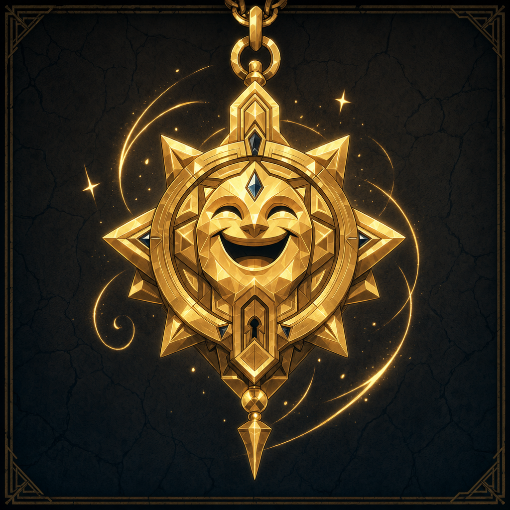

# Garl Glittergold

## One-Line Summary
Dain Truthammer's chosen deity, whose worship carries a real cost in his relationship to Truthammer mountain.

## Status
- [Confirmed] [Dain Truthammer](../Characters/Dain%20Truthammer.md) chose Garl Glittergold as his deity on 2026-04-18.
- [DM-private] [Character-only] [Confirmed] Dain is considered an outcast from [Truthammer mountain](../Places/Truthhammer%20Mountains.md) because of this faith.
- [To verify] Exact rites, symbols, clergy ties, prayers, and how public Dain is about this devotion.

## What Dain Knows
- [Character-only] This faith is important enough to shape Dain's identity, choices, and magical style.
- [Character-only] Cleverness, benevolent trickery, delight, and protective misdirection can all serve good ends.
- [Character-only] The faith is tied to his outcast status from home. [DM-private] [Confirmed]
- [Character-only] On 2026-05-03, Dain begins praying to Garl Glittergold in front of the [Coal Mine Puppet](../Items/Coal%20Mine%20Puppet.md), and the puppet bites him. Dain does not know why.
- [Character-only] Dain then realizes the puppet is a cobalt puppet, and it says, "[Kurtlemack](./Kurtlemack.md) hates you."

## What The Party Knows
- [To verify] Whether the party knows Dain follows Garl Glittergold.
- [To verify] Whether the party knows this faith made Dain an outcast from his mountain homeland.

## What Is Uncertain
- [To verify] Whether Dain's mountain home rejects Garl Glittergold generally, rejects Dain's particular form of worship, or rejects the social consequences of that worship.
- [To verify] Whether Dain has allies, mentors, rivals, or family members connected to this faith.
- [To verify] Whether the [Coal Mine Puppet](../Items/Coal%20Mine%20Puppet.md) reacted to prayer, Garl Glittergold's name or sigil, Dain personally, or something unrelated.
- [To verify] Whether [Kurtlemack](./Kurtlemack.md)'s hatred is directed at Garl Glittergold, Dain, Glittergold's faithful, dwarves, or someone else.

## Description
- For campaign continuity, Garl Glittergold is currently documented through Dain's relationship to the faith rather than broader cosmology.
- The symbolic motif should stay warm, golden, clever, protective, and slightly mischievous in Dain-related visuals.

## Notable Events
- 2026-04-18: Dain's deity was confirmed as Garl Glittergold.
- 2026-05-03: DM note recorded that Dain is considered an outcast from Truthammer mountain because of his faith in Garl Glittergold. [Session 2026-05-03](../../Adventures/2026-05-03.md)
- 2026-05-03: Dain begins praying to Garl Glittergold, and the [Coal Mine Puppet](../Items/Coal%20Mine%20Puppet.md) bites him for reasons Dain does not understand. [Session 2026-05-03](../../Adventures/2026-05-03.md)
- 2026-05-03: The puppet is recognized as cobalt and says, "[Kurtlemack](./Kurtlemack.md) hates you." [Session 2026-05-03](../../Adventures/2026-05-03.md)

## Related Entries
- [Dain Truthammer](../Characters/Dain%20Truthammer.md)
- [Coal Mine Puppet](../Items/Coal%20Mine%20Puppet.md)
- [Kurtlemack](./Kurtlemack.md)
- [Truthhammer Mountains](../Places/Truthhammer%20Mountains.md)
- [Relationships](../../Character/Relationships.md)
- [Current State](../../Character/Current%20State.md)
- [Open Threads](./Open%20Threads.md)
- [Campaign Visual Style Guide](../Images/Campaign%20Visual%20Style%20Guide.md)
