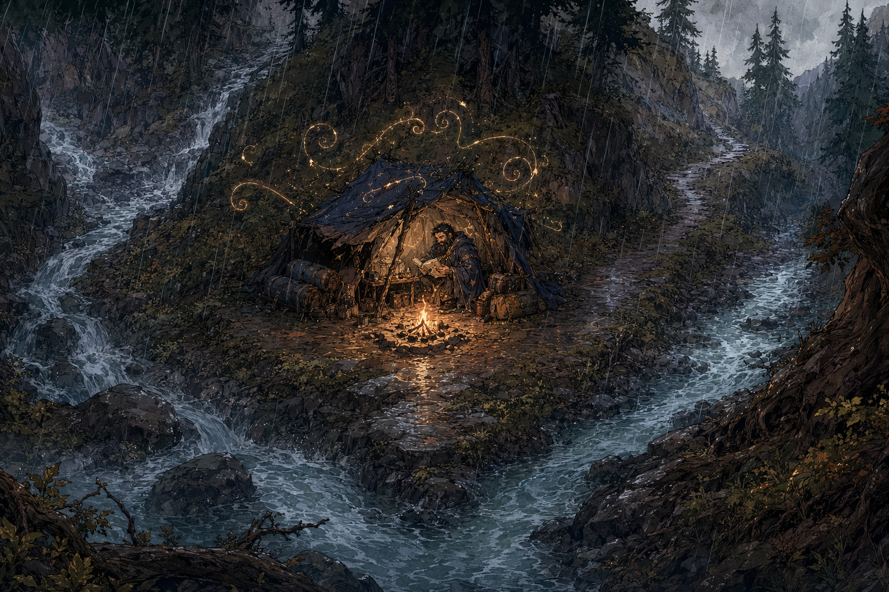

# Creek-Fork Camp

## One-Line Summary
A rainy Y-shaped creek confluence on the mountain road where Dain researches shelter magic and the party survives an ogre ambush.

## Status
- [Party] [Confirmed] The party reaches this Y-shaped confluence by the end of the second day on the mountain route.
- [Party] [Confirmed] Rain begins before or during the camp at this junction.
- [To verify] Which fork the party takes afterward.

## What Dain Knows
- [Character-only] Dain used Minor Conjuration to fashion shelter and Prestidigitation to light a fire here.
- [Character-only] Dain spent time here developing the anti-shelter spell that later became [Truthammer's Leaky Tent](../Powers/Truthammer%20Leaky%20Tent.md).
- [Party] Two ogres crossed the creek toward camp during Dain's watch.

## Description
- Two creeks meet in a Y shape where the mountain path splits.
- Rain, cold creek water, stone, and campfire light define the memory of the place.

## Notable Events
- 2026-04-18: Dain researches the anti-shelter spell here, reaching four total hours of progress. [Session 2026-04-18](../../Adventures/2026-04-18.md)
- 2026-04-18: Two ogres approach through the creek and attack the camp. [Creek-Fork Ogre Ambush](../Events/Creek-Fork%20Ogre%20Ambush.md)
- 2026-04-18: The party completes a long rest after the fight. [Session 2026-04-18](../../Adventures/2026-04-18.md)

## Related Entries
- [Truthammer's Leaky Tent](../Powers/Truthammer%20Leaky%20Tent.md)
- [Creek-Fork Ogre Ambush](../Events/Creek-Fork%20Ogre%20Ambush.md)
- [Samyrn Torst](../Lore/Samyrn%20Torst.md)
- [Session 2026-04-18](../../Adventures/2026-04-18.md)
