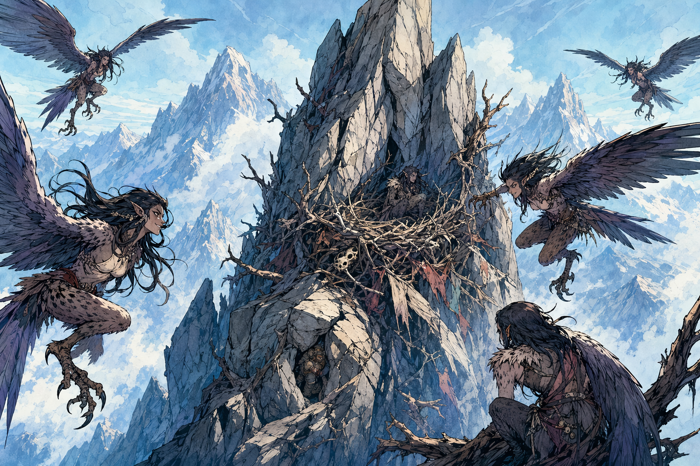

# Harpy Nest Near Samryn Torsten

## One-Line Summary
A high mountain crag where five harpies circle their nest along the route toward Samryn Torsten.

## Status
- [Party] [Confirmed] The party sees five harpies around a nest two hours into the day's travel after the ogre ambush.
- [Party] [Confirmed] The party defeats the harpies.
- [To verify] Whether the nest remains dangerous, lootable, or strategically useful after the fight.

## What Dain Knows
- [Character-only] Dain hid in cracks in the mountain wall near the nest.
- [Character-only] Dain used `Minor Illusion` and `Prestidigitation` to lure harpies past his concealed position.
- [Character-only] Dain immolated an alpha harpy and fixed it in place with `Suggestion`.

## Description
- A high mountain nesting site near the route toward Samryn Torsten.
- [Inferred] Exposed crags, wind, narrow approaches, and mountain wall cracks make concealment possible.

## Notable Events
- 2026-04-18: The party sights five harpies around the nest. [Session 2026-04-18](../../Adventures/2026-04-18.md)
- 2026-04-18: Dain hides in the mountain cracks and draws harpies past him with subtle magic. [Harpy Nest Battle](../Events/Harpy%20Nest%20Battle.md)
- 2026-04-18: The party defeats the harpies, and Dain receives the `Ghostly Form Tattoo` reward. [Confirmed] [Retcon] User correction recorded 2026-05-03. [Session 2026-04-18](../../Adventures/2026-04-18.md)

## Related Entries
- [Harpy Nest Battle](../Events/Harpy%20Nest%20Battle.md)
- [Ghostly Form Tattoo](../Items/Ghostly%20Form%20Tattoo.md)
- [Samryn Torsten](../Lore/Samryn%20Torsten.md)
- [Session 2026-04-18](../../Adventures/2026-04-18.md)
