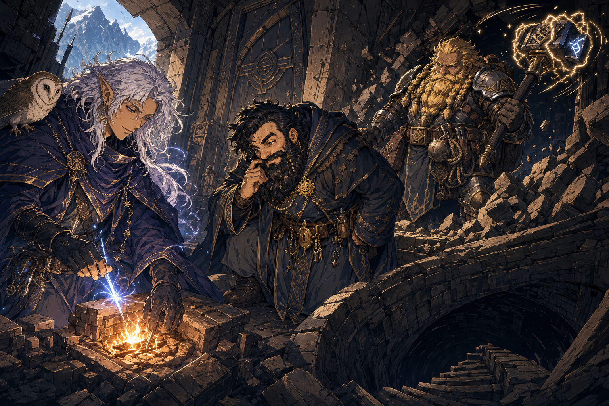

# Hidden Tunnel Near Truthammer Mountain

## One-Line Summary
A hidden mountain tunnel route near Truthhammer Mountain, entered through a grand door and hearth chamber, with a descending stair and a collapse over the Underdark.

## Status
- [Party] [Confirmed] The party reached this tunnel on 2026-06-20 after travelling east and considering local tunnels as a possible time-saving route.
- [Party] [Confirmed] The entrance includes a grand door and a hearth.
- [Party] [Confirmed] The party found a hidden passage beyond rubble, with a spiral staircase going straight down.
- [Party] [To verify] The passage or stair is "unknown to the Truthhammers"; whether this means unknown to Dain, his father, the whole clan, or the party's current understanding is unclear.
- [Party] [Confirmed] After about another hour of travel, the floor collapsed beneath the party and exposed the Underdark below.
- [Party] [To verify] A roper may be present below the collapse.

## What Dain Knows
- [Character-only] A detour to Truthhammer Mountain / the [Truthhammer Mountains](./Truthhammer%20Mountains.md) may add a day or two of travel, while cutting through local tunnels may save time. Exact route math is [To verify].
- [Character-only] Dain expected the entrance hearth's fire to trigger or reveal something, but nothing occurred after the moon elf lit it. [To verify who lit the fire]
- [Character-only] Dain considers this passage important enough to tell his father and return armed.
- [Character-only] Dain has father-taught stories about fire spirits and spirits haunting the mountain. Exact wording, truth, and relevance to this tunnel are [To verify].
- [Character-only] Dain sensed danger at the collapse and began stepping back.

## What The Party Knows
- The route included eastward travel, a stone bridge, a tunnel within about six hours, and a grand door.
- Norhan / [Hammerton Harry Drizddon](../Characters/Hammerton%20Harry%20Drizddon.md) pushed the door open on a natural `1`. [To verify exact actor/character]
- [Hammerton Harry Drizddon](../Characters/Hammerton%20Harry%20Drizddon.md) / "Dresden" broke down rubble with his hammer, which audibly protested. [To verify exact name and hammer identity]
- The floor collapse opens over the Underdark, making the tunnel a current danger rather than merely a shortcut.

## What Is Uncertain
- [To verify] What the stone bridge crosses.
- [To verify] Exact relationship between this tunnel, Truthhammer Mountain, the Truthhammer clan, and the party's Agland-letter route.
- [To verify] Whether the grand door and hearth were built by Truthhammers, older dwarves, fire spirits, Underdark dwellers, or another group.
- [To verify] Whether the hearth has a mechanism that failed, requires a second step, is already spent, or was only symbolic.
- [To verify] Whether the possible roper is actually present, and whether it is the cause of the collapse.
- [To verify] Whether anyone fell, took damage, is separated, or is in initiative.

## Dain-Facing Live Use
- Do not bunch up at the edge; step back, spread out, and secure rope before peering or descending.
- Ask Tom what Dain's Stonecunning / Tremorsense, Arcana, History, or family lore tell him about the masonry, the collapse, the hearth, and the hidden stair.
- Confirm whether the route still helps the [Agland's Sealed Letter](../Items/Aglands%20Sealed%20Letter.md) delivery, or whether the shortcut has become a mission risk.
- If the possible roper is visible, avoid giving it easy targets near the ledge; force distance, light, and line-of-sight clarity before committing.
- If retreat is possible, mark the passage, inform Dain's father / the Truthhammers, and return armed rather than donating the party to a secret hole.

## Notable Events
- 2026-06-20: Party travels east, reaches a stone bridge, and considers a local-tunnel route that may save time compared with a Truthhammer Mountain detour. [Session 2026-06-20](../../Adventures/2026-06-20.md)
- 2026-06-20: Party reaches a grand tunnel door; Norhan / Hammerton opens it on a natural `1`; the entrance hearth is found and lit. [Session 2026-06-20](../../Adventures/2026-06-20.md)
- 2026-06-20: Party finds a hidden passage, breaks rubble with a protesting hammer, and discovers a spiral staircase descending straight down. [Session 2026-06-20](../../Adventures/2026-06-20.md)
- 2026-06-20: Dain says the passage should be reported to his father and revisited armed. [Session 2026-06-20](../../Adventures/2026-06-20.md)
- 2026-06-20: After about another hour of travel, the floor collapses over the Underdark; a roper may be present, and Dain begins stepping back after sensing danger. [Session 2026-06-20](../../Adventures/2026-06-20.md)

## Related Entries
- [Session 2026-06-20](../../Adventures/2026-06-20.md)
- [2026-06-20 Live Play Aid](../../Adventures/2026-06-20-play-aid.md)
- [Truthhammer Mountains](./Truthhammer%20Mountains.md)
- [Dain Truthammer](../Characters/Dain%20Truthammer.md)
- [Hammerton Harry Drizddon](../Characters/Hammerton%20Harry%20Drizddon.md)
- [Agland's Sealed Letter](../Items/Aglands%20Sealed%20Letter.md)
- [Open Threads](../Lore/Open%20Threads.md)
