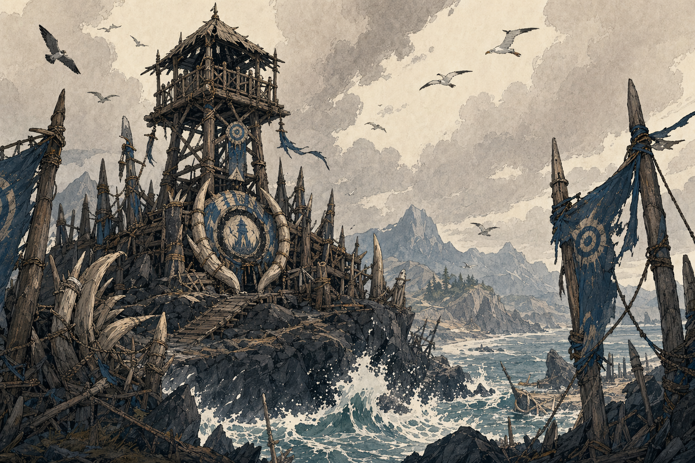

# Iron Shore Watchtower

## One-Line Summary
The coastal rendezvous point where Dain meets the party near the Iron Shore Tribes.

## Status
- [Party] [Confirmed] The party converges near the watchtower of the Iron Shore Tribes on 2026-04-18.
- [To verify] Exact watchtower allegiance, garrison, condition, and whether it remains important after the opening rendezvous.

## What Dain Knows
- [Party] Dain meets the party along the coast near this watchtower.
- [Party] Inland routes and mountain-fed waterways are visible beyond the coast.

## Description
- Harsh coastal terrain with surf, rock, watch-signs, and tribal presence.
- [Inferred] A practical lookout site, likely exposed to wind and sea weather.

## Notable Events
- 2026-04-18: Dain's session opens along the Iron Shore coast and he meets the party near the watchtower. [Session 2026-04-18](../../Adventures/2026-04-18.md)

## Related Entries
- [Iron Shore Tribes](../Factions/Iron%20Shore%20Tribes.md)
- [Session 2026-04-18](../../Adventures/2026-04-18.md)
