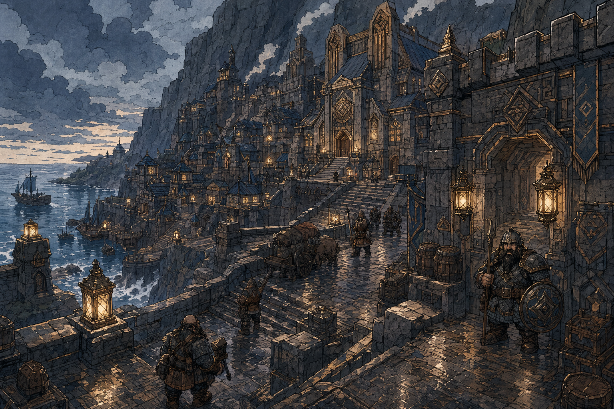

# Lerdar

## One-Line Summary
A smaller dwarven city east of the Iron Shore coast where the party meets Commander Agland.

## Status
- [Party] [Confirmed] The party arrives in Lerdar on 2026-04-18.
- [Party] [Confirmed] Lerdar is a smaller dwarven city.
- [To verify] Spelling may be `Lerdar` or `Llurdar` based on later route notes.

## What Dain Knows
- [Character-only] Dain knows the party came to Lerdar to deliver news to Commander Agland, but he does not know what the news is.
- [Party] Commander Agland is based here.

## What Is Uncertain
- [To verify] Lerdar's ruler, military hierarchy, relationship to the mountain general, and local faction pressures.

## Description
- Smaller dwarven city east of the coast.
- [Inferred] A practical military and civic stop between the Iron Shore and the mountain route.

## Notable Events
- 2026-04-18: The party reaches Lerdar and seeks Commander Agland to deliver news. [Session 2026-04-18](../../Adventures/2026-04-18.md)
- 2026-04-18: Agland sends the party onward into the mountains with a sealed letter for the actual general. [Session 2026-04-18](../../Adventures/2026-04-18.md)

## Related Entries
- [Commander Agland](../Characters/Commander%20Agland.md)
- [Agland's Sealed Letter](../Items/Aglands%20Sealed%20Letter.md)
- [Samyrn Torst](../Lore/Samyrn%20Torst.md)
- [Session 2026-04-18](../../Adventures/2026-04-18.md)
