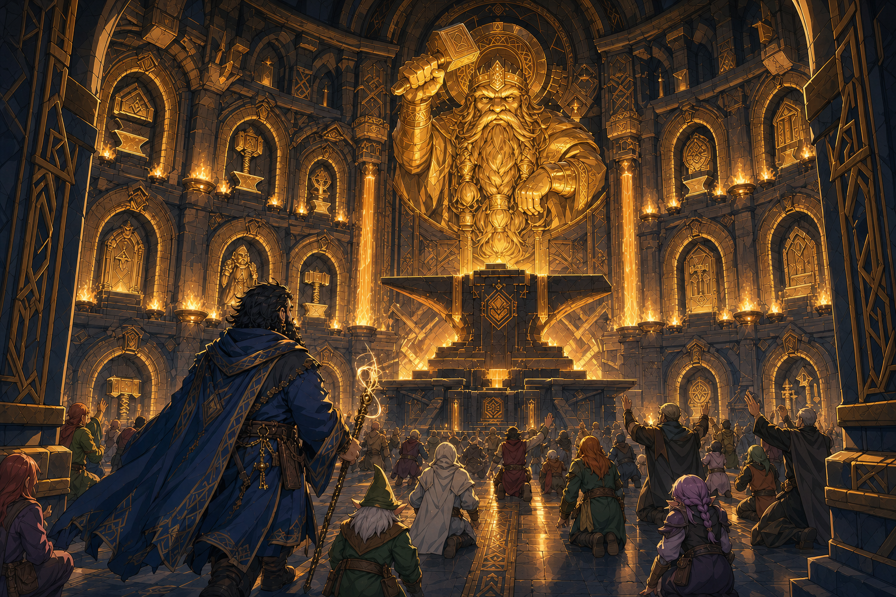

# Moradin's Chamber - Ola Dung Lot

## One-Line Summary
A sacred chamber of Moradin in [Ola Dung Lot](./Ola%20Dung%20Lot.md), entered by the party shortly before their skyship departure.

## Status
- [Party] [Confirmed on 2026-08-29] The party walks into Moradin's chamber.
- [Party] [Confirmed] The chamber is in Ola Dung Lot, a city within the [Samryn Torsten](../Lore/Samryn%20Torsten.md) area.
- [Party] [Confirmed on 2026-08-29] A `20-foot` statue of a dwarf made from pure gold stands at the chamber's centre.
- [Party] [Confirmed on 2026-08-29] A variety of non-dwarven humanoids, including gnomes, is worshipping inside.
- [To verify] Whether this chamber is itself one of the city's fourteen temples, part of a larger temple, or a separate civic or sacred room.

## What Dain Knows
- [Party] The city contains fourteen temples associated with the [Morndinsamman](../Lore/Morndinsamman.md).
- [Party] Non-dwarven worshippers are present, including gnomes.
- [To verify] The chamber's clergy, purpose, full congregation, current ceremony and why the party has entered.

## Description
- A chamber sacred to Moradin, centred on a `20-foot` pure-gold statue depicting a dwarf.
- A mixed congregation of humanoids who are not dwarves, including gnomes, worships around the statue.
- [To verify] Whether the statue depicts Moradin, whether it is solid gold rather than gold-clad, and the chamber's remaining architecture and furnishings.

## Notable Events
- 2026-08-29: The party enters Moradin's chamber; no interaction with the chamber's occupants has yet been recorded. [Session 2026-08-29](../../Adventures/2026-08-29.md)
- 2026-08-29: The party sees the central `20-foot` pure-gold dwarf statue and a congregation of non-dwarven humanoids, including gnomes, worshipping in the chamber. [Session 2026-08-29](../../Adventures/2026-08-29.md)

## Related Entries
- [Morndinsamman](../Lore/Morndinsamman.md)
- [Ola Dung Lot](./Ola%20Dung%20Lot.md)
- [Samryn Torsten](../Lore/Samryn%20Torsten.md)
- [Party Skyship - 2026-08-29](./Party%20Skyship%20-%202026-08-29.md)
- [Session 2026-08-29](../../Adventures/2026-08-29.md)
