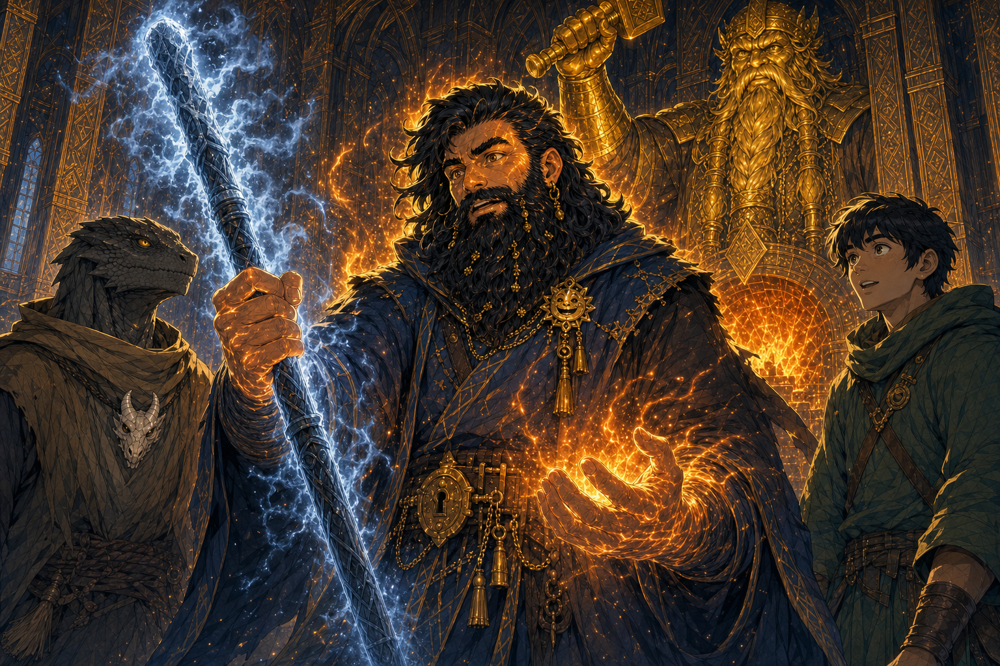

# Moradin's Chamber - Ola Dung Lot

## One-Line Summary
A sacred chamber of Moradin in [Ola Dung Lot](./Ola%20Dung%20Lot.md), entered by the party shortly before their skyship departure.

## Status
- [Party] [Confirmed on 2026-08-29] The party walks into Moradin's chamber.
- [Party] [Confirmed] The chamber is in Ola Dung Lot, a city within the [Samryn Torsten](../Lore/Samryn%20Torsten.md) area.
- [Party] [Confirmed on 2026-08-29] A `20-foot` statue of a dwarf made from pure gold stands at the chamber's centre.
- [Party] [Confirmed on 2026-08-29] A variety of non-dwarven humanoids, including gnomes, is worshipping inside.
- [Party] [Confirmed on 2026-08-29] Moradin's temple or chamber connects to a second temple along a shared wall. A symbolic forge representing Moradin is built into that wall.
- [To verify] The identity of the adjoining temple and whether the chamber is itself one of the city's fourteen temples or part of a larger temple complex.

## What Dain Knows
- [Party] The city contains fourteen temples associated with the [Morndinsamman](../Lore/Morndinsamman.md).
- [Party] Non-dwarven worshippers are present, including gnomes.
- [Party] Worshippers offer chunks of metal at the shared-wall forge and retrieve unidentified white-to-red-hot objects with bare hands that do not appear to burn.
- [To verify] The chamber's clergy, purpose, full congregation, current ceremony and why the party has entered.

## Description
- A chamber sacred to Moradin, centred on a `20-foot` pure-gold statue depicting a dwarf.
- A mixed congregation of humanoids who are not dwarves, including gnomes, worships around the statue.
- One wall connects this temple to a second temple. A symbolic forge representing Moradin is built into the shared structure.
- Worshippers bring chunks of metal as offerings and take something white-to-red hot from the forge. Their hands show no apparent burns.
- [To verify] Whether the statue depicts Moradin, whether it is solid gold rather than gold-clad, and the chamber's remaining architecture and furnishings.
- [To verify] Whether the forge physically transforms the offerings, what the retrieved objects are, whether the same object is returned, and whether heat immunity comes from the forge, a blessing, the rite, the worshippers or an illusion.
- [Party] Taleesh replicates the rite successfully without showing pain. His composure and experience-seeking outlook produce a respect result of `18`. [To verify tracker meaning and concealed injury]
- [Party] Immediately afterward, an unidentified [azer](../Characters/Azer%20in%20Moradins%20Forge.md) briefly appears within the forge and disappears back into the fire.
- [Character-only] Inspired by Taleesh and the azer vision, Dain performs the rite. The ritual rod grows colder as Dain grows hotter, his skin takes on a bronze sheen, and he experiences intense guilt over neglecting the Truthammer forge after releasing it.

## Notable Events
- 2026-08-29: The party enters Moradin's chamber; no interaction with the chamber's occupants has yet been recorded. [Session 2026-08-29](../../Adventures/2026-08-29.md)
- 2026-08-29: The party sees the central `20-foot` pure-gold dwarf statue and a congregation of non-dwarven humanoids, including gnomes, worshipping in the chamber. [Session 2026-08-29](../../Adventures/2026-08-29.md)
- 2026-08-29: The party observes the shared-wall forge ritual: worshippers offer chunks of metal and retrieve white-to-red-hot objects without apparent burns. [Session 2026-08-29](../../Adventures/2026-08-29.md)
- 2026-08-29: Taleesh successfully completes the ritual without showing pain despite Dain's warning about Moradin's protection. His success and outlook produce a respect result of `18`. [Session 2026-08-29](../../Adventures/2026-08-29.md) [To verify tracker meaning and concealed injury]
- 2026-08-29: An azer briefly appears in the forge and then vanishes back into its fire. [Session 2026-08-29](../../Adventures/2026-08-29.md) [To verify identity, purpose and relation to the ritual]
- 2026-08-29: Dain performs the ritual, producing an inverse temperature change with the rod, a bronze sheen and a powerful sense of guilt tied to the Truthammer forge. [Session 2026-08-29](../../Adventures/2026-08-29.md) [To verify duration and cause]

## Related Entries
- [Morndinsamman](../Lore/Morndinsamman.md)
- [Ola Dung Lot](./Ola%20Dung%20Lot.md)
- [Samryn Torsten](../Lore/Samryn%20Torsten.md)
- [Party Skyship - 2026-08-29](./Party%20Skyship%20-%202026-08-29.md)
- [Session 2026-08-29](../../Adventures/2026-08-29.md)
- [Azer in Moradin's Forge](../Characters/Azer%20in%20Moradins%20Forge.md)
- [Moradin's Forge Ritual Rod](../Items/Moradins%20Forge%20Ritual%20Rod.md)
