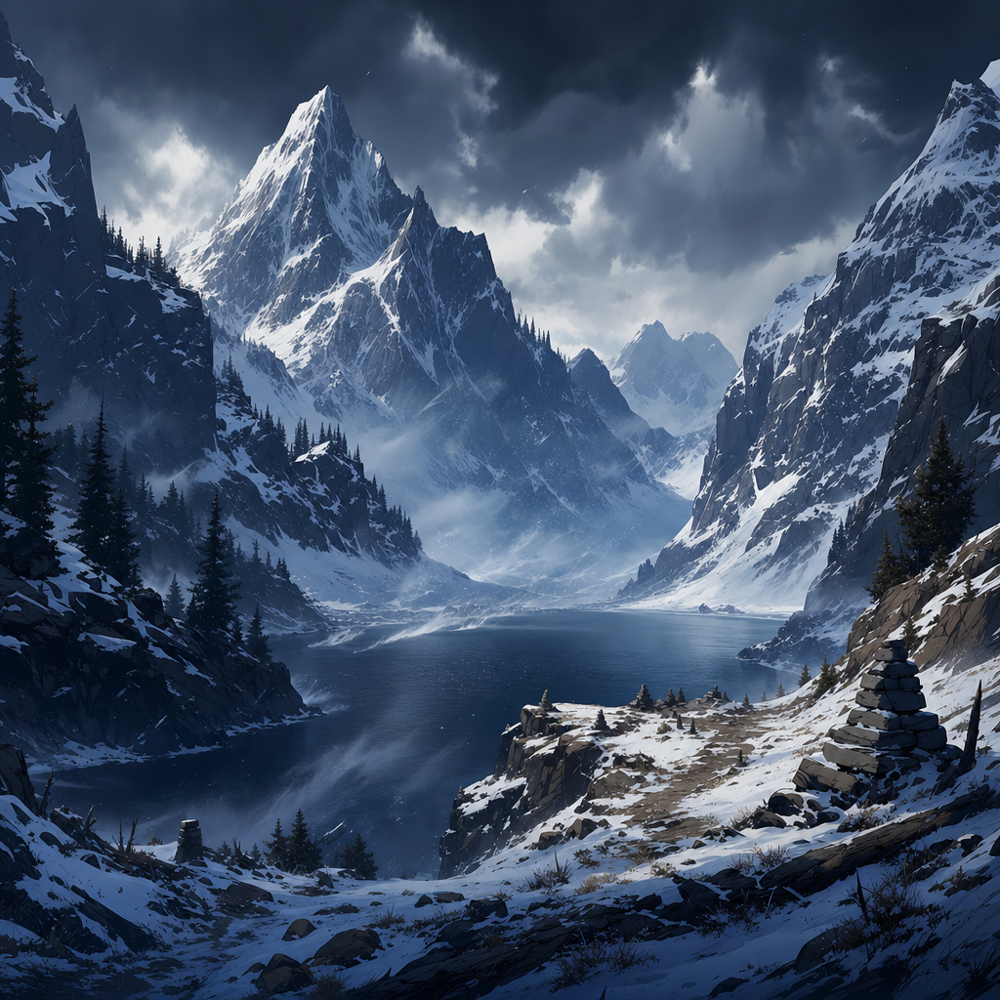

# Olar Dunglor

## One-Line Summary
A lake high in the mountains, named by [Southern Human Traders](../Factions/Southern%20Human%20Traders.md) seeking directions from the party during worsening cold winds.

## Status
- [Party] [Confirmed] First named in play on 2026-05-03.
- [Party] [Confirmed] Described as a lake high in the mountains.
- [To verify] Exact location, route, local settlements, hazards, political control, and whether it lies near the party's route to the general near [Samyrn Torst](../Lore/Samyrn%20Torst.md).

## What Dain Knows
- [Party] [Southern Human Traders](../Factions/Southern%20Human%20Traders.md) are looking for their way to Olar Dunglor.
- [Party] The request comes at the start of a new day in cold winds that [Kagrenac](../Characters/The%20Astral%20Elf.md) says will worsen.
- [To verify] Whether Dain has heard of Olar Dunglor before.

## What The Party Knows
- [Party] Olar Dunglor is a high-mountain lake.
- [Party] The [Southern Human Traders](../Factions/Southern%20Human%20Traders.md) are seeking directions to it.

## Description
- A high-mountain lake. [Confirmed]
- [Inferred] Likely exposed to severe mountain winds and difficult travel conditions.

## Notable Events
- 2026-05-03: [Southern Human Traders](../Factions/Southern%20Human%20Traders.md) approach the party during cold morning winds and ask for the way to Olar Dunglor. [Session 2026-05-03](../../Adventures/2026-05-03.md)

## Related Entries
- [Southern Human Traders](../Factions/Southern%20Human%20Traders.md)
- [Kagrenac](../Characters/The%20Astral%20Elf.md)
- [Dain Truthammer](../Characters/Dain%20Truthammer.md)
- [Samyrn Torst](../Lore/Samyrn%20Torst.md)
- [Open Threads](../Lore/Open%20Threads.md)
- [Session 2026-05-03](../../Adventures/2026-05-03.md)
