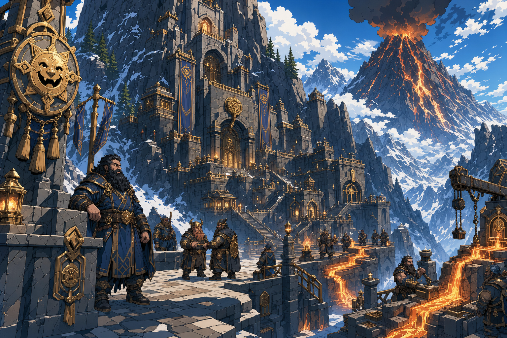

# Truthhammer Mountains

## One-Line Summary
Dain's mountain homeland, now placed near a volcano that may power the Truthhammer clan forges.

## Status
- [Character-only] [Confirmed] Dain identifies home with the Truthhammer Mountains.
- [Confirmed] On 2026-04-24, the user set the location of Dain's clan mountain with a volcano just behind it.
- [DM-private] [Character-only] [Confirmed] Dain is considered an outcast from this mountain homeland because of his faith in [Garl Glittergold](../Lore/Garl%20Glittergold.md).
- [To verify] Exact settlement name, map position, neighboring landmarks, and public name used by outsiders.
- [To verify] The Truthhammer clan may be master smiths with a forge powered by volcanic flow, but this remains proposed lore until the user locks it in.

## What Dain Knows
- [Character-only] His clan mountain stands with a volcano behind it.
- [Character-only] The mountain home is tied to stone, drafts, secrets, and practical stubbornness.
- [Character-only] He is considered an outcast there because of his faith in [Garl Glittergold](../Lore/Garl%20Glittergold.md). [DM-private] [Confirmed]
- [Character-only] [To verify] The clan may maintain volcanic-flow forges and a reputation for master smithing.

## What Is Uncertain
- [To verify] Whether "outcast" means social shame, formal exile, family estrangement, religious censure, political danger, or some combination.
- [To verify] Whether Dain can safely return to the mountain, enter clan holdings, contact family, or claim Truthammer standing openly.
- [To verify] Whether the volcano is active, dormant, magically regulated, sacred, dangerous, or merely useful.
- [To verify] Whether the Truthhammer forge is a clan monopoly, a religious craft site, a military supplier, or a local civic engine.
- [To verify] Whether Dain trained in smith-lore himself or merely grew up around it.

## Description
- A clan mountain with a volcano just behind it, suitable for a forge powered by volcanic flow.
- The idea supports the Truthhammers as practical, stubborn, craft-minded dwarves whose household magic may mix scholarship, metalwork, heat, stone, and inconvenient honesty.
- Dain's faith in [Garl Glittergold](../Lore/Garl%20Glittergold.md) marks him as an outcast from this homeland, making the place both origin and wound. [DM-private] [Character-only]

## Related Entries
- [Home In The Truthammer Mountains](../Lore/Dain%20Background%20Evasions/Home%20In%20The%20Truthammer%20Mountains.md)
- [Dain Truthammer](../Characters/Dain%20Truthammer.md)
- [Garl Glittergold](../Lore/Garl%20Glittergold.md)
- [Open Threads](../Lore/Open%20Threads.md)
