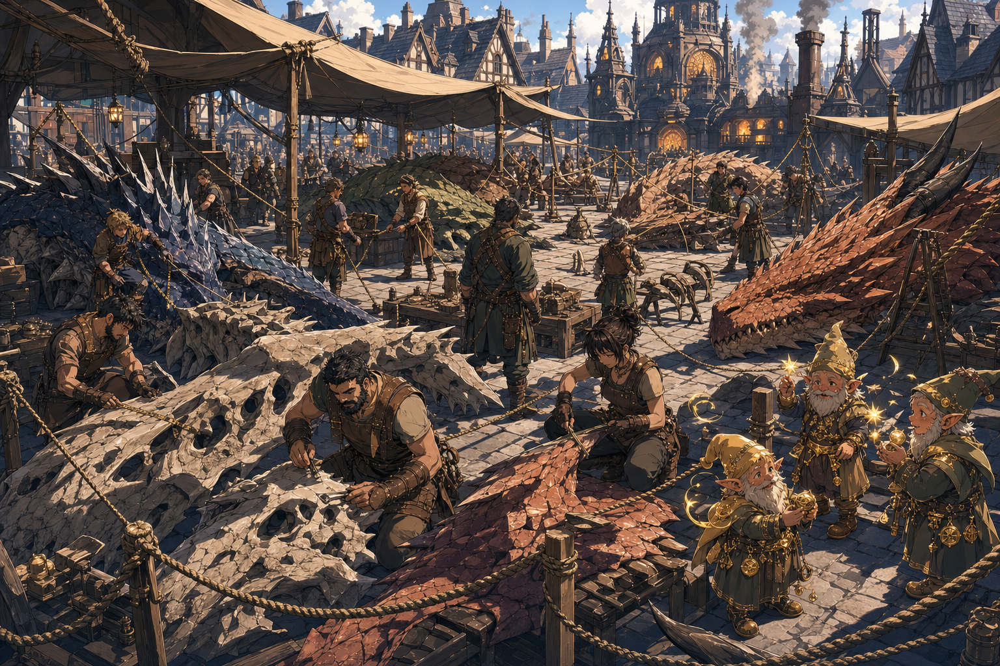

# Unnamed Town - 2026-06-20

## One-Line Summary
A currently unnamed town where Dain enters the 2026-06-20 session amid six dragon corpses/remains, artisan negotiations, Glittergold-worshipping gnomes, a church errand, a tavern dice conflict, a rat-and-poverty problem, and a falling-rat spell seed.

## Status
- [Party] [Confirmed] Dain is in the centre of this town on 2026-06-20.
- [Party] [Confirmed] Six dragon corpses or remains are present in or near the town centre. Exact type, condition, and ownership are [To verify].
- [Party] [Confirmed] The town artisans have struck an equipment-for-dragon-material deal with Dain / Truthhammer. Exact deliverables are [To verify].
- [Party] [Confirmed] Local gnomes who worship Glittergold are present in the town.
- [Party] [Confirmed] Dain receives the [Half-Pound Sack From Glittergold Gnomes](../Items/Half-Pound%20Sack%20From%20Glittergold%20Gnomes.md) here and intends to take it to a local church.
- [Party] [Confirmed] Dain notes that this town has issues with rats and poverty.
- [Party] [To verify] The [Rat-House Human - 2026-06-20](../Characters/Rat-House%20Human%20-%202026-06-20.md), an unnamed human/townsperson tied to the tavern/dice aftermath, may also be tied to a rat-infested house and a silver exchange with [Ollyander](../Characters/Ollyander.md).
- [Character-only] [To verify] Dain gives his last `5 gp` to the [rat-house human/townsperson](../Characters/Rat-House%20Human%20-%202026-06-20.md); exact silver and other coin holdings remain unresolved.
- [Character-only] [To verify] The next morning, a rat falls from the ceiling and inspires Dain's new failed-moral-lesson rat spell seed.
- [To verify] Actual town name, region, route context, church identity, tavern name, artisan leaders, and whether `Glittergold Road` has any in-world meaning. Current user correction says `Glittergold Road` is only the session title.

## What Dain Knows
- [Character-only] This town is the immediate stage for several unresolved tasks: the dragon-material contract, the Glittergold gnome errand, the possible church / forge shrine, and the dice-game conflict with [Brother Taleesh](../Characters/Brother%20Taleesh.md).
- [Character-only] Dain can use his Religion +7, History +7, and Arcana +9 to ask what local symbols, forge rites, gnome customs, dragon-material hazards, and religious obligations he recognizes.
- [Character-only] Dain should confirm whether the [Southern Human Traders](../Factions/Southern%20Human%20Traders.md) and [Coal Mine Puppet](../Items/Coal%20Mine%20Puppet.md) entered this town with the party, and whether the five-truthful-answers debt has come due.
- [Character-only] Dain has identified rats and poverty as a practical local problem, and he told the [rat-house human/townsperson](../Characters/Rat-House%20Human%20-%202026-06-20.md): "Gather the rats while I'm gone."
- [Character-only] Dain's stated action item is to find the [rat-house human/townsperson](../Characters/Rat-House%20Human%20-%202026-06-20.md) and give silver after addressing or inspecting the rat problem.
- [Character-only] Dain has begun idea-stage research on a spell involving a failed moral lesson and a rat; the mechanics are staged in [Failed Moral Lesson Rat Spell Ideas](../Brainstorm/Powers/Failed%20Moral%20Lesson%20Rat%20Spell%20Ideas.md) and are not canon until approved.

## What The Party Knows
- [Party] The town has artisans capable or willing to work dragon remains into equipment.
- [Party] The town contains gnomes associated with Glittergold worship.
- [Party] The tavern is where Dain buys drinks and where Taleesh invites Dain to dice.
- [Party] A local church or forge-related religious site is likely relevant to the sack errand. Exact deity is [To verify].
- [Party] At least one [human/townsperson](../Characters/Rat-House%20Human%20-%202026-06-20.md) runs away or withdraws after seeing the amount of money involved in the dice/silver scene. [To verify identity and motive]

## What Is Uncertain
- [To verify] Whether this town is on the earlier mountain route, near Samyrn Torst, near Olar Dunglor, or somewhere reached after an unlogged transition.
- [To verify] Whether the six dragon remains were slain by the party, found by the town, brought in by another faction, or tied to the artisan deal in another way.
- [To verify] Whether the artisans keep all dragon material, only leftovers, or a specific share in exchange for making equipment.
- [To verify] Whether the church is dedicated to [Garl Glittergold](../Lore/Garl%20Glittergold.md), Gond, another forge / gnome deity, a mixed shrine, or a local civic institution.
- [To verify] Whether the Glittergold-worshipping gnomes are a faction, a household, a church group, artisans, refugees, pranksters, or something else.
- [To verify] Which house has the rat problem, whether the rats are ordinary vermin or magical/diseased/organized, and whether the rat note connects to Ollyander's earlier `3 rats`.
- [To verify] Whether the rat that fell from the ceiling is an ordinary rat, a divine joke, a local hazard, a sign of the infestation, or all of the above.
- [To verify] Whether the town's poverty is general, concentrated around the human/townsperson, caused by the dragon remains aftermath, or tied to another faction.
- [To verify] Whether the human/townsperson involved in the `60 gp` worth-of-silver trade with Ollyander is the same person who ran away and the same person Dain instructed to gather rats.

## Dain-Facing Live Use
- Ask for the town name, region, and whether the [Southern Human Traders](../Factions/Southern%20Human%20Traders.md) and [Coal Mine Puppet](../Items/Coal%20Mine%20Puppet.md) are still physically present.
- Ask artisans for a witnessed equipment list, material split, timeline, and dragon-material hazard read before the remains are processed.
- Inspect the [Half-Pound Sack From Glittergold Gnomes](../Items/Half-Pound%20Sack%20From%20Glittergold%20Gnomes.md) respectfully before opening it; then approach the church / shrine by asking what custom Dain has stepped into.
- Find the [rat-house human/townsperson](../Characters/Rat-House%20Human%20-%202026-06-20.md), confirm which house has rats, and inspect the infestation before handing out silver.
- Ask whether the rats are mundane hunger-signs, disease carriers, game-piece confusion, a magical swarm, or a civic symptom of poverty.
- If a quiet morning beat opens, ask whether Dain can continue writing the failed-moral-lesson rat spell as research rather than approved mechanics.
- Treat `Glittergold Road` as a player/session title only unless Tom confirms a real road, route, song, joke, or local phrase with that name.

## Notable Events
- 2026-06-20: Dain is in the centre of this unnamed town, where six dragon corpses/remains are present and artisans have made an equipment-for-material deal with Truthhammer / Dain. [Session 2026-06-20](../../Adventures/2026-06-20.md)
- 2026-06-20: Dain gives `1 gp` each to six local Glittergold-worshipping gnomes and receives the [Half-Pound Sack From Glittergold Gnomes](../Items/Half-Pound%20Sack%20From%20Glittergold%20Gnomes.md). [Session 2026-06-20](../../Adventures/2026-06-20.md)
- 2026-06-20: In the tavern, Dain gives drinks to a sad deep gnome, a human, and two dwarves, says "Remember the name Truthhammer," and enters a dice game with [Brother Taleesh](../Characters/Brother%20Taleesh.md). [Session 2026-06-20](../../Adventures/2026-06-20.md)
- 2026-06-20: After the dice/silver scene, Dain notes that the town has issues with rats and poverty, records an action item to find the [rat-house human/townsperson](../Characters/Rat-House%20Human%20-%202026-06-20.md) and give silver, and tells them, "Gather the rats while I'm gone." [Session 2026-06-20](../../Adventures/2026-06-20.md) [To verify exact human and house]
- 2026-06-20: Dain gives his last `5 gp` to the [rat-house human/townsperson](../Characters/Rat-House%20Human%20-%202026-06-20.md). The next morning, after praying to [Garl Glittergold](../Lore/Garl%20Glittergold.md) about a failed moral lesson, Dain sees a rat fall from the ceiling and begins writing a new failed-moral-lesson rat spell. [Session 2026-06-20](../../Adventures/2026-06-20.md) [To verify spell approval and exact coin accounting]

## Images

## Related Entries
- [Session 2026-06-20](../../Adventures/2026-06-20.md)
- [2026-06-20 Live Play Aid](../../Adventures/2026-06-20-play-aid.md)
- [Dain Truthammer](../Characters/Dain%20Truthammer.md)
- [Rat-House Human - 2026-06-20](../Characters/Rat-House%20Human%20-%202026-06-20.md)
- [Brother Taleesh](../Characters/Brother%20Taleesh.md)
- [Ollyander](../Characters/Ollyander.md)
- [Hammerton Harry Drizddon](../Characters/Hammerton%20Harry%20Drizddon.md)
- [Half-Pound Sack From Glittergold Gnomes](../Items/Half-Pound%20Sack%20From%20Glittergold%20Gnomes.md)
- [Coal Mine Puppet](../Items/Coal%20Mine%20Puppet.md)
- [Garl Glittergold](../Lore/Garl%20Glittergold.md)
- [Failed Moral Lesson Rat Spell Ideas](../Brainstorm/Powers/Failed%20Moral%20Lesson%20Rat%20Spell%20Ideas.md)
- [Open Threads](../Lore/Open%20Threads.md)
